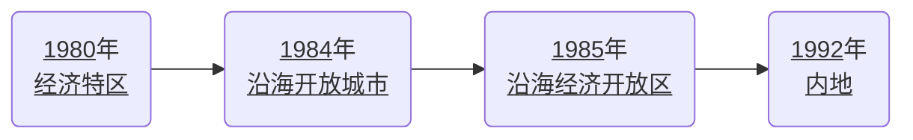

# 政史地综合提纲

- [政史地综合提纲](#政史地综合提纲) 
- [道德与法治](#道德与法治) 
  - [七年级上册](#七年级上册) 
    - [第一单元 成长的节拍](#第一单元-成长的节拍) 
      - [第一课 中学时代](#第一课-中学时代) 
      - [第二课 学习新天地](#第二课-学习新天地) 
      - [第三课 发现自己](#第三课-发现自己) 
    - [第二单元 友谊的天空](#第二单元-友谊的天空) 
      - [第四课 友谊与成长同行](#第四课-友谊与成长同行) 
      - [第五课 交友的智慧](#第五课-交友的智慧) 
    - [第三单元 师长情谊](#第三单元-师长情谊) 
      - [第六课 师生之间](#第六课-师生之间) 
      - [第七课 亲情之爱](#第七课-亲情之爱) 
    - [第四单元 生命的思考](#第四单元-生命的思考) 
      - [第八课 探问生命](#第八课-探问生命) 
      - [第九课 珍视生命](#第九课-珍视生命) 
      - [第十课 绽放生命之花](#第十课-绽放生命之花) 
  - [七年级下册](#七年级下册) 
    - [第一单元 青春时光](#第一单元-青春时光) 
      - [第一课 青春的邀约](#第一课-青春的邀约) 
      - [第二课 青春的心弦](#第二课-青春的心弦) 
      - [第三课 青春的证明](#第三课-青春的证明) 
    - [第二单元 做情感情绪的主人](#第二单元-做情感情绪的主人) 
      - [第四课 解开情绪的面纱](#第四课-解开情绪的面纱) 
      - [第五课 品出情感的韵味](#第五课-品出情感的韵味) 
    - [第三单元 在集体中成长](#第三单元-在集体中成长) 
      - [第六课 “我”和“我们”](#第六课-“我”和“我们”) 
      - [第七课 共奏和谐乐章](#第七课-共奏和谐乐章) 
      - [第八课 美好集体有我在](#第八课-美好集体有我在) 
    - [第四单元 走进法治天地](#第四单元-走进法治天地) 
      - [第九课 法律在我们身边](#第九课-法律在我们身边) 
      - [第十课 法律伴我们成长](#第十课-法律伴我们成长) 
  - [八年级上册](#八年级上册) 
    - [第一单元 走进社会生活](#第一单元-走进社会生活) 
      - [第一课 丰富的社会生活](#第一课-丰富的社会生活) 
      - [第二课 网络生活新空间](#第二课-网络生活新空间) 
    - [第二单元 遵守社会规则](#第二单元-遵守社会规则) 
      - [第三课 社会生活离不开规则](#第三课-社会生活离不开规则) 
      - [第四课 社会生活讲道德](#第四课-社会生活讲道德) 
      - [第五课 做守法的公民](#第五课-做守法的公民) 
    - [第三单元 勇担社会责任](#第三单元-勇担社会责任) 
      - [第六课 责任与角色同在](#第六课-责任与角色同在) 
      - [第七课 积极奉献社会](#第七课-积极奉献社会) 
    - [第四单元 维护国家利益](#第四单元-维护国家利益) 
      - [第八课 国家利益至上](#第八课-国家利益至上) 
      - [第九课 树立总体国家安全观](#第九课-树立总体国家安全观) 
      - [第十课 建设美好祖国](#第十课-建设美好祖国) 
  - [八年级下册](#八年级下册) 
    - [第一单元 坚持宪法至上](#第一单元-坚持宪法至上) 
      - [第一课 维护宪法权威](#第一课-维护宪法权威) 
      - [第二课 保障宪法实施](#第二课-保障宪法实施) 
    - [第二单元 理解权利与义务](#第二单元-理解权利与义务) 
      - [第三课 公民权利](#第三课-公民权利) 
      - [第四课 公民义务](#第四课-公民义务) 
    - [第三单元 人民当家作主](#第三单元-人民当家作主) 
      - [第五课 我国的政治和经济制度](#第五课-我国的政治和经济制度) 
      - [第六课 我国国家机构](#第六课-我国国家机构) 
    - [第四单元 崇尚法治精神](#第四单元-崇尚法治精神) 
      - [第七课 尊重自由平等](#第七课-尊重自由平等) 
      - [第八课 维护公平正义](#第八课-维护公平正义) 
  - [九年级上册](#九年级上册) 
    - [第一单元 富强与创新](#第一单元-富强与创新) 
      - [第一课 踏上强国之路](#第一课-踏上强国之路) 
      - [第二课 创新驱动发展](#第二课-创新驱动发展) 
    - [第二单元 民主与法治](#第二单元-民主与法治) 
      - [第三课 追求民主价值](#第三课-追求民主价值) 
      - [第四课 建设法治中国](#第四课-建设法治中国) 
    - [第三单元 文明与家园](#第三单元-文明与家园) 
      - [第五课 守望精神家园](#第五课-守望精神家园) 
      - [第六课 建设美丽中国](#第六课-建设美丽中国) 
    - [第四单元 和谐与梦想](#第四单元-和谐与梦想) 
      - [第七课 中华一家亲](#第七课-中华一家亲) 
      - [第八课 中国人 中国梦](#第八课-中国人-中国梦) 
  - [九年级下册](#九年级下册) 
    - [第一单元 我们共同的世界](#第一单元-我们共同的世界) 
      - [第一课 同住地球村](#第一课-同住地球村) 
      - [第二课 构建人类命运共同体](#第二课-构建人类命运共同体) 
    - [第二单元 世界舞台上的中国](#第二单元-世界舞台上的中国) 
      - [第三课 与世界紧密相连](#第三课-与世界紧密相连) 
      - [第四课 与世界共发展](#第四课-与世界共发展) 
    - [第三单元 走向未来的少年](#第三单元-走向未来的少年) 
      - [第五课 少年的担当](#第五课-少年的担当) 
      - [第六课 我的毕业季](#第六课-我的毕业季) 
      - [第七课 从这里出发](#第七课-从这里出发) 
- [中国历史](#中国历史) 
  - [中国历史 古代史](#中国历史-古代史) 
    - [第一单元 史前时期：中国境内早期人类与文明的起源](#第一单元-史前时期：中国境内早期人类与文明的起源) 
      - [第 1 课 中国境内早期人类的代表——北京人](#第-1-课-中国境内早期人类的代表——北京人) 
      - [第 2 课 原始农耕生活](#第-2-课-原始农耕生活) 
      - [第 3 课 远古的传说](#第-3-课-远古的传说) 
    - [第二单元 夏商周时期：早期国家与社会变革](#第二单元-夏商周时期：早期国家与社会变革) 
      - [第 4 课 夏商周的更替](#第-4-课-夏商周的更替) 
      - [第 5 课 青铜器与甲骨文](#第-5-课-青铜器与甲骨文) 
      - [第 6 课 动荡的春秋时期](#第-6-课-动荡的春秋时期) 
      - [第 7 课 战国时期的社会变革](#第-7-课-战国时期的社会变革) 
      - [第 8 课 百家争鸣](#第-8-课-百家争鸣) 
    - [第三单元 秦汉时期：统一多民族国家的建立和巩固](#第三单元-秦汉时期：统一多民族国家的建立和巩固) 
      - [第 9 课 秦统一中国](#第-9-课-秦统一中国) 
      - [第 10 课 秦末农民大起义](#第-10-课-秦末农民大起义) 
      - [第 11 课 西汉建立和“文景之治”](#第-11-课-西汉建立和“文景之治”) 
      - [第 12 课 汉武帝巩固大一统王朝](#第-12-课-汉武帝巩固大一统王朝) 
      - [第 13 课 东汉的兴衰](#第-13-课-东汉的兴衰) 
      - [第 14 课 沟通中外文明的“丝绸之路”](#第-14-课-沟通中外文明的“丝绸之路”) 
      - [第 15 课 两汉的科技文化](#第-15-课-两汉的科技文化) 
    - [第四单元 三国两晋南北朝时期：政权分立与民族交融](#第四单元-三国两晋南北朝时期：政权分立与民族交融) 
      - [第 16 课 三国鼎立](#第-16-课-三国鼎立) 
      - [第 17 课 西晋的短暂统一与北方各族的内迁](#第-17-课-西晋的短暂统一与北方各族的内迁) 
      - [第 18 课 东晋南朝时期江南地区的开发](#第-18-课-东晋南朝时期江南地区的开发) 
      - [第 19 课 北魏政治和北方民族大交融](#第-19-课-北魏政治和北方民族大交融) 
      - [第 20 课 魏晋南北朝的科技和文化](#第-20-课-魏晋南北朝的科技和文化) 
    - [第五单元 隋唐时期：繁荣与开放的时代](#第五单元-隋唐时期：繁荣与开放的时代) 
      - [第 1 课 隋朝的统一与灭亡](#第-1-课-隋朝的统一与灭亡) 
      - [第 2 课 从“贞观之治”到“开元盛世”](#第-2-课-从“贞观之治”到“开元盛世”) 
      - [第 3 课 盛唐气象](#第-3-课-盛唐气象) 
      - [第 4 课 唐朝的中外文化交流](#第-4-课-唐朝的中外文化交流) 
      - [第 5 课 安史之乱](#第-5-课-安史之乱) 
    - [第六单元 辽宋夏金元时期：民族关系发展和社会变化](#第六单元-辽宋夏金元时期：民族关系发展和社会变化) 
      - [第 6 课 北宋的政治](#第-6-课-北宋的政治) 
      - [第 7 课 辽、西夏与北宋的并立](#第-7-课-辽、西夏与北宋的并立) 
      - [第 8 课 金与南宋的对峙](#第-8-课-金与南宋的对峙) 
      - [第 9 课 宋代经济的发展](#第-9-课-宋代经济的发展) 
      - [第 10 课 蒙古的兴起的元朝的建立](#第-10-课-蒙古的兴起的元朝的建立) 
      - [第 11 课 元朝的统治](#第-11-课-元朝的统治) 
      - [第 12 课 宋元时期的都市和文化](#第-12-课-宋元时期的都市和文化) 
      - [第 13 课 宋元时期的科技与中外交通](#第-13-课-宋元时期的科技与中外交通) 
    - [第七单元 明清时期：统一多民族国家的巩固与发展](#第七单元-明清时期：统一多民族国家的巩固与发展) 
      - [第 14 课 明朝的统治](#第-14-课-明朝的统治) 
      - [第 15 课 明朝的对外关系](#第-15-课-明朝的对外关系) 
      - [第 16 课 明朝的科技、建筑与文学](#第-16-课-明朝的科技、建筑与文学) 
      - [第 17 课 明朝的灭亡](#第-17-课-明朝的灭亡) 
      - [第 18 课 统一多民族国家的巩固和发展](#第-18-课-统一多民族国家的巩固和发展) 
      - [第 19 课 清朝前期社会经济的发展](#第-19-课-清朝前期社会经济的发展) 
      - [第 20 课 清朝君主专制的强化](#第-20-课-清朝君主专制的强化) 
      - [第 21 课 清朝前期的文学艺术](#第-21-课-清朝前期的文学艺术) 
  - [中国历史 近代史](#中国历史-近代史) 
    - [第一单元 中国开始沦为半殖民地半封建社会](#第一单元-中国开始沦为半殖民地半封建社会) 
      - [第 1 课 鸦片战争](#第-1-课-鸦片战争) 
      - [第 2 课 第二次鸦片战争](#第-2-课-第二次鸦片战争) 
      - [第 3 课 太平天国运动](#第-3-课-太平天国运动) 
    - [第二单元 近代化的早期探索与民族危机的加剧](#第二单元-近代化的早期探索与民族危机的加剧) 
      - [第 4 课 洋务运动](#第-4-课-洋务运动) 
      - [第 5 课 甲午中日战争与列强瓜分中国狂潮](#第-5-课-甲午中日战争与列强瓜分中国狂潮) 
      - [第 6 课 戊戌变法](#第-6-课-戊戌变法) 
      - [第 7 课 八国联军侵华与《辛丑条约》的签订](#第-7-课-八国联军侵华与《辛丑条约》的签订) 
    - [第三单元 资产阶级民主革命与中华民国的建立](#第三单元-资产阶级民主革命与中华民国的建立) 
      - [第 8 课 革命先行者孙中山](#第-8-课-革命先行者孙中山) 
      - [第 9 课 辛亥革命](#第-9-课-辛亥革命) 
      - [第 10 课 中华民国的建立](#第-10-课-中华民国的建立) 
      - [第 11 课 北洋政府的统治与军阀割据](#第-11-课-北洋政府的统治与军阀割据) 
    - [第四单元 新民主主义革命的开始](#第四单元-新民主主义革命的开始) 
      - [第 12 课 新文化运动](#第-12-课-新文化运动) 
      - [第 13 课 五四运动](#第-13-课-五四运动) 
      - [第 14 课 中国共产党诞生](#第-14-课-中国共产党诞生) 
    - [第五单元 从国共合作到国共对立](#第五单元-从国共合作到国共对立) 
      - [第 15 课 国共合作与北伐战争](#第-15-课-国共合作与北伐战争) 
      - [第 16 课 毛泽东开辟井冈山道路](#第-16-课-毛泽东开辟井冈山道路) 
      - [第 17 课 中国工农红军长征](#第-17-课-中国工农红军长征) 
    - [第六单元 中国人民的抗日战争](#第六单元-中国人民的抗日战争) 
      - [第 18 课 从九一八事变到西安事变](#第-18-课-从九一八事变到西安事变) 
      - [第 19 课 七七事变与全民族抗战](#第-19-课-七七事变与全民族抗战) 
      - [第 20 课 正面战场的抗战](#第-20-课-正面战场的抗战) 
      - [第 21 课 敌后战场的抗战](#第-21-课-敌后战场的抗战) 
      - [第 22 课 抗日战争的胜利](#第-22-课-抗日战争的胜利) 
    - [第七单元 人民解放战争](#第七单元-人民解放战争) 
      - [第 23 课 内战爆发](#第-23-课-内战爆发) 
      - [第 24 课 人民解放战争的胜利](#第-24-课-人民解放战争的胜利) 
    - [第八单元 近代经济、社会生活与教育文化事业的发展](#第八单元-近代经济、社会生活与教育文化事业的发展) 
      - [第 25 课 近代经济和社会生活的变化](#第-25-课-近代经济和社会生活的变化) 
      - [第 26 课 教育文化事业的发展](#第-26-课-教育文化事业的发展) 
  - [中国历史 现代史](#中国历史-现代史) 
    - [第一单元 中华人民共和国的成立和巩固](#第一单元-中华人民共和国的成立和巩固) 
      - [第 1 课 中华人民共和国成立](#第-1-课-中华人民共和国成立) 
      - [第 2 课 抗美援朝](#第-2-课-抗美援朝) 
      - [第 3 课 土地改革](#第-3-课-土地改革) 
    - [第二单元 社会主义制度的建立与社会主义建设的探索](#第二单元-社会主义制度的建立与社会主义建设的探索) 
      - [第 4 课 工业化的起步和人民代表大会制度的确立](#第-4-课-工业化的起步和人民代表大会制度的确立) 
      - [第 5 课 三大改造](#第-5-课-三大改造) 
      - [第 6 课 艰辛探索与建设成就](#第-6-课-艰辛探索与建设成就) 
    - [第三单元 中国特色社会主义道路](#第三单元-中国特色社会主义道路) 
      - [第 7 课 伟大的历史转折](#第-7-课-伟大的历史转折) 
      - [第 8 课 经济体制改革](#第-8-课-经济体制改革) 
      - [第 9 课 对外开放](#第-9-课-对外开放) 
      - [第 10 课 建设中国特色社会主义](#第-10-课-建设中国特色社会主义) 
      - [第 11 课 为实现中国梦而努力奋斗](#第-11-课-为实现中国梦而努力奋斗) 
    - [第四单元 民族团结与祖国统一](#第四单元-民族团结与祖国统一) 
      - [第 12 课 民族大团结](#第-12-课-民族大团结) 
      - [第 13 课 香港和澳门的回归](#第-13-课-香港和澳门的回归) 
      - [第 14 课 海峡两岸的交往](#第-14-课-海峡两岸的交往) 
    - [第五单元 国防建设与外交成就](#第五单元-国防建设与外交成就) 
      - [第 15 课 钢铁长城](#第-15-课-钢铁长城) 
      - [第 16 课 独立自主的和平外交](#第-16-课-独立自主的和平外交) 
      - [第 17 课 外交事业的发展](#第-17-课-外交事业的发展) 
    - [第六单元 科技文化与社会生活](#第六单元-科技文化与社会生活) 
      - [第 18 课 科学技术成就](#第-18-课-科学技术成就) 
      - [第 19 课 社会生活的变迁](#第-19-课-社会生活的变迁) 
- [世界历史](#世界历史) 
  - [世界古代史
](#世界古代史
) 
    - [第一单元 古代亚非文明](#第一单元-古代亚非文明) 
    - [第二单元 古代欧洲文明](#第二单元-古代欧洲文明) 
    - [第三单元 封建时代的欧洲](#第三单元-封建时代的欧洲) 
    - [第四单元 封建时代的亚洲国家](#第四单元-封建时代的亚洲国家) 
  - [世界近代史](#世界近代史) 
    - [第五单元 走向近代](#第五单元-走向近代) 
    - [第六单元 资本主义制度的初步确立](#第六单元-资本主义制度的初步确立) 
    - [第七单元 工业革命和共产主义运动的兴起](#第七单元-工业革命和共产主义运动的兴起) 
    - [第八单元 殖民地人民的反抗与资本主义制度的扩展](#第八单元-殖民地人民的反抗与资本主义制度的扩展) 
    - [第九单元 第二次工业革命和近代科学文化](#第九单元-第二次工业革命和近代科学文化) 
  - [世界现代史](#世界现代史) 
    - [第十单元 第一次世界大战和战后初期的世界](#第十单元-第一次世界大战和战后初期的世界) 
    - [第十一单元 经济大危机和第二次世界大战](#第十一单元-经济大危机和第二次世界大战) 
    - [第十二单元 二战后的世界变化](#第十二单元-二战后的世界变化) 
    - [第十三单元 走向和平发展的世界](#第十三单元-走向和平发展的世界) 
- [人文地理](#人文地理) 
  - [第一单元 人在社会中生活](#第一单元-人在社会中生活) 
    - [第一课 我的家在哪里](#第一课-我的家在哪里) 
      - [第一框 从社区看我家](#第一框-从社区看我家) 
      - [第二框 在社区中生活](#第二框-在社区中生活) 
    - [第二课 乡村与城市](#第二课-乡村与城市) 
      - [第一框 乡村聚落](#第一框-乡村聚落) 
      - [第二框 城市聚落](#第二框-城市聚落) 
      - [第三框 往来在区域之间](#第三框-往来在区域之间) 
    - [综合探究一 从地图上获取信息](#综合探究一-从地图上获取信息) 
  - [第二单元 人类共同生活的世界](#第二单元-人类共同生活的世界) 
    - [第一课 大洲和大洋](#第一课-大洲和大洋) 
      - [第一框 人类的栖息地](#第一框-人类的栖息地) 
      - [第二框 海洋对人类的影响](#第二框-海洋对人类的影响) 
    - [第二课 自然环境](#第二课-自然环境) 
      - [第一框 地形多样](#第一框-地形多样) 
      - [第二框 气象万千](#第二框-气象万千) 
      - [第三框 众多的河湖](#第三框-众多的河湖) 
      - [第四框 风光迥异](#第四框-风光迥异) 
    - [第三课 世界大家庭](#第三课-世界大家庭) 
      - [第一框 人口与人种](#第一框-人口与人种) 
      - [第二框 语言与宗教](#第二框-语言与宗教) 
      - [第三框 世界上的国家](#第三框-世界上的国家) 
    - [综合探究二 从地球仪上看世界](#综合探究二-从地球仪上看世界) 
  - [第三单元 各具特色的区域生活](#第三单元-各具特色的区域生活) 
    - [第一课 家住平原
](#第一课-家住平原
) 
      - [第一框 稻作文化的印记
](#第一框-稻作文化的印记
) 
      - [第二框 用机械种庄稼
](#第二框-用机械种庄稼
) 
    - [第二课 与山为邻
](#第二课-与山为邻
) 
      - [第一框 垂直的生计
](#第一框-垂直的生计
) 
      - [第二框 山地之国
](#第二框-山地之国
) 
    - [第三课 傍水而居
](#第三课-傍水而居
) 
      - [第一框 耕海牧渔
](#第一框-耕海牧渔
) 
      - [第二框 水上都市
](#第二框-水上都市
) 
    - [第四课 草原人家
](#第四课-草原人家
) 
      - [第一框 逐水草而居
](#第一框-逐水草而居
) 
      - [第二框 现代化的牧场
](#第二框-现代化的牧场
) 
    - [第五课 干旱的宝地
](#第五课-干旱的宝地
) 
      - [第一框 石油宝库
](#第一框-石油宝库
) 
      - [第二框 沙漠绿洲
](#第二框-沙漠绿洲
) 
    - [第六课 不同类型的城市
](#第六课-不同类型的城市
) 
      - [第一框 俄罗斯的政治文化中心：莫斯科
](#第一框-俄罗斯的政治文化中心：莫斯科
) 
      - [第二框 文化艺术之都：巴黎
](#第二框-文化艺术之都：巴黎
) 
      - [第三框 IT新城：班加罗尔
](#第三框-it新城：班加罗尔
) 
      - [第四框 汽车城：蔚山
](#第四框-汽车城：蔚山
) 
      - [第五框 城市规划的典范：巴西利亚
](#第五框-城市规划的典范：巴西利亚
) 
    - [综合探究三 如何认识区域——以南非为例
](#综合探究三-如何认识区域——以南非为例
) 
  - [第四单元 中国各族人民的家园](#第四单元-中国各族人民的家园) 
    - [第一课 国土与人民](#第一课-国土与人民) 
      - [第一框 辽阔的疆域](#第一框-辽阔的疆域) 
      - [第二框 行政区划](#第二框-行政区划) 
      - [第三框 众多的人口](#第三框-众多的人口) 
      - [第四框 多民族的大家庭](#第四框-多民族的大家庭) 
    - [第二课 山川秀美](#第二课-山川秀美) 
      - [第一框 复杂多样的地形](#第一框-复杂多样的地形) 
      - [第二框 气候的影响](#第二框-气候的影响) 
      - [第三框 母亲河](#第三框-母亲河) 
    - [第三课 地形差异显著](#第三课-地形差异显著) 
      - [第一框 秦岭—淮河分南北](#第一框-秦岭—淮河分南北) 
      - [第二框 交流与互补](#第二框-交流与互补) 
    - [综合探究四 走进台湾](#综合探究四-走进台湾) 
  - [第五单元 一方水土养一方人](#第五单元-一方水土养一方人) 
    - [第一课 北方地区](#第一课-北方地区) 
      - [第一框 红松之乡](#第一框-红松之乡) 
      - [第二框 沟壑纵横的黄土高原](#第二框-沟壑纵横的黄土高原) 
      - [第三框 古老而现代的首都——北京](#第三框-古老而现代的首都——北京) 
    - [第二课 南方地区](#第二课-南方地区) 
      - [第一框 水乡城镇](#第一框-水乡城镇) 
      - [第二框 富庶的四川盆地](#第二框-富庶的四川盆地) 
      - [第三框 开放的珠江三角洲地区](#第三框-开放的珠江三角洲地区) 
      - [第四框 我国最大的经济中心——上海](#第四框-我国最大的经济中心——上海) 
    - [第三课 西北地区](#第三课-西北地区) 
      - [第一框 丝路明珠](#第一框-丝路明珠) 
      - [第二框 草原风情](#第二框-草原风情) 
      - [第三框 向西开放的重要门户——乌鲁木齐](#第三框-向西开放的重要门户——乌鲁木齐) 
    - [第四课 青藏地区](#第四课-青藏地区) 
      - [第一框 海拔最高的牧区](#第一框-海拔最高的牧区) 
      - [第二框 日光城——拉萨](#第二框-日光城——拉萨) 
    - [综合探究五 如何开展社会调查——以调查家乡为例](#综合探究五-如何开展社会调查——以调查家乡为例) 
  - [第六单元 共同面对的全球性问题](#第六单元-共同面对的全球性问题) 
    - [第一课 不断变化的人口问题](#第一课-不断变化的人口问题) 
      - [第一框 世界人口的数量变化](#第一框-世界人口的数量变化) 
      - [第二框 我国的人口与发展](#第二框-我国的人口与发展) 
    - [第二课 日益严峻的资源问题](#第二课-日益严峻的资源问题) 
      - [第一框 世界面临的资源问题](#第一框-世界面临的资源问题) 
      - [第二框 应对我国的资源问题](#第二框-应对我国的资源问题) 
    - [第三课 共同关注的环境问题](#第三课-共同关注的环境问题) 
      - [第一框 愈演愈烈的环境问题](#第一框-愈演愈烈的环境问题) 
      - [第二框 加快改善我国的生态环境](#第二框-加快改善我国的生态环境) 
    - [第四课 发展的选择](#第四课-发展的选择) 
      - [第一框 可持续发展与新发展理念](#第一框-可持续发展与新发展理念) 
      - [第二框 因地制宜谋发展](#第二框-因地制宜谋发展) 
      - [第三框 向贫困宣战](#第三框-向贫困宣战) 
    - [综合探究六 区域的变化](#综合探究六-区域的变化) 
- [《习近平新时代中国特色社会主义思想学生读本》提纲](#《习近平新时代中国特色社会主义思想学生读本》提纲) 
- [九上 1-3 课默写](#九上-1-3-课默写) 
- [七上历史期末重点题目](#七上历史期末重点题目) 
- [八上一、二单元默写](#八上一、二单元默写) 
- [八上期中历史押题](#八上期中历史押题) 
- [人文地理第四单元默写提纲](#人文地理第四单元默写提纲) 
- [八上中国历史终极默写](#八上中国历史终极默写) 
- [八下历史与社会复习提纲](#八下历史与社会复习提纲) 
- [Copyrights](#copyrights) 

# 道德与法治

## 七年级上册

七年级上册的内容，中考要点 **只有 [第四单元 生命的思考](./%E7%AC%AC%E5%9B%9B%E5%8D%95%E5%85%83%20%E7%94%9F%E5%91%BD%E7%9A%84%E6%80%9D%E8%80%83/)** 。

### 第一单元 成长的节拍

---

#### 第一课 中学时代

1. 中学时代的重要性

    1. 中学时代是人生发展的一个新阶段，为我们的一生奠定重要基础。
    2. 中学时代见证着一个人从少年到青年的生命进阶。

2. 为什么说中学时代是“成长的礼物”

    1. 中学生活为我们的发展提供了多种机会。
    2. 进入中学，新的目标和要求激发着我们的潜能，激励着我们不断实现自我超越。
    3. 我们有机会改变不够完美的形象，重新塑造一个“我”。

3. 面对中学生活，我们应该怎么做
   珍视当下，把握机遇，从点滴做起，为美好明天付出不懈的努力。

4. 青少年为什么要有梦想

    1. 编织人生梦想，是青少年时期的重要生命主题。梦想是对未来美好生活的愿望，它能不断激发我们生命的热情和勇气，让生活更有色彩。
    2. 少年的梦想，是人类天真无邪、美丽可爱的愿望。人类有了梦想，才能不断地进步和发展。

5. 少年应该有怎样的梦想

    1. <u>少年的梦想，与个人的人生目标紧密相连。</u>
    2. <u>少年的梦想，与时代的脉博紧密相连，与中国梦密不可分。</u>

6. 中国梦的含义、基本内涵、如何实现 
   含义：实现中华民族的伟大复兴。 
   基本内涵：实现国家富强、民族振兴、人民幸福。 
   如何实现：走中国道路，弘扬中国精神，凝聚中国力量。

7. 少年应如何对待梦想

    1. <u>少年有梦，不应止于心动，更要付诸行动。</u>
    2. <u>努力，是梦想与现实之间的桥梁。（努力的重要性）</u>

8. 少年应如何去努力
    1. <u>努力，是一种生活态度。要有不服输的坚忍和失败后从头再来的勇气，以及对自我的坚定信念和对美好的不懈追求。</u>
    2. <u>努力，需要立志。要早立志，立大志，立长志。</u>
    3. <u>努力，需要坚持。要落实在每一天的具体行动中。</u>
    4. <u>努力也有方法。</u>

---

#### 第二课 学习新天地

1. 初中阶段的学习内容
   <u>包括知识的获取、能力的培养以及如何做人。</u>

2. 如何正确认识学习

    1. 学习不仅仅局限在学校，时时处处都可以学习。
    2. 学习不仅表现为接受和掌握，而且表现为探究、发现、体验和感悟。
    3. 学习需要自觉、主动的态度。
    4. 学习伴随着我们的成长，学习没有终点。

3. 我们为什么要学习

    1. <u>学习，不仅让我们能够生存，而且让我们能够拥有更充实的生活。</u>
    2. <u>学习点亮我们心中的明灯，激发前进的动力。</u>
    3. <u>学习可以帮助他人，服务社会，为幸福生活奠基。</u>

4. 如何理解学习中的苦与乐

    1. 学习中有快乐。
    2. 学习中也有辛苦。
    3. 学习是一个苦乐交织的过程。

5. 怎样学会学习
    1. <u>学会学习，需要发现并保持对学习的兴趣。</u>
    2. <u>学会学习，需要掌握科学的学习方法。</u>
    3. <u>学会学习，要善于运用不同的学习方式。</u>

---

#### 第三课 发现自己

1. 正确认识自己的重要性、意义

    1. 正确认识自己，可以促进自我发展。有助于我们增强对自己的信心，更好地发展自己的能力。
    2. 正确认识自己，可以促进与他人的交往。有助于我们认识到自己离不开他人和社会，从而更好地理解、宽容和善待他人，与他人积极互动。

2. 如何正确认识自己

    1. <u>我们可以从生理、心理、社会等方面来认识自己。（角度）</u>
    2. <u>我们可以通过自我评价来认识自己。（途径）</u>
    3. <u>我们可以通过他人评价来认识自己。（途径）</u>

3. 如何正确对待他人的态度和评价

    1. <u>我们要重视他人的态度和评价，但也要客观冷静分析，既不能盲从，也不能忽视。用理性的心态面对他人的评价，是走向成熟的表现。</u>
    2. 我们可以通过用心聆听、勇于面对、平静拒绝等方法来正确对待他人的评价。

4. 如何接纳自己

    1. <u>接纳自己，需要接纳自己的全部。</u>
    2. <u>接纳自己，需要乐观的心态，更需要勇气和智慧。</u>

5. 如何欣赏自己

    1. <u>欣赏自己的独特、优点、努力、为他人的奉献。</u>
    2. <u>欣赏自己，不是骄傲自大，也不是目中无人，而是成长道路上面对压力与挫折的自我鼓励与自我奋进。</u>
    3. <u>向他人学习、与他人合作。会欣赏他人的人，才会真正地欣赏自己。</u>

6. 如何接纳与欣赏自己

    1. <u>接纳自己，需要接纳自己的全部。</u>
    2. <u>接纳自己，需要乐观的心态，更需要勇气和智慧。</u>
    3. <u>欣赏自己的独特、优点、努力、为他人的奉献。</u>
    4. <u>欣赏自己，不是骄傲自大，也不是目中无人，而是成长道路上面对压力与挫折的自我鼓励与自我奋进。</u>
    5. <u>向他人学习、与他人合作。会欣赏他人的人，才会真正地欣赏自己。</u>

7. 如何做更好的自己

    1. <u>做更好的自己，就要扬长避短。</u>
    2. <u>做更好的自己，需要主动改正缺点。</u>
    3. <u>做更好的自己，需要不断激发自己的潜能。</u>
    4. <u>更好的自己，是在和他人共同生活的过程中不断成长的，更是在为他人、为社会带来福祉的过程中实现的。</u>

8. 如何激发自己的潜能
    1. 珍视自己的兴趣爱好，专注自己喜爱的领域；
    2. 通过广泛参与多方面的活动，发现他人和社会对自己的需要；
    3. 通过积极合作，与他人共同完成任务等。

---

### 第二单元 友谊的天空

---

#### 第四课 友谊与成长同行

1. 朋友圈的变化

    1. 随着年龄的增长，交往范围扩大了，朋友圈也扩大了，交往内容更丰富了。
    2. 朋友圈比以前变小了，但是交往更加深入，朋友关系更加密切。

2. 梳理朋友圈的意义 
   经常对自己的朋友关系做些梳理，我们可以更好地觉察自己对友谊的真正期待，逐渐学会处理交友中遇到的各种问题。

3. 友谊的力量（朋友的重要性、作用、意义）

    1. <u>朋友对一个人的影响很大，我们的言谈举止、兴趣爱好甚至性格都或多或少地受到朋友的影响；</u>
    2. <u>朋友见证了我们一起走过的成长历程，我们需要真诚友善的朋友；</u>
    3. <u>朋友丰富了我们的生活经验，友谊让我们更深刻地体悟生命的美好。</u>

4. 友谊的特质

    1. <u>友谊是一种亲密的关系。</u>
    2. <u>友谊是平等的、双向的。</u>共同分享，相互分担
    3. <u>友谊是一种心灵的相遇。友谊的美好就在于它可以超越物质条件、家庭背景、学习成绩等。志同道合、志趣相投的友谊，更能够经得住时间的考验和风雨的洗礼。</u>

5. 友谊的澄清
    1. <u>友谊不是一成不变的。我们要学会接受一段友谊的淡出，坦然接受新的友谊。</u>
    2. <u>竞争并不必然伤害友谊，关键是我们对待竞争的态度。在竞争中能坦然接受并欣赏朋友的成就，做到自我反省和激励，我们会收获更多。</u>
    3. <u>友谊不能没有原则。当朋友误入歧途时，不予规劝甚至推波助澜，反而会伤害朋友，伤害友谊。</u>

---

#### 第五课 交友的智慧

1. 如何建立友谊

    1. <u>建立友谊，需要开放自己。</u>
    2. <u>建立友谊，需要持续的行动。</u>
    3. <u>掌握有助于建立友谊的方法。</u>

2. 如何呵护友谊

    1. <u>呵护友谊，需要用心去关怀对方。</u>体会朋友的需要，以行动向朋友表达关心和支持。
    2. <u>呵护友谊，需要学会尊重对方。</u>朋友之间需要坦诚相待，但并不意味着毫无保留；给予朋友积极合理的建议，但不要替朋友做决定。
    3. <u>呵护友谊，需要学会正确处理冲突。</u>可以相互协商，寻找彼此能够接受的解决方式。
    4. <u>呵护友谊，需要学会正确对待交友中受到的伤害。</u>

3. 网上交往的特点
   <u>虚拟、平等、自主</u>

4. 网上交往的影响

    1. 网上交往超越时空限制，开辟了人际交往的新通道，让我们有更多机会结交新的伙伴，拓展交往圈；
    2. 互联网开启了通往世界的又一个窗口，但是有时却关闭了与他人沟通的心灵之门。
    3. 网上交往有利有弊，是一把双刃剑；

5. 如何慎重结交网友
    1. <u>网上交往，需要考虑对自己学习和生活的影响，学会理性辨别，慎重选择；</u>
    2. <u>虚拟世界的交往，带有很多不确定的因素，我们要有一定的自我保护意识；</u>
    3. <u>将网上的朋友转化为现实中的朋友，需要慎重；</u>
    4. <u>在网上交往过程中，我们要遵守法律、法规；</u>
    5. <u>我们要学会在现实中与同伴交往。</u>

### 第三单元 师长情谊

---

#### 第六课 师生之间

1. 教师的作用

    1. <u>传道授业解惑，人类文明的主要传承者之一。</u>
    2. <u>承担教书育人的使命。</u>

2. 新时代对教师的要求 
   有理想信念、有道德情操、有扎实学识、有仁爱之心

3. 老师风格不同的原因 
   由于年龄、学识、阅历、性格、情感与思维方式等差异，每位老师解决问题的方法和表达方式不同，由此呈现出不同的风格。

4. 如何正确面对风格不同的老师

    1. <u>承认老师的差异，接纳、尊重老师的不同。</u>
    2. <u>发现不同风格老师的优点。</u>
    3. <u>了解老师教育行为的目的。</u>
    4. <u>主动交往。</u>

5. 如何理解教学相长

    1. 教与学是师生相互陪伴、相互促进、共同成长的过程。
    2. 一方面，我们的学习离不开老师的引领和指导；
    3. 另一方面，我们与老师交流互动，也可以促进老师更好地“教”。

6. 如何促进教学相长

    1. <u>面对老师的引领和指导，要有主动参与、勤学好问的态度。</u>真诚、恰当地向老师表达自己的观点和见解；与老师分享自己的学习感受、学习成果。
    2. <u>学会正确对待老师的表扬和批评。</u>对待老师的批评，我们要把注意力放在老师批评的内容和用意上，理解老师的良苦用心。

7. 师生交往的良好状态 
   学生乐于学习，老师寓教于乐，师生彼此尊重、相互关心，携手共进，这是师生交往的良好状态，即 “亦师亦友”。

8. 如何建立良好的师生关系
    1. <u>彼此尊重，是我们与老师建立良好关系的开始。要尊重对方的人格尊严、个性差异和劳动成果等。</u>
    2. <u>在平等相待、相互促进的师生交往中，我们可以和老师成为朋友。我们应主动关心老师、理解老师。</u>

---

#### 第七课 亲情之爱

1. 家庭是<u>由婚姻关系、血缘关系或收养关系结合成的亲属生活组织</u>。

2. 家庭关系的确立情形

    1. 依照法定条件和法定程序结婚而组成的家庭；
    2. 因血缘关系组成的家庭；
    3. 依照法定条件和法定程序收养而组成的家庭；
    4. 随父或母再婚组建新的家庭。

3. 家庭的功能有经济功能、生育功能、赡养、扶养和抚养功能、情感交流功能、教育功能、休闲娱乐功能。

4. 家庭的作用（意义、重要性）

    1. 家是我们身心的寄居之所，我们的成长离不开家庭的哺育和支持。
    2. 家是我们心灵的港湾。家里有亲人，家中有亲情。（家最重要的特点）
    3. 在中国人的心目中，家是代代传承、血脉相连的生活共同体，是甜蜜、温暖、轻松的避风港。

5. 为什么要孝亲敬长

    1. <u>在中国的家庭文化中，“孝”是重要的精神内涵。</u>
    2. <u>孝亲敬长是中华民族的传统美德，也是每个中国公民的法定义务。</u>

6. 如何孝亲敬长

    1. <u>尽孝在当下。孝敬双亲长辈，关爱家人，不仅仅是长大成人以后的事，从现在开始，我们就应该用行动表达孝敬之心。</u>
    2. 尊敬双亲长辈，听取他们的意见和教导。
    3. 与双亲长辈保持亲近、融洽的关系，倾听他们的心声。
    4. 知恩、感恩，用行动表达感恩之情。

7. 如何体味亲情

    1. 每个人的内心都有一份对家人割舍不断的情感，这种情感就是家庭中的亲情之爱。
    2. 每个家庭的亲情表现不尽相同，我们不能因为它的平常而忽略它，更不能因此否认亲情的存在。
    3. 家庭结构会改变，但家中的亲情仍在，尽管表现形式可能会发生变化。

8. 亲子冲突产生的原因

    1. <u>独立意识的增强。</u>一方面我们希望父母像对待成人一样尊重我们，另一方面我们又觉得失落和不安。
    2. <u>逆反心理的出现。</u>我们开始质疑父母，甚至挑战父母的权威和经验。
    3. <u>代沟的存在。</u>作为两代人，我们与父母在心智、学识、经历等方面差异较大，对问题的理解、感受等方面必然存在差异，亲子冲突有时难以避免。

9. 亲子冲突的影响 
   <u>如果处理不好，亲子冲突会伤害双方的感情，影响家庭的和睦。</u>

10. 如何化解亲子冲突

    1. <u>有效地化解冲突，既需要父母做出榜样，也需要我们自己努力。</u>
    2. <u>掌握互动沟通的技巧和应对冲突的智慧，如果与父母发生冲突，要选择不伤害父母感情和不影响亲子关系的做法。</u>
    3. <u>试着去接纳父母的做法，理解父母行为中蕴含的爱。</u>
    4. <u>尝试让父母了解我们的变化和需要，用他们能接受的方式表达我们的爱。</u>

11. 家庭结构的类型有核心家庭和主干家庭、联合家庭、单亲家庭等

12. 现代家庭的特点

    1. 现代家庭的结构、规模、观念等都发生了不同程度的变化。（不断趋向小型化；二孩家庭逐渐增多）
    2. 家庭成员的交流、沟通方式发生了较大的变化。
    3. 家庭氛围越来越平等、民主。

13. 现代家庭生活的重要内容

    1. 关心世界和国家大事
    2. 探讨社会和人生问题
    3. 学习现代科学文化知识，创建学习型家庭
    4. 参与社区活动。

14. 为什么要创建和谐家庭

    1. 家和万事兴。家庭成员之间和睦相处是家庭幸福美满的重要条件。
    2. 在一个家庭中，祖辈、父辈、子辈之间有着不同的价值观念和生活方式，这些差异可能带来家庭成员间的矛盾和冲突。

15. 如何创建和谐家庭
    1. <u>家庭成员之间互相信任、体谅和包容，可以增进理解，化解矛盾和冲突。</u>
    2. <u>积极参与家务劳动，养成劳动习惯，不断提高自我管理能力，增强家庭责任意识。</u>
    3. <u>以良好的心态面对家庭变化，才能让亲情更浓，让家庭更和睦。</u>

---

### 第四单元 生命的思考

---

#### 第八课 探问生命

1. 生命的特点

    1. <u>生命来之不易；</u>
    2. <u>生命是独特的；</u>
    3. <u>生命是不可逆的；</u>
    4. <u>生命是短暂的；</u>
    5. <u>我们每个人都无法抗拒生命发展的自然规律；</u>
    6. <u>生命有接续。</u>

2. 如何理解“生命有接续”

    1. 个人的生命虽然短暂，但正是一代又一代的个体生命实现了人类生命的接续；
    2. 生命的接续，使得每个人的生命不仅仅是“我”的生命，还是“我们”的生命。
    3. 在生命的接续中，人类生命不断发展，人类的精神文明也不断积累和丰富。
    4. <u>我们每个人都不仅仅是在身体上接续祖先的生命，还在社会关系中得到接续，也在精神上不断继承和创造人类的文明成果。</u>

3. 个体生命的内涵
   生命对于我们而言，不仅仅是身体的生命，还包括社会关系中的生命、精神信念上的生命。

4. 为什么要敬畏生命

    1. <u>生命是脆弱的、艰难的；</u>
    2. <u>生命是坚强的、有力量的，生命是崇高的、神圣的。</u>
    3. <u>生命是宝贵的，生命价值高于一切。</u>
    4. <u>生命至上，并不意味着只看到自己生命的重要性，我们也必须承认别人的生命同样重要。</u>

5. 如何敬畏生命
    1. <u>珍爱自己的生命，不漠视自己的生命。</u>
    2. <u>珍爱他人的生命，尊重、关注、关怀和善待身边的每一个人。</u>
    3. <u>发自内心地敬畏生命，做到与周围的生命休戚与共。</u>

---

#### 第九课 珍视生命

1. 如何爱护身体

    1. <u>守护生命首先要关注自己的身体。关心身体的状况，养成健康的生活方式。</u>
    2. <u>关注自己的内在感受，不做出过激的行为，不伤害自己的身体。</u>
    3. <u>增强安全意识、自我保护意识，提高安全防范能力，掌握一些基本的自救自护方法。</u>

2. 为什么要养护精神

    1. 我们每个人活着，除了要关注生理需要和身体健康，还要过精神生活，满足精神需求。
    2. 精神风貌反映着我们的生命状态，守护生命需要关注并养护我们的精神。

3. 物质支持和精神发育的关系

    1. <u>我们的精神发育，需要物质的支持，但不完全受物质生活条件和外部环境的制约。</u>
    2. 即使在物质贫乏、外部环境艰苦的情况下，只要我们守住自己的心灵，仍然可以看到真、善、美。
    3. 过度的物质追求、物质攀比，容易使我们丧失对真、善、美的体验，丢失精神世界的财富。

4. 如何养护精神

    1. <u>我们要守住自己的心灵，不进行过度的物质追求、物质攀比。</u>
    2. <u>传承优秀的民族文化，发扬民族精神。</u>

5. 如何守护生命

    1. <u>守护生命首先要关注自己的身体。关心身体的状况，养成健康的生活方式。</u>
    2. <u>关注自己的内在感受，不做出过激的行为，不伤害自己的身体。</u>
    3. <u>增强安全意识、自我保护意识，提高安全防范能力，掌握一些基本的自救自护方法。</u>
    4. <u>我们要守住自己的心灵，不进行过度的物质追求、物质攀比。</u>
    5. <u>传承优秀的民族文化，发扬民族精神。</u>

6. 挫折的含义是<u>生活中的阻碍、失利和失败</u>。

7. 人们面对挫折的不同反应

    1. 面对不同的挫折，不同的人会有不同的情绪感受和行为反应；
    2. 即使遭遇同样的挫折,不同人的情绪感受和行为反应也是不同的；
    3. 同一个人在生命的不同时期，对于挫折也会有不同的感受和行为反应。

8. 人们面对挫折会有不同反应是因为<u>人们对挫折的认识和态度不同</u>。

9. 挫折三要素是指<u>挫折情境</u>、<u>挫折认知</u>（关键）、<u>挫折反应</u>。

10. 如何正确认识挫折

    1. <u>挫折有利有弊，是一把双刃剑，我们需要及时调整自己，正确对待挫折。（背）</u>
    2. <u>消极影响：面对挫折，我们可能会产生负面情绪，但如果一味沉浸在负面情绪中，我们就容易消沉，甚至做出不恰当的行为。</u>
    3. <u>积极影响：生活中的挫折是我们生命成长的一部分。得意时，挫折会使我们更清醒，避免盲目乐观、精神懈怠；失意时，挫折会使我们获得更加丰富的生活经验。</u>

11. 如何正确对待挫折（如何发掘生命的力量如何增强生命的韧性）
    1. <u>发现、发掘自己的生命力量，激发承受力、自我调节和自我修复的能力。</u>
    2. <u>逐渐培养自己面对困难的勇气和坚强的意志。</u>
    3. <u>发掘自身的力量并不排斥借助外力，学会向他人寻求帮助。</u>
    4. <u>掌握增强生命韧性的方法。</u>

---

#### 第十课 绽放生命之花

1. 怎样的一生是值得的

    1. <u>能够活出自己的人生，自食其力，实现自我价值；</u>
    2. <u>当别人需要帮助时，付出自己的爱心，无论大小，自愿承担责任；</u>
    3. <u>将个人理想与国家发展、民族复兴和人类命运结合起来。</u>

2. 如何认识生命的意义

    1. 探索生命意义，是人类生命的原动力之一；
    2. 生命是独特的，生命意义是具体的。
    3. 生命的意义需要自己发现和创造。

3. 生命贫乏的原因（表现）

    1. 有的人把自己封闭起来，不愿也不善于感受生活中的美好，不敢也无力去面对生活的困境与难题。
    2. 有的人缺乏生活目标，无所事事，在时光流逝中生命日益空虚。

4. 充盈生命的做法

    1. 热爱学习，乐于实践，在探索中扩展生活的阅历。
    2. 敞开胸怀，不断尝试与他人、与社会、与自然建立联系。

5. 为什么拒绝冷漠、关切他人

    1. 人与人在相互依存和彼此关切中感受温暖，传递温暖。所有的冷漠也许都有理由，然而，没有人愿意遭遇冷漠。生命拒绝冷漠。
    2. 我们用心对待自己和他人，不仅能将自己的生命照亮，而且可以温暖他人、照亮他人，甚至温暖世界、照亮世界。

6. 如何拒绝冷漠、关切他人

    1. 我们不仅要关注自身的发展，而且要关切他人的生命，设身处地地思考并善待他人。
    2. 用真诚、热情、给予去感动、改变他人，消融冷漠，共同营造一个互信、友善、和谐的社会。

7. 如何理解平凡与伟大

    1. <u>伟大在于创造和贡献。一个人的伟大，不在于其地位的高低，而在于他创造的社会价值。</u>
    2. 面对生活的艰难考验，不放弃、不懈怠，为家庭的美好和社会的发展贡献自己的力量。
    3. <u>生命虽然平凡，但也能时时创造伟大。当我们将个体生命和他人的、集体的、民族的、国家的甚至人类的命运联系在一起时，生命便会从平凡中闪耀出伟大。</u>

8. 怎样活出生命的精彩
    1. <u>拒绝贫乏，充盈生命。</u>
    2. <u>拒绝冷漠，关切他人。</u>
    3. <u>在平凡中创造伟大。</u>

---

## 七年级下册

七年级下册的内容，中考要点，只有 **[第四单元 走进法治天地](./%E7%AC%AC%E5%9B%9B%E5%8D%95%E5%85%83%20%E8%B5%B0%E8%BF%9B%E6%B3%95%E6%B2%BB%E5%A4%A9%E5%9C%B0/)**，而且是对于法律的初探，处于重中之重。

### 第一单元 青春时光

---

#### 第一课 青春的邀约

1. 什么是青春期 
   青春期一般指人的发育过程中，介于儿童期和成年期之间的过渡期。它是继婴儿期后，人生第二个生长发育的高峰期。

2. 青春期身体变化的主要表现

    1. <u>身体外形的变化；</u>
    2. <u>内部器官的完善；</u>
    3. <u>性机能的成熟。</u>

3. 如何正确对待青春期的生理变化

    1. <u>知道我们身体的发育情况各不相同；</u>
    2. <u>正视身体的变化，欣然接受；</u>
    3. <u>提高品德和文化修养，体现青春的内在美。</u>

4. 青春期矛盾心理的主要表现

    1. <u>反抗与依赖；</u>
    2. <u>闭锁与开放；</u>
    3. <u>勇敢与怯懦。</u>

5. 如何正确对待青春期的矛盾心理

    1. <u>参加集体活动；</u>
    2. <u>求助他人；</u>
    3. <u>通过培养兴趣爱好转移注意；</u>
    4. <u>学习自我调节。</u>

6. 青春期思想、精神方面的变化

    1. <u>学会独立思考；</u>
    2. <u>培养批判精神；</u>
    3. <u>激发创造潜能。</u>

7. 独立思考的表现（做法） 
   <u>独立思考并不等同于一味追求独特，而是表现为不人云亦云，有自己独到的见解，同时能接纳他人合理、正确的意见。</u>

8. 批判性思维的表现

    1. 对事情有自己的看法
    2. 敢于表达不同观点
    3. 敢于对不合理的事情说“不”
    4. 敢于向权威挑战

9. 批判性思维的作用

    1. 批判性思维有助于我们发现问题、提出问题，并从不同角度思考问题，探索解决方案。
    2. 批判能调动我们的经验，激发我们新的学习动机，促使我们解决问题，改进现状。

10. 如何培养批判精神

    1. <u>要有质疑的勇气，有表达自己观点、提出合理化建议的能力</u>
    2. <u>要考虑他人的感受，知道怎样的批判更容易被人接受，更有利于解决问题</u>

11. 如何开发创造潜力
    1. <u>我们在遵守法律和道德的前提下，要敢于打破常规</u>
    2. <u>创造离不开实践，社会实践是创造的源泉</u>

---

#### 第二课 青春的心弦

1. 男女性别差异的表现

    1. 男女性别特征既表现在生理上，也表现在心理和社会行为上。
    2. 生理性别特征主要表现为男女生理上的差异。最显著的生理性别差异来自青春期男女第二性征的相继出现。
    3. 心理性别特征表现为性别角色方而的差异。

2. 性别刻板印象的含义、影响

    1. 性别刻极印象是人们对男性或女性角色特征的有印象，表明人们对性别角色的期望和看法
    2. 在社会中，人们对性别的认识通常会受到性别刻板印象的影响
    3. 性别刻板印象也可能在某种程度上能响我们自身潜能的发挥

3. 如何正确对待男女性别差异

    1. 我们在接受自己生理性别的同时，不要过于受性别刻板印象的影响。
    2. 男生女生的生理性别特征是与生俱来的，对于青春期特有的生理变化，我们应平静而欣然地接受。

4. 男生女生优势互补的做法

    1. 我们不仅要认识自己的优势，而而且要发现对方的有点，相互取长补短，让自己变得更加优秀；
    2. 不因自己某一方面的欠缺而自卑。男生女生应相互理解，相互帮助，相互学习，共同进步。

5. 如何正确与异性交往 
   <u>内心坦荡、言谈得当、举止得体</u>

6. 如何正确对待青春期的异性情感 
   <u>慎重对待、理智处理</u>

---

#### 第三课 青春的证明

1. 为什么要自信

    1. 自信让我们充满激情。
    2. 有了自信我们才能怀着坚定的信心和希望，开始伟大而光荣的事业。
    3. 自信的人有勇气交往与表达，有信心尝试与坚持，能够展现优势与才华，激发潜能与活力，获得更多的实践机会与创造可能。

2. 如何培养自信

    1. 自强可以让我们更自信
    2. 克服惰性、抵制不良诱惑、战胜自我的努力
    3. 相信自已，勇敢尝试，不断进步

3. 为什么要自强

    1. 自强可以让我们更自信
    2. 不断克服自己的弱点，战胜自己、超越自己
    3. 要靠坚强的意志、进取的精神和不懈的坚持

4. 行己有耻的要求

    1. <u>我们要知廉耻，懂荣辱；有所为，有所不为</u>
    2. <u>需要我们有知耻之心，不断提高辨别“耻”的能力</u>
    3. <u>能真诚面对自我，闻过即改，知耻而后勇</u>
    4. <u>树立底线意识，触碰道德底线的事情不做，违反法律的事情坚决不做</u>
    5. <u>磨砺意志，拒绝不良诱惑，不断增强自控力</u>

5. 止于至善的要求
    1. <u>可以从点滴小事做起,积少成多，积善成德</u>
    2. <u>寻找好的榜样，向榜样学习，及取榜样的力量</u>
    3. <u>养成自我省察的习惯，通过自省和慎独，端正自己的行为</u>

---

### 第二单元 做情感情绪的主人

---

#### 第四课 解开情绪的面纱

1. 人的基本情绪有<u>喜</u>、<u>怒</u>、<u>哀</u>、<u>惧</u>

2. 影响情绪的因素有<u>个人的生理周期</u>、<u>对某件事情的预期</u>、<u>周闱的舆论氛围</u>、<u>自然环境</u>。

3. 情绪的作用

    1. <u>影响着我们的观念和行动</u>
    2. <u>激励我们克服困难、努力向上</u>
    3. <u>让我们因为某个小小的挫败而止步不前</u>

4. 青春期的情绪特点

    1. 情绪反应强烈
    2. 情绪波动与固执
    3. 情绪的细腻性
    4. 情绪的闭锁性
    5. 情绪的表现性

5. 如何管理情绪

    1. <u>恰当表达情绪</u>
    2. <u>合理调节情绪</u>

6. 为什么要恰当表达情绪

    1. <u>人与人之间的情绪会相互感染。</u>
    2. <u>情绪的表达不仅与自己的身心健康打关，而且关乎人际交往。</u>

7. 如何表达情绪 
   <u>在人际交往中，我们需要了解自己的情绪，接受它们，并学会以恰当的方式表达出来。</u>

8. 为什么要调节情绪

    1. 保持积极的心态，享受喜悦和快乐，让我们的青春生活更加美好。
    2. 适度的负面情绪，可以帮助我们适应突发事件，但持续地处于负面情绪状态，则可能危害我们的身心健康。
    3. 学会合理地调节情绪，使情绪在生理活动、主观体验、外显表情等方面发生一定的变化，有助于我们更好地适应环境。

9. 调节情绪的方法有<u>改变认知评价</u>、<u>转移注意</u>、<u>合理宜泄</u>、<u>放松训练</u>。

10. 掌握调节情绪方法的意义
    1. 有助于我们更好地调节情绪，成为情绪的主人。
    2. 我们还可以帮助同学、家人改善情绪，使他们保持积极乐观的心境。

---

#### 第五课 品出情感的韵味

1. 情绪与情感的区别与联系

    | **情绪**                                         | **情感**                                             |
    | ------------------------------------------------ | ---------------------------------------------------- |
    | 情绪是短暂的、不稳定的，会随着情境的改变而变化。 | 情感则是我们在生活中不断强化、逐渐积累的，相对稳定。 |

    联系：情感与情绪紧密相关。伴随着情绪反应逐渐积累和发展，我们对某此人或事物的情绪随时间的推移形成比较稳定的倾向，就可能产牛某种情感。

2. 情感的类型

    ::: tip 性质分类
    基础性情感如安全感 
    高级情感如道德感
    :::

    ::: tip 体验分类
    正面体验如爱的情感 
    负面体验如恐惧感 
    两方面混杂的体验如敬畏感
    :::

3. 情感的作用

    1. <u>在杜会生活中，情感是人最基本的精神需求。</u>
    2. <u>情感反映着我们对人和对事的态度、观念，影响我们的判断和选择，驱使我们做出行动。</u>
    3. <u>情感与我们的想象力、创造力相关。丰宫、深刻的情感有助于我们更全面地观察事物，探索未知。</u>
    4. <u>悄感伴随杆我们的生活经历不断积累、发展。这正是找们生命成长的体现。</u>

    狭隘的生活经验容易导致偏执的情感。

4. 我们可以通过<u>阅读</u>、<u>与人交往</u>、<u>参与有意义的社会活动</u>获得美好情感。

5. 如何传递情感正能量
    1. 在情感体验中，我们并不总是被动地接受外部环境的影响，也可以用自己的热情和行动来影响环境。
    2. 我们的情感需要表达、回应，需要共鸣。在与他人的情感交流中，我们可以传递美好的情感，传递生命的正能量。

---

### 第三单元 在集体中成长

---

#### 第六课 “我”和“我们”

1. 集体是人们联合起来的<u>有组织</u>的整体。集体并不是成员的简单相加，而是有<u>共同目标</u>、<u>分工明确</u>的整体。

2. 如何理解集体的温暖

    1. 一般来说，<u>集体的联结度</u>越高，个体感知到的集体温暖就越多。
    2. 在集体中，我们希望被认可和接纳，得到尊重和理解，获得<u>安全感</u>和<u>归属感</u>。
    3. 当集体取得成绩、受到表彰或奖励时，我们可以体验到<u>集体荣誉感</u>。

3. 集体力量的来源于<u>成员共同的目标</u>和<u>团结协作</u>。

4. 个人力量和集体力量的关系

    1. 个人的力量是<u>分散</u>的，但在集体中汇聚，就会变得<u>强大</u>。
    2. 个人的力量是<u>有限</u>的，但通过<u>优化组合</u>可以实现<u>优势互补</u>，产生强大的<u>合力</u>。

5. 集体生活对涵养品格所起的作用
    1. 集体生活可以培养我们<u>负责任</u>的态度和能力。
    2. 集体生活可以培养我们<u>人际交往</u>的基本态度和能力。

---

#### 第七课 共奏和谐乐章

1. 个人意愿与集体规则的关系

    1. 在集体中，每个人都有自己的意愿，集体又必须有一些共同的规则。这些规则能够保证集体的 和声更动听。
    2. 当集体规则与我们的个人意愿一致，并且能够保障个人利益时，我们更乐于积极遵守和维护。
    3. 集体规则与我们的某些个性化需要之间存在矛盾甚至冲突。

2. 个人意愿与集体规则存在矛盾甚至冲突的原因 
    这可能基于<u>一方有不正当或不合理的要求</u>，也可能是基于<u>个人和集体的需要不同</u>。

3. 如何处理个人意愿与集体规则的矛盾

    1. 面对冲突，我们通常会让个人意愿服从集体的共同要求。
    2. 实际上，个人意愿和集体的共同要求之间往往不是完全对立的。
    3. 理解集体要求的合理性，反思个人意愿的合理性和实现的可能性，我们就可能找到解决冲突的平衡点。

4. 如何让集体的和声更美

    1. <u>尽力做好自己</u>，<u>遵守规则</u>，以保持和声的和谐之美。
    2. 对于集体要求中存在的不合理因素，我们可以通过<u>恰当的方式</u>表达自己的<u>意见</u>，提出积极的<u>改进建议</u>。
    3. <u>正确处理个人利益和集体利益的关系。</u>
    4. 在集体生活中，我们要学会处理<u>与他人的关系</u>。

5. 如何正确处理个人利益与集体利益的关系

    1. 在集体中，个人利益与集体利益<u>本质上</u>是一致的。
    2. 当个人利益与集体利益发生冲突时，应把<u>集体利益</u>放在<u>个人利益</u>之上，坚持<u>集体主义</u>。
    3. 坚持集体主义，不是不关注个人利益，而是在承认<u>个人利益的合理性</u>、<u>保护个人正当利益</u>的的前提下，反对<u>只顾自己</u>、<u>不顾他人</u>的<u>极端个人主义</u>。

6. 如何正确处理与他人的各种关系

    1. 当遇到矛盾和冲突时，我们要冷静考虑，慎重选择适当的处理方式。
    2. 无论个人之间有多大的矛盾和冲突，我们都应心中有集体，识大体、顾大局，不得因个人之间得矛盾做有损集体利益得事情。

7. 如何排解角色冲突带来的烦恼 
    既要考虑自己更关注<u>哪个集体</u>，也要考虑自己的<u>兴趣</u>、<u>爱好</u>以及<u>任务的紧迫程度等</u>。遇到矛盾时，我们应从<u>整体利益</u>出发，自觉地让<u>局部利益</u>服从<u>整体利益</u>，<u>个人利益</u>服从<u>集体利益</u>。

13. 如何正确处理“小群体”和“大集体”的矛盾

    我们需要“心怀一把尺子”，不为成见所“扰”，不为人言所“惑”，明辨是非，坚持正确的行为，坚持集体主义，反对小团体主义。

---

#### 第八课 美好集体有我在

---

### 第四单元 走进法治天地

---

#### 第九课 法律在我们身边

1. 生活与法律息息相关的表现

    1. <u>生活需要法律来调整。</u>每一步法律都是因生活的需要而制定和颁布的，又对生活加以规范和调整
    2. <u>法律已经深深地嵌入我们的生活之中，渗透到社会的方方面面。</u>法律通过调整社会关系，不仅服务于人们当下的生活，而且指导着人们未来的生活。
    3. <u>法律与我们每个人如影随形，相伴一生。</u>我们一生都享有法律规定的各项权利，同时也必须履行法律规定的各项义务。

2. 法律的本质是<u>统治阶级意志的体现</u>。

3. 我国法律的本质是<u>广大人民意志和利益的体现</u>。

4. 法治的含义是依法对国家和社会事务进行治理，强调<u>依法治国</u>，<u>法律至上</u>，要求<u>任何组织和个人</u>都要服从法律，遵守法律，依法办事。

5. 法治的意义

    1. 法治是人们共同的*生活愿景*，也是国家治理现代化的*重要标志*；
    2. 坚持全面依法治国，建设社会主义法治国家，切实保障社会公平正义和人民权利，已经成为*我国国家制度和国家治理体系*的*显著优势之一*；
    3. 法治助推中国梦的实现，是实现政治清明、社会公平、民心稳定、国家长治久安的必由之路法治是国家治理现代化的重要标志，也是实现国家长治久安的*必由之路*。

6. 法律、道德等都是人们生活中的<u>行为规范</u>，它们共同约束人们的行为，调整社会关系，维护社会秩序。（共同点）

7. 法律与道德、校纪校规有什么不同？

    | **不同点** | **产生方式**          | **实施手段**           | **调整对象和范围**  |
    | ---------- | --------------------- | ---------------------- | ------------------- |
    | 法律       | <u>国家制定或认可</u> | <u>国家强制力</u>      | <u>全体社会成员</u> |
    | 道德       | 自发形成              | 社会舆论、信念、习俗等 | 全体社会成员        |
    | 校纪校规   | 学校制定              | 学校行政力量           | 全体师生            |

8. 法律的特征

    1. <u>法律是由国家制定或认可的</u>
    2. <u>法律是由国家强制力保证实施的</u>
    3. <u>法律对全体社会成员具有普遍约束力</u>

9. 国家创制法律的两种基本形式<u>制定和认可</u>

10. 创制法律的特定国家机关是<u>全国人民代表大会</u>

11. 实行法治的前提是<u>拥有科学完备的法律体系</u>

12. 法律区别于道德等行为规范的最主要特征是<u>法律是由国家强制力保证实施的</u>，它的运用必须以<u>合法</u>为前提。

13. 党的十八大以来，我国加大反腐力度，“老虎”“苍蝇”一起打，这一举措体现了<u>法律对全体社会成员具有普遍约束力</u>。
14. 法律的作用
    1. 法律<u>规范</u>着全体社会成员的行为，<u>保护</u>着我们的生活。
    2. 法律规定我们<u>应该享有的权利</u>，<u>应该履行的义务</u>。法律让我们懂得在社会生活中<u>可以做什么</u>，<u>应当做什么</u>，<u>不应当做什么</u>。法律也为我们评判自己和他人的行为提供了<u>准绳</u>，<u>指引</u>、<u>教育人向善</u>。
    3. 法律通过<u>解决纠纷</u>和<u>制裁违法犯罪</u>，惩恶扬善、伸张正义，<u>维护我们的合法权益</u>。

---

#### 第十课 法律伴我们成长

1. 未成年人需要特殊保护的原因

    1. 未成年人<u>身心发育尚不成熟</u>，<u>自我保护能力较弱</u>，<u>辨别是非能力</u>和<u>自我控制能力</u>不强，容易受到不良因素的影响和不法侵害。
    2. 未成年人的生存和发展事关<u>人类的未来</u>，是<u>人类文明</u>和<u>社会进步</u>的应有之义。

2. 对保护未成年人作出特别规定的法律有：<u>《未成年人保护法》</u>、<u>《预防未成年人犯罪法》</u>、<u>《宪法》</u>、<u>《民法典》</u>、<u>《义务教育法》</u>、<u>《劳动法》</u>等。
   其中保护未成年人的专门法律是<u>《未成年人保护法》</u>、<u>《预防未成年人犯罪法》</u>。

3. 在我国，未成年人是指未满<u>18</u>周岁的公民。禁止用人单位招用未满<u>16</u>周岁的未成年人。

4. 保护未成年人合法权益的六道防线是<u>家庭保护</u>、<u>学校保护</u>、<u>社会保护</u>、<u>网络保护</u>、<u>政府保护</u>、<u>司法保护</u>。

5. 未成年人保护的第一个阵地是<u>家庭</u>，基础是<u>家庭保护</u>，起着重要作用的是<u>学校保护</u>，承担着主体责任的是<u>政府保护</u>，维护未成年人合法权益的重要保障是<u>司法保护</u>。

6. 国家司法机关包括<u>公安机关</u>、<u>人民检察院</u>、<u>人民法院</u>以及司法行政部门等。

7. 有了特殊保护，未成年人自身应怎么做

    1. 增强<u>自我保护的意识和能力</u>，维护<u>自身合法权益</u>。
    2. 依法行使<u>自己的权利</u>，自觉履行<u>公民应尽的义务</u>。

8. 什么是法治意识、为什么要树立法治意识
   法治意识人们对法律<u>发自内心</u>的认可、崇尚、遵守和服从。树立法治意识，是青少年健康成长的<u>基本要求</u>。

9. 如何依法办事
    1. <u>要树立法治意识</u>，要经常想一想，什么可以做，什么不可以做，如果违背了法律，会有什么后果
    2. <u>要遵守各种法律法规。</u>遇到问题需要解决，应当通过法治方式，表达自身合法的诉求和愿
       望。在实现自身利益的过程中，还要自觉维护他人和集体的合法权益
    3. <u>要养成尊法学法守法用法的习惯</u>，逐步成长为社会主义法治的忠实崇尚者、自觉遵守者、坚
       定捍卫者

---

## 八年级上册

重要内容：

-   [第二课 网络生活新空间](/道德与法治/八年级上册/第一单元%20走进社会生活/#第二课-网络生活新空间)
-   [第三课 社会生活离不开规则](/道德与法治/八年级上册/第二单元%20遵守社会规则/#第三课-社会生活离不开规则)
-   [第五课 做守法的公民](/道德与法治/八年级上册/第二单元%20遵守社会规则/#第五课-做守法的公民)
-   [第四单元 维护国家利益](/道德与法治/八年级上册/第四单元%20维护国家利益/)

### 第一单元 走进社会生活

---

#### 第一课 丰富的社会生活

1. 参与社会活动的意义
   人们在社会交往中形成了各种社会关系。随着身体的成长、智力的发展、能力的提高，我们的社会生活空间不断延展，我们会与越来越多的人打交道，对社会生活的感受越来越丰富，认识越来越深刻。我们会更加关注社区治理，并献计献策；会更加关心国家发展，或为之自豪，或准备为之分忧。
2. 个人与社会的关系
    1. <u>个人是社会的有机组成部分</u>。如果把个人看成点，把人与人的关系看成线，那么由各种关系连接成的线就织成一张“大网“，每个人都是社会这张”大网“上的一个”节点“。
    2. <u>人的身份是在社会关系中确定的</u>，在不同的社会关系中，我们具有不同的身份。
3. 社会关系从<u>建立的基础</u>可分为<u>血缘关系</u>、<u>地缘关系</u>、<u>业缘关系</u>。
4. 社会对个人成长的重要性

    1. 人的成长是在不断<u>社会化</u>的过程。

    2. 人的<u>生存</u>和<u>发展</u>也离不开社会，每个人都从社会中获得<u>物质支持</u>和<u>精神滋养</u>。

5. 亲社会行为的表现
   谦让、分享、帮助他人、关心社会发展
6. 为什么要养成亲社会行为
   青少年处于走向社会的<u>关键时期</u>，我们应该树立积极的生活态度，关注社会，了解社会，服务社会，养成亲社会行为。亲社会行为有利于我们养成良好的行为习惯，塑造健康的人格，形成正确的价值观念，获得他人和社会的接纳和认可。
7. 如何养成亲社会行为
   亲社会行为在<u>人际交往</u>和<u>社会实践</u>中养成。

---

#### 第二课 网络生活新空间

1. 网络丰富日常生活的表现
    1. <u>网络让我们日常生活中的信息传递和交流变得方便快捷；</u>
    2. <u>网络打破了传统人际交往的时空限制，促进了人际交往；</u>
    3. <u>网络让我们的生活变得更加便利和丰富多彩</u>
2. 网络推动社会进步的表现
    1. <u>网络为经济发展注入新的活力。</u> 
       原因：
        1. 互联网大大促进了人才、资金、技术、物资的流动，已经成为社会生产的新工具、经济贸易的新途径。（表现）
        2. 互联网与传统行业的统合，推动了传动行业转型升级，创造了新业态，提升了经济发展水平。（互联网+）
    2. <u>网络促进民主政治的进步。</u> 
       原因：
        1. 老百姓上了网，民意就上了网。互联网丰富了民主形式，拓宽了民主渠道，使人们更加便利、有序地参与社会生活和政治生活。
        2. 对保障公民的知情权、参与权、表达权、监督权发挥着重要作用。
    3. <u>网络为文化传播和科技创新搭建新平台。</u> 
       原因：
        1. 互联网打破了地域界限，极大地拓展了文化交流的内容、场合及范围，提高了文化传播的速度。（文化）
        2. 互联网促进了科技创新所需的物质与信息资源快速流动，加速了各种创新资源的汇聚、融合与共享。（科技：物联网）
        3. 基于互联网的大数据正在改变我们的生活和我们理解世界的方式，成为众多新发明和新服务的源泉。（科技：大数据）
3. 网络的积极作用

    1. <u>网络丰富日常生活</u>
        1. <u>网络让我们日常生活中的信息传递和交流变得方便快捷；</u>
        2. <u>网络打破了传统人际交往的时空限制，促进了人际交往；</u>
        3. <u>网络让我们的生活变得更加便利和丰富多彩</u>
    2. <u>网络推动社会进步</u> 4. <u>网络为经济发展注入新的活力。</u> 5. <u>网络促进民主政治的进步。</u> 6. <u>网络为文化传播和科技创新搭建新平台。</u>

4. 网络的消极作用
    1. <u>在网络时代，出现了一些虚假的、不良的信息；</u>
    2. <u>沉迷于网络，影响学习、工作和生活。</u>
    3. <u>个人隐私容易被侵犯。</u>
5. 网络是把<u>双刃剑</u>，<u>有利有弊</u>，我们应<u>合理利用网络</u>。
6. 如何合理利用网络
    1. <u>理性参与网络生活</u>
        1. 我们要<u>提高媒介素养</u>，积极利用互联网<u>获取新知</u>、<u>促进沟通</u>、<u>完善自我</u>；
        2. 注意浏览、寻找与<u>学习和工作</u>有关的信息，不可<u>沉溺于网络</u>，要学会<u>“信息节食“</u>。
        3. 要学会<u>辨析网络信息</u>，让谣言止于智者，<u>自觉抵制</u>暴力、色情、恐怖等<u>不良信息</u>。
        4. <u>恪守道德</u>、<u>遵守法律</u>是网络生活的<u>基本准则</u>。
    2. <u>传播网络正能量</u>
        1. <u>我们要充分利用网络平台为社会发展建言献策</u>；
        2. <u>我们要在网上传播正能量</u>。
7. 如何理性参与网络生活
    1. 我们要<u>提高媒介素养</u>，积极利用互联网<u>获取新知</u>、<u>促进沟通</u>、<u>完善自我</u>；
    2. 注意浏览、寻找与<u>学习和工作</u>有关的信息，不可<u>沉溺于网络</u>，要学会<u>“信息节食“</u>。
    3. 要学会<u>辨析网络信息</u>，让谣言止于智者，<u>自觉抵制</u>暴力、色情、恐怖等<u>不良信息</u>。
    4. <u>恪守道德</u>、<u>遵守法律</u>是网络生活的<u>基本准则</u>。
8. 如何传播网络正能量
    1. <u>我们要充分利用网络平台为社会发展建言献策</u>；
    2. <u>我们要在网上传播正能量</u>。

---

### 第二单元 遵守社会规则

---

#### 第三课 社会生活离不开规则

1. 社会秩序包括<u>社会管理秩序</u>、<u>生产秩序</u>、<u>交通秩序</u>、<u>公共场所秩序</u>等。
   社会规则包括<u>道德</u>、<u>纪律</u>、<u>法律</u>等。

2. 社会秩序的重要性

    1. <u>社会正常运行需要秩序</u>
    2. <u>社会秩序是人民安居乐业的保障</u>。

3. 社会规则的作用（社会规则与社会秩序的关系）

    1. <u>社会规则明确社会秩序的内容</u>
    2. <u>社会规则保障社会秩序的实现</u>。

4. 自由与规则的关系（自由与规则不可分）

    1. <u>社会规则划定了自由的边界</u>，自由不是<u>随心所欲</u>，它受<u>道德</u>、<u>纪律</u>和<u>法律</u>等社会规则的约束。
    2. <u>社会规则是人们享有自由的保障</u>，人们建立规则的目的不是<u>限制自由</u>，而是保证每个人<u>不越过自由的边界</u>，促进<u>社会有序运行</u>。

5. 如何遵守规则

    1. 遵守社会规则需要<u>他律</u>和<u>自律</u>。
    2. 遵守社会规则，需要我们<u>发自内心地敬畏规则</u>，将规则<u>内化于心</u>、<u>外化于行</u>。

6. 如何维护规则

    1. 一方面要从自己做起，<u>自觉遵守规则</u>；
    2. 另一方面要在保证<u>自身安全</u>的前提下，<u>提醒</u>、<u>监督</u>和<u>帮助他人</u>遵守规则。

7. 为什么要改进规则

    1. <u>规则不是一成不变的</u>。
    2. 随着社会的发展和社会生活的变迁，一些原来没有的规则，需要<u>制定</u>
    3. 一些原有的规则失去了存在的合理性，需要<u>废除</u>
    4. 一些原有的规则不能完全适应实际生活的变化，需要<u>加以调整和完善</u>。

8. 如何改进规则 
   我们要<u>积极参与</u>规则的改进和完善，积极为新规则的形成<u>建言献策</u>。

9. 如何对待规则
    1. <u>自觉遵守规则</u>
    2. <u>坚定维护规则</u>
    3. <u>积极改进规则</u>

---

#### 第四课 社会生活讲道德

1. 尊重即<u>尊敬</u>、<u>重视</u>。
2. 为什么要尊重他人
    1. 尊重是交往的<u>起点</u>，尊重他人是一个人<u>内在修养</u>的<u>外在表现</u>。
    2. 每个人都是有尊严的个体，都希望得到<u>他人和社会</u>的尊重；
    3. 尊重使<u>社会生活和谐融洽</u>。
3. 如何尊重他人
    1. <u>积极关注，重视他人</u>；
    2. <u>平等对待他人</u>；
    3. <u>学会换位思考</u>；
    4. <u>学会欣赏他人</u>。
4. 礼主要表现在<u>语言文明</u>、<u>仪表端庄</u>、<u>举止文明</u>等方面。
5. 文明有礼的重要性
    1. 文明有礼是一个人<u>立身处世</u>的前提；
    2. 文明有礼促进<u>社会和谐</u>；
    3. 文明有礼体现<u>国家形象</u>；
6. 怎样做文明有礼的人
    1. 做文明有礼的人，要<u>态度谦和</u>、<u>用语文明</u>；
    2. 做文明有礼的人，要<u>仪表整洁</u>、<u>举止端庄</u>；
    3. 做文明有礼的人，需要在<u>社会生活</u>中不断<u>学习、观察、思考和践行</u>。
7. 诚信就是<u>诚实</u>、<u>守信用</u>。
8. 诚信的重要性
    1. 诚信是社会主义核心价值观在公民<u>个人</u>层面的一个价值准则，是一种<u>道德规范和品质</u>，是中华民族的<u>传统美德</u>，也是一项<u>民法原则</u>。（地位）
    2. 诚信是一个人<u>安身立命之本</u>。（个人角度）
    3. 诚信是<u>企业</u>的<u>无形资产</u>。（企业角度）
    4. 诚信促进<u>社会文明</u>、<u>国家兴旺</u>。（国家角度）
9. 如何践行诚信
    1. 树立<u>诚信意识</u>；
    2. 运用<u>诚信智慧</u>；
    3. 珍惜<u>个人的诚信记录</u>。

---

#### 第五课 做守法的公民

1. 法律是<u>最刚性</u>的社会规则，<u>不违法</u>是人们行为的底线。

2. 根据违反法律的类别，违法行为分为<u>民事违法行为</u>、<u>行政违法行为</u>和<u>刑事违法行为</u>。根据对社会的危害程度（违法性质）不同，违法行为可分为<u>一般违法行为</u>和<u>犯罪行为</u>。

3. 三类违法行为的不同点

    |      违法行为       | 对社会的危害程度 |                        违反的法律                        | 承担的法律责任  |
    | :-----------------: | :--------------: | :------------------------------------------------------: | :-------------: |
    | <u>民事违法行为</u> | <u>相对轻微</u>  |    <u>民事法律规范</u>（举一例： <u>《民法典》</u>）     | <u>民事责任</u> |
    | <u>行政违法行为</u> | <u>相对轻微</u>  | <u>行政法律规范</u>（举一例：<u>《治安管理处罚法》</u>） | <u>行政制裁</u> |
    | <u>刑事违法行为</u> |   <u>严重</u>    |             <u>刑事法律规范（《刑法》）</u>              | <u>刑罚处罚</u> |

4. 行为分类

    1. 谎报险情属于哪一类违法行为<u>行政违法行为</u>
    2. 欠债不还属于什么性质的违法行为<u>一般违法行为</u>
    3. 返还财产属于哪一类法律责任<u>民事责任</u>
    4. 警告、罚款属于哪一类法律责任<u>行政制裁</u>

5. 最常见的行政违法行为是违反<u>治安管理</u>的行为。 
   较为典型的民事违法行为是侵犯他人<u>民事权利</u>或者没有依法履行<u>合同义务</u>。

6. 犯罪的三个基本特征：<u>严重社会危害性</u>、<u>刑事违法性</u>、<u>应当受刑罚处罚性</u>。 
   最本质特征是<u>严重社会危害性</u>，法律标志是<u>刑事违法性</u>，必然法律后果是<u>应受刑法处罚性</u>。

7. 犯罪的法律后果是什么<u>刑罚处罚</u>； 
   违法的法律后果是什么<u>法律责任</u>。

8. 请指出以下法律责任的类别。

    1. 民事责任：<u>恢复名誉、停止侵害、赔礼道歉、返还财产</u>
    2. 行政制裁：<u>罚款、警告、行政拘留、没收违法财产</u>
    3. 刑罚处罚：<u>罚金、拘役、管制、没收财产</u>。

9. 如何加强自我防范，预防犯罪

    1. 我们作为社会成员，要珍惜美好生活，<u>认清犯罪危害</u>，<u>远离犯罪</u>。
    2. 预防犯罪，需要我们<u>杜绝不良行为</u>；
    3. <u>增强法治观念</u>，<u>依法自律</u>，做一个自觉守法的人；
    4. <u>从小事做起</u>，<u>避免沾染不良习气</u>，自觉遵纪守法，防患于未然。

10. 遇到侵害时，我们怎样依法求助

    1. 在遇到法律问题或者权益受到侵害时，要及时寻求法律救助，<u>依靠法律维护自己的合法权益</u>。
    2. 我们可以通过<u>法律服务机构</u>来维护合法权益。如<u>法律服务所</u>、<u>律师事务所</u>、<u>公证处</u>、<u>法律援助中心</u>等。
    3. 受到非法侵害，可以寻求国家的法律救济。我们可以依法到<u>公安机关</u>、<u>人民法院</u>或<u>人民检察院</u>中的任何一个机关控告、举报，必要时可以直接<u>向人民法院起诉</u>。

11. 诉讼是处理纠纷和应对侵害<u>最正规</u>、<u>最权威</u>的手段，是维护合法权益的<u>最后屏障</u>。（最常用的手段是<u>非诉讼手段</u>）

12. 诉讼的类型包括<u>民事诉讼</u>、<u>行政诉讼</u>、<u>刑事诉讼</u>。俗称“民告官”的是<u>行政诉讼</u>。

13. 青少年为什么要有勇有谋，同违法犯罪作斗争

    1. 同违法犯罪做斗争，是<u>包括我们青少年在内的全体公民义不容辞的责任</u>；
    2. <u>见义勇为</u>作为高尚的品质，历来受到全社会的褒扬和敬佩。但是，我们身为未成年人，<u>体力不具优势</u>，<u>心智尚未成熟</u>，如果鲁莽行事，<u>自己极易受到伤害</u>，<u>也不利于制止违法犯罪</u>。

14. 青少年如何有勇有谋，同违法犯罪作斗争

    1. 当国家利益、公共利益、本人或他人的权益受到不法侵害时，我们要<u>勇敢于并善于依法维护正当权益</u>；

    2. 在面对违法犯罪时，我们要<u>善于斗争</u>，在<u>保全自己</u>、<u>减少伤害</u>前提下，巧妙地借助他人或社会的力量，采取<u>机智灵活的方式</u>，同违法犯罪作斗争。

### 第三单元 勇担社会责任

---

#### 第六课 责任与角色同在

1. 责任的来源 
   责任来自<u>对他人的承诺</u>、<u>职业要求</u>、<u>道德规范</u>、<u>法律规定</u>等。

2. 作为社会的一员，我们每个人首先要对<u>自己</u>负责。

3. 承担责任的代价是什么 
   承担责任不仅意味着付出<u>时间</u>、<u>精力</u>和<u>金钱</u>，而且意味着可能因为做得不好而受到<u>责备</u>，甚至受到<u>处罚</u>。

4. 承担责任会获得哪些回报

    1. 承担责任往往伴随着获得回报的权利。这种回报既包括<u>物质方面</u>，又包括<u>精神方面</u>
    2. 更重要的是<u>精神方面</u>的回报，如<u>良好的自我感觉</u>、<u>获得新的知识和技能</u>、<u>赢得他人的尊重和赞许</u>等。

5. 如何做一个负责任的人

    1. 当可以选择自己承担的责任时，我们要作出<u>正确的评估</u>、<u>合理的选择</u>；一旦作出选择，就应该义无反顾地担当起应负的责任。
    2. 虽然有些应该做的事情不是我们自愿选择的，但是我们仍然应该<u>自觉承担</u>相应的责任。
    3. 履行社会责任应<u>不计代价和回报</u>。
    4. 我们应努力提升<u>自身素质</u>，增强<u>履行责任的能力</u>，勇于承担责任。

---

#### 第七课 积极奉献社会

---

### 第四单元 维护国家利益

---

#### 第八课 国家利益至上

1. 国家利益的内容（列举三点）：<u>安全利益、政治利益、经济利益、文化利益</u> 
   国家核心利益的内容（列举三点）：<u>国家主权、国家安全、领土完整、国家统一、宪法确立的国家政治制度和社会大局稳定、经济社会可持续发展的基本保障</u> 
   国家的最高利益：<u>国家安全利益</u>

2. 国家利益与人民利益的关系

    1. <u>在我们国家，国家利益反映广大人民的共同需求，是人民利益的集中表现。国家利益至上，人民利益高于一切，二者相辅相成。</u>
    2. <u>人民利益只有上升、集中到国家利益，运用国家的工具，才能得到真正的维护。</u>
    3. <u>国家利益只有反映人民利益，依靠人民艰苦奋斗，才能得到真正的实现。</u>
    4. <u>在当代中国，国家利益与人民利益是高度统一的。</u>

3. 实现中华民族伟大复兴最鲜明的特点 
   将国家和人民视为一个<u>命运共同体</u>，将国家利益和人民利益<u>紧密联系</u>在一起。

4. 为什么要维护国家利益

    1. 维护国家利益是实现国家富强、民族振兴、人民幸福的<u>重要保证</u>。
    2. 维护国家利益是每个公民的<u>基本任务</u>。

5. 如何维护国家利益（如何坚持国家利益至上）
    1. 思想上：<u>树立维护国家利益意识</u>
        1. <u>我们要心怀爱国之情，牢固树立国家利益至上观念，以热爱祖国为荣，以危害祖国为耻。</u>
        2. <u>我们要树立和增强危机意识和防范意识。</u>
        3. <u>我们要增强维护国家利益的责任感和使命感。</u>
    2. 行为上：<u>捍卫国家利益</u>
        1. <u>无论何时何地，我们都应当着眼长远、顾全大局，以国家利益为重，把国家利益放在第一位。</u>
        2. <u>为了国家利益，有时不仅需要放弃个人利益，甚至要献出自己的生命。</u>
        3. <u>我们要始终把国家利益放在第一位，捍卫国家尊严，坚决同一切损坏国家利益的行为作斗争。</u>

---

#### 第九课 树立总体国家安全观

1. 国家安全的重要性

    1. <u>国家安全是国家生存与发展的重要保障</u>，是<u>实现国家利益的最根本的保障</u>
    2. <u>国家安全是人民幸福安康的前提</u>

2. 如何走中国特色国家安全道路 
   坚持<u>总体国家安全观</u>，以<u>人民安全</u>为宗旨，以<u>政治安全</u>为根本，以<u>经济安全</u>为基础，以军事、文化、社会安全为<u>保障</u>，以促进<u>国际安全</u>为依托，走出一条中国特色国家安全道路。

3. 如何维护国家安全

    1. 国家角度：
        1. <u>坚持总体国家安全观，走中国特色国家安全道路</u>
        2. <u>全面推动国防和军队现代化</u>
        3. <u>坚持党对人民军队的绝对领导</u>
    2. 公民角度：
        1. <u>人人有责：我们要增强国家安全意识，树立国家安全利益高于一切的观念，自觉维护国家安全。</u>
        2. <u>人人可为：我们可以通过各种方式为维护国家安全贡献智慧和力量。</u>
        3. <u>人人必为：积极履行和维护国家安全的法定义务。</u>

4. 公民如何履行维护国家安全的法定义务三点，注意与第 3（2）题的区别
    1. <u>认真学习有关国家安全和保密工作的法律法规、规章制度吗，增强维护国家安全的法制意识。</u>
    2. <u>严格遵守有关国家安全的法律规定，积极履行维护国家安全的法定义务。</u>
    3. <u>不断增强防范意识，提高防范能力。</u>

---

#### 第十课 建设美好祖国

---

## 八年级下册

::: warning 重要提醒
八年级下册的道法是 **重中之重** ，而然，很多内容都出自于宪法。熟读宪法是熟悉本册道法的良好方法。
:::

全册皆为重要内容，请认真背诵。

### 第一单元 坚持宪法至上

---

::: tip 温馨提醒
八下内容多、考点相联系比较多。因此，请将注意力集中。中考考到八下内容概率极大（几乎 100%）。

内容几乎都来自 _《中华人民共和国宪法》第一章 总纲_。如果说需要再进一步学习的话，可以尝试熟读宪法第一章。
:::

---

#### 第一课 维护宪法权威

1. 我国宪法的基本原则：<u>国家的一切权力属于人民。</u> 
   我国宪法的原则：

    1. <u>国家的一切权利属于人民</u>
    2. <u>国家尊重和保障人权</u>

    我国宪法的核心价值追求：<u>规范国家权力运行以保障公民权利</u>

2. 中国共产党的性质：<u>中国共产党是中国工人阶级先锋队，是中国人民和中华民族的先锋队</u> 
   党的根本宗旨：<u>全心全意为人民服务</u> 
   党的根本组织原则：<u>民主集中制</u> 
   党的最高理想和最终目标：<u>实现共产主义</u> 
   党的奋斗目标：<u>人民对美好生活的向往</u> 
   党的地位：<u>中国共产党是中国特色社会主义事业的领导核心，是最高政治领导力量，是执政党</u> 
3. 中国特色社会主义最本质的特征：<u>中国共产党领导</u> 
   中国特色社会主义制度的最大优势：<u>中国共产党领导</u> 
4. 我国的国体（国家性质）：<u>人民民主专政</u> 
   我国的政体（根本政治制度）：<u>人民代表大会制度</u> 
   我国的根本制度：<u>社会主义制度</u> 
   我国人民的地位：<u>国家的一切权力属于人民（或人民当家作主）</u> 
   立法活动的基本要求：<u>尊重和保障人权</u> 
   我国宪法、党和人民三者关系：<u>我国宪法是党的主张和人民意志的统一</u> 
5. 人权的实质内容和目标：<u>人自由、平等地生存和发展</u> 
   我国人权的特点：<u>广泛性、公平性，真实性</u> 
   <u>贫穷</u>是实现人权的最大障碍，中国的<u>减贫行动</u>是中国人权事业进步的最显著标志。

6. 我国国家机构

    |        性质         |        名称         |           最高机关            |                   职权                    |
    | :-----------------: | :-----------------: | :---------------------------: | :---------------------------------------: |
    | <u>国家权力机关</u> | <u>人民代表大会</u> |    <u>全国人民代表大会</u>    | <u>立法权、决定权、 任免权、监督权</u> |
    | <u>国家行政机关</u> |   <u>人民政府</u>   | <u>国务院（中央人民政府）</u> |               <u>行政权</u>               |
    | <u>国家监察机关</u> |  <u>监察委员会</u>  |     <u>国家监察委员会</u>     |               <u>监察权</u>               |
    | <u>国家审判机关</u> |   <u>人民法院</u>   |      <u>最高人民法院</u>      |               <u>审判权</u>               |
    | <u>国家检察机关</u> |  <u>人民检察院</u>  |     <u>最高人民检察院</u>     |               <u>检察权</u>               |

    在国家机构中居于主导地位的是：<u>人民代表大会</u>
    国家机构实行的原则：<u>民主集中制</u>
    党的领导机关：

    1. （中央）<u>党的全国代表大会及其产生的中央委员会</u>
    2. （地方）<u>党的地方各级代表大会及其产生的委员会</u>

7. 人民和人大的关系：<u>人民代表大会是人民行使国家权力的机关。全国人民代表大会和地方各级人民代表大会都由民主选举产生，对人民负责，受人民监督。</u> 
   人大和其他国家机关的关系：<u>国家行政机关、监察机关、审判机关、检察机关都由人民代表大会产生，对它负责，受它监督。</u> 
   ::: warning 答题模板：

    如国务院与全国人大的关系：

    1. <u>国务院是**国家行政机关**，全国人民代表大会是**国家权利机关**</u>（性质）
    2. <u>国务院由人民代表大会产生，对它负责，受它监督。</u>
       :::

8. 宪法如何规范权力运行

    1. <u>必须加强对权力运行的制约和监督，让人民监督权力，让权力在阳光下运行，把权力关进制度的笼子。</u>
    2. <u>国家权力必须在宪法和法律限定的范围内行使，不能超越权限行使权力，也不能滥用权力</u>
    3. <u>国家机关及其工作人员必须依法行使权力、履行职责，不得懈怠、推诿。</u>
    4. <u>国家权力必须严格按照法定的程序、途径和方式行使。</u>
    5. <u>国家权力的行使不能任性，法定职责必须为，法无授权不可为。</u>

---

#### 第二课 保障宪法实施

1. 党领导人民治理国家的基本方略：<u>依法治国</u>

2. 我国宪法的本质：<u>我国宪法是党和人民意志的集中体现，是国家的根本法</u>
3. 坚持依法治国首先要坚持<u>依宪治国</u>，坚持依法执政首先要坚持<u>依宪执政</u>。
   （依法执政的主体是<u>中国共产党</u>。）

4. 一切组织和个人的行为准则是<u>宪法和法律</u>，根本活动准则是<u>宪法</u>。

5. 宪法的地位（重要性）：

    1. <u>我国宪法是党的主张和人民意志的统一，是治国安邦的总章程。</u>
    2. <u>宪法是一切组织和个人的根本活动准则。</u>
    3. <u>宪法是国家的根本法，在国家法律体系中具有最高的法律地位、法律权威和法律效力。</u>
    4. <u>宪法是国家法制统一的基础，是中国特色社会主义法律体系的核心。</u>

6. 宪法是国家根本法的原因（或表现）（宪法与普通法律的区别）

    1. 从内容上看：<u>宪法所规定的内容是国家生活中带有全局性、根本性的问题</u>（普通法律规定的内容通常只是国家生活中的<u>一般性问题</u>。）
    2. 从效力上看：<u>宪法具有最高的法律效力，宪法是其他法律的立法基础和立法依据，其他法律是根据宪法制定的，不得与宪法的原则精神相违背。否则，就会因为违宪而无效。</u>
    3. 从制定和修改的程序上看：<u>宪法的制定和修改程序比其他法律更加严格</u>（宪法的修改必须由全国人大常委会或<u>五分之一</u>以上的的全国人大代表提议，并由全体代表的<u>三分之二</u>以上的多数通过。而其他法律只需由立法机关<u>半数</u>通过。）
    4. 从法律地位看：<u>宪法是国家法制统一的基础，是中国特色社会主义法律体系的核心。</u>（宪法是对公民基本权利的<u>根本确认和保障</u>，其他法律也对公民基本权利的实现具有<u>不可替代</u>的作用。）

7. 宪法与普通法律（其他法律）的关系
    1. <u>宪法是国家的根本法，在国家的法律体系中具有最高的法律地位，法律权威和法律效力</u>
    2. <u>宪法具有最高的法律效力，宪法是其他法律地立法基础和立法依据，其他法律是根据宪法制定的，不得与宪法的原则精神相违背。否则，就会因为违宪而无效。</u>
8. 权力正确行使的根本保证：<u>监督</u> 
   在监督体系中，具有基础性意义的是：<u>宪法监督制度</u>

9. 宪法监督的主体：<u>全国人大及其常委会</u> 
   宪法监督的内容： 
    1. <u>合宪性审查和监督</u>
    2. <u>审查违宪行为</u>
10. 国家增强宪法意识的重要举措：<u>设立国家宪法日、建立宪法宣誓制度等</u>

11. 公民（青少年）如何增强宪法意识
    1. <u><b>学习宪法。</b>领会我国宪法的原则和精神，积极参与宪法宣传活动</u>
    2. <u><b>认同宪法。</b>理解并认同宪法的价值，增强对宪法的信服和推崇</u>
    3. <u><b>践行宪法。</b>严格遵守宪法和法律规定，坚决维护宪法的权威，自觉抵制各种妨碍宪法实施、损害宪法尊严的行为。</u>

---

### 第二单元 理解权利与义务

---

::: tip 温馨提醒
八下内容多、考点相联系比较多。因此，请将注意力集中。中考考到八下内容概率极大（几乎 100%）。

内容几乎都来自 _《中华人民共和国宪法》第二章 公民的基本权力与义务_。如果说需要再进一步学习的话，可以尝试熟读宪法第二章。
:::

---

#### 第三课 公民权利

#### 第四课 公民义务

1. 宪法的核心内容：<u>公民的基本权利和义务</u> 
   宪法的核心价值：<u>确认并保障公民基本权利实现</u>

2. 公民的基本政治权利：<u>选举权与被选举权</u> 
   公民参与管理国家和管理社会的基础：<u>政治权力和自由</u> 
   公民最基本、最重要的权利：<u>人身自由</u> 
   公民赖以生存的基础：<u>劳动权</u> 
   即是权利又是义务的是：<u>劳动、受教育</u>。

3. 公民的基本权利包括：

    1. <u>依照宪法的规定，我国公民享有广泛的政治权利和自由、人身自由、社会经济与文化教育权利等基本权利</u>。
    2. <u>我国公民还享有平等权、宗教信仰自由等权利，妇女、儿童和残疾人等特定人群的权利受到宪法和法律的特殊保障</u>。

    政治权利和自由的内容：<u>选举权和被选举权</u>、<u>政治自由</u>、<u>监督权</u>。 
    政治自由的内容：我国公民有<u>**言论**</u>、<u>**出版**</u>、<u>**集会**</u>、<u>**结社**</u>、<u>**游行**</u>、<u>**示威**</u>的自由 
    监督权的内容：

    1. <u>我国公民对任何国家机关和国家工作人员，有提出批评和建议的权利；</u>
    2. <u>对任何国家机关和国家工作人员的违法失职行为，有向国家机关提出申诉、控告或者检举的权利。</u>

    人身自由的内容：<u>人身自由不受侵犯</u>、<u>人格尊严不受侵犯</u>、<u>住宅不受侵犯</u>、<u>通信自由和通信秘密受法律保护</u>。 
    人格尊严权的内容：<u>名誉权</u>、<u>荣誉权</u>、<u>肖像权</u>、<u>姓名权</u>、<u>隐私权</u>等。 
    社会经济权利的内容：<u>财产权</u>、<u>劳动权</u>、<u>物质帮助权</u> 
    财产权的内容：<u>占有权</u>、<u>使用权</u>、<u>收益权</u>、<u>处分权</u> 
    选举权和被选举权的条件：

    1. <u>年满**十八周岁**的**中国公民**</u>
    2. <u>没有被剥夺政治权利</u>

    行使监督权的注意事项：<u>不得捏造或者歪曲事实进行诬告陷害。</u> 
    受教育的重要性：<u>教育为个人人生幸福奠定基础，为人类文明传递薪火，成就民族和国家的未来。</u> 
    偷看日记侵犯了<u>隐私</u>权，偷看信件侵犯了<u>通信自由和通信秘密受法律保护</u>~~权~~，偷拍照片并传播侵犯了<u>隐私</u>权，起侮辱性绰号侵犯了<u>人格尊严权中的名誉</u>权，非法搜身侵犯了<u>隐私权、名誉权、人身自由不受侵犯</u>~~权~~。

4. 公民的基本义务包括：

    1. <u>遵守宪法法律</u>
    2. <u>维护国家利益</u>
    3. <u>依法服兵役</u>
    4. <u>依法纳税</u>
    5. 其他义务：（<u>劳动</u>的义务、<u>受教育</u>的义务、夫妻双方<u>实行计划生育</u>的义务、<u>父母抚养教育未成年子女</u>的义务、<u>成年子女赡养扶助父母</u>的义务等）

    遵守宪法法律的内容：<u>保守国家秘密，爱护公共财产，遵守劳动纪律，遵守公共秩序，尊重社会公德。</u> 
    维护国家利益的内容：

    1. <u>维护国家统一和全国各民族团结</u>
    2. <u>维护国家安全、荣誉和利益</u>

    我国顺利进行社会主义现代化建设的基本保证：<u>国家的统一和民族的团结</u> 
    国家财政收入的主要来源：<u>税收</u> 
    我国的兵役制度：<u>以志愿兵为主体的志愿兵役与义务兵役相结合</u>

5. 公民维护权利的方式：<u>和解</u>、<u>调解</u>、<u>仲裁</u>、<u>诉讼</u>。调解方式主要有：<u>人民调解</u>、<u>行政调解</u>和<u>司法调解</u>。，诉讼类型包括：<u>民事诉讼</u>、<u>刑事自诉</u>、<u>行政诉讼</u>，日常生活中大量的权益争议是通过<u>和解</u>解决的。仲裁的适用情形：<u>公民与其他个人或组织之间发生合同纠纷和其他财产权益争议</u>

6. 公民违反法定义务应承担的法律责任包括：

    1. <u>违反民事法律，应当依法承担民事责任；</u>
    2. <u>违反行政法律，应当依法承担行政责任；</u>
    3. <u>违反刑事法律，构成犯罪的，应当依法承担刑事责任。</u>

7. 权利和义务的关系

    1. <u>权利义务相统一，公民的权利与义务相互依存、相互促进。权利的实现需要义务的履行，义务的履行促进权利的实现。</u>
    2. <u>公民既是合法权利的享有者，又是法定义务的承担者。任何公民享有权利的同时必须履行义务。</u>
    3. <u>公民的某些权利同时也是义务。如劳动和受教育。</u>

8. 如何正确对待权利和义务

    1. <u>坚持权利和义务相统一，任何公民既不能只享受权利而不承担义务，也不应只承担义务而不享受权利。</u>
    2. <u>我们不仅要增强权利意识，依法行使权利，而且要增强义务观念，自觉履行法定的义务。</u>

9. 如何正确行使权利

    1. <u>公民行使权利不能超越它本身的界限，不能超越法律允许的范围，不能滥用权利。</u>
    2. <u>公民在行使自由和权利的时候，不得损害国家的、社会的、集体的利益和其他公民的合法的自由和权利。</u>
    3. <u>公民行使权利应依照法定程序，按照规定的活动方式、步骤和过程进行。</u>

10. 如何自觉履行义务

    1. <u>我们要依法履行公民义务，法律要求做的必须去做。</u>
    2. <u>我们要依法履行公民义务，法律禁止做的坚决不做。</u>

---

### 第三单元 人民当家作主

---

::: tip 温馨提醒
八下内容多、考点相联系比较多。因此，请将注意力集中。中考考到八下内容概率极大（几乎 100%）。

内容几乎都来自 _《中华人民共和国宪法》第三章 我国国家机构_。如果说需要再进一步学习的话，可以尝试熟读宪法第三章。
:::

---

#### 第五课 我国的政治和经济制度

1. 我国的根本制度：<u>社会主义制度</u> 
   我国的根本政治制度：<u>人民代表大会制度</u> 
   我国的基本政治制度：

    1. <u>中国共产党领导的多党合作和政治协商制度</u>
    2. <u>民族区域自治制度</u>
    3. <u>基层群众自治制度</u>

    其中，具有中国特色的政党制度是<u>（1）</u>，我国的民族制度是<u>（2）</u>。

2. 人大代表的职权：<u>依法审议各项议案和报告</u>、<u>表决各项决定</u>、<u>提出议案和质询案。</u>

3. 人大代表的义务：
   必须与人民群众<u>保持密切联系</u>，<u>听取和反映</u>人民群众的意见和要求，努力为人民<u>服务</u>，对人民<u>负责</u>，并接受人民<u>监督</u>。

4. 人民代表大会制度是<u>坚持党的领导</u>、<u>人民当家作主</u>、<u>依法治国</u>有机统一的根本政治制度安排。

5. 如何坚持和完善人民代表大会制度

    1. <u>必须毫不动摇地坚持中国共产党的领导，通过人民代表大会制度，使党的主张通过法定程序成为国家意志。</u>
    2. <u>必须保证和发展人民当家作主</u>，支持和保证人民通过人民代表大会行使国家权力，扩大人民民主，健全民主制度，丰富民主形式，拓宽民主渠道。
    3. <u>必须全面推进依法治国</u>，通过人民代表大会制度，弘扬社会主义法制精神，实现国家各项工作法治化。
    4. <u>必须坚持民主集中制</u>，人民代表大会统一行使国家权力，国家机关既有合理分工又有相互协调，保证国家统一高效组织推进各项事业。

6. 中国共产党和各民主党派合作的基本方针：<u>长期共存</u>、<u>互相监督</u>、<u>肝胆相照</u>、<u>荣辱与共</u>。 
   重要机构是<u>中国人民政治协商会议</u>，简称<u>人民政协</u>，它围绕<u>团结和民主</u>两大主题，履行<u>政治协商</u>、<u>民主监督</u>、<u>参政议政</u>的职能。

7. 我国政党制度的意义（优越性）

    1. 是发扬社会主义民主的<u>重要形式</u>。
    2. 有利于反映民意，集中民智，促进<u>科学民主决策</u>。
    3. 有利于协调关系，化解矛盾，维护<u>社会稳定和谐</u>。
    4. 有利于凝聚人民，反对分裂，推进<u>祖国和平统一大业</u>。

8. 社会主义民族关系的特点：<u>平等团结互助和谐</u>

    民族自治机关包括：<u>人民代表大会</u>（性质：<u>国家权力机关</u>）和<u>人民政府</u>（性质：<u>国家行政机关</u>） 。

    民族自治地方人民当家作主的主要形式是<u>人民代表大会制度</u>；专门形式是<u>民族区域自治制度</u>

9. 民族区域自治的意义（优越性）

    1. 有利于把国家的<u>集中、统一</u>和各民族的<u>自主、平等</u>结合起来。
    2. 有利于把国家的<u>法律、政策</u>与民族自治地方的<u>具体实际、特殊情况</u>结合起来。
    3. 有利于把各族人民<u>热爱祖国</u>的感情与<u>热爱自己民族</u>的感情结合起来。
    4. 民族区域自治制度符合我国国情，在维护<u>祖国统一</u>、<u>领土完整</u>，在加强<u>民族平等团结</u>、促进<u>民族地区发展</u>、增强<u>中华民族凝聚力</u>等方面都起到了重要作用。

10. 基层群众自治的组织包括<u>居民委员会</u>和<u>村民委员会</u>，其性质是<u>基层群众性自治组织</u>。

11. 基层群众自治的特点是<u>自我管理</u>、<u>自我服务</u>、<u>自我教育</u>、<u>自我监督</u>。

12. 我国基本经济制度包括：

    1. <u>公有制为主体、多种所有制经济共同发展</u>；
       （决定因素是<u>我国正处于社会主义初级阶段的基本国情</u>）
    2. <u>按劳分配为主体、多种分配方式并存</u>；
    3. <u>社会主义市场经济体制</u>；

13. 公有制经济包括：<u>国有经济</u>、<u>集体经济</u>、<u>混合所有制经济中的国有成分和集体成分</u>。 
    我国对公有制经济的政策：<u>必须毫不动摇巩固和发展公有制经济</u>

14. 非公有制经济包括：<u>个体经济</u>、<u>私营经济</u>、<u>港澳台投资经济</u>、<u>外商投资经济</u>。 
    我国对非公有制经济的政策：<u>毫不动摇鼓励、支持、引导非公有制经济发展</u>

15. 国民经济的主体：<u>公有制经济</u>； 
    国民经济的主导力量：<u>国有经济</u>； 
    社会主义市场经济的重要组成部分：<u>公有制经济和非公有制经济</u> 
    我国经济社会发展的重要基础：<u>公有制经济和非公有制经济</u>

16. 坚持公有制为主体、多种所有制经济共同发展的作用：
    促进了<u>生产力的发展</u>、<u>综合国力的增强</u>和<u>人民生活水平</u>的提高，为<u>人民当家作主</u>奠定了坚实的物质基础。

---

#### 第六课 我国国家机构

1. 我国的根本制度：<u>社会主义制度</u> 
   我国的根本政治制度：<u>人民代表大会制度</u> 
   我国的基本政治制度：

    1. <u>中国共产党领导的多党合作和政治协商制度</u>
    2. <u>民族区域自治制度</u>
    3. <u>基层群众自治制度</u>

    ***

    我国的基本经济制度：

    1. <u>公有制为主体、多种所有制经济共同发展</u>；
    2. <u>按劳分配为主体、多种分配方式并存</u>；
    3. <u>社会主义市场经济体制</u>

2. 人民行使国家权力的机关是<u>全国</u>人民代表大会和<u>地方各级</u>人民代表大会。 
   代表中华人民共和国的国家机关是<u>中华人民共和国主席</u>。 
   国家权力机关的执行机关是<u>国务院</u>及其领导的地方各级<u>人民政府</u>。 
   中华人民共和国的国家元首是<u>中华人民共和国主席</u>，政府首脑是<u>中华人民共和国国务院总理</u>。

3. 人大的性质：<u>国家权力机关</u> 
   全国人大的性质：<u>最高国家权力机关</u> 
   地方各级人大的性质：<u>地方国家权力机关</u> 
   人民政府的性质：<u>国家行政机关</u>，<u>国家权力机关的执行机关</u> 
   国务院的性质：<u>最高国家行政机关</u>，<u>最高国家权力机关的执行机关</u> 

4. 人大的职权：<u>立法权</u>、<u>决定权</u>、<u>任免权</u>、<u>监督权</u> 
   人大代表的职权：<u>审议权</u>、<u>表决权</u>、<u>提案权</u> 
   国家主席的职权：<u>公布法律、发布命令</u>、<u>任免权</u>、<u>外事权</u>、<u>授予荣誉权</u> 
   国家行政机关的宗旨：<u>全心全意为人民服务</u> 
   对行政机关的要求：<u>依法行政</u> 
   全国人大决定修改《个人所得税法》是在行使<u>立法</u>权；批准关于国民经济和社会发展规划的报告是在行使<u>决定</u>权；听取和审议最高人民法院工作报告是在行使<u>监督</u>权。

5. 自行梳理几对关系（不默）：

    1. 人民与人大的关系：
       人大代表由人民选举产生，对人民负责，受人民监督。
    2. 人大与其他国家机关的关系（全国人大与其他中央国家机关的关系）：
       全国人民代表大会是最高国家权力机关，有权监督其他中央国家机关的工作；其他中央国家机关都由全国人大产生，并对它负责，向它报告工作，受它监督。
    3. 宪法与全国人大的关系：
        1. 宪法是国家的根本法，是全国人大根本的活动准则。
        2. 全国人大是最高国家权力机关，拥有修改宪法和监督宪法实施的权力。
    4. 全国人大与国家主席的关系：
        1. 国家主席是中华人民共和国的国家元首，是代表中华人民共和国的国家机关；全国人民代表大会是最高国家权力机关。
        2. 国家主席由全国人民代表大会选举产生，根据全国人民代表大会及其常委会的决定行使宪法赋予的职权。
    5. 国家主席和国务院总理的区别：
        1. 职能不同： 国家主席代表中华人民共和国，行使国家元首的职权
           国务院总理是国务院的最高领导人，是中华人民共和国的政治首脑，国家政务上的最高负责人
        2. 产生方式不同：国家主席由全国人民代表大会选举产生
           国务院总理是根据国家主席提名，交由全国人民代表大会全体投票通过，再由国家主席根据全国人大的决定任命。

6. 区分各类国家机关：
   | 名称 | 中央一级名称 | 性质 | 职权 |
   | :----------: | :------------------------------------: | :----------------------------------------------------------: | :----------------------------------------------------------: |
   | 人民代表大会 | <u>全国</u>人民代表大会 | （最高）国家<u>权力</u>机关 | <u>立法权</u>、<u>决定权</u>、<u>任免权</u>、<u>监督权</u> |
   | 无 | 国家主席 | 1. <u>是代表中华人民共和国的国家机关</u> 2. <u>是中华人民共和国的国家元首</u> | <u>公布法律、发布命令</u>、<u>任免权</u>、<u>外事权</u>、<u>授予荣誉权</u> |
   | 人民政府 | <u>国务院</u>（或<u>中央</u>人民政府） | （最高）国家<u>行政</u>机关、 <u>国家权力机关的执行机关</u> | <u>行政权</u> |
   | 监察委员会 | <u>国家</u>监察委员会 | （最高）国家<u>监察</u>机关 | <u>监察权</u> |
   | 人民法院 | <u>最高</u>人民法院 | （最高）国家<u>审判</u>机关 | <u>审判权</u> |
   | 人民检察院 | <u>最高</u>人民检察院 | （最高）国家<u>法律监督（检察）</u>机关 | <u>检察权</u> |

7. 全国人大与国务院的关系：

    1. <u>全国人大是最高国家权力机关，国务院是最高国家行政机关、最高国家权力机关的执行机关</u>
    2. <u>国务院由全国人大产生，对其负责，受其监督。</u>

8. 国务院与最高人民法院的关系：

    1. <u>国务院是最高国家行政机关、最高国家权力机关的执行机关，最高人民法院是最高国家审判机关。</u>
    2. <u>国务院依法行使国家行政职权，最高人民法院依法独立公正行使审判权。</u>
    3. <u>办理职务违法和职务犯罪案件，应当与国家监察委员会互相配合、互相制约</u>
    4. <u>各机关在工作中需要协助的，有关机关和单位应当根据要求依法予以协助。</u>

9. 人民与国务院的关系：

    1. <u>人民是国家的主人，国务院的权力来自于人民，是人民授予的。</u>
    2. <u>国务院必须全心全意为人民服务，努力建设人民满意的服务型政府。</u>

10. 宪法与全国人大的关系：
    1. <u>宪法是国家的根本法，是全国人大根本的活动准则。</u>
    2. <u>全国人大是最高国家权力机关，享有修改宪法和监督宪法实施的权力。</u>

---

### 第四单元 崇尚法治精神

---

::: warning 重要提醒
观察两课的标题，自由平等公正法治。社会主义核心价值观的社会体现。
:::

---

#### 第七课 尊重自由平等

1. 法治的价值追求、法治精神的内容：<u>追求自由平等，维护公平正义</u> 
   法治社会的核心价值：<u>公平正义</u> 
   社会文明进步的标志，也是社会主义法治的基本原则之一：<u>法律面前人人平等</u>
2. 法治与自由的关系:
    1. 法治与自由<u>互相联系，不可分割</u>。
    2. 一方面，<u>法治标定了自由的界限</u>；
    3. 另一方面，<u>法治是自由的保障</u>。
3. 在法律意义上，平等具有两层含义：
    1. 一是<u>同等情况同等对待</u>
    2. 二是<u>不同情况差别对待</u>
4. 如何珍视自由
    1. <u>珍惜宪法和法律赋予我们的权利</u>；
    2. <u>必须依法行使权利</u>
5. 如何践行平等
    1. <u>就要反对特权</u>；
    2. <u>就要平等对待他人的合法权利</u>；
    3. <u>就要敢于抵抗不平等的行为</u>

---

#### 第八课 维护公平正义

1. 公平的内涵：<u>权利公平</u>、<u>规则公平</u>、<u>机会公平</u>

2. 一般而言，正义行为都是有利于<u>促进社会进步</u>、<u>维护公共利益</u>的行为。

3. 正义的要求：

    1. <u>要求依法保障人们的正当权利</u>，使受害者得到救济、违法者受到惩罚；
    2. 要求人们分辨是非，惩恶扬善，<u>维护社会公共利益</u>；
    3. 要求人们<u>对弱者给予必要的扶助</u>，以保证其有尊严地生存。

4. 公平的重要性：

    1. <u>公平是个人生存和发展的重要保障</u>；
    2. <u>公平是社会稳定和进步的重要基础</u>

5. 正义的重要性：

    1. <u>正义是社会文明的尺度，体现了人们对美好社会的期待和追求</u>
    2. <u>正义是法治追求的基本价值目标之一</u>
    3. <u>正义是社会制度的重要价值</u>
    4. <u>正义是社会和谐的基本条件</u>

6. 如何维护公平正义
    1. <u>个人守护公平正义，做有正义感的人；</u>
    2. <u>依靠制度（特别是法律）保障公平正义；</u>
    3. <u>司法维护公平正义，司法机关必须确保司法公正；</u>
    4. <u>社会积极承担责任，营造公平正义的社会氛围。</u>

---

## 九年级上册

围绕着 **五位一体建设** 富强民主文明和谐美丽 5 个关键词，讲经济建设、政治建设、文化建设、社会建设和生态环境建设。具体见下表

| 建设名称 | 文明建设名称 | 课时或单元                                                                                 | 建设目标 |
| :------- | :----------- | :----------------------------------------------------------------------------------------- | :------- |
| 经济建设 | 物质文明建设 | [第一单元 富强与创新](/道德与法治/九年级上册/第一单元%20富强与创新/)                       | 富强     |
| 政治建设 | 政治文明建设 | [第二单元 民主与法治](/道德与法治/九年级上册/第二单元%20民主与法治/)                       | 民主     |
| 文化建设 | 精神文明建设 | [第五课 守望精神家园](/道德与法治/九年级上册/第三单元%20文明与家园/#第五课-守望精神家园)   | 文明     |
| 生态建设 | 生态文明建设 | [第六课 建设美丽中国](/道德与法治/九年级上册/第三单元%20文明与家园/#第六课-建设美丽中国)\* | 美丽     |
| 社会建设 | 社会文明建设 | [第四单元 和谐与梦想](/道德与法治/九年级上册/第四单元%20和谐与梦想/)                       | 和谐     |

[\*]: 这是 PRED 问题，具体可以见[人文地理相关内容](/人文地理/第六单元%20共同面对的全球性问题/) 。

### 第一单元 富强与创新

---

#### 第一课 踏上强国之路

1. 近代以来几次伟大飞跃：

    |            | 醒过来          | 站起来            | 富起来                    | 强起来     |
    | ---------- | --------------- | ----------------- | ------------------------- | ---------- |
    | 时间       | <u>1911 年</u>  | <u>1949 年</u>    | <u>1978 年</u>            | 2012       |
    | 标志性事件 | <u>辛亥革命</u> | <u>新中国成立</u> | <u>中共十一届三中全会</u> | 党的十八大 |
    | 核心人物   | <u>孙中山</u>   | <u>毛泽东</u>     | <u>邓小平</u>             | 习近平     |

    共同追求：<u>实现中华民族伟大复兴</u>

2. 注意区别以下几个时间点（时间、事件）：

    1. 开辟中国历史新纪元：<u>1949 年，新中国成立</u>
    2. 进入社会主义社会：<u>1956 年，三大改造的基本完成</u>
    3. 进入中国特色社会主义新时期：<u>1978 年，中共十一届三中全会</u>
    4. 进入中国特色社会主义新时代：<u>2012 年，党的十八大</u>

3. 改革开放的标志：<u>1978 年，中共十一届三中全会的召开</u>； 
   中国改革的标志：<u>1978 年，安徽省凤阳县小岗村实行家庭联产承包责任制</u>。

4. 社会主义基本经济制度：

    1. <u>公有制为主体、多种所有制经济共同发展</u>
    2. <u>按劳分配为主体、多种分配方式并存</u>
    3. <u>社会主义市场经济体制</u>

5. 党在社会主义初级阶段的基本路线，其核心内容是：<u>以经济建设为中心，坚持四项基本原则，坚持改革开放。</u>（即一个中心，两个基本点）

6. 改革开放的成就：

    1. <u>经济快速发展、综合国力显著增强</u>
    2. <u>人民生活水平显著改善</u>
    3. <u>国际地位和国际影响力显著提高，已经成为世界经济增长的主要稳定器和动力源</u>

7. 改革开放的成就说明了什么（改革开放的重要性、意义、原因）？

    1. <u>坚持改革开放，是我们的强国之路。</u>
    2. <u>改革开放是决定当代中国命运的关键一招<i>（关键抉择）</i>，也是决定实现中华民族伟大复兴的关键一招。</u>
    3. <i>（意义）</i><u>改革开放极大解放和发展社会生产力，人民生活显著改善，综合国力显著增强，国际地位显著提高。</u>

8. 中国共产党的初心和使命：<u>为中国人民谋幸福、为中华民族谋复兴</u>； 
   社会主义的本质：<u>解放和发展社会生产力</u>； 
   社会主义初级阶段的奋斗目标：<u>将中国建设成为建成富强民主文明和谐美丽的社会主义现代化强国</u>。

9. 为什么要全面深化改革？

    1. 主要矛盾角度：<u>我国社会主要矛盾已经转化为人民日益增长的美好生活需要和不平衡不充分的发展之间的矛盾；</u>
    2. 经济发展新常态角度：<u>由高速增长阶段转向高质量发展阶段；</u>
    3. 现实挑战角度：<u>区域发展不平衡、城镇化水平不高、城乡发展不平衡不协调等现实挑战；</u>
    4. 改革开放重要性角度：<u>改革开放是我们的强国之路，是决定当代中国命运的关键一招，也是实现中华民族伟大复兴的关键一招；</u>
    5. 时代特色角度：<u>改革开放是当代中国最鲜明的特色。</u>

10. 怎样全面深化改革？

    1. <u>坚持以人民为中心的发展思想；</u>
    2. <u>落实新发展理念，转变发展方式，优化经济结构；</u>
    3. <u>促进区域协调发展，推动城乡发展一体化，实现共同富裕；</u>
    4. <u>弘扬改革创新精神。</u>

11. 关系国计民生的根本性问题：<u>农业、农村、农民问题（三农问题）</u>； 
    解决“三农”问题实施的战略：<u>乡村振兴战略</u>。

12. 常见经济指标的变化说明了什么

| 常见经济指标的变化           | 说明了什么                            |
| ---------------------------- | ------------------------------------- |
| 国内生产总值（GDP）增长      | <u>经济持续发展，综合国力不断增强</u> |
| 城镇居民和农村居民收入增长   | <u>人民生活水平显著改善</u>           |
| 城镇居民和农村居民收入差距大 | <u>城乡发展不平衡不协调</u>           |
| 对外贸易总额增长             | <u>国际地位和国际影响力不断提高</u>   |

15. 当代中国最鲜明的特色：<u>改革开放</u>； 
    党的奋斗目标：<u>人民对美好生活的向往</u>

16. 我国的发展思想：<u>坚持以人民为中心</u>； 
    发展的根本目的：<u>增进民生福祉</u>； 
    衡量一个社会的文明程度，不仅要看<u>经济发展</u>，而且要看<u>发展成果是否惠及全体人民</u>。

17. 共享发展成果的意义（改善民生措施的意义、乡村振兴战略的意义）
    1. <u>体现党和政府以人民为中心的发展思想；</u>
    2. <u>有利于实现共同富裕；</u>
    3. <u>有利满足人民日益增长的美好生活需要，缓解社会主要矛盾</u>
    4. <u>有利于促进社会公平正义。</u>

---

#### 第二课 创新驱动发展

1. <u>创新驱动</u>是国家命运所系，我国正在实施<u>创新驱动发展</u>战略。 
   国家发展的中心工作：<u>经济建设</u>； 
   国家发展全局的核心：<u>创新</u>； 
   创新的核心：<u>科技创新</u>； 
2. 创新的重要性：
    1. <u>科技创新能力已经成为综合国力竞争的决定性因素。（<i>创新已经成为世界主要国家发展战略的重心。</i>）</u>
    2. <u>创新是引领发展的第一动力，创新是一个民族进步的灵魂，是一个国家兴旺发达的不竭源泉。</u>
3. 改革与创新的关系：
    1. <u>创新是改革开放的生命。</u>
    2. <u>国家用改革之手激活创新引擎</u>
4. 国家的中心工作：<u>经济建设</u>； 
   国家发展全局的核心：<u>创新</u>； 
   关系国计民生的根本性问题：<u>农业农村农民问题</u>； 
   全面创新的核心：<u>科技创新</u>； 
   经济建设的重心：<u>依靠科技进步和提高劳动者素质</u>； 
   我们的强国之路：<u>改革开放</u>； 
   引领发展的第一动力：<u>创新</u>； 
   当代中国最鲜明的特色：<u>改革开放</u>； 
   民族振兴、社会进步的基石：<u>教育</u>； 
   企业持续发展之基、市场制胜之道：<u>提升创新能力</u>； 
   决定当代中国命运的关键抉择：<u>改革开放</u>； 
   综合国力竞争的决定性因素：<u>科技创新能力</u>； 
   培养创新型人才的根本途径：<u>教育</u>； 
   社会创新的重要力量：<u>企业</u>。

5. 党的奋斗目标：<u>人民对美好生活的向往</u>； 
   党和政府坚持的发展思想：<u>以人民为中心</u>； 
   社会主义初级阶段的奋斗目标：<u>把我国建设成为富强民主文明和谐的社会主义现代化强国</u>； 
   我国社会主要矛盾：<u>人民日益增长的美好生活需要和不平衡不充分的发展之间的矛盾</u>。

6. 发展的目的：<u>增进民生福祉</u>； 
   创新的目的：<u>增进人民福祉，让生活更美好</u>。

7. 我国取得的科技成就体现了怎样的科技现状：
   <u>我国在尖端技术的掌握和创新方面打下了坚实的基础，在一些重要领域走在世界前列。</u>

8. 为什么要建设创新型国家？
    1. 重要性角度：<u>创新是引领发展的第一动力，科技创新能力已经成为综合国力竞争的决定性因素。</u>
    2. 科技国情角度：<u>从整体上看，仍面临创新能力不强、科技发展总体水平不高、科技对经济社会发展的支撑能力不足、科技对经济增长贡献率远低于发达国家水平等问题。中国科技创新之路任重道远，需要加快建设创新型国家。</u>
    3. 意义角度：<u>建设创新型国家，有利于提高我国的科技创新能力和科技发展水平，有利于提高科技对经济社会发展的支撑能力和对经济增长的贡献率，有利于增强综合国力，在国际竞争中占据战略主动地位。</u>
9. 怎样建设创新型国家？
    1. 国家角度：
        1. <u>落实科教兴国、人才强国战略，把经济建设重心转移到依靠科技进步和提高劳动者素质的轨道上来</u>
        2. <u>大力发展教育事业，培养创新型人才</u>
        3. <u>实施创新驱动发展战略，推进以科技创新为核心的全面创新，增强自主创新能力</u>
        4. <u>营造有利于创新的舆论氛围和法治环境。</u>
    2. 企业角度：
        1. <u>企业是社会创新的重要力量，提升创新能力是企业持续发展之基、市场制胜之道</u>
        2. <u>增强自主创新能力。</u>
    3. 个人角度：
        1. <u>努力学习，提高科学文化素质</u>
        2. <u>积极参加社会实践，培养创新能力和实践能力</u>
        3. <u>树立远大理想，增强社会责任感。</u>
10. 教育的重要性 （国家角度）：<u>教育是民族振兴、社会进步的基石，是提高国民素质，培养创新型人才、促进人的全面发展的根本途径。</u>（个人角度见[八下第二单元](/道德与法治/八年级下册/第二单元%20理解权利义务/)内容）

---

### 第二单元 民主与法治

---

#### 第三课 追求民主价值

1. 社会主义民主的本质特征：<u>人民当家作主</u> 
   目的：<u>保障最广大人民的利益</u> 
   我国社会主义民主的特点：<u>是新型的民主，是维护人民根本利益的最广泛、最真实、最管用的民主</u>；

2. 我国社会主义民主的重要形式：<u>选举民主、协商民主</u>； 
   我国公民行使民主权利的形式：<u>民主选举、民主决策、民主监督</u>。

3. 人民民主的真谛：<u>有事好商量，众人的事情由众人商量</u>； 
   我国社会主义民主政治的特有形式和独特优势：<u>协商民主</u>；

4. 我国的社会主义民主制度：

    1. <u>人民代表大会制度</u>（人民掌握国家政权、行使权力的根本途径）；
    2. <u>中国共产党领导的多党合作和政治协商制度</u>（求同存异、最大公约数、最大同心圆）；
    3. <u>民族区域自治制度</u>（实现民族平等）；
    4. <u>基层群众自主制度</u>（社会主义民主政治建设的基础）；

5. 人民实现民主权利的一种重要形式：<u>民主选举</u>； 
   保障人民利益得到充分实现的有效方式：<u>民主决策</u>； 
   公民参与民主生活、行使公民监督权的具体体现：<u>民主监督</u>；

6. 我国公民参与民主决策的制度：<u>社情民意反映制度</u>、<u>专家咨询制度</u>、<u>重大事项社会公示制度</u>和<u>社会听证制度</u>等是公民参与民主决策的有力保证。

7. 社会听证制度（或其它民主决策制度）的意义：

    1. <u>是公民参与民主决策的有力保证；</u>
    2. <u>有利于决策方认真听取各方意见，集中民智，促进决策科学化。</u>

8. 民主监督的意义

    1. 国家角度：<u>有利于国家机关和国家工作人员改进工作，防止滥用权力，预防腐败；</u>
    2. 个人角度：<u>有助于增强公民的参与意识，保障公民的监督权。</u>

9. 网络问政的作用

    1. <u>有利于推进决策的民主化和科学化；</u>
    2. <u>有利于拓宽民主渠道，保障公民的监督权；</u>
    3. <u>有利于促进政府依法行政。</u>

10. 政府召开听证会（或网络问政）说明了什么

    1. <u>我国是人民当家作主的国家（人民是国家的主人）；</u>
    2. <u>政府坚持以人民为中心的发展思想；</u>
    3. <u>政府坚持依法行政，保障公民的参与权和监督权。</u>

11. 公民参与听证会（或网络问政）说明了什么

    1. <u>我国是人民当家作主的国家（人民是国家的主人）；</u>
    2. <u>公民依法享有建议权和监督权；</u>
    3. <u>公民参与民主生活的意识在不断增强。</u>

12. 公民如何参与民主生活：
    要有<u>社会责任感</u>和<u>主人翁意识</u>，以<u>理性、公正、客观</u>的态度全面、深刻、辩证地看问题， <u>立场正确、逻辑清晰</u>地表达观点和意见，逐步提高<u>依法有序</u>的能力。

13. 公民如何增强民主意识
    1. 公民要<u>自觉遵守宪法</u>，始终按照宪法原则和精神参与民主生活。
    2. 要不断<u>积累民主知识</u>，形成尊重、宽容、批判和协商的民主态度。
    3. 通过<u>依法参与公共事务</u>，在实践中增强民主意识。

---

#### 第四课 建设法治中国

1. 法治的要求

    1. 法治要求实行<u>良法之治</u>。其特征是：
        1. <u>反应最广大人民群众的意志和利益</u>；
        2. 反映社会发展的规律；
        3. <u>维护公民的基本权利</u>，<u>符合公平正义要求</u>，促进人与社会的共同发展；
    2. 法治还要求<u>善治</u>。其要求是：
        1. <u>建立在民主的基础上</u>；
        2. <u>通过赋予公民更多的参与公共活动的机会和权利</u>。

2. <u>依法治国</u>是党领导人民治理国家的基本方略。
3. 全面依法治国 
   地位：<u>是中国特色社会主义的本质要求和重要保障</u>； 
   全面依法治国的根本遵循和行动指南：<u>习近平法治思想</u>； 
   全面依法治国的总目标：<u>建设中国特色社会主义法治体系，建设社会主义法治国家</u>； 
   （全面）依法治国的基本方针：<u>科学立法、严格执法、公正司法、全民守法</u>
4. 区分几个本质性的观点
    1. 中国特色社会主义最本质的特征：<u>中国共产党领导</u>；
    2. 中国特色社会主义本质要求：<u>全面依法治国</u>；
    3. 我国社会主义民主政治的本质特征：<u>人民当家作主</u>。
5. 中国特色社会主义法治道路，必须坚持<u>党的领导、人民当家作主、依法治国</u>有机统一。
6. 现代法治政府行使权利普遍奉行的基本原则是<u>依法行政</u>，其核心是<u>规范政府行政权</u>。
7. 政府和人民的关系

    1. <u>政府的权利来源于人民</u>；
    2. <u>政府的宗旨是为人民服务</u>；
    3. <u>政府的工作要对人民负责，受人民监督，为人民谋利益</u>。

8. 如何建设法治政府（如何坚持依法行政）

    1. <u>我国政府依法行政，全面推进政务公开</u>，保障公民的知情权和监督权，<u>促进政府决策科学化和民主化</u>；
    2. <u>防范行政权力的滥用</u>，维护广大人民群众的合法利益，<u>提高政府公信力</u>；
    3. <u>公民要积极参与、献计献策、主动监督</u>。

9. 建设法治政府的意义有哪些

    1. 政府角度
        1. <u>有利于我国政府依法行政，全面推进政务公开，促进政府决策科学化和民主化</u>；
        2. <u>有利于防范行政权力的滥用，提高政府公信力</u>；
    2. 公民角度
        1. <u>有利于保障公民的知情权和监督权</u>；
        2. <u>有利于维护广大人民群众的合法利益</u>。

10. 如何厉行法治

    1. 总要求：<u>要推进科学立法、严格执法、公正司法、全民守法</u>。
    2. 对社会各界的要求 
       公民：<u>要增强尊法学法守法用法意识，树立正确的权利义务观念</u>； 
       企业：<u>依法经营</u>； 
       中国共产党：<u>依法执政</u>； 
       政府：<u>严格执法，依法行政</u>； 
       立法机关：<u>科学立法</u>； 
       司法机关：<u>公正司法</u>； 
       社会：<u>加强法治宣传，弘扬法治精神，共同营造良好的法治文化环境</u>。 

11. 法治和德治的关系
    1. <u>法律与道德相辅相成，法治与德治相得益彰，共同发挥作用</u>；
    2. <u>既重视发挥法律的规范作用，又重视发挥道德的教化作用</u>；
    3. <u>强化法律对道德建设的促进作用，强化到的对法治文化的支撑作用</u>。

---

### 第三单元 文明与家园

---

#### 第五课 守望精神家园

1. 中华文化的特点：<u>源远流长、博大精深、薪火相传、历久弥新</u>；
2. 中华民族共同创造的精神家园：<u>中华文化</u>； 
   中华文化的精髓：<u>中华传统美德</u>；
3. 一个民族进步的灵魂：<u>创新</u>； 
   一个国家、一个民族的灵魂：<u>文化</u>；
4. 中华文化薪火相传、历久弥新的原因：<u>中华文化具有应对挑战、与时俱进的创造力和海纳百川、有容乃大的包容力</u>；
5. 中国特色社会主义文化的内涵：<u>中华优秀传统文化、革命文化、社会主义先进文化</u>；
6. 中华民族精神的内涵：<u>以爱国主义为核心的团结统一、爱好和平、勤劳勇敢、自强不息的伟大民族精神</u>；
7. 民族精神的品格：<u>与时俱进</u>； 
   当代中国精神的集中体现：<u>社会主义核心价值观</u>；
8. 社会主义核心价值观的内涵：

    1. 国家层面的价值目标：<u>富强、民主、文明、和谐</u>；
    2. 社会层面的价值取向：<u>自由、平等、公正、法制</u>；
    3. 个人层面的价值准则：<u>爱国、敬业、诚信、友善</u>；

9. 中华文化的重要性（作用）

    1. <u>文化是一个国家、一个民族的灵魂；</u>
    2. 中华文化积淀着中华民族最深层的精神追求，代表着中华民族独特的精神标识，<u>为中华民族的伟大复兴提供了精神动力；</u>
    3. <u>增添了中国人民和中华民族内心深处的自信和自豪；</u>
    4. 中华文化是各民族共同创造的精神家园，是中华民族的根。

10. 坚定文化自信的重要性

    1. <u>文化自信是一个国家、一个民族发展中最基本、最深沉、最持久的力量；</u>
    2. <u>有利于实现中华民族伟大复兴；</u>
    3. <u>坚定文化自信，事关国运兴衰、文化安全和民族精神的传承和发展。</u>

11. 如何坚定文化自信

    1. <u>坚持以马克思主义为指导；</u>
    2. <u>推动中华优秀传统文化创造性转化、创造性发展，继承革命文化，发展社会主义先进文化；</u>
    3. <u>不忘本来，吸收外来，面向未来，不断铸就中华文化新辉煌。</u>

12. 举办各类先进人物评选表彰活动的意义

    1. <u>有利于践行社会主义核心价值观，弘扬中华民族传统美德；</u>
    2. <u>有利于弘扬以爱国主义为核心的民族精神，为中华民族伟大复兴提供不竭精神动力；</u>
    3. <u>有利于增强人们的社会责任感，弘扬社会正义，维护社会正气。</u>

13. 弘扬民族精神的原因（重要性）

    1. <u>民族精神始终是中华民族生生不息、发展壮大的强大精神支柱；</u>
    2. <u>是维系我国各族人民世世代代团结奋斗的牢固精神纽带；</u>
    3. <u>是激励中华儿女为实现中国梦而奋斗的不竭精神动力。</u>

14. XX 精神和民族精神的关系

    1. <u>XX 精神是中华民族精神的丰富和发展；</u>
    2. <u>是中华民族精神的具体体现；</u>
    3. <u>具有鲜明的先进性和时代性。</u>

15. 培育社会主义核心价值观的原因

    1. <u>社会主义核心价值观是当代中国精神的集中体现；</u>
    2. <u>是当代中国人评判是非曲直的价值标准；</u>
    3. 凝结着全体人民共同的价值追求，是坚持和发展中国特色社会主义的价值导向，也<u>是实现中华民族伟大复兴的价值引领；</u>
    4. <u>促进人的全面发展，引领人的全面进步。</u>

---

#### 第六课 建设美丽中国

::: warning 重要提醒

本课内容和人文地理 PRED 问题内容重复，详见[人文地理 PRED 问题](/人文地理/第六单元%20共同面对的全球性问题/))

:::

1. 我国人口国情

    1. <u>人口老龄化程度不断加深；</u>
    2. <u>人口素质大幅提高，但与世界发达国家相比还有上升空间；</u>
    3. <u>人口总量大，但增长势头明显减弱。</u>

2. 解决我国人口问题的基本国策：<u>计划生育</u>。

3. 我国的资源国情

    1. <u>我国资源总量丰富，人均占有量少；</u>
    2. <u>空间分布不均匀；</u>
    3. <u>利用率低，破坏与浪费严重。</u>

4. 我国主要的生态环境问题：荒漠化、水土流失； 
    我国主要的环境污染问题：废气、废水、固体废弃物污染。

5. 一个文明建设：<u>生态文明建设</u>； 
    两个社会：<u>资源节约型社会、环境友好型社会</u>； 
    两个发展观：<u>科学发展观、可持续发展观</u>； 
    两个发展战略：<u>可持续发展战略、科教兴国战略</u>； 
    两条道路：<u>生产发展、生活富裕、生活良好</u>的文明发展道路、<u>绿色发展</u>道路； 
    五大新发展理念：<u>创新、协调、绿色、开放、共享</u>； 
    三大基本国策：<u>（人口）计划生育、（资源）节约资源、（环境）保护环境</u>。 

6. 中国如何实现可持续发展（绿色发展、美丽中国……）的措施

    1. <u>政府积极贯彻可持续发展思想，依据中国国情，坚持创新、协调、绿色、开放、共享的新发展理念；</u>
    2. <u>树立“绿水青山就是金山银山”的意识；</u>
    3. <u>坚定可持续发展，坚定走生产发展、生活富裕、生态良好的文明发展道路；</u>
    4. <u>建设资源节约型、环境友好型社会，形成人与自然和谐发展的现代化建设新格局；</u>
    5. <u>坚持节约资源和环境保护的基本国策。</u>

7. 走可持续发展道路（低碳生活、美丽中国），青少年该怎么做？
    1. <u>积极宣传节约资源、保护环境的基本国策；</u>
    2. <u>采取低碳环保的生活方式，如一水多用、植树种草、不乱扔垃圾、公交出行等。</u>
    3. <u>依法同浪费资源、破坏环境的行为做斗争。</u>

---

### 第四单元 和谐与梦想

---

#### 第七课 中华一家亲

::: tip 提醒
本课的内容主要围绕民族团结和祖国统一来讲，和[中国现代史第四单元](/中国历史/现代史/第四单元%20民族团结与祖国统一/)的内容相近。
:::

1. 处理民族关系的基本政治制度：<u>民族区域自治制度</u>； 
   处理民族关系的方针：<u>民族平等、民族团结和各民族共同繁荣</u>； 
   社会主义民族关系：<u>平等团结互助和谐</u>；

2. 我国民族人口分布格局：<u>大杂居、小聚居、交错居住</u>（可见[地理部分内容](/人文地理/第四单元%20中国各族人民的家园/第一课%20国土与人民/#第四框-多民族的大家庭)）；

3. 中华民族的最高利益：<u>加强和巩固民族团结，维护祖国统一</u>； 
   中华民族的根本利益：<u>解决台湾问题，实现祖国完全统一</u>；

4. 安邦定国的重要基石：<u>国家安全</u>； 
   民族振兴、社会进步的基石：<u>教育</u>；

5. 一国两制的内容 
   在<u>祖国统一</u>的前提下，国家的主体坚持<u>社会主义</u>制度，同时在<u>台湾、香港、澳门</u>保持原有的<u>资本主义制度和生活方式</u>长期不变，享有<u>高度</u>的自治权；

6. “一国”和“两制”的关系 
   “一国”是实行“两制”的<u>前提</u>和<u>基础</u>，“两制”<u>从属</u>和<u>派生</u>于“一国”并统一于“一国”之内；

7. 一国两制的成功实践
   1. <u>1979</u>年7月1日，<u>香港</u>回归；
   2. <u>1999</u>年12月20日，<u>澳门</u>回归；

8. 香港澳门问题的实质：<u>国家主权问题</u>； 
   台湾问题的实质：<u>内政问题</u>； 
   台湾问题的由来：<u>1949年渡江战役胜利，结束了国民党在大陆的统治，国民党残余势力退往台湾。</u>；

9. 保持香港、澳门长期繁荣稳定的方针：<u>“一国两制”、“港人治港”、“澳人治澳”、高度自治</u>。

10. 解决台湾问题、实现祖国完全统一的措施：

    1. <u>“和平统一、一国两制”</u>是解决台湾问题的基本方针，也是实现国家统一的最佳方式；
    2. <u>一个中国原则</u>是两岸关系的政治基础，必须坚持 “九二共识”，坚决反对“台独”；
    3. 文化经济领域：<u>共同弘扬中华文化，增进对和平统一的认同。深化两岸融合发展，打造两岸共同市场，多走动、多交流、多沟通，增进理解、信任。</u>；

11. 为什么要加强和巩固民族团结

    1. <u>加强和巩固民族团结，维护祖国统一，是中华民族的最高利益；</u>
    2. <u>维护和促进民族团结，是每个公民的神圣职责和光荣义务；</u>
    3. <u>各族人民只有铸牢中华民族共同体意识，手足相亲、守望相助、齐心奋斗，伟大的祖国才能繁荣发展。</u>

12. 公民如何履行维护民族团结的义务

    1. <u>维护和促进民族团结，是每个公民的神圣职责和光荣义务；</u>
    2. <u>铸牢中华民族共同体意识；</u>
    3. <u>尊重各民族的宗教信仰、风俗习惯、语言文字；宣传党的民族政策；与破化民族团结的行为作斗争；</u>

13. 促进各民族共同繁荣、增进民族团结的意义

    1. <u>有利于民族地区经济发展；</u>
    2. <u>有利于促进民族关系更加融洽、社会更加和谐稳定；</u>
    3. <u>有利于推动少数民族文化发展；</u>
    4. <u>有利于巩固边防、维护国家统一和安全。</u>

14. 为什么说实现祖国完全统一是历史的必然

    1. <u>台湾是中华人民共和国的神圣领土的一部分；</u>
    2. <u>解决台湾问题，实现祖国完全统一，是全体中华儿女的共同愿望，是中华民族的根本利益所在。</u>

15. 解决台湾问题、实现祖国完全统一的有利条件

    1. <u>改革开放以来，我国经济发展迅速，综合国力不断增强；</u>
    2. <u>“一国两制”在香港、澳门的成功实践；</u>
    3. <u>两岸同胞同根同源、同文同种，中华文化是两岸同胞血脉相连的精神纽带；</u>
    4. <u>解决台湾问题，实现祖国完全统一，是全体中华儿女的共同愿望，是中华民族的根本利益所在。</u>

16. 在祖国统一问题/台湾问题上，青少年该怎么做

    1. <u>努力学习，立志成才，报效祖国；</u>
    2. <u>自觉履行维护国家统一的义务，积极宣传“一国两制”政策；</u>
    3. <u>依法同破坏祖国统一的言行作斗争。</u>

---

#### 第八课 中国人 中国梦

---

## 九年级下册

考点极少，基本上都是以前没说完的废话，尤其是第三单元。

### 第一单元 我们共同的世界

---

#### 第一课 同住地球村

---

#### 第二课 构建人类命运共同体

---

### 第二单元 世界舞台上的中国

---

#### 第三课 与世界紧密相连

---

#### 第四课 与世界共发展

### 第三单元 走向未来的少年

---

#### 第五课 少年的担当

---

#### 第六课 我的毕业季

---

#### 第七课 从这里出发

---

# 中国历史

## 中国历史 古代史

::: warning 注意
这里，由于七年级下册的内容和七年级上册内容接壤（都是古代史），因此在这里合并，七年级下册的单元的计数延续于七年级上册。但是课时七下（第五单元开始）从第 1 课开始计 ~~（主要是当时没弄清楚~~
:::

::: details 古代史相关补充知识
中国的古代史初始于夏商周时期，结束于 1840 年（[鸦片战争的开始](/中国历史/近代史/第一单元%20中国开始沦为半殖民地半封建社会/#第1课-鸦片战争)）（不包含）。中国的古代在唐代达到了最强盛，但也没有因此去奴役其他民族，而是更加包容地和其他民族友好往来。泱泱大国的风采在此之中淋漓尽致。
:::

### 第一单元 史前时期：中国境内早期人类与文明的起源

---

#### 第 1 课 中国境内早期人类的代表——北京人

1. 中国境内最具代表性的早期人类有<u>元谋人</u>，<u>北京人</u>，<u>山顶洞人</u>（他们都属于旧石器时代。）

2. 我国境内目前已确认的最早的古人类：<u>元谋人</u>。

3. 元谋人、北京人、山顶洞人的比较表格（白皮 P5）

    | 项目     | 元谋人                  | 北京人                            | 山顶洞人                                      |
    | -------- | ----------------------- | --------------------------------- | --------------------------------------------- |
    | 距今时间 | <u>约 170 万年</u>      | <u>约 70 万至 20 万年</u>         | <u>约 3 万年</u>                              |
    | 发现地点 | <u>云南元谋县</u>       | <u>北京周口店龙骨山的洞穴</u>     | <u>北京周口店龙骨山顶部的洞穴</u>             |
    | 进化程度 | <u>类似猿</u>           | <u>保留猿的部分特征</u>           | <u>与现代人基本相同</u>                       |
    | 工具制造 | <u>简单、粗糙的石器</u> | <u>打制石器</u>                   | <u>打制石器为主，但已经掌握磨光和钻孔技术</u> |
    | 火的使用 | <u>知道使用火</u>       | <u>已学会使用火，还会保存火种</u> | <u>懂得人工取火</u>                           |
    | 意识观念 | /                       | /                                 | <u>有爱美意识，也会埋葬逝者</u>               |

    组织形式：<u>结成群体生活在一起，使用公有的工具，共同劳动，共同分配食物，没有贫富贵贱的差别，依靠群体的力量生存</u>
    生活时代：<u>旧石器时代</u>

4. 火的使用对原始人类生存和进化的作用

    1. 用火烧烤食物，吃熟食，可缩短消化时间，促进营养物质的吸收，增强人的体质
    2. 用火驱赶野兽，可以增强人类自卫和狩猎的能力
    3. 用火御寒、照明，可以扩大人类的活动范围。
    4. 总之，火的使用，增强了人类适应自然的能力，是人类进化史上的里程碑。

5. 迄今所知世界上内涵最丰富、材料最齐全的直立人遗址之一是<u>周口店北京人遗址</u>。

---

#### 第 2 课 原始农耕生活

1. 原始农业兴起和发展的重要标志：<u>农作物种植</u>、<u>家畜饲养的出现以及聚落</u>、<u>磨制石器的发展</u>。

2. 世界上最早栽培的<u>稻</u>、<u>粟</u>、<u>黍</u>均发现于中国。

3. 最早栽培水稻的发源地是长江流域，代表的遗址有：<u>江西万年仙人洞—吊桶环遗址</u>、<u>湖南道县玉蟾岩遗址</u>、<u>浙江浦江上山遗址</u>。

4. 栽培粟的最早发源地是黄河流域，代表的遗址有<u>北京门头沟东胡林遗址</u>、<u>内蒙古赤峰兴隆洼遗址</u>。

5. 证实长江下游地区已经出现早期国家，进入文明社会的遗址是：<u>良渚古城遗址</u>

6. 良渚古城遗址申遗成功的重大意义
   <u>良渚古城申遗成功，证实了中华五千年文明史得到世界认可，增强了中华儿女的文化自信和民族自豪感。</u>

7. 人类进入文明社会的标志：<u>金属工具</u>、<u>文字的发明</u>和<u>国家的形成</u>。

8. 新石器时代与旧石器时代的比较

    | 项目     | 旧石器时代                | 新时期时代                        |
    | -------- | ------------------------- | --------------------------------- |
    | 含义     | <u>使用打制石器的时代</u> | <u>使用磨制石器的时代</u>         |
    | 生产方式 | <u>采集、渔猎</u>         | <u>人工种植粮食作物和饲养家畜</u> |
    | 生活方式 | <u>漂泊的群居生活</u>     | <u>定居生活</u>                   |

9. 河姆渡聚落和半坡聚落的比较

    | 项目       | 河姆渡聚落                                                      | 半坡聚落                                                                            |
    | ---------- | --------------------------------------------------------------- | ----------------------------------------------------------------------------------- |
    | 生活区域   | <u>长江流域的浙江河姆渡</u>                                     | <u>黄河流域的陕西西安半坡村</u>                                                     |
    | 生活时间   | <u>距今约 7000 年</u>                                           | <u>距今约 6000 年</u>                                                               |
    | 自然环境   | <u>气候比较湿润多雨，水网密布</u>                               | <u>气候比较干燥少雨，河流较少</u>                                                   |
    | 典型建筑   | <u>干栏式房屋</u>                                               | <u>半地穴式圆形房屋</u>                                                             |
    | 种植作物   | <u>水稻</u>                                                     | <u>粟</u>                                                                           |
    | 饲养家畜   | <u>以猪、狗和水牛为主</u>                                       | <u>猪、狗</u>                                                                       |
    | 农业工具   | <u>以骨耜最为典型；还大量使用磨制石器</u>                       | <u>会制作出精美的磨制石器，还使用骨器、角器、弓箭、长矛、石球、渔叉、渔钩、渔网</u> |
    | 原始手工业 | <u>会制作陶器、玉器和简单的乐器骨哨，会雕刻。懂得使用天然漆</u> | <u>会制作彩陶，有很多装饰品和少量乐器，会简单的纺织、制衣</u>                       |

    相同点：<u>都生活在新时期时代，使用磨制石器和陶器，会建筑房屋，建立了农业聚落，过着定居的生活，从事原始农业和畜牧业。</u>

10. 河姆渡聚落和半坡聚落呈现出不同特征的原因
    <u>河姆渡聚落和半坡聚落呈现出不同的特征是由不同的地理环境和自然条件决定的。</u>
    这说明<u>当时的人类能够与自然和谐相处，协调发展，已经学会适应自然环境。</u>
    启示：<u>人类的生产生活必须要顺应大自然的规律，做到因地制宜。</u>

---

#### 第 3 课 远古的传说

1. 黄帝战炎帝的战役是：<u>阪泉大战</u>
2. 炎黄战蚩尤的战役是：<u>涿鹿之战</u>
3. 炎帝和黄帝部落结成部落联盟，后来逐渐形成<u>华夏</u>族，是我们汉族的前身。
4. 炎帝和皇帝被称为中华民族人文初祖的原因

    1. 炎帝、黄帝的发明创造从物质和精神方面改善了人们的生产和生活，推动和人类社会的发展。
    2. 炎帝、皇帝等部落通过战争与融合定居中原后，共同开发黄河中下游两岸，经过长期发展，形成华夏族。

5. 列举几项黄帝的发明：
   建造宫殿、制作衣裳、挖掘水井、制作船只、会炼铜，发明弓箭。
   妻子嫘祖会缫丝，擅长纺织。
   下属仓颉创造文字、伶伦制作音律，隶首发明算盘。

6. 列举几项炎帝的发明：
   开垦耕种、制作生产工具、种植五谷和蔬菜，制作陶器、发明纺织、会煮盐、教人们交换物品，制作乐器琴瑟、具有最早的天文和历法知识。

7. 黄帝以后，<u>尧</u>、<u>舜</u>、<u>禹</u>依次被推举为部落联盟首领，当时实行的是<u>禅让制</u>。

8. 禅让制对当时社会发展的意义：<u>有利于选拔贤德之人来管理部落，促进社会发展；有利于部落联盟吏治清明。</u>

9. 治水有功，曾三过家门而不入的部落联盟首领是：<u>禹</u>

10. 从大禹治水的事迹中可以看到大禹什么样的精神
    <u>创新精神，不屈不挠，坚持不懈的斗争精神，无私奉献精神，敬业精神，高度的社会责任感等。</u>

---

### 第二单元 夏商周时期：早期国家与社会变革

---

#### 第 4 课 夏商周的更替

1. 夏商周的更替

   |     | 建立时间                | 灭亡时间                | 开国君主      | 灭亡君主      | 都城         | 文明成就                                        |
   | --- | ----------------------- | ----------------------- | ------------- | ------------- | ------------ | ----------------------------------------------- |
   | 夏  | <u>约公元前 2070 年</u> | <u>约公元前 1600 年</u> | <u>禹</u>     | <u>桀</u>     |              | <u>世袭制、二里头 宫殿、国家初创</u>         |
   | 商  | <u>约公元前 1600 年</u> | <u>约公元前 1046 年</u> | <u>汤</u>     | <u>纣</u>     | <u>亳/殷</u> | <u>青铜器、甲骨文</u>                           |
   | 周  | <u>约公元前 1046 年</u> | <u>公元前 771 年</u>    | <u>周武王</u> | <u>周幽王</u> | <u>镐京</u>  | <u>分封制，发展并 完善了古代礼乐 制度</u> |

2. 中国历史上 第一个王朝是<u>夏</u>，建立者<u>禹</u>。
   禹死后，<u>世袭</u>制代替了<u>禅让</u>制，“公天下”变成了“家天下”的标志是<u>启继承了最高统治者的位置</u>。

3. 我国考古学家发掘出年代相当于夏王朝后期的都城遗址是<u>二里头遗址</u>。

4. 商朝的历史转折点是<u>约公元前 1300 年，商王盘庚迁殷，此后相对稳定</u>

5. 标志着商朝灭亡的历史事件是<u>公元前 1046 年，武王伐纣（牧野之战）</u>

6. 为稳定周初的政治形势，西周实行了<u>分封制</u>制度 
   目的：<u>为稳定周初的政治形势，巩固疆土</u> 
   依据：<u>血缘关系远近和功劳大小</u> 
   对象：<u>宗亲，功臣，先代贵族</u> 
   权力和义务：<u>授予他们管理土地和人民的权力，建立诸侯国，诸侯国有较大的独立性，受封者可以在自己的封地内进行再分封。诸侯需要向周王进献贡物，并服从周王调兵。</u> 
   作用：<u>保证周王朝对地方的控制，同时稳定政局，扩大统治范围，确立了周王朝的社会等级制度。</u> 
   实质：<u>确立了周王朝的社会等级制度。周代的贵族增肌分为周天子—诸侯—卿大夫—士</u> 

7. 周朝的社会等级制度是<u>分封制</u>，社会等级分为<u>天子</u>、<u>诸侯</u>、<u>卿大夫</u>、<u>士</u>。

8. 西周的衰落与灭亡

   1. 西周衰落的历史事件：<u>公元前 841 年，周厉王与民争利，引起“国人暴动”，厉王逃亡。</u>
   2. 西周灭亡的历史事件：<u>公元前 771 年，西周王朝被犬戎族所灭。后来，周平王东迁洛邑，史称东周。</u>

9. 从灭亡中得到的启示
   1. 夏商周三朝灭亡的共同原因：<u>都因为统治者残暴昏庸，失去民心，激起了人民的反抗。</u>
   2. 对治国理政的启示：<u>统治者要以民为本，得民心者得天下。</u>

---

#### 第 5 课 青铜器与甲骨文

1. <u>青铜器</u>和<u>甲骨文</u>反映了夏商周时期高度发达的文明。

2. 铜器的出土

   1. <u>黄河流域</u>（<u>距今 5000-4000 年</u>）
   2. <u>山西襄汾陶寺遗址</u>（<u>距今 4000 多年</u>）<u>铜容器残片</u>
   3. <u>甘肃齐家文化遗址</u>（<u>距今约 4000 年</u>）<u>铜镜</u>

3. 青铜器数量增多，种类逐渐丰富发生在<u>商朝</u>

4. 青铜器的主要用于<u>饮食</u>、<u>祭祀</u>和<u>军事</u>等方面。后来功能逐渐由<u>食器</u>发展为<u>礼器</u>，礼器的数量反映了<u>权力</u>的大小和严格的<u>等级界限</u>。

5. 青铜器的铸造方法：<u>泥范铸造法</u>。

6. 青铜器的典型代表

   1. <u>后母戊鼎</u>（<u>商朝</u>）<u>迄今出土最重的青铜器</u>
   2. <u>利簋</u>（<u>西周</u>）<u>已发现最早的西周青铜器之一</u>
   3. <u>四羊方尊</u>（<u>商朝</u>）

   迄今为止世界上出土最重的青铜器是<u>后母戊鼎</u> 
   现今已发现的最早的西周青铜器是<u>利簋</u>

7. 甲骨文是中国<u>商周</u>时期刻写在<u>龟甲</u>和<u>兽骨</u>上的文字。 
   1899 年，清朝人<u>王懿荣</u>首次发现甲骨文。 
   中国发现的古代文字中最早、体系较为完整的文字是<u>甲骨文</u>。我国有文字可考的历史从<u>商朝</u>始。

8. 甲骨文的造字方法有<u>象形</u>、<u>指事</u>、<u>会意</u>、<u>形声</u>、<u>假借</u>。

   1. 用图形、线条把物体的外形特征勾画出来，最原始的造字方法是<u>象形</u> 。甲骨文中约 40％是<u>象形</u>字。
   2. 用一种指示性符号表示某一事物或概念的造字方法是<u>指事</u>。
   3. 把两个或两个以上的独体字结合起来表示新的意义的造字方法是<u>会意</u>。
   4. 用声符来注音，用一个字表示类别，组成新字，最为进步的造字方法是<u>形声</u>。

9. 甲骨文已经具备了<u>汉字</u>的基本结构，很多字体至今仍在使用。

---

#### 第 6 课 动荡的春秋时期

#### 第 7 课 战国时期的社会变革

1. 周分为两个时期，分别是<u>春秋</u>和<u>战国</u>。
   春秋开始的标志：<u>公元前 770 年，周平王从镐京迁都洛邑</u>
   战国开始的标志事件：<u>三家分晋</u>、<u>田氏代齐</u>。

2. 时局剖析

   1. <u>春秋战国时期社会出现大变革的根本原因是春秋时期，铁器、牛耕的使用，促进了社会生产力的发展。</u>
   2. 春秋时期诸侯争霸的原因（3 点）
      1. <u>周王室的衰微。</u>
      2. <u>由于政治、经济发展不平衡，各诸侯国为了自身的利益，相互之间展开了激烈的争斗。</u>
      3. <u>当时，民族间的矛盾也有所发展。</u>

3. 春秋时期的第一位霸主是 齐桓公，他为何能称霸的原因（4 点）。

   1. <u>地理位置优越</u>
   2. <u>自然资源丰富</u>
   3. <u>重用人才</u>
   4. <u>注重发展经济和改革内政。</u>

4. 春秋诸侯争霸的影响（积极 3 点，消极 1 点）

   1. 利：
      1. <u>争霸中，一些诸侯国被消灭，促进了国家逐步走向统一；</u>
      2. <u>促进了民族融合；</u>
      3. <u>各诸侯国变法图强，推动社会变革。</u>
   2. 弊：<u>给社会和百姓带了了巨大的灾难。</u>

5. 春秋五霸/战国七雄（形势图） 
   春秋五霸：<u>齐桓公</u>、<u>晋文公</u>、<u>秦穆公</u>、<u>楚庄王</u>、<u>宋襄公</u> 
   战国七雄：<u>秦国</u>、<u>楚国</u>、<u>齐国</u>、<u>燕国</u>、<u>赵国</u>、<u>魏国</u>、<u>韩国</u>

6. 战国时期战争的目的、特点、著名战役

   1. 目的：<u>各自为政，扩充军队，力图拓展疆域；</u>
   2. 特点：<u>战争规模很大，参战兵力多，交战区域广，持续时间长。</u>
   3. 著名战役：<u>桂陵之战</u>、<u>马陵之战</u>、<u>长平之战</u>等。

7. 变法改革的原因

   1. <u>铁制工具和牛耕的使用进一步推广，社会生产力水平不断提高（根本原因）</u>
   2. <u>新兴地主阶级的势力增强；</u>
   3. <u>为适应社会政治经济的变化，各诸侯国统治者实行变法改革，确立新的政治经济秩序，以求富国强兵，在兼并中取胜。（变法目的）</u>

8. 战国时期，各诸侯国统治者纷纷实行变法改革，以求富国强兵。 
   成效最大的是国家秦国，君主<u>秦孝公</u>，变法名称<u>商鞅变法</u>。 
   主要内容：

   1. <u>废除井田制，允许土地自由买卖</u>
   2. <u>鼓励耕织，生产粮食、布帛多的人可以免除徭役</u>
   3. <u>统一度量衡</u>
   4. <u>奖励军功，对有竣工者授予爵位并赏赐土地。</u>

   影响：<u>使秦国的国力大卫增强，提高了军队的战斗力，一跃成为最强盛的诸侯国，为以后秦国统一全国奠定了基础。</u> 
   商鞅虽死，新法没有被废止是因为：

   1. <u>变法改革必然会遭到旧势力的强烈反对，要付出代价。</u>
   2. <u>只要顺应了历史潮流，改革终会推行下去并取得成功，得到后世肯定。</u>

9. 都江堰的时期：<u>战国后期</u>，由<u>秦</u>国蜀郡<u>李冰</u>主持修建。 
   主要组成：<u>鱼嘴</u>、<u>宝瓶口</u>和<u>飞沙堰</u>。 
   功能：<u>防洪、灌溉、水运</u> 
   影响：是一座综合性的水利枢纽，使堤防、分洪、排沙、控流等功效合成为一个系统，发挥出防洪、灌溉、水运等多方面的作用。建成之后，成都平原成为沃野，被成为“天府之国”。2200 多年来，都江堰一直发挥着巨大的作用，这在世界水利史上绝无仅有，充分反应出我国人民的智慧。 

10.   夏、商、周时期的重要政治制度。

| 制度          | 朝代            | 内容                                                                                                                      |
| ------------- | --------------- | ------------------------------------------------------------------------------------------------------------------------- |
| <u>世袭制</u> | <u>夏朝</u>     | <u>禹建立夏朝；启在禹死后继承了禹的位置。 从此，世袭制代替了禅让制。</u>                                               |
| <u>分封制</u> | <u>西周</u>     | <u>为稳定周初的政治形势，周王实行分封制， 确立了天子、诸侯、卿大夫、士的社会等级制度， 保证了周王对地方的控制。</u> |
| <u>县制</u>   | <u>战国时期</u> | <u>商鞅变法建立县制，由国君直接派官吏治理。</u>                                                                           |

11. 商鞅变法是否是一场成功的变法
    1. <u>商鞅变法是成功的。一场变法的成功与否，取决于变法的目的是否达到，而不在于变法者的生与死。</u>
    2. <u>经过商鞅变法，秦国的国力大卫增强，提高了军队的战斗力，一跃成为最强盛的诸侯国，为以后秦国统一全国奠定了基础，所以变法是成功的。</u>
    3. 启示：<u>改革者需要顽强毅力和献身精神。</u>

---

#### 第 8 课 百家争鸣

1. 学派代表及其主张

2. 对后世影响最大的思想：<u>儒家</u>
   对春秋战国时期影响最大的思想（被秦始皇所采用的学说）：<u>法家</u>

3. 春秋战国时期出现“百家争鸣”原因（背景）

   1. 经济（根本原因）：<u>铁农具和牛耕的出现，生产力发展。</u>
   2. 社会：<u>战国时期，旧的社会制度进一步瓦解，新的社会制度逐步确立。</u>
   3. 政治：<u>春秋战国社会动荡，争霸变革，各诸侯国为了富国强兵，纷纷招贤纳士。</u>

4. 百家争鸣的影响：<u>促进了思想和学术的繁荣，成为中国古代第一次思想文化发展的高峰，为中国古代文化的发展奠定了基础。</u>

5. 春秋战国时期的主要特征：
   1. 政治：<u>（争霸和变革）周天子失去往日的权威，反而依附于强大的诸侯，一些实力强大的诸侯国为争夺霸权，相互征战为了适应社会发展和诸侯争霸的形式，一些诸侯国纷纷掀起变法运动（争霸和变革）。</u>
   2. 经济：<u>铁农具和牛耕的出现与推广，提高了生产效率，促进了生产力提高。</u>
   3. 文化：<u>出现了孔子、老子等伟大思想家“百家争鸣”的局面</u>
   4. 社会：<u>社会结构发生了深刻变化，出现了新型地主和个体农民。</u>

---

### 第三单元 秦汉时期：统一多民族国家的建立和巩固

---

#### 第 9 课 秦统一中国

1. 秦王<u>嬴政</u>灭六国的时间：从<u>公元前 230 年</u>到<u>公元前 221 年</u>，先后灭<u>韩赵魏楚燕齐</u>六国，建立<u>秦朝</u>，定都<u>咸阳</u>，建立起我国历史上第一个统一的多民族国家。

2. 秦统一后，为加强对全国的统治，秦朝确立的大一统制度是：<u>君主专制的中央集权制度</u>。

3. 中央：国家的最高统治者称为<u>皇帝</u>，拥有至高无上的权威，总揽全国一切军政大权。

4. 皇帝之下，设有中央政治机构，由<u>丞相</u>、<u>太尉</u>、<u>御史大夫</u>统领，分别掌管行政、军事和监察事务，最后的决断权由<u>皇帝</u>掌控。

5. 地方：建立由中央直接管辖的<u>郡县</u>制。

6. 君主专制的中央集权制度的影响：<u>有利于巩固秦朝的统治和社会的稳定</u>，有利于<u>维护国家统一</u>
   但中央集权导致<u>君主专制</u>，容易出现<u>独裁残暴</u>。秦朝的中央集权制度成为<u>中国两千多年封建政治制度的基本格局</u>，对后世产生深远影响。

7. 巩固统一的措施

    1. 统一货币：以秦国的<u>圆形方孔半两钱</u>作为标准货币，在全国流通。
    2. 统一<u>车辆</u>和<u>道路</u>的宽窄，修筑贯通全国的道路。
    3. 统一文字，制定笔画规整的<u>小篆</u>作为通用文字颁行全国。
    4. 统一<u>度量衡</u>。
    5. 秦始皇统一岭南及东南沿海地区，开凿<u>灵渠</u>；派大将<u>蒙恬</u>北击匈奴，修筑西起<u>临洮</u>，东到<u>辽东</u>的“万里长城”。

8. 秦朝的疆域：东至<u>东海</u>，西到<u>陇西</u>，北至<u>长城</u>一带，南达<u>南海</u>，是当时世界上的大国之一。

---

#### 第 10 课 秦末农民大起义

1. 评价秦始皇的功与过。

    1. <u>秦始皇既是千古一帝，同时又是历史上少有的暴君。他功大于过。</u>
    2. 功：
        1. <u>灭六国，统一全国，结束了在春秋战国以来长期征战混乱的局面，建立起我国历史上第一个统一的多民族封建国家。</u>
        2. <u>采取了一系列巩固统一的措施，如统一文字、货币、度量衡、统一车辆和道路的宽窄等，有利于巩固统一，有利于地区间的经济文化交流，对后世产生了深远影响。</u>
    3. 过：
        1. <u>实施“焚书坑儒”，禁锢了人们的思想言论，摧残了文化；</u>
        2. <u>实施一系列暴政，如大修供电和陵墓，征发徭役和兵役，采用严酷刑罚等，加重了百姓负担，激化了社会矛盾，加速了秦朝灭亡。</u>

2. 陈胜吴广起义 
   原因：

    1. 直接原因：<u>公元前 209 年，有 900 多个农民被征发去渔阳戍守长城，遇上大雨不能按期到达。按照秦律，要被处死。他们当中的领队人陈胜和吴广认为与其送死不如起来反抗。</u>
    2. 根本原因：<u>秦的暴政。秦始皇时，赋税沉重，役繁重，法律严苛，刑法残酷；禁锢思想；秦二世更加残暴。</u> 
       地位：<u>陈胜吴广起义是中国历史上第一次农民大起义。</u> 
       意义：
    3. <u>陈胜吴广起义是中国历史上第一次农民大起义，沉重打击了秦王朝，起义虽然失败了，但他们的革命首创精神在我国历史上闪烁着永不磨灭的光辉，鼓舞了后世千百万劳动人民起来反抗残暴的统治。</u>
    4. <u>从根本上动摇了秦王朝的统治，为日后刘邦灭秦创造了有利条件，对以后封建统治者具有很好的教育和警示作用。</u>

3. 秦的灭亡 
   歼灭秦军主力的战争是：<u>巨鹿之战</u> 
   推翻秦朝统治的军队是：<u>刘邦的起义军</u>

4. 秦朝灭亡前后，项羽与刘邦进行的战争性质的变化 
   秦亡前：<u>农民阶级的反封建斗争</u> 
   秦亡后：<u>统治阶级内部争夺最高统治权的斗争</u>

5. 秦朝灭亡的原因（直接原因、根本原因）
    1. 直接原因：<u>秦末农民大起义</u>
    2. 根本原因：<u>秦的暴政。秦始皇时，赋税沉重，役繁重，法律严苛，刑法残酷；禁锢思想；秦二世更加残暴。</u>

---

#### 第 11 课 西汉建立和“文景之治”

1. 汉高祖<u>刘邦</u>打败了项羽，于<u>公元前 202</u>年，定都<u>长安</u>，建立<u>汉朝</u>。
2. 汉初社会状况
   <u>汉初经济萧条，国家贫穷，到处都是残破荒凉的景象。人民流离失所，人口锐减，大片的田地荒芜。</u>
   原因：<u>秦朝的残暴统治和秦末的战乱，社会生产遭到严重破坏。</u>

3. 汉初的政策

    1. 汉初实行的政策是：<u>休生养息政策</u>
    2. 实行这一政策的皇帝：<u>汉高祖、汉文帝、汉景帝</u>
    3. 目的是为了<u>巩固政权和稳定社会局势</u>

4. <u>汉文帝</u>和<u>汉景帝</u>时期，政治清明，经济发展，国力富强，这一时期史称“<u>文景之治</u>”。
5. 这一时期，统治者重视农业生产，提倡<u>以农为本</u>，进一步轻徭薄赋，三十税一；重视<u>“以德化民”</u>，废除了一些严刑峻法；提倡<u>勤俭治国</u>，反对奢华浪费。
6. 秦汉时期的阶段特征：<u>统一多民族国家的建立和巩固</u>。

---

#### 第 12 课 汉武帝巩固大一统王朝

1. 汉武帝的改革
   汉武帝采纳大臣<u>晁错</u>的建议，削夺<u>诸侯王</u>的封地，吴楚等七国举兵叛乱，武帝派大军平定了<u>七国之乱</u>

    1. 政治上
        1. 汉武帝采纳<u>主父偃</u>的建议，实施<u>推恩令</u>政策
        2. 汉武帝建立<u>刺史</u>制度，把全国划分为 13 个州部
        3. 确立<u>察举制</u>制度，由各郡国每年向朝廷推举有道德有才能的人，经过考察，授予官职
    2. 思想上，汉武帝接受<u>董仲舒</u>“<u>罢黜百家，独尊儒术</u>” 的建议，把<u>儒家学说</u>立为正统思想
    3. 经济上，汉武帝把<u>铸币权</u>收归中央，统一铸造<u>五铢钱</u>

2. 汉武帝时反击匈奴的著名将领：<u>卫青、霍去病</u>
3. 公元前 119 年的<u>漠北战役</u>，是对抗匈奴的高潮
4. 推恩令的作用：<u>中央对地方的控制大大加强</u>
5. 罢黜百家，独尊儒术的作用：<u>儒学居于主导地位，为历代王朝所推崇，影响深远。</u>
6. 西汉王朝开始进入鼎盛时期是在什么时候
   <u>汉武帝从政治、经济和军事等方面巩固了大一统的局面，使西汉王朝开始进入鼎盛时期。</u>

---

#### 第 13 课 东汉的兴衰

1. 公元 9 年，外戚<u>王莽</u>夺取政权，建立<u>新朝</u>，西汉灭亡。

2. 公元 25 年，西汉宗室<u>刘秀</u>称帝，定都<u>洛阳</u>，史称<u>东汉</u>。他就是光武帝。

3. 刘秀多次下令释放<u>奴婢</u>，减轻农民的负担，减轻<u>刑罚</u>；还合并<u>郡县</u>，裁减官员，加强对官吏的监督，惩处贪官污吏；又允许北方<u>少数民族</u>内迁，缓和<u>民族矛盾</u>。到光武帝统治后期，社会出现了比较安定的局面，经济得到恢复和发展，史称“<u>光武中兴</u>”。其历史影响是<u>社会出现了比较安定的局面，经济得到恢复和发展</u>。

4. 东汉中期以后，政治黑暗最突出的表现（特点）是：<u>外戚与宦官交替专权</u>。
   其影响是<u>导致政府腐朽不堪，正直的官员收到排挤陷害，社会混乱，人民遭殃，动摇了东汉的统治，东汉王朝走向衰亡</u>。

5. 东汉中后期，外戚宦官交替专权的原因是什么
   <u>东汉中期以后，继位的皇帝大多年幼，无法主政，大权由皇帝的母亲太后主持。皇帝年幼时，太后重用自己的亲戚，导致外戚的势力膨胀。皇帝长大后，依赖身边的宦官，设法除掉外戚，宦官由此得宠，把持朝政。</u>

6. 184 年，由<u>张角</u>领导的<u>黄巾起义</u>，这是一场带有<u>宗教色彩</u>的<u>有组织有准备</u>的<u>农民大起义</u>。其影响是<u>沉重打击了东汉的统治，使其一蹶不振</u>。

---

#### 第 14 课 沟通中外文明的“丝绸之路”

1. 汉代的西域指的是今天的<u>甘肃阳关、玉门关以西</u>，也就是现在的<u>新疆和更远的广大地区</u>。

2. 张骞第一次出使西域的目的是：<u>联络大月氏夹击匈奴</u>

3. 张骞第二次出使西域的目的是：<u>加强与西域各国的联系</u>

4. 丝绸之路的路线：<u>长安、河西走廊、西域、中亚、西亚、欧洲。</u>

5. 西域（新疆）地区正式归属中央政权管辖开始于<u>公元前 60 年， 西域都护府的设置</u>

6. 西汉王朝为加强对西域的经营，西汉朝廷设置了<u>西域都护</u>,作为管理西域的最高长官。

7. 东汉明帝时，曾经被派谁出使西域的人是：<u>班超</u>

8. 海上丝绸之路最远到达<u>印度半岛南端和锡兰</u>

9. 开辟丝绸之路的作用：丝绸之路是<u>古代东西方往来</u>的大动脉，对于中国同其他国家和地区的贸易与文化交流，起到了极大的<u>促进</u>作用。

---

#### 第 15 课 两汉的科技文化

1. 纸问世之前，古人把文字刻画书写在<u>甲骨</u>、<u>简帛</u>或<u>青铜器物</u>上面。
2. <u>东汉</u>时，宦官<u>蔡伦</u>总结前人经验，改进造纸工艺。世界各国的造纸术大都是从<u>中国</u>辗转流传过去的，这是对世界文明的伟大贡献之一。
3. 东汉末年名医<u>张仲景</u>，著有《<u>伤寒杂病论</u>》，提出应辩证分析病情、对症治疗；还提出“<u>治未病</u>”理论，提倡预防疾病。他医术精湛，医德高尚，被后世称为“<u>医圣</u>”。
4. <u>东汉</u>末年名医<u>华佗</u>，不仅擅长用针灸、汤药为人治病，而且能实施外科手术，发明“<u>麻沸散</u>”，创编出“<u>五禽戏</u>”。
5. 《史记》的作者，是<u>西汉</u>伟大的史学家<u>司马迁</u>。《史记》是我国古代第一部<u>纪传体</u>通史。
6. 中国本土宗教<u>道教</u>，创立时间<u>东汉</u>末年，代表人物<u>张角</u>创立了<u>太平道</u>，张陵创立了<u>五斗米道</u>，受到下层民众的信奉。
7. 佛教产生于<u>公元前 6 世纪</u>的古代<u>印度</u>，创始人<u>乔达摩·悉达多</u>，又称<u>释迦摩尼</u>。西汉时期，佛教通过丝绸之路传入中国。东汉时期，佛教得到上层统治者的扶持，逐步在社会上传播开来。
8. 世界三大宗教是<u>基督教</u>、<u>伊斯兰教</u>和<u>佛教</u>。
9. 两汉时期科技和文化昌盛的原因
    1. <u>两汉时期国家长期处于统一局面，社会环境比较安定，为文化的发展提供了保障。</u>
    2. <u>汉代经济的发展促进了文化的繁荣昌盛。</u>
    3. <u>人民群众的创新是文化发展的不竭动力（如造纸术的发明和改进）</u>
    4. <u>各民族往来的加强推动了文化的交流与发展（如张骞通西域）</u>
    5. <u>中外交流的增多丰富了我国文化的内涵（如佛教的传入）</u>

---

### 第四单元 三国两晋南北朝时期：政权分立与民族交融

---

#### 第 16 课 三国鼎立

1. 为以后统一北方打下基础的战役是：<u>官渡之战</u>

2. 为三国鼎立局面的形成奠定基础的战役是：<u>赤壁之战</u>

3. 三国鼎立局面的形成：

| 政权名称 | 建国年代   | 创建者      | 都城（今名） | 标 志                   |
| -------- | ---------- | ----------- | ------------ | ----------------------- |
| 魏国     | <u>220</u> | <u>曹丕</u> | <u>洛阳</u>  | <u>东汉灭亡</u>         |
| 蜀汉     | <u>221</u> | <u>刘备</u> | <u>成都</u>  | /                       |
| 吴国     | <u>229</u> | <u>孙权</u> | <u>建业</u>  | <u>三国鼎立局面形成</u> |

4. 三国鼎立局面形成的标志事件和时间是：229<u>年孙权称帝</u>

5. 在三国时期，台湾地区被称为：<u>夷洲</u>

6. 曹操生活的朝代：<u>东汉末年</u>

7. 如何全面地看待三国鼎立?
    1. 一方面从<u>统一与分裂</u>的角度看，三国鼎立是历史的<u>退步</u>，因为它导致了其后三百多年<u>分裂</u>局面的出现，给<u>社会经济</u>和<u>人民生活</u>带来不利影响。
    2. 另一方面从<u>大规模分裂与局部统一</u>的角度看，三国鼎立又是一种历史发展的进步。因为它结束了东汉末年众多<u>割据势力混战</u>的局面，实现了魏蜀吴三地的<u>局部统一</u>，有利于经济的<u>恢复与发展</u>，并为以后<u>新的统一</u>奠定了基础。

---

#### 第 17 课 西晋的短暂统一与北方各族的内迁

1. 266 年，司马懿的孙子司马炎自立为帝，建立<u>西晋</u>，定都<u>洛阳</u>。
2. 历史事件
    1. 结束了分裂的局面，完成统一，标志着三国鼎立局面结束的事件是<u>280 年，西晋灭吴</u>
    2. 魏蜀吴三国覆灭的先后顺序是<u>蜀、魏、吴</u>
3. 西晋时期的社会风气<u>统治阶级以豪华奢侈为荣，追求享乐</u>
4. 西晋王朝由盛转衰的事件是：<u>晋惠帝</u>在位时，手握重兵的八个王为了争夺中央政权，先后起兵，在<u>洛阳</u>一带展开长达 16 年的相互混战，史称“<u>八王之乱</u>”。这场内乱之后，幸存的中原人口纷纷逃往<u>南方</u>，形成我国古代历史上第一次大规模的<u>人口迁徙高潮</u>。
5. 东汉、魏、晋时期，我国北方的游牧民族不断内迁，内迁的少数民族主要有<u>匈奴族</u>、<u>鲜卑族</u>、<u>氐族</u>、<u>羌族</u>、<u>羯族</u>
6. 在内迁的少数民族中灭掉西晋的是：<u>匈奴族</u>
7. 西晋灭亡后，从 4 世纪初到 5 世纪前期，北方各族统治者先后建立了许多政权，历史上把<u>北方</u>主要的 15 个政权，连同<u>西南</u>的<u>成汉</u>，总称为“<u>十六国</u>”。
8. 4 世纪后期，逐渐强盛并且统一了黄河流域的政权是<u>前秦</u>，皇帝是<u>苻坚</u>，民族<u>氐族</u>。
9. 西晋灭亡的原因（3 点）
    1. <u>西晋统治者上层的腐化</u>：随着西晋社会经济的发展，以晋武帝为首的统治阶级开始腐化、奢侈浪费成风，加重了农民的负担，破坏了社会经济。
    2. <u>统治阶级的内部争斗</u>：主要表现为“八王之乱”，统治阶级内部开始相互攻杀，削弱了自身力量，无力对付流民以及少数民族的起义。
    3. <u>少数民族的起义</u>：西晋政府对内迁的少数民族残酷压迫，向内迁各族人民收取重税，征兵派役，甚至掠买少数民族人民为奴婢。这些暴政激起了内迁各族人民的强烈反抗。

---

#### 第 18 课 东晋南朝时期江南地区的开发

1. <u>316</u>年，内迁的<u>匈奴族</u>灭掉了西晋。
2. 317 年，皇族<u>司马睿</u>重建晋朝，以<u>建康</u>（今<u>南京</u>）为都城，史称东晋。
3. “王与马共天下”，是<u>东晋</u>时期的统治特点。
4. 东晋灭亡后，中国南方出现<u>宋</u>、<u>齐</u>、<u>梁</u>、<u>陈</u>四个王朝更替的局面，都城都在建康，历史上统称为南朝。

5. 东晋南朝时期江南地区得到开发的原因是什么

    1. <u>西晋末年以来，大批北方人民为躲避战祸南下。北方人的南迁，给江南地区输送了大量的劳动力，也带来了中原先进的生产工具和生产技术</u>
    2. <u>江南地区自然条件优越</u>
    3. <u>当时的江南地区，战乱少，社会比较安定，统治者也重视发展经济。</u>

6. 江南地区农业发展的表现列举三点

    1. <u>大量荒地被开垦出来，耕地面积不断增加，并兴修了很多水利工程。</u>
    2. <u>农业生产技术有了很大的改进，包括推广和改进犁耕，实行精耕细作，以及推广选种、育种、田间管理和施用粪肥等比较先进的生产技术，例如：</u>
        1. <u>水稻由原来的直播变成育秧移栽，这是水稻生产技术的重大进步；</u>
        2. <u>普遍实行麦稻兼作，五岭以南的地区还种植了双季稻，使粮食产量有了很大的提高；</u>
    3. <u>还发展种桑养蚕、培植果树、种植药材等，实现农业多种经营。</u>

7. 南朝时期，人口众多，商业最为活跃的大都市是<u>建康</u>

---

#### 第 19 课 北魏政治和北方民族大交融

1. 淝水之战背景：强大的<u>前秦</u>与南方的<u>东晋</u>形成对峙的局面。
2. 影响：淝水之战以后，<u>前秦</u>很快土崩瓦解，北方再度陷入分裂和混战的状态。
3. 北魏孝文帝改革背景：4 世纪后期，游牧在阴山地区的<u>鲜卑</u>族拓跋部迅速崛起，建立北魏。439 年，北魏统一北方，结束了十六国以来分裂割据的局面。
4. 改革措施
    1. 北魏孝文帝力排众议，494 年迁都<u>洛阳</u>；
    2. 推行汉化措施，规定官员在朝廷中必须使用<u>汉语</u>；
    3. 以<u>汉服</u>代替鲜卑服；
    4. 改鲜卑姓为<u>汉姓</u>；
    5. 鼓励鲜卑贵族与汉人贵族<u>联姻</u>等。
5. 改革影响：促进了<u>民族交融</u>，也增强了北魏的实力。
6. 魏晋以来，内迁的各族人民向汉族农民学习农业技艺，逐渐将原来从事畜牧生产的习惯转变为从事<u>农业</u>生产。而汉族人民向北方各族人民学习畜牧经验，又学习和接受他们的<u>食物</u>、<u>服装</u>、<u>用具</u>等，融入到汉族的生活中。
7. 十六国北朝政权的统治者，与汉族士人合作，沿袭中原地区原有的统治方式，实行<u>君主专制</u>制度。
8. 北魏孝文帝改革后，<u>汉语</u>成为北方主要的通用语言。西北民族的<u>乐器</u>、<u>歌舞</u>等也受到汉族人民的喜爱。

---

#### 第 20 课 魏晋南北朝的科技和文化

| 类别 | 朝代 | 代表人物 | 成就                                                                                       |
| ---- | ---- | -------- | ------------------------------------------------------------------------------------------ |
| 农学 | 北朝 | 贾思勰   | 著《齐民要术》，我国现存最早的一部完整的农书。                                             |
| 数学 | 南朝 | 祖冲之   | 把圆周率精确到小数点以后的第七位数字， 领先世界近千年；制定当时最先进的历法《大明历》。 |
| 书法 | 东晋 | 王羲之   | 代表作《兰亭集序》，书法特点是“飘若浮云， 矫若惊龙”，被誉为书圣。                       |
| 绘画 | 东晋 | 顾恺之   | 代表作有《洛神赋图》和《女史箴图》                                                         |
| 雕刻 | 北朝 |          | 山西大同的云冈石窟和河南洛阳的龙门石窟。                                                   |

---

### 第五单元 隋唐时期：繁荣与开放的时代

---

#### 第 1 课 隋朝的统一与灭亡

1. 隋朝的建立 
   建立者：<u>杨坚</u> 
   建立时间：<u>581 年</u> 
   定都：<u>长安</u> 
   建立的方式：<u>外戚夺权</u>

2. 隋朝统一时间：<u>589 年</u> 
   统一者：<u>隋文帝（杨坚）</u> 
   被其灭掉的南方政权：<u>陈朝</u> 
   隋朝统一的意义：<u>结束了长期分裂的局面，顺应了统一多民族国家的历史发展趋势。</u>

3. 隋朝强盛的措施 
   措施：

    1. 经济上：<u>隋统一后，发展经济，编订户籍，统一南北币值和度量衡制度；</u>
    2. 政治上：<u>加强中央集权，提高行政效率。</u> 
       作用：<u>促进了社会经济的迅速恢复和发展，使人口数量和垦田面积大幅度增长，隋朝成为疆域辽阔、国力强盛的王朝。</u>

4. 隋朝开通大运河 
   目的：<u>隋炀帝为了加强南北交通，巩固隋王朝对全国的统治。从 605 年起，陆续开凿。</u> 
   一个中心：<u>洛阳</u> 
   两个端点：<u>北抵涿郡，南至余杭。</u> 
   四段运河：<u>从北至南：永济渠、通济渠、邗沟、江南河</u> 
   五大水系：<u>海河、黄河、淮河、长江、钱塘江</u> 
   地位：<u>隋朝大运河时古代世界上最长的运河。</u> 
   评价：

    1. 积极：<u>大运河的开通，加强了南北地区政治、经济和文化交流。</u>
    2. 消极：<u>给人民带来了沉重的负担，加速了隋朝的灭亡。</u>

5. 科举制正式创立 
   时间：<u>隋炀帝时</u> 
   正式创立者：<u>隋炀帝</u> 
   标志：<u>进士科的创立，标志着科举制的正式确立。</u> 
   特点：<u>按才学高低授官</u> 
   影响：

    1. <u>科举制的创立，是中国古代选官制度的一大变革；</u>
    2. <u>加强了皇帝在选官和用人上的权力，扩大了管理选拔的范围；</u>
    3. <u>使有才学的人能够由此参政，促进了社会阶层的流动，同时也推动了教育的发展。</u>
    4. <u>此后，科举制成为历朝选拔官吏的主要制度，一直维持了约 1300 年。</u>

6. 隋朝灭亡的时间、原因

    1. 时间：<u>618 年</u>
    2. 原因：
        1. 直接原因：<u>隋炀帝在江都被叛军杀死</u>
        2. 根本原因：<u>隋炀帝的残暴统治，激化了社会矛盾，导致了大规模农民起义爆发。</u>

7. 九品中正制和科举制的比较

    | 选官制度   | 选官依据              | 影响                                                                                                                                  |
    | ---------- | --------------------- | ------------------------------------------------------------------------------------------------------------------------------------- |
    | 九品中正制 | <u>按门第高低授官</u> | <u>上层权贵垄断官吏选拔权</u>                                                                                                         |
    | 科举制度   | <u>按才学高低授官</u> | <u>加强了皇帝在选官和用人上的权力，扩大了管理选拔的范围，使有才学的人能够由此参政，促进了社会阶层的流动，同时也推动了教育的发展。</u> |

8. 隋朝的贡献概述

    1. <u>统一南北，结束了长时间的政权分立的局面。</u>
    2. <u>开通了贯通南北的大运河</u>
    3. <u>创立了科举制和三省六部制，对后世有深远影响。</u>
    4. <u>三省六部制的创立者：隋文帝杨坚</u>

9. 填隋朝大运河的地图序号

     
    ①<u>洛阳</u>；②<u>涿郡</u>；③<u>余杭</u>； 
    A<u>永济渠</u>；B<u>通济渠</u>；C<u>邗沟</u>；D<u>江南河</u>。

---

#### 第 2 课 从“贞观之治”到“开元盛世”

1. 唐朝建立

    1. 时间：<u>618 年</u>
    2. 建立者：<u>李渊</u>
    3. 都城：<u>长安</u>

2. 唐朝出现的治世（盛世）局面

    1. “<u>贞观之治</u>”：<u>唐太宗</u>；
    2. “<u>开元盛世</u>”：<u>唐玄宗</u>。

3. 唐太宗的治国思想：<u>以民为本</u>

    1. 唐太宗治国策略与革新措施
       |方面|措施|
       | - | - |
       |虚心纳谏|<u>吸取隋朝灭亡的历史教训，勤于政事，虚心纳谏，从善如流。</u>|
       |善于用人|<u>广纳贤才，知人善任，用人唯贤，不拘一格。</u>|
       |政治|<u>1.完善三省六部制，明确中央机构的职权及决策程序； 2.制定法律，减轻刑罚； 3.增加科举考试科目，鼓励士人报考，进士科逐渐成为最重要的科目； 4.严格考察各级官吏的政绩。</u>|
       |经济|<u>减轻人民的劳役负担，鼓励发展农业生产 （明确了以民为本的治国思想，把君主和百姓的关系比喻成舟和水的关系）</u>|

    2. 结果（影响）：<u>唐太宗统治时期，政治比较清明，经济得到进一步发展，国力增强，文教昌盛，历史上称之为“贞观之治”。</u>

4. 唐前期击败东西突厥，设置<u>安西都护府</u>和<u>北庭都护府</u>加强了对西域的控制。

5. 中国历史上唯一一位女皇帝

    1. 皇帝：<u>武则天</u>
    2. 国号：<u>周</u>

6. 武则天

    1. 武则天的治国措施？
       |方面|措施|
       | - | - |
       |政治|<u>1. 打击敌对的官僚贵族； 2. 大力发展科举制，创立殿试制度，亲自面试考生， 不拘一格选拔人才，扩大了统治基础； 3. 爱惜人才</u>|
       |经济|<u>继续推行贞观以来减轻人民负担的 政策和措施，重视发展生产。</u>|

    2. 武则天治国影响？ 
       武则天在位期间，社会经济得以持续发展，人口持续增长，边疆得到巩固和开拓。这为后来 “开元盛世”局面的出现奠定了基础。

7. 唐玄宗

    1. 唐玄宗统治措施
       |方面|措施|
       | - | - |
       |<u>政治</u>|<u>整顿吏治，裁减冗员；</u>|
       |<u>经济</u>|<u>发展经济，改革税制；</u>|
       |<u>文化</u>|<u>注重文教，编修经籍。</u>|
    2. 唐玄宗在位期间的盛世 
       <u>唐玄宗在位的前期，年号为“开元”，当时政治稳定，经济繁荣，国库充盈，民众生活安定，唐朝的国力达到前所未有的强大，进入了鼎盛时期，历史上称为“开元盛世”。</u> 
       <u>出现盛世的原因：国家统一强盛；社会安定；经济文化繁荣；统治者励精图治；开明正确的治国方略；人民的勤劳和智慧等。</u>

8. 试分别写出唐太宗、唐玄宗时期任用的人才。

    1. 唐太宗时期：
        1. <u>魏征（直言进谏）</u>
        2. <u>房玄龄（善于谋略）</u>
        3. <u>杜如晦（敢于决断）</u>
    2. 唐玄宗：<u>姚崇、宋璟</u>

9. 三省六部制

    1. 创立时间：<u>隋朝</u>（581 年，隋文帝即位不久，采纳大臣崔仲方的建议）；
    2. 完善时间：<u>唐朝</u>（贞观以来） 
       将下表“三省六部制”补充完整 
       

10. 唐太宗、武则天和唐玄宗治国策略的相似之处
    1. 用人：<u>唐太宗和唐玄宗重用贤能，注重对官吏的考核；武则天则表现为不拘一格选拔人才，其中体现出来的治国之道是要注重人才的选拔任用与考核。</u>
    2. 经济：<u>三位皇帝都注重减轻人民负担，着力经济发展，其中体现出来的治国之道是要以民为本，改善民生，使民富足。</u>
11. 唐太宗、武则天和唐玄宗的治国举措对今天国家建设的启示：<u>要以民为本，重视改善民生；重用人才</u> 
12. 中国古代历史的鼎盛时期是<u>“唐朝”开元盛世</u>

---

#### 第 3 课 盛唐气象

1. 例举唐朝发明并推广的两项重要生产工具。 
   <u>曲辕犁</u>、<u>筒车</u>

2. 唐朝越窑的<u>青瓷</u>如冰如玉，邢窑的<u>白瓷</u>类雪似银，闻名中外的<u>唐三彩</u>，造型精美，<u>色彩亮丽</u>。
3. 唐太宗实行<u>开明的民族政策</u>，得到周边各族的拥戴，当时北方和西北地区的各族首领尊奉唐太宗为各族的“<u>天可汗</u>”。
4. 唐朝先后设置<u>安西都护府</u>和<u>北庭都护府</u>管理西域的天山南北地区。
5. 唐太宗把<u>文成公主</u>嫁给<u>松赞干布</u>，唐中宗把<u>金城公主</u>嫁给<u>赤德祖赞</u>，密切了<u>唐蕃经济文化交流</u>，增进了<u>唐蕃</u>之间的友好关系。
6. 唐朝社会风气的特点
    1. <u>开放性</u>（比较开放，充满活力）
    2. <u>包容性</u>（兼容并包）
7. 唐朝是中国历史上<u>诗歌创作</u>的黄金时期，名家辈出。
   其中李白享有“<u>诗仙</u>”的美誉
   杜甫生活在唐朝由盛转衰时期，被誉为“<u>诗圣</u>”，他的诗有“<u>诗史</u>”之称。

8. 唐朝书法名家辈出，最著名的是<u>颜真卿</u>、<u>柳公权</u>和<u>欧阳询</u>。
9. 唐朝著名的画家有<u>阎立本</u>、<u>吴道子</u>；
10. 盛唐社会风气形成的原因
    <u>唐朝辽阔的疆域、强盛的国力、开明的民族政策和广泛的对外交流，为开放与兼容并包社会风气的形成提供了广阔的舞台。</u>

---

#### 第 4 课 唐朝的中外文化交流

1. 唐朝的中外文化交流的表现

    1. <u>遣唐使和鉴真东渡</u>
    2. <u>唐与新罗的双向往来</u>
    3. <u>玄奘西行</u>
    4. <u>唐与大食的友好往来</u>

2. 遣唐使 
   国家：<u>日本</u> 
   <u>遣唐使把唐朝先进的制度、天文、立法、文字、典籍、书法艺术、建筑技术、风俗习惯等传回日本，对日本社会的发展产生了深远的影响。</u>

3. 鉴真东渡 
   754 年，<u>鉴真东渡日本，在唐玄宗在位时</u> 
   影响：<u>鉴真在日本传授佛经，还传播中国的医药、文学、书法、建筑、绘画等，为中日文化交流作出了卓越贡献。</u>

4. 新罗是朝鲜半岛上的国家 
   唐与新罗的关系/交流的表现：
   |方面|表现|
   | ---------- | ------------------------------------------------------------ |
   |政治上|<u>新罗仿照唐制建立了政治制度，采用科举制选拔官吏</u>|
   |经济上|<u>许多新罗商人来到中国经商，新罗物产居唐朝首位</u>|
   |文化上|<u>新罗强盛后，派遣使节和大批留学生（典型人物：崔致远）到唐朝学习中国文化， 唐朝诗文典籍等大量传播到朝鲜</u>|
   |科技上|<u>新罗引入了中国的医学天文历算等科技成就</u>|
   |艺术上|<u>朝鲜半岛的音乐传入中国，不仅在唐朝宫廷演出，而且广泛流行于民间</u>|

5. 玄奘西行 

    1. 时间：<u>贞观初年（唐太宗在位时）</u>
    2. 贡献：
        1. <u>玄奘取经游学译经，为中国佛教的发展作出重大贡献；</u>
        2. <u>根据玄奘的口述，由弟子记录成书的《大唐西域记》，记载了他游历过的 100 多个国家和地区的山川风物及社会风俗，是研究中外交流史的珍贵文献。</u>

6. 我国古代称阿拉伯为<u>大食</u> 
   友好往来的表现：<u>唐朝时，大食派遣使臣与唐朝通好，先后有 40 多次。大食的商人经陆路和海路来到中国，贩卖珠宝、香料和药材等。有人在中国长期定居，有的人还在唐朝的朝廷中任职。</u>

7. 鉴真东渡与玄奘西行的异同点？

    1. 同：<u>都为佛教的传播作出了巨大的贡献。</u>
    2. 异：<u>鉴真东渡是将佛教传播到日本，玄奘西行是从天竺带回了佛教经典。</u>

8. 唐朝对外交往活跃的原因？

    1. <u>唐朝国力强盛，政治经济文化都处于当时世界的领先地位，对各国产生了巨大的吸引力。</u>
    2. <u>唐朝比较开放、充满活力，兼容并包的社会风气，开放的对外政策，为各国友好交流提供了机会。</u>
    3. <u>唐朝交通发达，为同各国友好往来提供了条件。</u>

9. 唐朝对外交往的形式？
   <u>使节往来，留学生，贸易交往，宗教往来</u>

---

#### 第 5 课 安史之乱

1. 安史之乱

    1. 唐朝由盛转衰的转折点：<u>安史之乱</u> 
       时间：<u>755 年</u>，安禄山、史思明一起发动叛乱，763 年，被平定。
    2. 叛乱爆发的背景（其反应的实质问题是<u>中央和地方的矛盾</u>）
        1. <u>开元末年以后，唐玄宗追求享乐，任人唯亲，朝政日趋腐败；</u>
        2. <u>社会上的各种矛盾越来越尖锐，边疆形式也日益紧张；</u>
        3. <u>各地节度使逐渐集军权、行政权和财权与一身，势力膨胀，中央与地方的力量对比失去平衡，形成外重内轻的局面。</u>
        4. <u>边将安禄山一身兼任三地的节度使，担负东北地区防御重任，逐渐扩张势力。</u>
    3. 叛乱的结果和影响
        1. 结果：<u>763 年，被平定</u>
        2. 影响：
            1. <u>八年之久的安史之乱，对社会经济造成极大的破坏，尤其是北方地区遭到浩劫；</u>
            2. <u>唐朝的国力从此由盛转衰，各种矛盾越来越尖锐。</u>
            3. <u>唐朝的中央权力衰微，安史旧将和内地节度使权力加大，逐渐形成藩镇割据的局面。</u>

2. 给唐朝统治以致命打击，瓦解唐王朝农民战争是<u>黄巢起义</u>。 
   战争背景：<u>唐朝后期，统治腐朽，宦官专权，藩镇割据的态势越来越严重，而且相互之间发生兼并战争，中央已无力控制藩镇，人民赋役繁重，生活困苦，又遇到连年的灾荒，无以为生，发动了黄巢农民大起义。</u> 
   结果：<u>起义军在黄巢的率领下，转战南北，并攻入长安，建立政权，给唐朝统治以致命打击。</u>

3. 唐朝灭亡的标志：<u>907 年，朱温建立了后梁政权，唐朝至此灭亡</u>。

4. 辩证地评价唐玄宗

    1. <u>唐玄宗前期，重用人才，励精图治，进行了一系列改革，使唐朝政治清明、经济繁荣、国力强盛，出现了“开元盛世”的局面。</u>
    2. <u>唐玄宗后期贪图享乐，不理政事，重用奸臣，导致安史之乱爆发，唐朝有盛转衰。唐玄宗对唐朝社会的稳定和发展起过重大作用，但其后期统治也给唐朝人民带来了极大的灾难。</u>

5. 唐朝灭亡之后出现了<u>五代十国</u>的局面。<u>五代十国是唐末以来藩镇割据局面的延续，他们的开国君主都是掌握兵权的武将</u>。
   五代十国时期北方地区政权更迭频繁，战事不断，政局动荡不安。南方地区由于受到战乱影响较小，政局相对稳定，经济在原有的基础上也有一定的发展。

6. 后周的第二个皇帝改革的内容和影响。 
   皇帝：<u>周世宗</u> 
   |范围|内容|
   | - | - |
   |<u>政治上</u>|<u>加强中央集权，提高行政效率，修订法律；</u>|
   |<u>经济上</u>|<u>注重发展生产，兴修水利，减轻农民负担；</u>|
   |<u>军事上</u>|<u>整编中央禁军，削弱地方兵权。</u>|

    影响：<u>他的改革，使后周强大起来，为此后北宋的统一打下基础。</u>

---

### 第六单元 辽宋夏金元时期：民族关系发展和社会变化

---

#### 第 6 课 北宋的政治

1. 960 年，后周大将<u>赵匡胤</u>（宋太祖）在<u>陈桥驿</u>发动兵变，以<u>东京</u>为都城，史称<u>北宋</u>。

2. 宋太祖和他的后继者，依照<u>先南后北</u>的统一方针，陆续消灭了<u>南方割据</u>政权，结束了<u>中原</u>和<u>南方</u>的分裂割据局面。

3. 宋太祖加强中央集权的军事措施：解除<u>禁军高级将领</u>的兵权，牢牢地<u>控制了军队</u>。控制对军队的调动，使禁军将领<u>有握兵之重而无发兵之权</u>；经常调换<u>军队将领</u>，定期<u>换防</u>，割断<u>将领与士兵和地方的联系</u>，使<u>兵不识将，将不专兵</u>。

4. 宋太祖在中央的措施：采取<u>分化事权</u>的办法，削弱相权。宰相之下<u>副宰相</u>与宰相共同议政。设立多重机构，分割宰相的<u>军政、财政大权</u>。

5. 宋太祖在地方的措施：派<u>文臣</u>担任各地州县的长官，陆续取代原来藩镇手下的爪牙。为防止知州的权力过大难以控制，实施<u>三年一换</u>的制度，频繁调动州县长官；还在各州府设置<u>通判</u>，以分知州的权力。还下令<u>取消节度使收税的权力</u>，除各州留一部分用作地方的必要支出外，其余一切税收由<u>中央掌控</u>。后来又陆续在地方设置<u>转运使</u>，把地方财赋收归中央。

6. 宋朝重文轻武政策的积极影响 
   <u>宋朝的重文轻武政策，扭转了五代十国时期尚武轻文的风气，杜绝了武将跋扈和政变转移的情况发生，有利于政权的稳固和社会的安定。</u>

7. 王安石变法的目的 
   <u>希望通过变法，摆脱统治危机，实现富国强兵。</u>

8. 王安石变法触犯了<u>大官僚</u>、<u>大地主</u>的利益，遭到他们的<u>强烈反对</u>。
   宋神宗死后，司马光任宰相，新法几乎全部被废除。

---

#### 第 7 课 辽、西夏与北宋的并立

#### 第 8 课 金与南宋的对峙

1. 南宋时期各政权基本情况

   | 政权名称 | 建立时间           | 建立民族      | 建立者            | 都城                | 灭亡(时间、为谁所灭)       |
   | -------- | ------------------ | ------------- | ----------------- | ------------------- | -------------------------- |
   | 辽       | <u>10 世纪初</u>   | <u>契丹族</u> | <u>耶律阿保机</u> | <u>上京、林潢府</u> | <u>1125 年，金灭辽</u>     |
   | 北宋     | <u>960 年</u>      | <u>汉族</u>   | <u>赵匡胤</u>     | <u>东京</u>         | <u>1127 年，金灭北宋</u>   |
   | 西夏     | <u>11 世纪前期</u> | <u>党项族</u> | <u>元昊</u>       | <u>兴庆府</u>       | <u>1227 年，蒙古灭西夏</u> |
   | 金       | <u>1115 年</u>     | <u>女真族</u> | <u>完颜阿骨打</u> | <u>会宁、中都</u>   | <u>1234 年，蒙古灭金</u>   |
   | 南宋     | <u>1127 年</u>     | <u>汉族</u>   | <u>赵构</u>       | <u>临安</u>         | <u>1276 年，元灭南宋</u>   |
   | 蒙古     | <u>1206 年</u>     | <u>蒙古族</u> | <u>铁木真</u>     | /                   | /                          |

   宋朝民族关系呈现出怎样的基本特点：<u>有战有和，和为主流</u>

   两宋时期主要的时代特征：<u>（政治上）民族政权对立对峙，（经济上）农牧文化逐渐交融</u>

2. 北宋与辽、西夏、金订立的盟约

   | 政权       | 盟约(及内容)    | 影响                                                  |
   | ---------- | --------------- | ----------------------------------------------------- |
   | 北宋与辽   | <u>澶渊之盟</u> | <u>“澶渊之盟”后很长时间，辽宋之间保持着和平局面。</u> |
   | 北宋与西夏 | <u>宋夏合约</u> | <u>议和后，宋夏边界贸易兴旺。</u>                     |
   | 南宋与金   | <u>绍兴和议</u> | <u>南宋统治者满足于现状，偏安江南一隅。</u>           |

   影响：

   1. 对社会经济的影响：<u>和平的环境，促进了边界贸易，有利于经济的交流和发展。</u>
   2. 对民众生活的影响：
      1. <u>一方面在一定程度上加重了北宋人民的负担；</u>
      2. <u>另一方面，边境相对安定，加强了各民族间的友好关系。</u>

3. 契丹和西夏的钱币都模仿北宋的钱币的形状(圆形方孔)和文字反映的历史现象是：<u>北方的契丹族和汉族的经济、文化交流日益密切。</u>

4. 澶渊之盟 
   皇帝：<u>宋真宗</u> 
   积极影响：

   1. <u>很长时间，辽宋之间保持着和平局面。</u>
   2. <u>和平的环境，促进了边界贸易，有利于经济的交流和发展。</u>
   3. <u>边境相对安定，加强了各民族间的友好关系。</u> 
      消极影响：<u>在一定程度上加重了北宋人民的负担。</u>

5. 填写两宋时期，宋、辽、西夏、金有战有和，民族政权并立示意图。

6. 辽与北宋的和战关系变化过程

   1. <u>辽太宗时期，辽占领燕云十六，辽与中原王朝的冲突加剧。</u>
   2. <u>宋太祖晚期，双方互通使节，保持友好关系。</u>
   3. <u>宋太宗时，向辽发动数次战争遭到失败，宋采取防御政策。</u>
   4. <u>宋真宗时，辽军大举攻宋，北宋皇帝亲征，打退辽军。之后，辽与宋议和。辽军撤退，宋朝给辽岁币。这次宋辽盟约称“澶渊之盟”。“澶渊之盟”后很长时间，辽宋之间保持着和平局面。</u>

7. 女真族与金

   1. 女真族统的活动区域与生活方式

      1. <u>女真族居住在黑龙江流域和长白山一带。</u>
      2. <u>女真族过着游牧渔猎的生活，勇敢勤劳，擅长狩猎。</u>

   2. 女真族的统一
      <u>11 世纪末，完颜阿骨打</u>

   3. 女真族建立的政权
      <u>金，1115 年，国号大金</u>

   4. 女真族势力迅速壮大的原因
      <u>金太祖（阿骨打）模仿中原王朝制度，改革女真部落军政体制，颁行女真文字，发展生产，女真势力迅速壮大。</u>

8. 岳飞抗击金军 
   郾城大捷：<u>岳飞统帅的岳家军在郾城打败金军主力，并乘胜追击，迫使金军后撤。</u> 
   结果：<u>在有望收复中原之时，宋高宗和权臣秦桧害怕抗金力量壮大，危及他们的统治，便向金求和，下令岳飞班师，并以“莫须有”的罪名杀害了岳飞。</u>

9. 宋金对峙局面形成 
   标志：<u>宋金双方以淮水至大散关一线划定分界线</u> 
   影响：<u>后来，金都迁都燕京，改名为中都。南宋统治者满足于现状，偏安江南一隅。</u>

10.   北宋灭亡的原因

      1. 北宋方面：<u>经济上连年征战、缴纳岁币，造成内部空虚；政治上腐朽无能/妥协求和；军事上，长期重文轻武，守内虚外的政策，导致军队战斗力弱。</u>
      2. 金国方面：<u>金统治者励精图治；女真骁勇善战；灭辽后实力大增。</u>

11.   耶律阿保机、元昊和完颜阿骨打改革措施的共同点 
      <u>都向更发达的中原王朝学习治理国家，并都取得不错的效果。说明民族间的交融学习有利于社会的进步。</u>

---

#### 第 9 课 宋代经济的发展

1. 北宋时，由越南传入的<u>占城稻</u>推广到东南地区。<u>水稻</u>产量跃居粮食作物首位，长江下游和太湖流域一带成为丰饶的粮仓，出现了“苏湖熟，天下足”（苏常熟，天下足）的谚语。
2. 例举宋朝主要的两项经济作物：<u>茶树，棉花</u>
3. <u>河北定窑</u>、<u>河南汝窑</u>等地的瓷器，给人别致的美感。北宋兴起的<u>江西景德镇</u>，后来发展成著名的瓷都，南宋时，<u>江南地区</u>已成为我国制瓷业的中心。
4. 两宋时，<u>广州、泉州、明州</u>的造船业有很高的水平，在当时居于世界领先地位。
5. 北宋前期，四川地区出现“<u>交子</u>”，这是世界上<u>最早</u>的纸币。
6. 世界上最早的商标广告是“<u>济南刘家功夫针铺</u>”铜板广告。
7. 两宋时，中国商船的踪迹，近至<u>朝鲜、日本</u>远达<u>阿拉伯半岛</u>和<u>非洲东海岸</u>。
8. 宋朝鼓励海外贸易，在主要港口设立<u>市舶司</u>加以管理。
9. 从<u>唐朝中期</u>开始的经济<u>重心南移</u>，到<u>南宋</u>时完成。

---

#### 第 10 课 蒙古的兴起的元朝的建立

1. 统一前的蒙古族 
   生活区域：<u>大兴安岭北部</u> 
   生活方式：<u>“逐水草而居”的游牧生活</u> 
2. 蒙古政权建立 
   时间：<u>1206 年</u> 
   建立者：<u>铁木真</u> 
   尊称：<u>成吉思汗</u> 
3. 成吉思汗统一蒙古草原后的措施、影响 
   措施： 
   | 方面 | 做法 |
   | -------- | ------------------------------------------------------------ |
   |<u>制度上</u>|<u>创立了军事、行政于生产相结合的制度。 把蒙古人按编制组织起来，平时生产，战时出征</u>|
   |<u>军事上</u>|<u>建立了护卫军队</u>|
   |<u>机构上</u>|<u>建立了司法机构</u>|
   |<u>文化上</u>|<u>创立了蒙古文字</u>|

   影响：<u>这些措施，促进了蒙古族的发展壮大。</u>

4. 南宋和蒙古直接对峙局面开始形成的时间 
   <u>1234 年，蒙古灭金，导致了南宋和蒙古直接对峙局面开始形成。</u>

5. 忽必烈执政初期的治理措施 

   1. <u>接受了汉族儒臣提出的“行汉法”、“行仁政”、“不嗜杀”的建议</u>
   2. <u>施行“治国安民”的方略</u>
   3. <u>广开言路，整顿吏治，发展农桑</u>
   4. <u>依照中原王朝的统治方法，设立各种机构，建立年号。</u>

6. 元朝建立的时间、建立者、国号、定都 
   时间：<u>1271 年</u> 
   建立者：<u>忽必烈</u> 
   国号：<u>元</u> 
   定都：<u>大都</u>

7. 南宋灭亡的时间、标志；南宋抗元的代表人物有哪些 
   时间：<u>1276 年</u> 
   标志：<u>1276 年，元军攻入南宋都城临安，南宋灭亡。</u> 
   人物：<u>文天祥、陆秀夫</u>

8. 元朝统一全国的时间、意义 
   时间：<u>1279 年</u> 
   意义：<u>结束了我国历史上教程时期的分裂割据局面，为统一多民族国家的进一步发展奠定了基础。</u>

9. 历史上实现由分裂割据到统一的朝代有 
   <u>秦朝、西晋、隋朝、元朝</u>

---

#### 第 11 课 元朝的统治

1. 元朝在我国历史上的地位 
   <u>我国历史上第一个由少数名族贵族为主建立的全国性的统一王朝</u>

2. 元朝的疆域范围在我国历史上的地位 
   <u>元朝疆域“北逾阴山，西极流沙，东尽辽左，南越海表”，超越汉朝和唐朝。今天的新疆、西藏、云南，东北广大地区，台湾及南海诸岛，都在元朝的统治范围之内。元朝的版图是中国历史上最大的。</u>

3. 元朝时期民族交融的表现

   1. <u>元朝时候，边疆各族包括蒙古族，大量迁入中原和江南，同汉族等杂居相处。</u>
   2. <u>原先进入黄河流域的契丹、女真等族，经过长期共同生活，已同汉族没有什么区别。</u>
   3. <u>唐朝以来，不少来自波斯、阿拉伯的人，同汉、蒙、畏兀儿等族，长期杂居相处，互通婚姻，逐渐交融，开始形成一个新的民族一一回族。</u>
   4. <u>元朝境内大规模的人口流动，促进了各族经济、文化的发展与交融。</u>

4. 中国现存年代最早，规模最大的藏式佛塔 
   <u>北京白塔寺内建于元朝的白塔，是中国现存年代最早、规模最大的藏式佛塔。</u>

5. 元朝统治者参照<u>中原</u>历代王朝，逐步确立了<u>君主专制的中央集权制度</u>。 
   中央：由<u>中书省</u>掌管全国的行政事务，下设<u>吏、户、礼、兵、刑、工</u>六部，分管各项政务；设<u>枢密院</u>负责全国的<u>军事事务</u>，调度全国军队；设<u>御史台</u>负责<u>监察事务</u>。 
   在地方：设<u>行省制度</u>。把<u>山东</u>、<u>陕西</u>和<u>河北</u>称作“腹里”，直属于中央的<u>中书省</u>；除吐蕃、畏兀儿地区外，设置了岭北、辽阳等<u>10</u>个行省，行省下设<u>路、府、州、县</u>。

6. 元朝对边疆地区管辖的原则：<u>因地制宜</u>

   | <u>地方</u> | 措施                                                                                                                                                                                                                                         |
   | ----------- | -------------------------------------------------------------------------------------------------------------------------------------------------------------------------------------------------------------------------------------------- |
   | <u>台湾</u> | 在澎湖岛设置了澎湖巡检司， 负责管辖澎湖和琉球（今台湾）， 这是历史上中央政府首次 在台湾地区正式建立的行政机构。                                                                                                                     |
   | <u>西域</u> | 设置北庭都元帅府等机构管理西域的 军政事务，加强了对西域的管辖。                                                                                                                                                                           |
   | <u>西藏</u> | 元朝建立后，对西藏地区行使行政管理权， 在这一地区设立宣慰使司都元帅府， 由宣政院直接统辖，掌管西藏的军民各项事务； 在当地设置地方机构，任令官员征赋税， 屯驻军队，实行充分和有效的管理。 从此，中央政府对西藏正式行使行政管辖 |

7. 今天中国的省作为地方一级行政区域，其建制和名称都来源于<u>元朝的行省制度</u>。

8. 元朝知识

   | 名称              | 内容                                                                                                                                       |
   | ----------------- | ------------------------------------------------------------------------------------------------------------------------------------------ |
   | <u>一个“第一”</u> | 元朝是我国历史上第一个由少数民族贵族 为主建立的全国性的统一王朝                                                                         |
   | <u>一种“创新“</u> | 行省制度                                                                                                                                   |
   | <u>一个“标志”</u> | 设立宣慰使司都元帅府，由宣政院直接统辖， 掌管西藏的军民各项事务。中央政府对西藏正式行使行政管辖                                         |
   | <u>两个“之最”</u> | 元朝的疆域版图是我国历史上最大的； 设置彰湖巡检司，负责管辖彩湖和琉球（今台湾）， 这是历史上中央政府首次在台湾地区正式建立的行政机构 |

---

#### 第 12 课 宋元时期的都市和文化

1. 北宋的<u>开封</u>、南宋的<u>临安</u>、元朝的<u>大都</u>，是当时世界上著名的大都市。
2. 开封城内有许多娱乐兼营商业的场所，即“<u>瓦子</u>”，此中圈出许多专供演出的圈子，称为“<u>勾栏</u>”。
3. 宋元时期戏剧表演的主要形式是<u>杂剧</u>，包含说唱、杂技、歌舞、傀儡等技艺在内。形成于<u>宋</u>代，元朝统一后，元杂剧传入南方。
4. 今天的传统节日如<u>春节</u>、<u>元宵</u>、<u>中秋</u>等，在宋代都有了。
5. 例举三个宋词词牌，如《<u>念奴娇</u>》《<u>满江红</u>》《<u>蝶恋花</u>》等。
6. 元代最优秀的戏剧家是<u>关汉卿</u>，代表作是悲剧《<u>窦娥冤</u>》。
7. 北宋史学家司马光著有《<u>资治通鉴</u>》，<u>编年体</u>体例通史，记述了从<u>战国</u>到<u>五代</u>共 1300 多年的历史。
8. 元代最著名的画家是<u>赵孟頫</u>。
9. 宋元文化繁荣的原因
   1. <u>北宋统治者采取重文轻武的政策；</u>
   2. <u>社会经济的繁荣；</u>
   3. <u>科举制度的完善与发展；</u>
   4. <u>民族交流与交融；</u>
   5. <u>印刷术的改进。</u>

---

#### 第 13 课 宋元时期的科技与中外交通

1. 雕版印刷术
   发明的朝代：<u>隋唐</u> 
   作用：<u>促进了文化的发展</u> 
   缺点： <u>刻板费工费时，而且刻好的版只能印制一种书籍。</u>

2. 活字印刷术

   1. 发明：<u>活字印刷术</u>（最初是泥活字） 
      朝代：<u>北宋</u> 
      发明者：<u>毕昇</u> 

   2. 发展： 
      1. 木活字
      2. 转轮排字法是<u>元代</u>的<u>王桢</u>发明的，相关著作为<u>《农书》</u>
      3. 铜活字出现的朝代：<u>元朝中期</u> 
   3. 活字印刷术的影响：<u>对人类文明的发展产生了重大影响</u>

3. 指南针 
   1. “司南”和罗盘开始出现的朝代 
      司南：<u>战国</u> 
      罗盘：<u>宋代</u> 
   2. 中国海船上开始使用指南针的朝代：<u>北宋</u> 
   3. 指南针被<u>阿拉伯商人</u>传到欧洲 
   4. 指南针的影响：<u>大大促进了世界远洋航海技术的发展</u> 
4. 火药 

   1. 火药发明的时间：<u>唐朝</u> 
   2. 火药开始运用到军事领域和广泛用于战争的时间 
      <u>唐朝末年，火药开始运用于军事领域；</u> 
      <u>宋元时期，火药武器广泛用于战争。</u> 
   3. 火药对外传播：<u>13 世纪传入阿拉伯地区，14 世纪初又经阿拉伯人传到欧洲。</u>

   ::: details 你知道的太多了
   ~~严禁使用大规模杀伤性武器！~~
   :::

   4. 火药的影响：<u>中国的火药和火器对欧洲的火器制造和作战方式产生巨大影响，推动了欧洲社会的变革。</u> 
      ::: details 你知道的太多了
      ~~然后自己造不出来了~~
      :::

5. 海上丝绸之路进入鼎盛时期的朝代：<u>元朝</u>

6. 宋元时期成为中国通往西方的交通要道是古代著名的<u>陆上丝绸之路</u>

7. 元朝来中国意大利的旅行家是、讲述他在中国经历的书是 
   旅行家：<u>马可·波罗</u> 
   书籍：<u>《马可·波罗行纪》</u>

8. 宋元时期海路交通发达的条件、影响

   1. 条件：<u>宋元时期造船和航海技术有了较大的发展，中国的航海家除了使用指南针外，也初步掌握了潮汛信风气象的规律。</u>
   2. 影响：
      1. 总述：<u>使中外经济文化和科技的交流进一步发展起来。</u>
      2. 输出：<u>中国的创造发明，如印刷术、火药、指南针、纸币和驿站制度等输往西方，天文、历法、农业、手工业生产技术传入亚洲各国，对欧亚国家的社会、经济发展起了重要作用。</u>
      3. 输入：<u>西方的药物、天文、历法、数学等传到中国，外来的科学技术与文化在元朝受到重视。</u>

9. 《梦溪笔谈》是<u>北宋</u>时期的<u>沈括</u>编纂的；《授时历》是<u>元朝</u>时期<u>郭守敬</u>编纂的。

10.   我国古代的四大发明：<u>造纸术，指南针，火药和印刷术</u>

---

### 第七单元 明清时期：统一多民族国家的巩固与发展

---

#### 第 14 课 明朝的统治

1. 明朝建立的背景
   1. 元朝末年，政治十分腐败，各级官吏竭力搜刮民财，导致社会动荡，民不聊生。
   2. 1351 年，黄河下游地区爆发农民起义，很快发展到江淮地区，出现了多支反元队伍。朱元璋参加了反元起义军，由于英勇善战和足智多谋，被推为领袖。他采取“高筑墙，广积粮，缓称王”的策略，逐步发展壮大，先是消灭东南各地群雄，然后向北进军。

2. 朱元璋的统一策略：<u>“高筑墙，广积粮，缓称王”</u>

3. 明朝建立 
   时间：<u>1368 年</u> 
   人物：<u>朱元璋称帝，建立明朝，他就是明太祖。</u> 
   都城：<u>应天府（今江苏南京）</u> 
   明灭元：<u>1368 年，明军攻占大都，结束了元朝的统治。</u>

4. 朱元璋强化皇权的原因、目的。 
   原因：<u>朱元璋认为，元朝的灭亡是由于地方分权和朝臣的权力过大所致。</u> 
   目的：<u>巩固统治，强化皇权。</u>

5. 朱元璋强化皇权的措施

   | 项目     | 具体做法                                                                                                                                                                                                                                       | 目的                                  |
   | -------- | ---------------------------------------------------------------------------------------------------------------------------------------------------------------------------------------------------------------------------------------------- | ------------------------------------- |
   | 地方     | 朱元璋（明太祖）取消行中书省，设立 “三司”。三司长官由中央任命，将原来 行中书省的权力一分为三，互不统属。                                                                                                                                 | <u>使行省的权力分散</u>               |
   |          | 朱元璋还先后分封诸子为王驻守各地，监控地方                                                                                                                                                                                                     | <u>巩固皇室</u>                       |
   | 中央     | 朱元璋废除丞相制度和中书省， 提升吏、户、礼、兵、刑、工六部的 职权，并使六部直接向皇帝负责。                                                                                                                                             | <u>进一步集中权力</u>                 |
   |          | 朱元璋把原来的大都督府分为中，左， 右，前，后五军都督府，将军队 调动和武官任命的权力统归兵部                                                                                                                                             | <u>分散兵权，皇帝直接掌握军事大权</u> |
   | 特务机关 | 朱元璋（明太祖）设立了由皇帝直接 指挥的锦衣卫，掌管侍卫缉捕刑狱 诸事，保护皇帝，镇压官民。 后来，明成祖设立了同类机构东厂， 该特务机构由宦官负责，权力在 锦衣卫之上。
<del>古代的 FBI</del>
 | <u>为监视官民</u>                     |
   | 思想     | 明朝提倡尊孔崇儒，采用八股取士制度                                                                                                                                                                                                             | /                                     |

   ::: tip 三司内容
   布政使司（掌民政和财政）、 按察使司（掌司法）、都指挥使司（掌军务）。
   :::

   影响：<u>地方和中央的各个部门，既互不统属，又互相牵制，各自直接向皇帝负责，这样就使皇权高度集中，君主专制大为加强。</u>

6. 朱元璋废除丞相、强化皇权举措的利弊得失
   1. 利：克服了朝臣权力过大的弊端，巩固了明王朝的统治，形成了比较安定的政治局面，为经济发展创造了有利环境。
   2. 弊：皇权高度集中，地方政府必须严格服从中央政府的命令，没有独立性；不能广泛吸纳建议，容易形成专权，出现偏颇决策，不利于提高工作效率，给明朝统治埋下了危机。

7. 朱元璋对地方和中央管制的改动，最突出的特点 
   权力的分散和制衡。通过分散中央和地方的权力，防止朝臣和地方官员专权，从而加强皇权。

8. 秦始皇设立丞相制度， 明太祖废除丞相制度，目的都是为了<u>加强中央集权</u>，这一设一废折射出<u>我国古代君主专制的不断强化</u>。

9. 明太祖时，为提高皇帝的权威，惩处大臣的方式：<u>廷杖</u>

10.   在实现大权独揽后，朱元璋以明朝祖宗的身份立下“<u>祖制</u>”，明确规定子子孙孙不得改变他的做法。

11.   明朝科举考试变化的背景 
      明朝科举考试命题范围必须来自<u>“四书”“五经”</u>；学生对题目的解释，必须是以<u>朱熹</u>的<u>四书集注</u>为标准；答卷格式为“八股文”。

12.   八股取士对教育、选官等方面造成的负面影响
      1. <u>明朝八股文内容空疏，形式呆板，又脱离实际，禁锢思想。应试的人为了能被录取，只有死读《四书》、《五经》，成为皇帝旨意的顺从者。</u>
      2. <u>教育上，不利于教育的发展；选官上，不利于选贤任能。</u>
      3. <u>八股取士严重阻碍了中国古代思想文化、科学技术的发展与进步。</u>
13.   明朝经济的发展
      1. 农业：明朝引进的原产于<u>美洲</u>的<u>玉米、甘薯、马铃薯和向日葵</u>等。
      2. 手工业：<u>棉纺织业</u>由南方推向北方，南北方涌现出一批<u>棉纺织业</u>基地。苏州是明代的丝织业中心。<u>景德镇</u>是全国的制瓷中心，所产的<u>青花瓷器</u>畅销海内外。
      3. 商业：商品经济相当活跃。<u>北京</u>和<u>南京</u>是全国性的商贸城市，还出现了有名的<u>商帮</u>，如山西的<u>晋商</u>、安徽的<u>徽商</u>。

---

#### 第 15 课 明朝的对外关系

1. 郑和下西洋的目的 
   <u>提高明朝在国外的地位和威望，“示中国富强”，同时也用中国的货币去换取海外的奇珍。</u>

2. 郑和先后到达亚洲和非洲的 30 多个国家和地区，最远到达<u>非洲东海岸</u>和<u>红海沿岸</u>。

3. 郑和下西洋时间之长，规模之大，堪称<u>世界航海史上的空前壮举</u>。

4. 郑和下西洋的意义

   <u>不仅增进了中国与亚非国家和地区的相互了解和友好往来，而且开创了西太平洋与印度洋之间的亚非海上交通线，为人类的航海事业作出了伟大贡献。</u>

5. <u>元末明初</u>时期，日本的一些武士和奸商，组成海盗武装集团，到<u>中国东南沿海地区</u>进行走私和抢劫，被时人称为“<u>倭寇</u>”。

6. 戚继光率领“<u>戚家军</u>”抗击<u>倭寇</u>，在台州九战九捷，平定了浙东地区的倭患；随后，戚继光又平息福建、广东地区的倭患。

7. 请评价戚继光抗倭。

   <u>戚继光领导的抗倭战争是一场反侵略的战争，他是我国历史上一位伟大的民族英雄。</u>

---

#### 第 16 课 明朝的科技、建筑与文学

1. 明朝的科技名著

   | 作者          | 著作                | 内容                            | 地位                                                                                                                                      |
   | ------------- | ------------------- | ------------------------------- | ----------------------------------------------------------------------------------------------------------------------------------------- |
   | <u>李时珍</u> | <u>《本草纲目》</u> | <u>规模空前的药物学著作</u>     | <u>总结了我国古代 药物学成就，在世界 医药史上占有重要地位。</u>                                                                   |
   | <u>宋应星</u> | <u>《天工开物》</u> | <u>是一部科技巨著</u>           | <u>对我国古代的农业和手工业 生产技术进行了全面总结。 被誉为“中国 17 世纪的 工艺百科全书”。</u>                                |
   | <u>徐光启</u> | <u>《农政全书》</u> | <u>有关国计民生的科技名著。</u> | <u>全面总结了我国古代农业的 生产的先进经验、技术革新 和作者关于农学的创新 研究成果。明代末年一部 重要的农业科学巨著。</u> |

2. 明长城和北京城

   1. 明长城

      1. 目的：<u>防御北方蒙古贵族南扰</u> 
         起止：<u>东起鸭绿江边；西至嘉峪关；</u> 
         特点： 
         1. <u>明长城是军事防御体系；</u>
         2. <u>长城修筑史上，规模最大，历史最久的是明长城；</u> 
            影响： 
         3. <u>长城处于北方游牧地区与农耕地区的连接线上；</u>
         4. <u>长城附近是多民族聚集的地区，建立了许多农牧贸易场所，使长城成为各民族交往的纽带，被视为中华民族精神的象征。</u>

   2. 北京城 
      1. <u>朱棣（di）</u>修建，1420 年基本建成，1421 年正式迁都北京；
      2. 构成：<u>宫城 、皇城、内城和外城</u>；
      3. <u>紫禁城</u>是北京城的核心；
      4. 地位：<u>世界上最宏大、最辉煌的皇家建筑群。</u>

3. 小说和戏剧

   1. 背景：明朝时期， 文学艺术的发展与市民文化结合起来。
   2. 成就：

      1. 小说

         | 作品               | 作者   | 朝代     | 内容                                                                                                                         | 艺术特点                                        |
         | ------------------ | ------ | -------- | ---------------------------------------------------------------------------------------------------------------------------- | ----------------------------------------------- |
         | 《三国志通俗演义》 | 罗贯中 | 元末明初 | 以三国的史实 为基础，描写了 魏蜀吴三国之 间的政治和军事 斗争，也反映 了人民群众要求 统一的强烈愿望。 | 我国最为流行 的长篇历史 小说。          |
         | 《水浒传》         | 施耐庵 | 元末明初 | 以<u>官逼民反</u>为 主题，描写了 各路好汉反 抗官府压迫 的武装斗争                                            | 运用<u>白话</u>描写 故事进程和 人务性格 |
         | 《西游记》         | 吴承恩 | 明代中期 | 根据民间流传 唐僧取经故事 创作。                                                                                     | 富于浪漫主义 色彩的神话小说。               |

      2. 书画艺术：明朝时期，书法名家<u>董其昌</u>、绘画名家<u>徐渭</u>。
      3. 戏剧：汤显祖是明朝后期最负盛名的戏剧家，代表作是<u>《牡丹亭》</u>。
      4. 地理学巨著：明末<u>徐霞客</u>留下 60 余万字的游记资料，后人整理成<u>《徐霞客游记》</u>。
      5. <u>《几何原本》</u>：明朝中后期，<u>徐光启</u>与意大利人利玛窦共同翻译，对中国数学的发展有着深远影响。几何、点、线、三角形、四边形等术语，均来自该译本。

---

#### 第 17 课 明朝的灭亡

1. 明朝政治腐败与社会动荡 
   表现：

   1. <u>政治上日益腐败：皇帝沉迷享乐，疏于朝政；皇室钩心斗角，纷争不已；大臣们结党营私，争权夺利。</u>
   2. <u>经济上，土地兼并严重</u> 
      影响：<u>政治上日益腐败、经济上土地兼并严重导致社会动荡不安，统治危机日益加深。</u>

2. 明朝土地兼并严重的原因：<u>朝政的混乱，造成中央对社会的控制力不断下降，法纪松弛，各级官吏贪赃枉法，对民众百般盘剥。</u>

3. 李自成起义推翻明朝统治的原因

   1. 根本原因：<u>明朝末年，政治腐败越发严重，国家财政危机深重，朝廷不断加派赋税，民众不堪重负，怨声载道，阶级矛盾异常尖锐。</u>
   2. 直接原因：<u>陕西北部一带连年大旱，庄稼颗粒无收，饥民遍野，官府不顾民众死活，催征如故。</u>

4. 明末农民起义队伍中，<u>李自成</u>队伍发展迅速，人称“李闯王”，成为起义的主力军。他率领农民起义军进入中原以后，提出“<u>均田免赋</u>”的口号，得到广大农民的拥护。

5. 李自成的策略中触及封建土地制的是<u>“均田免赋”</u>

6. 明朝统治的结束

   1. 李自成建立政权 
      时间：<u>1644 年</u> 
      地点：<u>西安</u> 
      国号：<u>“大顺”</u> 
   2. 明王朝统治被统治被推翻的时间：<u>1644 年 4 月</u> 
      百万大军在李自成的统一指挥下，对北京城发起猛烈进攻。明朝末代皇帝<u>崇祯</u>在绝望中自缢。

7. 李自成率领的起义队伍受到农民欢迎的原因 
   <u>符合农民的要求，反映了广大农民对土地的强烈要求和减免赋税的迫切愿望。</u>

8. 明朝灭亡的原因 
   <u>朝政腐败，宦官擅权，朝政混乱；土地兼并严重；朝廷征派苛捐杂税；阶级矛盾异常尖锐；农民大起义和东北满洲的双重夹击等。</u>

9. 清朝的建立

   1. 建立民族 
      清朝建立者的民族：女真族 
      活动区域：我国东北地区 
   2. 满洲建国（统一） 
      时间：1616 年 
      人物：努尔哈赤 
      政权：大金，史称“后金” 
   3. 满洲的发展：<u>努尔哈赤</u>死后，<u>皇太极</u>继位，继续进攻明朝。<u>1635 年</u>，<u>皇太极</u>改族名为<u>满洲</u>。<u>1636</u>年，改国号为<u>清</u>。
   4. 清王朝的建立时间和第一位皇帝：<u>1636 年， 皇太极</u>

10.   明朝灭亡以后，引清兵入关，并与清军联合夹击李自成军队的将领是<u>吴三桂</u>

11.   满洲族（满族）曾建立的“中原王朝”有<u>金朝（大金，史称“后金”），清朝</u>

12.   努尔哈赤在统一女真各部的过程中建立的制度：<u>八旗制度</u>
      影响：<u>大大提高了了战斗力，推动了满族社会经济发展。</u>

---

#### 第 18 课 统一多民族国家的巩固和发展

1. 清朝统治者以<u>北京</u>为都城，建立起对全国的统治。在政治制度方面进一步加强<u>中央集权</u>，维护政治上的大一统；在思想文化方面推崇<u>儒家学说</u>，继承历代文化传统。
2. <u>1662 年</u>，荷兰殖民长官被迫投降，被占据了 38 年的<u>台湾</u>，重新回到祖国的怀抱。
3. 1684 年，清朝设置<u>台湾府</u> ，隶属<u>福建省</u>，加强了<u>中央政府</u>对台湾的管辖，巩固了祖国的<u>东南海防</u>，台湾的社会经济发展也步入了新的历史时期。
4. 1885 年，台湾正式<u>建省</u>，成为中国的一个行省。
5. 顺治帝接见达赖五世并正式赐予“<u>达赖喇嘛</u>”的封号，还拨专款重修布达拉宫。康熙帝册封另一位西藏宗教首领为“<u>班禅额尔德尼</u>”。此后历代达赖和班禅都必须经过中央政府的册封。
6. 1727 年，清朝设置<u>驻藏大臣</u>，督西藏地方政务。1793 年，乾隆帝颁布<u>《钦定藏内善后章程》29 条</u>，标志着中央政权对西藏地方行使主权达到制度化、法律化的程度。（形成<u>金瓶掣 （che）签</u>制度，修建须弥福寿庙）
7. 康熙帝三次率军亲征，打败<u>噶（ga）尔丹</u>平定叛乱，稳定了西北部边疆地区。乾隆帝平定了<u>大、小和卓</u>的叛乱，设置<u>伊犁将军</u>，管辖包括巴尔喀什湖在内的整个新疆地区，加强了对西北地区的管辖。

8. 1771 年，西迁的<u>蒙古族</u><u>土尔扈（hu）特部</u>，不堪忍受沙皇俄国的控制和压迫，在杰出首领<u>渥巴锡</u>的领导下，战胜重重困难，返回<u>新疆</u>。得到清政府的妥善安置。
9. 1689 年，中俄双方代表经过平等协商签订了中俄第一个边界条约<u>《尼布楚条约》</u>。这个条约，从法律上肯定了<u>黑龙江和乌苏里江流域包括库页岛在内的广大地区</u>，都是中国的领土。
10.   清朝疆域西跨<u>葱岭</u>，西北达巴尔喀什湖，北接西伯利亚，东北至黑龙江以北的外兴安岭和库页岛，东临太平洋，东南到<u>台湾</u>及其附属岛屿钓鱼岛、赤尾屿，南至南海诸屿。
11.   清朝的统一的意义
      <u>中国成为一个幅员辽阔、人口众多、国力强大的统一的多民族国家。</u>

---

#### 第 19 课 清朝前期社会经济的发展

1. 清朝前期社会经济发展的三个表现
   1. <u>农业生产的恢复和发展</u>
   2. <u>手工业和商业的发展</u>
   3. <u>人口的增长</u>
2. 清朝农业生产恢复和发现：

   1. 背景：清初统治者重视农业发展
   2. 表现：
      1. 耕地面积<u>不断扩大</u>；
      2. 兴修水利：<u>黄河</u>、<u>淮河</u>等大河及<u>大运河</u>进行治理；
      3. 庄稼种植：推广<u>玉米</u>、<u>甘薯</u>等高产作物；
      4. 经济作物：品种增加、种植面积扩大。
   3. 影响： 农业生产的发展，有利于社会的稳定和繁荣。农业产品品种和产量的增加，也对手工业和城镇商品经济的发展起到了推动作用。

3. 清朝手工业发展的原因：农业发展对手工业的推动 

4. 清朝手工业发展表现

   1. 传统手工业的发展：<u>丝织、棉织、印染、制瓷等方面，品种繁多，产品精良</u>
   2. 出现比较成熟的：<u>手工业工场</u>，其产生的标志/特点是出现了雇佣关系。反映了明清时期我国的<u>东南沿海</u>地区出现了<u>资本主义</u>萌芽。

5. 清朝商业发展的表现：

   1. 商业网的形成
   2. 市镇的出现：代表吴江县的盛泽镇；湖北的汉口镇
   3. 工商业的繁荣：<u>苏州</u>为代表
   4. 大商帮的商业活动：<u>晋商</u>、<u>徽商</u>等为代表。他们在全国各地开设 “票号”；经营汇兑、放贷、存款业务。

6. 清朝人口增长的原因： 
   明朝鼎盛时期，全国人口达到 1 亿多。明末以来的经济衰败和连年战乱，造成人口锐减。清朝前期的统治者采取一系列恢复社会经济的措施，使经济发展，国力增强，社会安定，人口的数量也有了很大的增长。

7. 清朝人口增长的表现： 
   到康熙时，全国人口总数已达到 1.5 亿。乾隆末年，全国人口发展到 3 亿，占当时世界总人口的三分之一。

8. 清朝人口增长的影响： 
   人口的增长，带来了许多问题。有些地方，由于人口密度加大，人地矛盾逐渐突出，随之而来的是进一步开荒垦田，使很多天人纸杯和原始森林遭到破坏；水土流失严重，地力下降。庞大的人口也造成社会压力，影响了经济的持续发展。

---

#### 第 20 课 清朝君主专制的强化

1. 清朝君主专制强化的表现（4 个） 
   军机处的设立 
   文字狱和文化专制政策 
   不管加剧的社会矛盾 
   闭关锁国政策 

2. 清朝设立机构比较

   | 时期 | 机构名称       | 机构地位或职责                                                                                         | 中央权力归属                             | 影响                                             |
   | ---- | -------------- | ------------------------------------------------------------------------------------------------------ | ---------------------------------------- | ------------------------------------------------ |
   | 清初 | 议政王大臣会议 | 由<u>满洲贵族</u>组成，一切<u>军国大事</u>都要经过议政王大臣会议讨论，一旦做出决定，连皇帝也不能改变。 | 议政王大臣会议权力很大，皇帝受到很大限制 | 皇帝受到很大限制                                 |
   | 康熙 | 南书房         | 直接为皇帝<u>草拟谕旨和处理奏章</u>                                                                    | 分割议政王大臣会议的权力，皇权得到加强   | 皇权得到加强，加强君主专制                       |
   | 雍正 | 军机处         | 帮助皇帝处理政务的最重要的中枢机构                                                                     | 军政大权完全集中于皇帝手中               | 军政大权完全集中于皇帝手中，使君主专制进一步加强 |

3. 军机处的设立：

   1. 直接原因：处理西北事务
   2. 时间：雍正年间
   3. 组成：由皇帝选派亲信大臣组成
   4. 地位：军机处是<u>辅助皇帝处理政务</u>的<u>最重要</u>的<u>中枢机构</u>。
   5. 军机处的作用是辅助皇帝处理政务，军政大事完全由皇帝裁决，军机大臣只是跪在地上记录，按照皇帝的旨意拟写成文，经皇帝审阅同意后传达给中央各部和地方机构去执行。

4. 军机处设立有何影响：
   军机处的设立使议政王大臣会议、内阁成为虚设机构。这样，全国的军政大权完全集中于皇帝一人之手，君主专制极端强化。

5. 清朝实行<u>文字狱</u>与<u>文化专制</u>的思想政策使文化受到严重的摧残。

6. 大兴文字狱

   1. 清朝实行文字狱的目的，其中根本目的是<u>从思想领域严密控制知识分子，维护君主专制</u>。
   2. 打压对象是<u>知识分子</u>
   3. 兴盛时期是<u>康熙</u>、<u>雍正</u>、<u>乾隆</u>三朝
   4. 大兴文字狱的危害：文字狱造成了社会恐怖，摧残了许多人才，致使知识分子从此再不敢过问政治，也不敢表露个人的思想，禁锢了人们的思想言论，严重阻碍了思想、学术的发展和进步。

7. 实行文化专制政策

   1. 目的：<u>清朝统治者为了维护集权统治，在文化上实行专制政策。</u>
   2. 做法：一方面，大力提倡<u>尊孔读经</u>，组织人力大规模进行<u>整理文献</u>和<u>编纂书籍</u>的活动。另一方面，对全国书籍进行<u>全面检查</u>，把认为是<u>对清朝统治不利的书籍</u>列为禁书，<u>收缴并销毁</u>。

8. 清朝社会矛盾不断加剧的表现

   1. <u>官场腐败：贿赂上级、结党营私、中饱私囊</u>
   2. <u>军队腐败：尚武精神荡然无存，军纪败坏，将领贪污</u>
   3. <u>财政危机：经济衰退，国力虚弱</u>
   4. <u>社会危机：贫富分化严重，民众生活困苦，社会危机重重</u>

9. 清朝社会危机发生的时间、主要表现和影响 
   时间：<u>清朝中期以后</u> 
   主要表现：<u>人口增长，土地紧张；土地日益集中，农民纷纷破产。</u>

10.   清朝“与外国隔绝”实行的政策：<u>闭关锁国政策</u>

11.   闭关锁国政策：

      1. 原因：清朝统治者认为天朝物产丰富，无所不有，不需要同外国进行经济交流。
         根本原因：西方的殖民者正向东方扩展势力，清朝统治者担心国家领土主权受到侵犯，又惧怕沿海人民同外国人交往，会危及自己的统治。

      2. 闭关锁国政策的含义：<u>严格限制对外贸易，实行“闭关锁国”政策。</u>
         ::: tip 注意点
         注：“闭关锁国”政策是严格限制对外交流，而不是绝对禁止。
         :::

      3. 闭关锁国政策的具体表现

         1. 顺治时期，颁布“禁海令”，严厉限制海上贸易；强迫沿海居民内迁，不准“片帆出海”。

         2. 清朝在台湾设立行政建制后，开放宁波、漳州等地，作为对外通商口岸，并对出口的商品种类和出海船只的载重量作出严格限制。

         3. 1757 年，清廷下令关闭其他港口，只开放广州一处作为对外通商口岸，由“<u>广州十三行</u>”统一经营对外贸易，负责承销外伤进口货物，代外商收购中国出口商品，并管理外国商人。

            ::: details 你知道的太多了
            勘定奉行实锤了这
            :::

      4. 闭关锁国政策的影响
         1. 积极影响：<u>清朝的闭关锁国政策推行了近两百年，面对西方殖民者的侵略活动，曾起到过一定的自卫作用。</u>
         2. 消极影响：<u>清廷固步自封，闭关自守，使中国逐渐落伍于使节历史的发展进程。</u>

12.   联系闭关锁国政策，对今天国家发展有何启示：
      <u>闭关锁国导致国家落后，今天的中国要坚持和深化对外开放政策。</u>

---

#### 第 21 课 清朝前期的文学艺术

1. <u>《红楼梦》</u>，初名<u>《石头记》</u>，前 80 回，作者是<u>曹雪芹</u>，后来经<u>高鹗（e）</u>整理续写了后 40 回。
2. 《红楼梦》以贵族青年<u>贾宝玉</u>与<u>林黛玉</u>的爱情悲剧故事为主线，深刻地反映了封建社会末期的<u>社会现实</u>和<u>尖锐矛盾</u>，揭露了<u>统治阶级</u>的奢靡与丑陋，揭示了封建社会走向衰亡的历史命运。
3. 《红楼梦》是<u>艺术成就</u>最高、<u>影响</u>最深远的清代小说，也是<u>我国古代最优秀的长篇小说</u>。
4. 《红楼梦》被翻译成多种文字，成为<u>世界文化宝库</u>中不可多得的文学名著。
5. 昆曲又称<u>昆剧</u>、<u>昆腔</u>。代表作有汤显祖创作的<u>《牡丹亭》</u>。清朝前期，政治历史剧洪昇的<u>《长生殿》</u>、孔尚任的<u>《桃花扇》</u>成为昆曲的传世之作。
6. 昆曲既集中体现了<u>南曲清柔婉转的特点</u>，又保留了部分<u>北曲慷慨激昂的声腔</u>，并将<u>诗词歌赋</u>等文学形式糅合在一起，且与柔美的<u>舞姿</u>相结合，给人以充分的艺术享受。
7. 1790 年，四大徽班先后到<u>北京</u>为乾隆帝祝寿献艺。<u>徽调</u>不断吸收昆曲、秦腔、京调、汉调的优点，加以创造和改进，在道光年间 19 世纪中期形成一个新的剧种“<u>皮黄戏</u>”，后被称为“<u>京戏</u>”或“<u>京剧</u>”，流传四方。

---

## 中国历史 近代史

::: danger 警告
中国的近代史是一段屈辱史，也是一段抗争史。决不能以看跳梁小丑之态看先前的衰弱。我们应当从中汲取应当知道的告诫，而不是以先前在灾难中的中国人民的挣扎为乐。

**如果没有先辈们的抗争，就没有我们和平安定的今天！**

请大家牢记这段历史，不忘国耻！
:::

::: tip 提示
请从左侧的菜单中选择内容阅读或学习
:::

### 第一单元 中国开始沦为半殖民地半封建社会

---

#### 第 1 课 鸦片战争

1. 英国发动鸦片战争的根本原因：<u>打开中国市场，进行殖民主义侵略</u>。

2. 英国发动鸦片战争的直接原因、导火线、借口：<u>中国的禁烟运动（林则徐虎门销烟）</u>

3. 中英《南京条约》内容及影响

    | 项目            | 内容                                                  | 影响                            |
    | --------------- | ----------------------------------------------------- | ------------------------------- |
    | <u>割地</u>     | <u>割香港岛给英国</u>                                 | <u>破坏了领土主权</u>           |
    | <u>赔款</u>     | <u>赔款 2100 万银元</u>                               | <u>加重人民负担</u>             |
    | <u>五口通商</u> | <u>开放广州、福州、厦门、宁波、上海五处为通商口岸</u> | 使中国<u>东南沿海门户</u>被打开 |
    | <u>协定关税</u> | <u>英商进出口货物应纳税款，必须经过双方协议</u>       | 破坏了中国的<u>关税主权</u>     |

4. 中英《南京条约》的性质：<u>中国近代史上第一个丧权辱国的不平等条约。</u>

5. 鸦片战争的影响

    1. <u>鸦片战争改变了中国历史发展的进程。</u>
    2. <u>使中国丧失了完整独立的主权</u>
    3. <u>中国社会的自然经济遭到破坏</u>
    4. <u>开始从封建社会变为半殖民地半封建社会</u>
    5. <u>鸦片战争成为中国近代史的开端</u>

---

#### 第 2 课 第二次鸦片战争

1. 第二次鸦片战争的目的（根本原因）：<u>进一步打开中国市场，进行殖民主义扩张。</u>

2. 《天津条约》内容

    | 项目 | 条约内容                                      | 危害                                                                               |
    | ---- | --------------------------------------------- | ---------------------------------------------------------------------------------- |
    | 公使 | <u>外国公使进驻北京</u>                       | <u>政治上控制清政府，获取更多的利益</u>                                            |
    | 通商 | <u>增开汉口、南京等十处为通商口岸</u>         | 列强侵略势力深入到<u>长江中下游地区</u>地区（军舰自由航行还破坏了<u>领土主权</u>） |
    | 通航 | <u>外国商船和军舰可以在长江各口岸自由通行</u> | 列强侵略势力深入到<u>长江中下游地区</u>地区（军舰自由航行还破坏了<u>领土主权</u>） |

3. 第二次鸦片战争中，割地最多的国家是：<u>俄国</u>

---

#### 第 3 课 太平天国运动

1. 中国历史上规模最宏大的一次农民战争是：<u>太平天国运动</u>
2. 太平天国运动的两个纲领性文件：<u>《天朝田亩制度》</u>、<u>《资政新篇》</u>。

---

### 第二单元 近代化的早期探索与民族危机的加剧

---

#### 第 4 课 洋务运动

1. 洋务运动的领导阶级：<u>地主阶级洋务派</u> 
   ​ 根本目的:<u>维护和巩固清朝的统治</u> 
   ​ 口号：<u>“自强”“求富”</u>
2. 中国第一所新式学堂是：<u>京师同文馆</u>
3. 1875 年，清政府任命<u>左宗棠</u>为钦差大臣，收复新疆；1884 年，清政府在新疆建立<u>行省</u>。
4. 19 世纪 80 年代，清政府筹建新式海军。其中<u>北洋舰队</u>规模最大。
5. 洋务运动的地位和性质 
   地位：洋务运动是中国历史上第一次<u>近代化</u>运动 
   性质：<u>是晚清时期统治集团（地主阶级）求强求富</u>的<u>自救运动</u>。

---

#### 第 5 课 甲午中日战争与列强瓜分中国狂潮

1. 例举 3 例甲午中日战争中壮烈牺牲的英雄人物及其参与的战役名称

    | 人物名称 | 战役名称   |
    | -------- | ---------- |
    | 左宝贵   | 平壤战役   |
    | 邓世昌   | 黄海海战   |
    | 徐邦道   | 辽东战役   |
    | 丁汝昌   | 威海卫战役 |

2. 甲午中日战争中，日本在<u>旅顺</u>进行了疯狂的大屠杀。

3. 《马关条约》

| 项目 | 条约内容                                                                        | 危害                                                                                        |
| ---- | ------------------------------------------------------------------------------- | ------------------------------------------------------------------------------------------- |
| 割地 | 清政府割<u>辽东半岛</u>、<u>台湾全岛</u>及所有附属各岛屿、<u>澎湖列岛</u>给日本 | 进一步破坏了中国<u>领土主权</u>的完整，刺激了<u>列强瓜分中国的野心</u>                      |
| 赔款 | <u>赔偿日本兵费白银 2 亿两</u>                                                  | <u>大大加重了中国人民的负担</u>                                                             |
| 通商 | 开放<u>沙市</u>、<u>重庆</u>、<u>苏州</u>、<u>杭州</u>为商埠                    | <u>列强侵略势力进一步深入中国腹地</u>                                                       |
| 设厂 | 允许日本在通商口岸<u>开设工厂</u>等                                             | 经济侵略方式由<u>商品输出</u>为主转变为<u>资本输出</u>为主，阻碍了<u>中国民族工业的发展</u> |

9. 《马关条约》的影响

    1. 《马关条约》使外国侵略势力进一步侵入<u>中国腹地</u>
    2. 进一步加剧了中国的<u>民族危机</u>，大大加深了中国的<u>半殖民地化</u>程度

10. 长江流域是属于<u>英国</u>（国别）的势力范围
11. 香港问题的由来
    1. <u>1842</u>年《<u>南京条约</u>》割占香港岛
    2. 1860 年《<u>北京条约</u>》割占<u>九龙司地方一区</u>
    3. 在<u>列强瓜分中国狂潮</u>中英国强租<u>九龙租借地（即新界）</u>。

---

#### 第 6 课 戊戌变法

1. 戊戌变法的代表人物：<u>康有为</u>、<u>梁启超</u> 
   领导阶级： <u>资产阶级维新派</u> 
   目的：<u>变法救国，发展资本主义，实行君主立宪制度</u> 
   性质：<u>是一场资产阶级改良运动，是近代中国制度变革的一次尝试</u>
2. 洋务运动开启了中国<u>经济</u>领域近代代化的步伐；戊戌变法开启了中国<u>政治</u>领域近代代化的步伐，在<u>思想文化</u>方面产生了广泛而持久的影响。

---

#### 第 7 课 八国联军侵华与《辛丑条约》的签订

1. 义和团运动的口号：<u>“扶清灭洋”</u> 
   性质： <u>是一场波澜壮阔的反帝爱国运动</u>
2. 为什么说《辛丑条约》签订后清政府已经成为“洋人的朝廷”
    1. 清政府的主要财政收入<u>海关税</u>、<u>盐税</u>作为<u>赔款担保</u>，使清政府在<u>经济上</u>受制于列强；
    2. 划定<u>北京东交民巷</u>为<u>使馆界</u>，使清政府完全处于<u>列强的监控之下</u>；
    3. 清政府保证严禁人民参加各种形式的<u>反帝活动</u>，说明清政府完全<u>沦为列强统治中国的工具</u>。
3. 辛丑条约的影响：
    1. 《辛丑条约》是中国近代史上<u>赔款数目最庞大</u>、<u>主权丧失最严重</u>的不平等条约
    2. 从此，清政府<u>沦为列强统治中国的工具</u>
    3. 使中国<u>完全陷入半殖民地半封建社会</u>的深渊

---

### 第三单元 资产阶级民主革命与中华民国的建立

---

#### 第 8 课 革命先行者孙中山

1. 中国第一个资产阶级革命团体：<u>兴中会</u>（时间：<u>1894 年 11 月</u>；创立者：<u>孙中山</u>）

2. 中国第一个资产阶级革命政党：<u>中国同盟会</u>（时间：<u>1895 年 8 月</u>；创立者：<u>孙中山</u>） 
   成立的意义：<u>使中国资产阶级革命派有了统一的领导和明确的奋斗目标，大大推动了全国革命运动的发展。</u>

3. 请将以下政治纲领与指导思想相对应

    | 政治纲领           | 驱除鞑虏，恢复中华 | 创立民国 | 平均地权 |
    | ------------------ | ------------------ | -------- | -------- |
    | 指导思想：三民主义 | 民族主义           | 民权主义 | 民生主义 |

4. 孙中山领导资产阶级革命的指导思想中，核心是<u>民权主义</u>

---

#### 第 9 课 辛亥革命

1. 中国革命的重镇，有“首义之城”美誉的是<u>武汉</u>

2. 辛亥革命爆发的原因

    1. 时代背景：<u>《辛丑条约》签订后，清政府沦为帝国主义统治中国的工具，国内革命情绪日趋高涨，推翻清朝的反动统治成为大势所趋。</u>
    2. 物质基础：20 世纪初，<u>中国民族资本主义</u>有了比较迅速的发展。
    3. 阶级基础：<u>民族资产阶级队伍</u>进一步壮大，革命志士的奋斗锤炼了革命力量。
    4. 思想基础：<u>资产阶级革命思想</u>得到迅速的传播，<u>三民主义</u>成为资产阶级革命的指导思想。
    5. 组织基础：<u>各种革命团体</u>的建立，尤其是<u>同盟会</u>的成立，大大推动了全国革命运动的发展。

3. 辛亥革命的领导阶级：<u>资产阶级革命派</u> 
   性质：<u>近代资产阶级民族民主革命</u>

4. 武昌起义爆发的时间：<u>1911</u>年<u>10</u>月<u>10</u>日 ，地点：<u>武昌</u>，主要力量：<u>湖北新军中倾向革命的士兵</u>。 
   起义爆发后，10 月 11 日，起义军成立<u>湖北军政府</u>。 
   武昌起义的意义： 武昌起义胜利后，各省纷纷响应清政府的统治土崩瓦解。11 月下旬，全国已有一半以上的省份宣布独立，支持革命。

---

#### 第 10 课 中华民国的建立

1. <u>1912</u>年 1 月 1 日，孙中山在<u>南京</u>宣誓就职，宣告<u>中华民国临时政府</u>成立， 1912 年为民国元年。 
   意义：<u>南京临时政府的成立是孙中山领导的资产阶级民主革命的重要成果。</u>
2. 1912 年 2 月 12 日，袁世凯逼迫<u>宣统帝</u>下诏退位。 
   辛亥革命的胜利果实被袁世凯窃取的标志：<u>孙中山正式解除临时大总统职务，临时政府迁往北京。</u>
3. 1912 年 3 月 11 日，中华民国颁布<u>《中华民国临时约法》</u>，规定参议院行使<u>立法权</u>；国务员辅佐临时大总统行使<u>行政权</u>并负其责任；<u>司法</u>独立。
4. 请全面评价辛亥革命：

    1. 成功之处：
        1. 推翻了清王朝的反动统治，宣告了中国两千多年君主专制制度的终结；
        2. 开创了完全意义上的近代民族民主革命，极大推动了中华民族的思想解放，打开了中国进步潮流的闸门。
    2. 失败之处：
        1. 辛亥革命的胜利果实被袁世凯窃取，中国半殖民地半封建的社会性质没有改变；
        2. 没有完成实现民族独立、人民解放（反帝反封建）的革命任务，新生的中华民国很快陷入政治混乱的局面之中。

5. 辛亥革命失败的原因：

    1. 脱离了当时中国半殖民地半封建社会的国情
    2. 资产阶级的软弱与妥协
    3. 革命力量不够强大，封建势力和帝国主义势力过于强大
    4. 没有依靠广大人民群众等。

6. 辛亥革命的启示：<u>资产阶级共和国的道路在中国行不通。</u>

---

#### 第 11 课 北洋政府的统治与军阀割据

1. 镇压二次革命后，袁世凯对内<u>加快复辟步伐</u>，对外<u>寻求日本支持</u>，接受<u>“二十一条”的大部分内容</u>，承认<u>日本</u>继承<u>德国</u>在<u>山东</u>的一切特权，加快复辟步伐。
2. 袁世凯的复辟活动，令举国哗然，1915 年底，<u>云南</u>（地点）率先宣告独立，<u>蔡锷</u>（人物）、李烈钧、唐继尧等组织护国军北上讨袁，<u>护国战争</u>爆发。
3. 袁世凯死后，中国陷入了<u>军阀割据纷争</u>的动乱之中。

---

### 第四单元 新民主主义革命的开始

---

#### 第 12 课 新文化运动

1. 比较洋务运动、戊戌变法、辛亥革命和新文化运动

    1. 比较表格

    | 项目                     | 洋务运动                                                                             | 戊戌变法                                                                               | 辛亥革命                                                 | 新文化运动                                                   |
    | ------------------------ | ------------------------------------------------------------------------------------ | -------------------------------------------------------------------------------------- | -------------------------------------------------------- | ------------------------------------------------------------ |
    | 时间                     | <u>19 世纪 60-90 年代</u>                                                            | <u>1898 年</u>                                                                         | <u>1911 年</u>                                           | <u>1915-1919 年</u>                                          |
    | 领导阶级                 | <u>地主阶级洋务派</u>                                                                | <u>资产阶级维新派</u>                                                                  | <u>资产阶级革命派</u>                                    | <u>资产阶级激进派（先进知识分子）</u>                        |
    | 性质                     | <u>晚清时期统治集团求强求富的自救运动</u>                                            | <u>资产阶级改良运动</u>                                                                | <u>近代资产阶级民族民主革命</u>                          | <u>思想文化领域的革新运动</u>                                |
    | 主张                     | <u>自强、求富</u>                                                                    | <u>变法图强、实行君主立宪制</u>                                                        | <u>三民主义、实行民主共和制</u>                          | <u>民主、科学</u>                                            |
    | 在中国近代化过程中的地位 | 中国历史上第一次近代化运动，开启了中国<u>经济领域</u>近代化的步伐（<u>器物层面</u>） | 是近代中国制度变革的一次尝试，开启了<u>政治领域</u>中国近代化的步伐（<u>制度层面</u>） | 中国<u>政治领域</u>近代化的进一步尝试（<u>制度层面</u>） | 开启了中国<u>思想领域</u>近代化的步伐（<u>思想文化层面</u>） |

    2. 特点：
        1. <u>都为了探索救亡图存的发展道路。</u>
        2. <u>都主张向西方学习，近代化的探索从器物层面到制度层面再到思想文化层面，由浅入深、由表及里、层层深入。都对中国历史的发展起到一定的推动作用。</u>

2. 新文化运动的内容

    1. <u>抨击旧道德和旧文化；</u>
    2. <u>提倡民主与科学；</u>
    3. <u>反对旧文学，提倡新文学，倡导白话文（使用标点符号）；</u>
    4. <u>后期传播马克思主义。</u>

3. 新文化运动的意义（积极意义与局限性）

    1. 积极意义：
        1. <u>新文化运动动摇了封建道德礼教的统治地位，使中国人民接受了一次民主与科学的洗礼，为随后爆发的五四运动起了思想宣传和铺垫的作用。</u>
        2. <u>打开了遏制新思想涌流的闸门，掀起了一股思想解放的潮流。</u>
    2. 局限性：<u>新文化运动对于中国传统文化的看法带有一定的片面性。</u>

4. 正确对待传统文化的态度：<u>取其精华，去其糟粕，批判地继承。</u>

---

#### 第 13 课 五四运动

1. 五四运动的导火线：<u>1919 年巴黎和会上中国外交的失败</u>
2. 新民主主义革命时期开始的标志性事件是：<u>五四运动</u>
3. 五四运动的第一阶段主力和中心：<u>以学生为先锋，中心在北京。</u> 
   第二阶段主力和中心：<u>以工人阶级为主力，中心在上海。</u>
4. 标志着中国民族资产阶级开始登上政治舞台的时间：<u>戊戌变法</u>
5. 标志着中国工人阶级登上政治舞台的事件：<u>五四运动</u>
6. 五四运动的历史意义：

    1. 五四运动的性质：<u>彻底反帝反封建的伟大爱国革命运动</u>；<u>伟大社会革命运动</u>；<u>伟大思想启蒙运动</u>；
    2. 五四运动以彻底的反帝反封建的革命性、追求救国强国真理的进步性、各族各界群众积极参与的广泛性，推动了中国社会进步。
    3. <u>五四运动促进了马克思主义在中国的传播，促进了马克思主义同中国工人运动的结合，为中国共产党成立做了思想上干部上的准备，为新的革命力量、革命文化、革命斗争登上历史舞台创造了条件，是中国旧民主主义革命走新民主主义革命的转折点。</u>
    4. <u>五四运动在近代以来中华民族追求民族独立和发展进步的历史进程中具有里程碑意义。</u>

---

#### 第 14 课 中国共产党诞生

1. 共产党成立的条件

    1. 思想条件：<u>马克思主义</u>在中国广泛传播
    2. 阶级条件：<u>工人阶级队伍不断壮大</u>，并且与马克思主义开始与工人运动结合
    3. 组织条件：各地<u>共产党早期组织</u>的建立

2. 中共一大的地点：<u>上海</u>；后转移到浙江<u>嘉兴南湖红船上</u>

3. 共产党成立的历史意义

    1. 中国共产党的诞生，<u>是中国历史上开天辟地的大事变</u>
    2. 自从有了中国共产党，<u>中国革命的面貌焕然一新了</u>
    3. 中国共产党的诞生不是<u>偶然的</u>，是适应近代以来中国社会进步和革命的<u>客观需要</u>，是近代历史选择的<u>必然结果</u>。

4. 中共二大重申了党的最终奋斗目标是<u>实现共产主义</u> 
   最低纲领：民主革命阶段，党的主要任务是<u>打倒军阀，推翻帝国主义的压迫，将中国统一为真正的民主共和国</u>

5. 中共二大的历史意义：中国共产党在中国历史上<u>第一次</u>提出了明确的<u>反帝反封建</u>的民主革命纲领。

6. 将第一次工人运动高潮推向了顶峰的工人运动是：<u>京汉铁路工人大罢工</u>； 
   这次工人运动的教训是：必须<u>团结一切可能的同盟者</u>，才能战胜强大的敌人。

---

### 第五单元 从国共合作到国共对立

---

#### 第 15 课 国共合作与北伐战争

1. 第一次国共合作的成果（3 个）
    1. <u>黄埔军校的创办</u>
    2. <u>北伐胜利进军</u>
    3. <u>各地工农革命运动高涨</u>
2. 第一次国共合作正式建立的标志： 
   时间： <u>1924 年 1 月</u> 
   会议： <u>国民党一大的召开</u>
3. 第一次国共合作政治基础：<u>新三民主义</u> 
   形式：<u>建立革命统一战线</u> 
   合作目的：<u>推翻北洋军阀统治，统一全国</u> 
   合作得以实现的根本原因：<u>反帝反封建的革命任务需要</u>

4. 北伐胜利进军的原因

    1. <u>国共两党实现第一次合作，建立了革命统一战线</u>；
    2. <u>北伐师出有名，得到了广大公民群众的大力支持</u>；
    3. <u>广大官兵英勇作战和共产党、共青团员的先锋模范作用</u>；
    4. <u>北伐作战目的明确，作战方针正确</u>；
    5. 北洋军阀失道寡助，且各自为政，力量分散；
    6. 北洋得到了苏联和共产国际的大力支持。

5. 北伐战争的目的：<u>推翻吴佩孚、孙传芳、张作霖等北洋军阀的统治，统一全国。</u>
6. 北伐战争的意义（成果）：<u>基本上推翻了北洋军阀的统治，南京政府在名义上统一了全国。</u>
7. 中共正式决定同孙中山领导的国民党合作的会议是： 
   时间：<u>1923 年 6 月</u> 
   会议：<u>中共三大</u>

---

#### 第 16 课 毛泽东开辟井冈山道路

1. 中国共产党从大革命失败中得到的教训
   <u>从大革命失败的教训中，中国共产党开始认识到独立掌握革命武装力量的重要性。</u>
2. 南昌起义
   时间：<u>1927 年 8 月 1 日</u> 
   地点：<u>江西南昌</u> 
   意义：<u>打响了武装反抗国民党反动派的第一枪，是中国共产党独立领导武装斗争、创建革命军队的开始。</u> 
3. 八七会议
   时间：<u>1927 年 8 月 7 日</u> 
   地点：<u>湖北汉口</u> 
   内容： 
    1. <u>通过了土地革命和武装反抗国民党反动派的总方针，决定在秋收时节发动武装起义。</u>
    2. <u>毛泽东提出了“政权是由枪杆子中取得”的著名论断</u>
4. 第一个农村革命根据地是<u>井冈山革命根据地</u> 
   建立的时间<u>1927 年 10 月</u>； 
   领导人是<u>毛泽东</u>； 
   这一根据地建立的意义是<u>拉开了中国革命从城市转入农村</u>、建立根据地的序幕。
5. 最大的农村革命根据地是：<u>中央革命根据地</u>（位于赣南 、闽西）
6. <u>三湾改编</u>从组织上确立了党对军队的领导。
7. 井冈山会师的时间：<u>1928 年 4 月</u> 
   意义：<u>会师后的红军在井冈山开展武装斗争，井冈山根据地不断巩固和扩大</u>
   会师前后军队的名称从<u>中国工农革命军第四军</u>变成<u>中国工农红军第四军</u>。
8. 古田会议 
   时间：<u>1929 年 12 月</u>； 
   内容：确立了<u>思想建党、政治建军</u>原则。 
9. 共产党人开创的中国特色革命道路的内容： 
   <u>毛泽东在领导秋收起义过程中，逐渐将革命的重心放在偏僻的农村，开展工农武装割据的斗争，开辟了一条农村包围城市、武装夺取政权的道路。</u>
10. 可以证明共产党领导照搬俄国十月革命道路，先攻打大城市，后解放农村的道路行不通的革命斗争有：<u>南昌起义</u>、<u>秋收起义</u>。
11. 中国特色革命道路探索过程带来的启示
    1. <u>要立足国情，从中国国情出发，走适合中国国情的道路</u>；
    2. <u>要坚持中国共产党的正确领导</u>；
    3. <u>要有开拓创新精神</u>；
    4. <u>要及时纠正错误，制定正确的方针、政策等</u>。

---

#### 第 17 课 中国工农红军长征

1. 红军长征的原因：<u>红军第五次反“围剿”失利，被迫实行战略转移</u>
2. 遵义会议的意义 
   <u>开始确立以毛泽东为主要代表的马克思主义正确路线，在中共中央的领导地位，在极其危险的情况下挽救了党，挽救了红军，挽救了中国革命，是中国共产党历史上一个生死攸关的转折点。</u>
3. 长征保存了党和红军的<u>基干力量</u>，使中国革命<u>转危为安</u>，打开了<u>中国革命的新局面</u>。

---

### 第六单元 中国人民的抗日战争

---

#### 第 18 课 从九一八事变到西安事变

1. 中国人民的局部抗战开始于<u>九一八事变</u>
2. 九一八事变的影响 
   <u>九一八事变成为中国人民抗日战争的起点，从此中国人民开始了艰苦卓越的抗战，揭开了世界反法西斯战争的序幕。</u>
3. 一二九运动的性质：<u>爱国救亡运动</u>
4. 西安事变的根本原因：<u>日本进一步侵华，民族危机日益严重，中日民族矛盾上升为主要矛盾。</u>
5. 西安事变 
   时间：<u>1936 年 12 月 12 日</u>。 
   经过：<u>张学良</u>和<u>杨虎城</u>实行 “<u>兵谏</u>”，并通电全国，要求<u>停止内战 ，联共抗日</u>。
6. 西安事变的和平解决，揭开了国共两党<u>由内战到联合抗日</u>的序幕，成为<u>扭转时局</u>的关键。从此，十年内战基本停止，<u>抗日民族统一战线初步形成</u>。

---

#### 第 19 课 七七事变与全民族抗战

1. 时间节点

    | 节点                                  | 时间、事件                          |
    | ------------------------------------- | ----------------------------------- |
    | <u>中国人民局部抗战开始</u>           | <u>1931 年九一八事变</u>            |
    | <u>中国人民全民族抗战开始</u>         | <u>1937 年七七事变</u>              |
    | <u>抗日民族统一战线初步形成的标志</u> | <u>193 年 12 月西安事变和平解决</u> |
    | <u>抗日民族统一战线正式建立的标志</u> | <u>1937 年 9 月国共合作宣言发表</u> |

2. 根据国共两党协议，中国工农红军主力改编为<u>国民革命军第八路军</u>，<u>朱德</u>任总指挥； 
   红军长征后留在南方八省的南方游击队改编为<u>国民革命军新编第四军</u>，<u>叶挺</u>任军长。

3. 标志着日本全面侵华开始的历史事件：<u>七七事变</u>。在这一事件中，<u>赵登禹</u>、<u>佟麟阁</u>殉国。

4. 打破了日军三个月灭亡中国的迷梦，激发了全国人民的斗志的历史事件：<u>淞沪会战</u>，在这次战斗中，<u>中国空军</u>首次参战，初战告捷。 
   请列举两位战斗中的英雄：<u>姚子青</u>、<u>谢晋元</u>

5. 1937 年 12 月 13 日，日军攻陷<u>南京</u>。国民政府迁往<u>重庆</u>。日军占领后，屠杀手无寸铁的中国居民和放下武器的士兵达<u>30 万人</u>以上。 
   这一历史事件给我们的警示： 
    1. <u>要反对战争，珍爱和平；警惕日本军国主义势力抬头，不让历史悲剧重演；</u>
    2. <u>铭记历史，勿忘国耻，努力学习，肩负起实现中华民族伟大复兴的重任。</u>

---

#### 第 20 课 正面战场的抗战

1. 战役

    1. 全民族抗战爆发后中国军队主动对日作战取得的第一次胜利是<u>1937</u>年的<u>平型关大捷</u>
    2. 抗战以来中国正面战场的最大胜利是<u>1938</u>年<u>李宗仁</u>指挥的<u>台儿庄战役</u>
    3. 标志着日本企图迅速灭亡中国的既定策略彻底破灭：<u>武汉会战</u>。
    4. <u>广州</u>、<u>武汉</u>失陷后，抗战进入<u>相持</u>阶段。

---

#### 第 21 课 敌后战场的抗战

1. 1940 年下半年，八路军总部在<u>彭德怀</u>指挥下，在<u>华北</u>对日军发动了一场大规模的作战，史称“<u>百团大战</u>”。

2. 为了驳斥流行的“亡国论”和“速胜论”，<u>毛泽东</u>发表<u>《论持久战》</u>。

3. 抗日战争中，敌后战场的战略总后方和指挥中枢：<u>延安</u>

4. 抗日根据地的建设：政治上建立<u>抗日民主政权</u> 
   经济上，实行<u>地主减租减息</u>、<u>农民交租交息</u>的土地政策，开展<u>大生产运动</u>。 
   作用：抗日根据地成为<u>敌后游击战</u>得以坚持并取得最后胜利的<u>基地</u>。 
   <u>敌后</u>战场和<u>正面</u>战场<u>相互配合</u>，构成了中国抗日战争的<u>整体</u>。

---

#### 第 22 课 抗日战争的胜利

1. 写出下列事件相对应的时间： 
   抗日战争的起止时间：<u>1931 年 9 月 18 日 – 1945 年 9 月 2 日</u>； 
   日本宣布无条件投降：<u>1945 年 8 月 15 日</u>； 
   中国抗日战争胜利结束：<u>1945 年 9 月 2 日</u>； 
   中国人民抗日战争胜利纪念日：<u>每年 9 月 3 日</u>； 
   南京大屠杀死难者国家公祭日：<u>每年 12 月 13 日</u>。
2. 抗日战争胜利的原因：
    1. <u>中国共产党在全民族抗战中发挥了中流砥柱作用，这是中国人民抗日战争取得完全胜利的决定性因素。</u>
    2. <u>中国共产党以卓越的政治领导力和正确的战略策略，指引了中国抗战的前进方向。</u>
    3. <u>中国共产党高举抗日民族统一战线的旗帜，坚持独立自主、团结抗战，维护了团结抗战大局</u>
    4. <u>中国共产党人勇敢战斗在抗日战争最前线，支撑起中华民族救亡图存的希望</u>
    5. <u>抗日战争的实践表明，中国共产党是领导中国人民争取民族独立和人民解放的坚强核心</u>
3. 抗日战争胜利的意义：
    1. 国内意义：<u>是中国近代以来反抗外敌入侵第一次取得完全胜利的民族解放战争。它促进了中华民族的觉醒，为中国共产党带领中国人民实现彻底的民族独立和人民解放奠定了重要基础。</u>
    2. 国际意义：<u>中国战场是世界反法西斯战争的东方主战场，对世界反法西斯战争的胜利。维护世界和平作出了巨大贡献。中国的国际地位得到提高</u>
4. <u>中共七大</u>内容
    1. 制定了<u>党的政治路线</u>：
    2. <u>毛泽东</u>在七届一中全会上当选为<u>中共中央主席</u>；
    3. 大会确立<u>毛泽东思想</u>为中国共产党的<u>指导思想</u>并写入党章。
       意义：为争取<u>抗日战争</u>的最后胜利准备了条件，并为中国共产党和中国人民指明了<u>战后</u>的<u>斗争方向</u>。

---

### 第七单元 人民解放战争

---

#### 第 23 课 内战爆发

1. 重庆谈判 
   时间：<u>1945</u>年； 
   国民党方面的目的是：<u>为发动内战争取时间、另一方面想在政治舆论上获得主动。</u> 
   中共目的：<u>为了尽一切可能争取和平</u>。 
   谈判结果：国共签署《政府与中共代表会谈纪要》，即“<u>双十协定</u>”。

2. 国民党发动内战 
   内战爆发：<u>1946</u>年 6 月，蒋介石公然违背“<u>双十协定</u>”，撕毁政协决议，全力围攻<u>中原解放区</u>，发动了<u>全面</u>内战。 
   重点进攻：<u>1947</u>年 3 月，国民党全面进攻被粉碎，开始发动对<u>陕北</u>解放区与<u>山东</u>解放区的重点进攻。

3. 解放区军民的自卫反击
    1. 战略藐视：<u>毛泽东</u>提出“<u>一切反动派都是纸老虎</u>”的著名论断。
    2. 粉碎重点进攻：<u>毛泽东</u>、<u>周恩来</u>等率中共中央和解放军总部主动撤出<u>延安</u>，转战<u>陕北</u>。<u>彭德怀</u>率领的西北野战军先后取得了<u>青化砭</u>、<u>沙家店</u>等战役的胜利，粉碎了国民党军队对<u>陕北</u>的重点进攻。 
       华东野战军在山东<u>孟良崮</u>消灭掉国民党王牌主力整编第七十四师，打退了敌人对<u>解放区的重点进攻</u>。

---

#### 第 24 课 人民解放战争的胜利

1. 解放区的土地改革 
   政策调整：将抗日战争时期的<u>减租减息</u>政策改为实行<u>耕者有其田</u>的土地政策。 
   时间：<u>1947</u>年 
   地点：<u>解放区</u> 
   法令文件：中国共产党颁布《<u>中国土地法大纲</u>》 
   规定：没收<u>地主</u>土地，<u>废除封建制剥削的土地制度</u>，实行<u>耕者有其田</u>，按照农村人口<u>平均分配</u>土地。 
   土地改革总路线：依靠贫雇农，团结中农，有步骤地、有分别地消灭<u>封建性剥削</u>的土地制度，发展农业生产。 
   结果：<u>解放区</u>的土地改革历时<u>一年</u>多顺利完成，广大农民分得了土地、房屋、粮食和衣物。 
   改革意义：使农村的<u>阶级关系</u>和<u>土地占有状况</u>发生了<u>根本性</u>变化，激发了<u>农民革命和生产</u>的积极性；为<u>人民解放战争</u>的胜利提供了重要的<u>人力</u>、<u>物力</u>保障。 
2. 揭开了人民解放军<u>战略进攻</u>的序幕：<u>1947</u>年夏，<u>刘伯承</u>、<u>邓小平</u>率领晋冀鲁豫野战军主力，强渡<u>黄河</u>，<u>大别山</u>，直接威胁<u>南京</u>、<u>武汉</u>。
3. 国民党军队主力基本被消灭的事件：<u>三大战役</u>
4. 结束国民党在大陆统治的事件：<u>南京解放（渡江战役）</u>
5. 人民解放战争取得胜利的原因：
    1. <u>中国共产党的正确领导及高超的军事指挥艺术</u>
    2. <u>人民解放军英勇作战</u>
    3. <u>广大人民群众的支持等。</u>

---

### 第八单元 近代经济、社会生活与教育文化事业的发展

---

::: warning 重要提醒
本单元考点极少，换言之，本单元没有提纲。这里只是占位。
由于维护者有强迫症，喜欢左右的都凑齐，所以这只是形式。
~~如果要的话去看书叭，拜拜。~~
:::

---

#### 第 25 课 近代经济和社会生活的变化

---

#### 第 26 课 教育文化事业的发展

---

## 中国历史 现代史

::: warning 重要提醒
中国历史中的现代史，是由中国共产党带领中国人民一步步走向强大的历程，也是中国人民从 **站起来** 、 **富起来** 到 **强起来** 的历史进程。

1. 站起来：**1949 年**，中华人民共和国成立
2. 富起来：**1978 年**，改革开放
3. 强起来：**2012 年**，中国特色社会主义进入了新时代

:::

### 第一单元 中华人民共和国的成立和巩固

---

#### 第 1 课 中华人民共和国成立

1. 中国人民政治协商会议召开的时间：<u>1949 年 9 月</u>；地点：<u>北平</u>。

2. 中国人民政治协商会议的内容

    1. 决定成立<u>中华人民共和国</u>，通过了《<u>中国人民政治协商会议共同纲领</u>》。我国是<u>新民主主义</u>即<u>人民民主主义国家</u>，实行工人阶级领导的、以工农联盟为基础的、团结各民主阶级和国内各民族的<u>人民民主专政</u>；国家政权属于人民。各政权机关一律实行<u>民主集中制</u>。 
       中国人民政治协商会议代行<u>全国人民代表大会</u>的职权。共同纲领起<u>临时宪法</u>的作用。选举中央人民政府委员会，<u>毛泽东</u>当选中央人民政府主席。
    2. 决定<u>北京</u>为新中国的首都、<u>《义勇军进行曲》</u>为代国歌、<u>五星红旗</u>为国旗；采用<u>公元</u>纪年。
    3. 决定建立人民英雄纪念碑。

3. 中国人民政治协商会议的意义：标志着<u>中国共产党领导的多党合作和政治协商</u>制度正式确立。

4. 开国大典的时间：<u>1949 年 10 月 1 日下午 3 时</u>；地点：<u>北京天安门</u>。

5. 中华人民共和国成立的意义：

    1. 国内意义：
        1. <u>中华人民共和国的成立，开辟了中国历史的新纪元。中国人民经过一百多年的英勇斗争，终于推翻了帝国主义 、封建主义和官僚主义的统治；中国真正成为独立自主的国家，占人类总数四分之一的中国人从此站起来了。（中国人民终于赢得了民族独立和人民解放，真正成为国家的主人。）</u>
        2. <u>标志着中国新民主主义革命的胜利。</u>
    2. 国际意义： <u>新中国的成立，壮大了世界和平民主和社会主义的力量。</u>

6. 1949 年，西藏宗教领袖之一<u>班禅额尔德尼·确吉坚赞</u>，表示拥护中共和中央人民政府，希望早日解放西藏。1951 年，以<u>阿沛·阿旺晋美</u>为首席代表的代表团，与中央人民政府谈判，西藏和平解放。

7. 西藏和平解放的意义：
   <u>至此，祖国大陆获得统一，各族人民实现了大团结。</u>

8. 新民主主义革命的历史是从天安门到天安门。两个天安门所指历史事件分别是<u>五四运动</u>、<u>中华人民共和国成立</u>。

9. 列举元朝和清朝各一例相关史实印证“西藏自古以来就是中国的领土”。

    |     时间     |                                                    事件                                                     |
    | :----------: | :---------------------------------------------------------------------------------------------------------: |
    |     元朝     | 在西藏设立宣慰使司都元帅府，由宣政院直接统辖，掌管西藏的军民各项事务。从此，中央政府对西藏正式行使行政管辖  |
    |     清朝     | 先后确立对达赖和班禅的册封制度，设置驻藏大臣和噶厦，颁布《钦定藏内善后章程》29 条，有效地加强了对西藏的管辖 |
    | 新中国成立后 |                              1951 年，西藏和平解放；1965 年，西藏自治区成立。                               |

---

#### 第 2 课 抗美援朝

#### 第 3 课 土地改革

1. 在抗美援朝保家卫国战争中，中国人民志愿军发扬了怎样的精神：<u>抗美援朝精神</u>

2. 中华人民共和国成立后采取的巩固措施

    1. 政治上：<u>西藏和平解放</u>。

    2. 军事上：<u>抗美援朝</u>。 
       目的：<u>抗美援朝，保家卫国</u>。 
       性质：<u>正义的反侵略战争</u>。 
       军队名称：以<u>彭德怀</u>为司令员兼政治委员的<u>中国人民志愿军</u>。
       列举一例著名战役：<u>上甘岭战役</u>。列举两位英雄人物：<u>黄继光</u>、<u>邱少云</u>。 
       这一场战争意义： 
        1. <u>伟大的抗美援朝战争，抵御了帝国主义侵略扩张，捍卫了新中国安全，保卫了中国人民和平生活。</u>
        2. <u>稳定了朝鲜半岛局势，维护了亚洲和世界和平，大大提高了我国的国际地位。</u>
        3. <u>抗美援朝战争伟大胜利，是中国人民站起来后屹立于世界东方的宣言书，是中华民族走向伟大复兴的重要里程碑。</u>
    3. 经济上：<u>土地改革</u>。 1950 年，《<u>中华人民共和国土地改革法</u>》 颁布，规定废除<u>地主阶级封建剥削的土地所有制</u>，实行<u>农民的土地所有制</u>。 
       成果：到<u>1952</u>年底，除部分民族地区外，在<u>全国大陆基本上</u>完成。 
       意义：
        1. 政治上：
            1. <u>土地改革的完成，彻底摧毁了我国存在 2000 多年的封建土地制度，消灭了地主阶级。</u>
            2. <u>农民翻了身，得到了土地，成为土地的主人。</u>
            3. <u>使人民政权更加巩固。</u>
        2. 经济上：<u>大大解放了农村生产力，农业生产获得迅速恢复和发展，为国家的工业化建设准备了条件。</u>

---

### 第二单元 社会主义制度的建立与社会主义建设的探索

---

#### 第 4 课 工业化的起步和人民代表大会制度的确立

1. 第一个五年计划的时间<u>1953-1957 年底</u>，集中主要力量发展<u>重工业</u>。 
   意义：<u>我国开始改变工业落后的面貌，向社会主义工业化迈进。</u>
2. 列举第一个五年计划的成就（工业和交通运输业各 3 例） 

    1. 工业：<u>鞍山钢铁公司无缝钢管厂等三大工程</u>，<u>长春第一汽车制造厂</u>，<u>沈阳第一机床厂</u>和<u>飞机制造厂</u>等建成投产
    2. 交通运输业：
        1. 新建<u>宝成</u>、<u>鹰厦</u>等铁路 30 余条
        2. <u>川藏</u>、<u>青藏</u>、<u>新藏</u>公路
        3. 1957 年，<u>武汉长江大桥</u>建成

3. 1954 年，<u>第一届全国人民代表大会</u>第一次会议在<u>北京</u>召开，通过了《<u>中华人民共和国宪法</u>》 ，这是我国第一部<u>社会主义</u>类型的宪法，也是我国有史以来真正反映<u>人民利益</u>的宪法。宪法规定，中华人民共和国<u>全国人民代表大会</u>是最高国家权力机关。这就以国家<u>根本大法</u>的形式确定了<u>人民代表大会</u>制度，这一制度是我国的<u>根本</u>政治制度，为社会主义<u>民主政治建设</u>奠定了基础。

4. 人民军队在不同时期的称谓： 
   土地革命战争时期：<u>中国工农革命军</u>、<u>中国工农红军</u> 
   全面抗战时期：<u>八路军</u>、<u>新四军</u> 
   人民解放战争时期：<u>人民解放军</u>（1948 年改称“<u>中国人民解放军</u>”，沿用至今）

---

#### 第 5 课 三大改造

1. 我国改变生产资料私有制的深刻社会变革：<u>三大改造</u>
2. 我国进入社会主义初级阶段的标志/社会主义基本制度建立的标志：<u>1956 年底，三大改造的基本完成。</u>
3. 三大改造指国家对<u>农业</u>、<u>手工业</u>和<u>资本主义工商业</u>的社会主义改革。
4. 对资本主义工商业实行社会主义改造的方式：<u>公私合营</u>； 
   对资本主义工商业实行社会主义改造的政策：<u>赎买政策</u> 
   意义：<u>实现了和平过渡，是中国社会主义改造的创举</u>
5. 三大改造基本完成 
   时间：<u>1956 年底</u> 
   意义： 
    1. <u>国家实现了生产资料私有制向社会主义公有制的转变</u>
    2. <u>社会主义基本制度在我国建立起来</u>
    3. <u>这是中国历史上最深刻的社会改革</u>
    4. <u>我国从此进入社会主义初级阶段</u>
6. 近现代中国社会性质的三次转变： 
   <u>鸦片战争：从封建社会转变为半殖民地半封建社会</u> 
   <u>中华人民共和国成立：从半殖民地半封建社会转变为新民主主义社会</u> 
   <u>三大改造基本完成：从新民主主义社会转变为社会主义社会</u>
7. 请写出以下事件生产资料所有制的变化 
   土地改革：<u>从封建地主阶级土地所有制变为农民土地所有制</u> 
   农业的社会主义改造：<u>从生产资料私有制变为社会主义公有制</u>

---

#### 第 6 课 艰辛探索与建设成就

1. 探索时期的良好开端是指：<u>中共八大</u>
2. 探索时期的四个失误：<u>总路线</u>、<u>“大跃进”</u>、<u>人民公社化运动</u>、<u>“文化大革命”</u>。
3. 大跃进和人民公社化运动的教训：
    1. <u>经济建设要遵循经济发展的客观规律，实事求是，一切从实际出发；</u>
    2. <u>要正确认识基本国情，要立足国情，制定正确的方针、政策和路线；</u>
    3. <u>要维护好群众利益，调动人民的生产积极性等</u>
4. 调整措施：<u>1961</u>年实施“<u>调整</u>、<u>巩固</u>、<u>充实</u>、<u>提高</u>”的八字方针。1962 年，中共中央召开<u>“七千人大会”</u>，比较系统地初步总结了“大跃进”以来的基本经验教训，对推动国民经济全面调整起到了积极作用。
5. 建设成就
    1. 全面建设社会主义时期的（1956—1966）年的成就
        1. <u>武汉</u>、<u>包头</u>两大钢铁基地；
        2. 建设三个油田：<u>大庆油田</u>、<u>胜利油田</u>、<u>大港油田</u>；
        3. 交通方面修建了：<u>兰新</u>、<u>兰青</u>、<u>包兰</u>铁路。
        4. 1965 我国首先完成了<u>人工合成结晶牛胰岛素</u>，这在世界上居于领先地位；
        5. 1964 年成功爆炸第一颗<u>原子弹</u>。
           这一时期涌现出的英雄模范人物典型代表：大庆石油工人“铁人”<u>王进喜</u>，党的好干部<u>焦裕禄</u>，解放军好战士<u>雷锋</u>。
    2. “文革”期间的成就(1966—1976)
        1. 1967 年我国爆炸了第一颗<u>氢弹</u>
        2. 1970 年成功发射了第一颗<u>人造地球卫星</u>
        3. 1973 年我国在世界上首次培育成功强优势的<u>籼型杂交水稻</u>。

---

### 第三单元 中国特色社会主义道路

---

#### 第 7 课 伟大的历史转折

1. 我国进入社会主义初级阶段的标志： 
   时间：<u>1956 年底</u> 
   事件：<u>三大改造基本完成</u>

    中国人民站起来的标志： 
    时间：<u>1949 年</u> 
    事件：<u>中华人民共和国成立</u>

    新中国成立以来，党历史上的伟大转折： 
    时间：<u>1978 年</u> 
    事件：<u>中共十一届三中全会</u>

2. 新中国成立以来党历史上的伟大转折内容：

    1. <u>思想</u>上：冲破长期“<u>左</u>”的 错误的严重束缚，确定了<u>解放思想</u>、<u>开动脑筋</u>、<u>实事求是</u>、团结一致向前看的指导方针。
    2. <u>组织</u>上：实际上形成了以<u>邓小平</u>为核心的党的第二代中央领导集体。
    3. <u>政治</u>上：果断结束 “<u>以阶级斗争为纲</u>”，做出了把国家工作中心转移到<u>经济建设</u>上来，实行<u>改革开放</u>的历史性决策。
       意义：是新中国成立以来党的历史上具有深远意义的伟大转折，开启了<u>改革开放</u>和<u>社会主义现代化建设</u>新时期。会后，中国共产党进行拨乱反正。

---

#### 第 8 课 经济体制改革

1. 农村经济体制改革的内容：<u>家庭联产承包责任制</u>，<u>农村乡镇企业</u>
2. 城市经济体制改革的中心环节：<u>增强企业活力</u>
3. 家庭联产承包责任制的意义？
    1. <u>家庭联产承包责任制的实行，激发了农民的劳动热情</u>
    2. <u>带来农村生产力的大解放</u>
    3. <u>农业生产和农民收入均有很大提高。</u>

---

#### 第 9 课 对外开放

1. 我国对外开放格局：<u>中国形成了“经济特区——沿海开放城市——沿海经济开放区——内地的全方位、多层次、宽领域的对外开放格局。</u>

2. <u>2001</u>年，中国加入<u>世界贸易组织</u>（WTO）。

3. 对外开放（经济特区建立）的作用/意义？
    1. <u>设立经济特区，引进外资、先进技术和管理经验</u>
    2. <u>推动国内的进一步改革，扩大对外经济交流，</u>
    3. <u>对发展社会主义现代化事业起到了极其重要的作用。</u>

---

#### 第 10 课 建设中国特色社会主义

1. 中国特色社会主义理论体系的形成过程

    |                理论成果                 |     确立会议      |                                        重要意义                                        |
    | :-------------------------------------: | :---------------: | :------------------------------------------------------------------------------------: |
    |            <u>邓小平理论</u>            | <u>中共十五大</u> | 阐明了中国建设社会主义、巩固和发展社会主义的基本问题，是马克思主义在中国发展的新阶段。 |
    |        <u>“三个代表”重要思想</u>        | <u>中共十六大</u> |                        回答了建设什么样的党，怎样建设党的问题。                        |
    |            <u>科学发展观</u>            | <u>中共十八大</u> |         对新形势下实现什么样的发展，怎样实现发展等重大问题作出了新的科学回答。         |
    | <u>习近平新时代中国特色社会主义思想</u> | <u>中共十九大</u> |                            实现了马克思主义中国化新的飞跃。                            |

---

#### 第 11 课 为实现中国梦而努力奋斗

1. 新发展理念的内涵：<u>创新、协调、绿色、开放、共享</u>
2. 为实现中国梦，青少年应该做好哪些准备？
    1. <u>树立远大理想，积极承担社会责任，宣传党的方针、政策、路线；</u>
    2. <u>努力学习科学文化知识，培养创新精神，提高实践能力。</u>
    3. <u>加强思想道德修养，增强法治观念，全面提高自身素质；</u>
    4. <u>自觉投身于中国特色社会主义建设，抓住机遇，迎接挑战，担当起实现中华民族伟大复兴的历史使命。</u>
3. 我国发展新的历史方位：<u>中国特色社会主义进入了新时代</u>

---

### 第四单元 民族团结与祖国统一

---

#### 第 12 课 民族大团结

1. 我国的一项基本政治制度，也是解决我国民族问题的基本政策：<u>民族区域自治制度</u> 
   实行这一制度的意义？
    1. <u>从制度和政策层面保障了少数民族公民享有平等自由权利以及经济、社会、文化权利。</u>
    2. <u>这对维护民族团结、巩固祖国统一和促进民族地区发展具有重大意义，</u>
    3. <u>为实现各民族共同发展、共同富裕奠定了基础。</u>

---

#### 第 13 课 香港和澳门的回归

1. 一国两制的含义：就是在<u>祖国统一</u>前提下，国家的主体坚持<u>社会主义制度</u>，同时在台湾、香港、澳门保持原有的<u>资本主义制度</u>和生活方式长期不变，享有<u>高度的自治权</u>。

2. 完成祖国统一大业的基本方针/解决台湾问题的基本方针<u>“和平统一、一国两制”</u>

3. 香港、澳门回归祖国的意义？
   <u>香港、澳门回归祖国，标志着中国人民洗雪了百年耻辱，在完成祖国统一大业的道路上迈出了重要一步。</u>

4. 香港、澳门能够顺利回归祖国的原因？
    1. <u>中国综合国力增强，国际地位提高</u>
    2. <u>“一国两制”构想开辟了途径；整个中华民族的强烈愿望</u>
    3. <u>中国政府的努力等。</u>

---

#### 第 14 课 海峡两岸的交往

1. 台湾问题与香港、澳门问题的最大的不同在于，台湾问题是中国的<u>内政</u>问题，香港、澳门问题西方国家侵华造成的<u>历史遗留</u>问题。

2. 两岸关系的发展

    1. 1987，台湾当局开始被迫调整<u>“三不”</u>政策，开放台湾居民赴大陆探亲，并在经济、文化交流等方面，逐步采取了一些开放措施。海峡两岸同胞近 40 年的<u>隔绝状态</u>状态被打破，两岸关系发生<u>历史性</u>的变化。
    2. 1990 年，台湾成立台湾海峡交流基金会（<u>海基会</u>），1991 年祖国大陆成立海峡两岸关系协会（<u>海协会</u>）。1992 年，两会达成共识，史称<u>“九二共识”</u>。影响：<u>海峡两岸关系的发展迈出了历史性的重要一步</u>。
    3. 2005 年 ，事件：<u>胡锦涛会见连战</u>。
    4. 2015 年，事件：<u>习近平同马英九会面</u>。
    5. 2008 年，两岸达成<u>空运直航</u>、<u>海运直航</u>、<u>邮政合作</u>等协议，两岸同时举行<u>“三通”</u>启动仪式，两岸关系取得重大进展。

3. 实现祖国和平统一的基础：<u>坚持一个中国原则</u>

### 第五单元 国防建设与外交成就

---

#### 第 15 课 钢铁长城

1. 导弹部队的地位：<u>中国战略威慑的核心力量</u>
2. 中国人民解放军调整组建五大军种：<u>陆军 、海军 、空军 、火箭军、战略支援部队</u>

---

#### 第 16 课 独立自主的和平外交

1. 和平共处五项原则是在<u>1953</u>年底，周恩来在接见印度代表团时首次提出，它的内容是<u>互相尊重主权和领土完整</u>、<u>互不侵犯</u>、<u>互不干涉内政</u>、<u>平等互利</u>、<u>和平共处</u>。它的意义是<u>在国际上产生深远影响，被世界上越来越多的国家接受，成为处理国与国之间关系的基本准则。</u>
2. 万隆会议的时间<u>1955 年</u> 特点：<u>第一次没有西方殖民主义国家</u>参加的会议 会上周恩来提出<u>“求同存异”</u>方针。
3. 我国的外交原则：<u>和平共处五项原则等</u> 
   我国的外交政策：<u>独立自主的和平外交政策</u>
4. 例举三例史实说明 20 世纪 50 年代新中国的外交成就
    1. <u>1953 年，周恩来首次提出和平共处五项原则；</u>
    2. <u>1954 年，第一次以五国之一的身份参加日内瓦国际会议；</u>
    3. <u>1955 年，参加万隆会议，提出“求同存异”方针。</u>

---

#### 第 17 课 外交事业的发展

1. 列举两例史实说明 20 世纪 70 年代新中国的外交成就
    1. <u>1971 年，恢复在联合国的合法席位</u>
    2. <u>1979 年中美建交、1972 年中日建交</u>
2. 改革开放以来，我国的外交布局<u>全方位</u>、<u>多层次</u>、<u>立体化</u>。
3. 列举三例史实说明改革开放以来新中国的外交成就 
   <u>中国举办“一带一路”国际合作高峰论坛、亚太经合组织领导人非正式会议、二十国集团领导人峰会、金砖国家领导人厦门会晤、亚信峰会等重要国际会议</u>

---

### 第六单元 科技文化与社会生活

---

#### 第 18 课 科学技术成就

1. 两弹一星指的是<u>核弹（原子弹和氢弹）</u>、<u>导弹和人造地球卫星</u>
2. 获得 2015 年诺贝尔生理学或医学奖的是<u>屠呦呦</u>，她发现了<u>青蒿素</u>
3. 2012 年，中国作家<u>莫言</u>获得<u>诺贝尔文学奖</u>

---

#### 第 19 课 社会生活的变迁

---

# 世界历史

::: warning 重要提醒
和中国古代史一样，世界历史由2册课本讲述。

这里，由于九年级下册的内容和九年级上册内容接壤（都是古代史），因此在这里合并，九年级下册的单元的计数延续于九年级上册。但是课时九下（第五单元开始）从第1课开始计 ~~（主要是当时没弄清楚~~
:::

## 世界古代史

### 第一单元 古代亚非文明

### 第二单元 古代欧洲文明

### 第三单元 封建时代的欧洲

### 第四单元 封建时代的亚洲国家

## 世界近代史

### 第五单元 走向近代

### 第六单元 资本主义制度的初步确立

### 第七单元 工业革命和共产主义运动的兴起

### 第八单元 殖民地人民的反抗与资本主义制度的扩展

### 第九单元 第二次工业革命和近代科学文化

## 世界现代史

### 第十单元 第一次世界大战和战后初期的世界

### 第十一单元 经济大危机和第二次世界大战

### 第十二单元 二战后的世界变化

### 第十三单元 走向和平发展的世界

# 人文地理

## 第一单元 人在社会中生活

这一单元主要讲的是地理的基础知识。

### 第一课 我的家在哪里

---

#### 第一框 从社区看我家

1. 地图三要素是<u>方向</u>、<u>比例尺</u>、<u>图例和注记</u>。

2. 地图定向方法

    1. 地图上最常用的定向方法是：<u>一般定向法</u>，定向依据为<u>面向地图，上北下南，左西右东</u>。
    2. 地图上最准确的定向方法是经纬网定向法 ，在地球仪上经线指示<u>南北</u>方向，纬线指示<u>东西</u>方向。
    3. 除此之外还有一种定向方法称为 指向标定向法 ，一般指向<u>正北</u>方向，

3. 经测定，从柳岸晨韵到蛟川书院的实地距离是 660 米，在某幅地图上距离为 6.6 厘米，则这幅地图的比例尺为<u>1：10000</u>。

4. 走向的描述方法

    1. 描述河流流向：<u>如自西北向东南流、自西向东流</u>
    2. 描述公路、山脉走向：<u>如西北-东南走向 、东西走向</u>
    3. 描述风向：<u>风从那个方向吹来就叫什么风，如风从北方吹来叫北风，从东南方吹来叫东南风</u>

5. 两幅图的辨析，其中第一张图为图 A，另一张为图 B。
   
   

    1. 两幅图中，比例尺更大的是图<u>A</u>，比例尺更小的是图<u>B</u>。
    2. 两幅图中，表示范围大的是图<u>B</u>，范围小的是图<u>A</u>。
    3. 两幅图中，内容更详尽的是图<u>A</u>，更简略的是图<u>B</u>。

6. 图幅相同时，比例尺越<u>大</u>，表示实地范围越<u>小</u>，内容越<u>详细</u>；比例尺越<u>小</u>，表示实地范围越<u>大</u>，内容越<u>简略</u>。

---

#### 第二框 在社区中生活

1. 写出以下场景对应的社区服务功能。
    1. 居委会定期进行天然气管道检查：<u>管理功能</u>
    2. 小李爷爷在社区老年大学教书法：<u>文化功能</u>
    3. 社区居委会宣传党的方针、政策：<u>政治功能</u>
    4. 小王在社区某超市购买学习用品：<u>经济功能</u>

---

### 第二课 乡村与城市

---

#### 第一框 乡村聚落

1. 乡村聚落的分类及主要生产方式？

    | 村落        | 主要生产方式  |
    | ----------- | ------------- |
    | <u>农村</u> | <u>种植业</u> |
    | <u>渔村</u> | <u>渔业</u>   |
    | <u>林场</u> | <u>林业</u>   |
    | <u>牧村</u> | <u>畜牧业</u> |

2. 云南傣族吊脚楼、沙特阿拉伯、我国黄土高原的窑洞、北极因纽特人的冰屋的自然环境特征、建筑特征、功能

    | 民居                 | 自然环境特点                                | 建筑特征                                  | 功能                              |
    | -------------------- | ------------------------------------------- | ----------------------------------------- | --------------------------------- |
    | 我国云南的傣族民居   | <u>气候炎热，降水丰沛，地面潮湿</u>         | <u>以竹木为主材搭建而成，往往悬离地面</u> | <u>通风防潮，又可防充蛇</u>       |
    | 沙特阿拉伯的乡村民居 | <u>终年高温干燥，白天炎热，昼夜温差大</u>   | <u>墙厚、窗小</u>                         | <u>阻风隔热，防晒防风沙</u>       |
    | 北极因纽特人的冰屋   | <u>气候严寒</u>                             | <u>用冰块构筑冰屋，低矮无窗户</u>         | <u>保温效果好</u>                 |
    | 我国黄土高原的窑洞   | <u>夏季炎热湿润，冬季寒冷干燥，黄土广布</u> | <u>利用黄土治理性强的特点挖成窑洞</u>     | <u>冬暖夏凉，隔音、隔热、保暖</u> |

---

#### 第二框 城市聚落

1. 城市居民主要生产方式有<u>工业</u>、<u>商业</u>、<u>服务业</u>等；
2. 城市的特色：

    1. 首都以政治活动为主的：<u>北京</u>、<u>华盛顿</u>；
    2. 工商业发达偏重于经济活动：<u>上海</u>、<u>纽约</u>、<u>鹿特丹</u>；
    3. 历史文化积淀厚重、在文化艺术方面富有特色的：<u>西安</u>、<u>巴黎</u>、<u>维也纳</u>；

3. 城市内部功能区分：北京的中关村地区属于<u>高科技园区</u>；王府井属于<u>商业区</u>；方庄小区属于<u>生活区</u>。

4. 城市景观与乡村景观存在差异的原因：<u>劳动生产方式不同</u>。
5. 不同乡村景观存在差异的原因：<u>自然环境（地形和气候）不同</u>。

---

#### 第三框 往来在区域之间

1. 区域联系的必要性及内容

    必要性：

    1. 无论是一个乡村还是一座城市，它们总是与其他<u>区域</u>发生联系。而不同的区域，其<u>自然</u>和<u>人文</u>环境不同，对<u>社会生活</u>所产生的影响也不尽相同；
    2. 由于各地区的<u>自然条件</u>不同，<u>物产</u>也有所不同。为了满足人们物质生活多样化的需求，各区域之间就会发生联系，实现<u>优势互补</u>。

    内容：不同区域之间的联系，不仅限于物产方面，还包括<u>经济</u>、<u>文化</u>、<u>信息</u>、<u>技术</u>、<u>人才</u>等各个方面。

---

### 综合探究一 从地图上获取信息

---

1. 不同的地图反映不同的信息。应根据使用目的，正确地选择地图：

    1. 设计登山线路，选择<u>地形图</u>；
    2. 外出旅行确定行程，选择<u>交通图</u>和<u>旅游图</u>；
    3. 了解国际时事，确定事情发生地点，选择<u><mark>世界政区图</mark></u>；
    4. 了解中国各个省级行政区的分布和位置，选择<u><mark>中国政区图</mark></u>。

2. 同一副等高线地形图中<u>等高距</u>相等。

3. 等高线的特点：<u>等高线是一条封闭的曲线</u>；<u>同一条等高线上的所有点的海拔相等</u>

4. 等高线中的坡

    1. 陡坡：等高线<u>密集</u>的地方，表示地势比较<u>陡峭</u>；
    2. 缓坡：等高线<u>稀疏</u>的地方，表示地势比较<u>和缓</u>；

5. 填山体的部位：

    1. 等高线向海拔低处凸出的地方是<u>山脊</u>；
    2. 多条等高线重合的地方是<u>陡崖</u>；
    3. 等高线向海拔高处凸出的地方<u>山谷</u>；
    4. 闭合曲线，外低内高<u>山顶</u>；
    5. 闭合曲线，外高内低<u>洼地</u>；
    6. 两个山顶中间的位置<u>鞍部</u>；
    7. 河流往往出现在<u>山谷</u>处；

6. 几种地形图的辨析

    1. 能够直观反映地势起伏状况的地图类型是<u>分层设色地形图</u>；
    2. 能够最直观反映地势的起伏状况的地图类型是<u>地形剖面图</u>。

7. 教材上的世界政区图是用<u>小比例尺</u>；

8. 4 种基本的交通运输方式

    1. 其中运量大、运费低的是<u>水路运输</u>；
    2. 其中运费高、速度快、运量小的是<u>航空运输</u>；
    3. 机动灵活、速度较快、运量小的是<u>公路运输</u>；
    4. 最重要、速度较快、相对经济的是<u>铁路运输</u>；

9. 下列四图等高距相等，那么图中坡度由大到小排列<u>丁</u>><u>甲</u>><u>乙</u>><u>丙</u>。
   

10. 读图：

    

    甲地海拔为<u>1500m</u>；乙地海拔为<u>500m</u>；甲乙两地相对高度为<u>1000m</u>。

11. 读图：
    

    1. 写出图中各处字母所代表的地形部位：
       A<u>山顶</u>；B<u>陡崖</u>；C<u>山谷</u>；D<u>山脊</u>
    2. 等高线稀疏的地方，表示地势<u>和缓</u>；等高线密集的地方，表示地势<u>陡峭</u>。
    3. 途中山顶海拔范围在<u>600</u>米到<u>700</u>米之间。

## 第二单元 人类共同生活的世界

主要内容为，世界地理和世界人文的概述。

### 第一课 大洲和大洋

---

#### 第一框 人类的栖息地

#### 第二框 海洋对人类的影响

1. 识别大洲大洋海峡运河
   

    1. 大洲：A<u>南美洲</u>；B<u>亚洲</u>；C<u>北美洲</u>；D<u>大洋洲</u>；E<u>亚洲</u>；F<u>欧洲</u>;G<u>南极洲</u>；
    2. 大洋：H<u>印度洋</u>；I<u>北冰洋</u>；J<u>太平洋</u>；K<u>大西洋</u>。
    3. 海峡：①<u>直布罗陀海峡</u>；②<u>德雷克海峡</u>；③<u>马六甲海峡</u>；④<u>白令海峡</u>。
    4. 运河：⑤<u>苏伊士运河</u>；⑥<u>巴拿马运河</u>。
    5. 写出下列大洲的分界线：
        1. 亚洲与欧洲：<u>乌拉尔山脉—乌拉尔河—大高加索山脉—黑海—土耳其海峡</u>；
        2. 非洲与欧洲：<u>直布罗陀海峡</u>；
        3. 亚洲与非洲：<u>苏伊士运河</u>；
        4. 亚洲与北美洲：<u>白令海峡</u>；
        5. 南美洲与北美洲：<u>巴拿马运河</u>；
        6. 南美洲与南极洲：<u>德雷克海峡</u>。
    6. 几个大洲
        1. 赤道穿过的大洲有：<u>非洲、亚洲、大洋洲、南美洲</u>；
        2. 大陆主体位于东半球的大洲：<u>欧洲、亚洲、大洋洲、非洲</u>；
        3. 大陆主体位于西半球的大洲：<u>北美洲、南美洲</u>；
        4. 完全位于南半球的大洲：<u>南极洲</u>；
        5. 完全位于北半球的大洲：<u>欧洲、北美洲</u>；
        6. 跨经度最广的大洲：<u>南极洲</u>；
    7. 几个大洋
        1. 跨越经度最多的大洋是：<u>北冰洋</u>；
        2. 纬度位置最高的洋是：<u>北冰洋</u>；
        3. 全部都在东半球的大洋是：<u>印度洋</u>；
        4. 赤道穿越的大洋有：<u>大西洋、印度洋、太平洋</u>；
        5. 水体最深的大洋是：<u>太平洋</u>；

2. 地球上海洋占据了<u>79</u>%，而陆地只占据了<u>21</u>%。（<u>七</u>分海洋，<u>三</u>分陆地）

3. 陆地相关知识

    1. 陆地可以分为<u>大陆</u>和<u>岛屿</u>。
    2. 地球中面积广大的陆地是<u>大陆</u>，其中世界上最大的是<u>欧亚大陆</u>，世界上最小的是<u>澳大利亚大陆</u>。
    3. 面积较小，四面环水的陆地是<u>岛屿</u>。世界上最大的岛屿是<u>格陵兰岛</u>，中国最大的岛屿是<u>台湾岛</u>。
    4. 三面环水，一面与大陆相连的是<u>半岛</u>，世界上最大的群岛是<u>马来群岛</u>。

4. 大洲大洋面积

    1. 大洲面积由大到小的速记顺序是<u>亚非北南美，南极欧大洋</u>。
    2. 大洋的面积大小顺序<u>太平洋</u>><u>大西洋</u>><u>印度洋</u>><u>北冰洋</u>。

5. 世界上著名海峡、运河的地理位置与沟通的海洋（石油海峡是：<u>霍尔木兹海峡</u>）

---

### 第二课 自然环境

---

::: tip 提醒
自然环境包含<u>地形</u>、<u>气候</u>、<u>河湖</u>等方面，<u>地形</u>、<u>气候</u>是影响自然环境的重要因素
:::

---

#### 第一框 地形多样

1. 地理重要区域识别
   
    1. 高原：①<u>巴西高原</u>；②<u>青藏高原</u>；③<u>南非高原</u>；④<u>东非高原</u>；
    2. 平原：甲<u>西西伯利亚平原</u>；乙<u>亚马孙平原</u>；丙<u>东欧平原</u>；
    3. 山脉：A<u>落基山脉</u>；B<u>安第斯山脉</u>；C<u>阿尔卑斯山脉</u>；D<u>阿特拉斯山脉</u>；E<u>喜马拉雅山脉</u>；
    4. 盆地：F<u>刚果盆地</u>；
2. 地理之“最”

    1. 世界上最高的山脉：<u>喜马拉雅山脉</u>；
    2. 世界上最长的山脉：<u>安第斯山脉</u>；
    3. 欧洲最高大的山脉：<u>阿尔卑斯山脉</u>；
    4. 世界屋脊：<u>青藏高原</u>；
    5. 世界上最大的高原：<u>巴西高原</u>；
    6. 世界最大的热带雨林区：<u>亚马孙平原</u>；
    7. 世界上最大的平原：<u>亚马孙平原</u>；
    8. 北半球最冷的平原：<u>西西伯利亚平原</u>；
    9. 世界上最大的盆地：<u>西伯利亚盆地</u>；
    10. 被称为高原大陆的大洲是：<u>非洲</u>；

3. 世界上平均海拔最低的大洲是<u>欧洲</u>；最高的大洲是<u>南极洲</u>；

4. 一个地区的地形特点一般从<u>海拔</u>、<u>地面起伏</u>、<u>地形种类和分布</u>三个方面来描述

5. 简写亚洲的地形特点
    1. <u>亚洲地表起伏很大；</u>（地形起伏特点）
    2. <u>亚洲地形种类多样，以山地和高原为主；</u>（地形种类特点）
    3. <u>亚洲地势中间高、四周地。</u>（地势特点）

---

#### 第二框 气象万千

1. 我们可以通过<u>气温曲线</u>图和<u>降水量柱状</u>图，从<u>气温</u>和<u>降水</u>两个方面来描述各地不同的气候。

2. 请写出下列图示所代表的气候类型、气候特点，并列举一例代表性的城市。

    

    | <u>热带雨林气候</u> | <u>热带草原气候</u>             | <u>热带季风气候</u>             | <u>热带沙漠气候</u>           | <u>亚热带季风和湿润气候</u>           |
    | ------------------- | ------------------------------- | ------------------------------- | ----------------------------- | ------------------------------------- |
    | <u>终年高温多雨</u> | <u>终年高温， 分干湿两季</u> | <u>终年高温， 分旱雨两季</u> | <u>终年高温， 降水稀少</u> | <u>夏季高温多雨， 冬季温和少雨</u> |
    | <u>伊基托斯</u>     | <u>巴马科</u>                   | <u>孟买</u>                     | <u>阿斯旺</u>                 | <u>上海</u>                           |

    

    | <u>地中海气候</u>                     | <u>温带海洋性气候</u>             | <u>温带季风气候</u>                   | <u>温带大陆性气候</u>         | <u>寒带气候</u>               |
    | ------------------------------------- | --------------------------------- | ------------------------------------- | ----------------------------- | ----------------------------- |
    | <u>夏季炎热干燥， 冬季温和多雨</u> | <u>冬暖夏凉， 全年降水均匀</u> | <u>夏季高温多雨， 冬季寒冷干燥</u> | <u>冬冷夏热， 降水较少</u> | <u>终年严寒， 降水稀少</u> |
    | <u>罗马</u>                           | <u>伦敦</u>                       | <u>北京</u>                           | <u>莫斯科</u>                 | <u>东方站</u>                 |

3. 识别亚洲地区的气候类型

    

    1. 写出图中序号代表的气候类型名称

        ①<u>热带沙漠气候</u>；②<u>地中海气候</u>；③<u>寒带气候</u>；

        ④<u>热带季风气候</u>；⑤<u>温带季风气候</u>；⑥<u>热带雨林气候</u>；

        ⑦<u>亚热带季风和湿润气候</u>；⑧<u>温带大陆性气候</u>；⑨<u>高原山地气候</u>。

    2. 在亚洲各种气候类型中，影响范围最大的是<u>温带大陆性气候</u>，降水最多的是<u>热带雨林气候</u>。
    3. 在世界主要气候类型中，亚洲没有分布的是<u>温带海洋性气候</u>、<u>热带草原气候</u>。

4. 气候之”最“

    1. 世界上分布面积最大的气候类型：<u>温带大陆性气候</u>；
    2. 除南极洲外各大洲都有分布的气候类型：<u>地中海气候</u>；

5. 理想大陆气候分布模式图（北半球）了解位置

    

    

---

#### 第三框 众多的河湖

1. 被称为大地的动脉的是<u>河流</u>；
   被誉为大地的明珠的是<u>湖泊</u>；
   被誉为大地的骨架的是<u>山脉</u>。

2. 世界主要的河流与湖泊

    | 河湖              | 流向              | 所在大洲          | 世界之最                              |
    | ----------------- | ----------------- | ----------------- | ------------------------------------- |
    | 尼罗河            | <u>自南向北流</u> | 非洲              | <u>世界第一长河</u>                   |
    | 亚马孙河          | <u>自西向东流</u> | 南美洲            | <u>世界上流量第一</u>                 |
    | 多瑙河            | <u>自西向东流</u> | <u>欧洲</u>       | <u>世界上干流流经国家最多</u>         |
    | <u>刚果河</u>     | <u>自东向西流</u> | <u>非洲</u>       | 世界水能蕴含量最大                    |
    | 黄河              | <u>自西向东流</u> | <u>亚洲</u>       | <u>世界上含沙量最大</u>               |
    | <u>苏必利尔湖</u> | /                 | 北美洲            | 世界上面积最大的淡水湖                |
    | 里海              | /                 | <u>亚欧交界处</u> | <u>世界上面积最大的湖泊（咸水湖）</u> |
    | 贝加尔湖          | /                 | <u>亚洲</u>       | <u>世界上最深的湖泊</u>               |
    | <u>死海</u>       | /                 | 亚洲              | 世界上海拔最低的湖                    |
    | <u>青海湖</u>     | /                 | <u>亚洲</u>       | 中国面积最大的咸水湖                  |
    | <u>鄱阳湖</u>     | /                 | <u>亚洲</u>       | 中国面积最大的淡水湖                  |

3. 亚洲河流与地形之间的关系：亚洲<u>中间高四周低</u>的地势特点，导致河流呈<u>放射状</u>分布。

4. 填图
   

    1. 名称：<u>尼罗河</u>；流向：<u>自南向北</u>；注入：<u>地中海</u>；位于：<u>非</u>洲；
    2. 名称：<u>密西西比河</u>；流向：<u>自西向东流</u>；注入：<u>墨西哥湾（大西洋）</u>；位于：<u>北美</u>洲；
    3. 名称：<u>亚马孙河</u>；流向：<u>自西向东流</u>；注入：<u>大西洋</u>；位于：<u>南美</u>洲；
    4. 名称：<u>湄公河</u>；流向：<u>自北向南流</u>；注入：<u>南海（太平洋）</u>；位于：<u>亚</u>洲。

---

#### 第四框 风光迥异

1. 世界各地在<u>地形</u>和<u>气候</u>等方面的地区差异，共同构成了多种多样的自然景观。

2. 读图，然后回答以下问题

    

    1. 在图中标出企鹅主要生活的大洲；（用字母 A 表示）
    2. 在图中标出世界上面积最大的热带雨林分布区；（用字母 B 表示）
    3. 在图中标出撒哈拉沙漠所在的区域。（用字母 C 表示）

---

### 第三课 世界大家庭

---

#### 第一框 人口与人种

1. 世界上人口最稠密的地区是亚洲东部和南部、<u>欧洲</u>西部及<u>北美洲</u>东部。
2. 世界的居民，根据皮肤的颜色以及头发、鼻形、眼色、面部的特征等可分为<u>黄色人种</u>、<u>黑色人种</u>和<u>白色人种</u>三大人种。
3. 分布特点：世界人种在分布上既有<u>大范围的集中</u>，又有<u>小范围的零星分布</u>。
4. 人口数量最多的是<u>白色</u>人种。其中印第安人属于<u>黄色</u>人种，印度人属于<u>白色</u>人种，阿拉伯人属于<u>白色</u>人种。

---

#### 第二框 语言与宗教

1. 世界上使用人数最多的是<u>汉语</u>，使用最广泛的语言是<u>英语</u>。
2. 世界上的三大宗教指的是<u>佛教</u>、<u>基督教</u>和<u>伊斯兰教</u>。

---

#### 第三框 世界上的国家

1. 一个国家的领土是神圣不可侵犯的，它包括该国的<u>领地</u>、<u>领水</u>和<u>领空</u>。

2. 按经济发展水平，世界上的国家通常被分为<u>发达</u>国家和<u>发展中</u>国家两大类，发达国家主要分布在<u>欧</u>洲、<u>北美</u>洲、<u>大洋</u>洲，还有亚洲的<u>日本</u>。发展中国家绝大部分集中分布在<u>亚洲</u>、<u>非洲</u>和拉丁美洲。

3. 世界上最大的发展中国家是<u>中国</u>。当今世界最发达的国家是<u>美国</u>。~~（过几年就不是了~~

4. 处理国与国关系的基本准则是：<u>和平共处五项原则</u>（作为国际社会的成员，任何国家都应该在<u>相互尊重领土和主权完整</u>、<u>互不侵犯</u>、<u>步互不干涉内政</u>、<u>平等互利</u>、<u>和平共处</u>下，共同为维护世界大家庭的繁荣与稳定，贡献自己的力量）。
   ::: tip 提醒
   不要存有侥幸心理，这个到了八下要求背诵的。具体内容见[这里](/中国历史/现代史/第五单元%20国防建设与外交成就/#第16课-独立自主的和平外交)
   :::

5. 国界线的划分：国界是人为划分的，如埃及与利比亚的部分国界是以<u>经线</u>来划定的；法国与西班牙的国家是以<u>山脉</u>来划定的；老挝与泰国的国界是以<u>河流</u>来划定的；美国与加拿大的部分国界是以<u>纬线</u>来划定的

6. 世界陆地面积位居世界前六位的国家，从大到小依次为：<u>俄罗斯</u>、<u>加拿大</u>、<u>中国</u>、<u>美国</u>、巴西、澳大利亚。

7. 以下是哪些国家的国旗？

    ::: warning 警告
    打印时请注意不要违反国旗法
    :::

    | 中国                           | 俄罗斯                         | 阿根廷                         | 埃及                           |
    | ------------------------------ | ------------------------------ | ------------------------------ | ------------------------------ |
    |  |  |  |  |
    | 澳大利亚                       | 新加坡                         | 加拿大                         | 英国                           |
    |  |  |  |  |

8. 世界上人口最多的国家是<u>中国</u>；
   人口超过一亿的国家最多的大洲是<u>亚洲</u>。

---

### 综合探究二 从地球仪上看世界

---

1. 经线指示<u>南北</u>方向，纬线指示<u>东西</u>方向。

2. 东西半球的分界线是<u>20°W</u>，<u>160°E</u>；
   东西经的划分界限是<u>本初子午线（0°）</u>；

3. 南北半球的划分是以<u>赤道（0°）</u>来划分。

4. 东经的代号是<u>E</u>(ast)，西经的代号是<u>W</u>(est)，北纬的代号是<u>N</u>(orth)，南纬的代号是<u>S</u>(outh)。

5. 维度带的划分

    | 纬度带（名称） | <u>低纬度</u>             | <u>中纬度</u>                 | <u>高纬度</u>                 |
    | -------------- | ------------------------- | ----------------------------- | ----------------------------- |
    | 纬度范围       | <u>30°N—0° 0°—30°S</u> | <u>30°N—60°N 30°S—60°S</u> | <u>60°N—90°N 60°S—90°S</u> |

6. 五带的划分

    

    1. 五带的纬度范围：A<u>66.5°N—90°N</u>；B<u>23.5°N—66.5°N</u>；C<u>23.5°N—23.5°S</u>；

    D<u>23.5°S—66.5°S</u>；E<u>66.5°S—90°S</u>。

    2. 填写纬线的名称与纬度：1<u>北极圈</u>：<u>66.5°N</u>；2<u>北回归线</u>：<u>23.5°N</u>；

    3<u>南回归线</u>：<u>23.5°S</u>；4<u>南极圈</u>：<u>66.5°S</u>。

7. 中国之”最“
    1. 中国最东边的经度约为<u>135°E</u>；
    2. 中国最西边的经度约为<u>73°E</u>；
    3. 中国最北边的纬度约为<u>53°N</u>；
    4. 中国最南边的纬度约为<u>4°N</u>；
    5. 中国大约跨越<u>62°</u>经度，中国最东和最西相差<u>4</u>个小时；
    6. 中国在<u>亚洲</u>的东部，<u>太平洋</u>的西岸。
    7. 中国的位置是：从半球位置看，我国位于<u>东</u>半球、<u>北</u>半球；
       从纬度位置看，我国大部分位于<u>中纬度</u>；大部分位于<u>北温带</u>。

## 第三单元 各具特色的区域生活

::: warning 重要提醒
本单元没有考点，换言之，本单元没有提纲。这里只是占位。
由于维护者有强迫症，喜欢左右的都凑齐，所以这只是形式。
~~如果要的话去看书叭，拜拜。~~
:::

非考点，可忽略。

### 第一课 家住平原

---

::: warning 重要提醒
本单元没有考点，换言之，本单元没有提纲。这里只是占位。
由于维护者有强迫症，喜欢左右的都凑齐，所以这只是形式。
~~如果要的话去看书叭，拜拜。~~
:::

---

#### 第一框 稻作文化的印记

---

#### 第二框 用机械种庄稼

---

### 第二课 与山为邻

---

::: warning 重要提醒
本单元没有考点，换言之，本单元没有提纲。这里只是占位。
由于维护者有强迫症，喜欢左右的都凑齐，所以这只是形式。
~~如果要的话去看书叭，拜拜。~~
:::

---

#### 第一框 垂直的生计

---

#### 第二框 山地之国

---

### 第三课 傍水而居

---

::: warning 重要提醒
本单元没有考点，换言之，本单元没有提纲。这里只是占位。
由于维护者有强迫症，喜欢左右的都凑齐，所以这只是形式。
~~如果要的话去看书叭，拜拜。~~
:::

---

#### 第一框 耕海牧渔

---

#### 第二框 水上都市

---

### 第四课 草原人家

---

::: warning 重要提醒
本单元没有考点，换言之，本单元没有提纲。这里只是占位。
由于维护者有强迫症，喜欢左右的都凑齐，所以这只是形式。
~~如果要的话去看书叭，拜拜。~~
:::

---

#### 第一框 逐水草而居

---

#### 第二框 现代化的牧场

---

### 第五课 干旱的宝地

---

::: warning 重要提醒
本单元没有考点，换言之，本单元没有提纲。这里只是占位。
由于维护者有强迫症，喜欢左右的都凑齐，所以这只是形式。
~~如果要的话去看书叭，拜拜。~~
:::

---

#### 第一框 石油宝库

---

#### 第二框 沙漠绿洲

---

### 第六课 不同类型的城市

---

::: warning 重要提醒
本单元没有考点，换言之，本单元没有提纲。这里只是占位。
由于维护者有强迫症，喜欢左右的都凑齐，所以这只是形式。
~~如果要的话去看书叭，拜拜。~~
:::

---

#### 第一框 俄罗斯的政治文化中心：莫斯科

---

#### 第二框 文化艺术之都：巴黎

---

#### 第三框 IT新城：班加罗尔

---

#### 第四框 汽车城：蔚山

---

#### 第五框 城市规划的典范：巴西利亚

---

### 综合探究三 如何认识区域——以南非为例

---

::: warning 重要提醒
本单元没有考点，换言之，本单元没有提纲。这里只是占位。
由于维护者有强迫症，喜欢左右的都凑齐，所以这只是形式。
~~如果要的话去看书叭，拜拜。~~
:::

---

## 第四单元 中国各族人民的家园

主要内容为，中国地理，包括中国的国土、人口、地形、气温等。

### 第一课 国土与人民

---

#### 第一框 辽阔的疆域

1. 中国的海陆位置
   <u>位于亚欧大陆东部，东部濒临太平洋，西南临近印度洋，西部和北部深入内陆，是一个海陆兼备的国家。</u>
2. 中国的经纬度位置
    1. 约<u>73°E-135°E</u>，约<u>4°N -53°N</u>
    2. （纬度带：<u>大部分地区位于中纬度，小部分地区位于低纬度，无高纬度</u>）
    3. （温度带/五带：<u>大部分地区位于北温带，小部分地区位于热带，无寒带</u>）
3. 中国的半球位置：<u>东半球</u>、<u>北半球</u>（无南半球）
4. 中国的地理位置的特点及其优势
    1. <u>中国是一个海陆兼备的国家。</u>
    2. <u>其东部濒临海洋，气候湿润，有利于农业生产；沿海有许多优良港湾，有利于与各国海上往来和发展海洋事业。</u>
    3. <u>西部深入亚欧大陆内部，通过陆上交通可与中亚、西亚、欧洲各国直接往来；</u>
5. 中国的疆域领土四至及其经/纬度
    1. 东：<u>黑龙江与乌苏里江主航道中心线的相交处</u>（<u>135°E</u>）<u>黑龙江省</u>
    2. 南：<u>南海南沙群岛中的曾母暗沙</u>（<u>4°N</u>）<u>海南省</u>
    3. 西：<u>新疆的帕米尔高原</u>（<u>73°E</u>）<u>新疆维吾尔自治区</u>
    4. 北：<u>黑龙江漠河以北的黑龙江主航道的中心线</u>（<u>53°N</u>）<u>黑龙江省</u>
6. 中国陆上邻国共<u>14</u>个，隔海相望的国家<u>6</u>个。
7. 中国冬季南北温差大的原因：<u>中国南北跨纬度约 49°</u>。
8. 中国东西时差约<u>4</u>小时，产生这一现象的原因：<u>中国东西跨度约 62°</u>。
9. 中国的陆地面积<u>960 万</u>平方千米；在世界各国中仅次于<u>俄罗斯</u>、<u>加拿大</u>，居第<u>三</u>位.
10. 中国濒临的海洋，自北向南依次为：<u>渤海</u>、<u>黄海</u>、<u>东海</u>、<u>南海</u>，以及台湾以东的太平洋海域。 
    中国的海域面积为 300 万平方千米。

11. 中国的第一大岛屿：<u>台湾岛</u> 
    中国的第二大岛屿：<u>海南岛</u>

12. 中国的大陆海岸线：北起中朝边境的<u>鸭绿江口</u>；南到中越边境的<u>北仑河口</u>。

13. 标图

    1. 在下图填我国疆域的四至；

    2. 在下图填写我国的四大海域；

    3. 在图中填写我国的 14 个陆上领国和 6 个海上领国。
       
       
       
       

---

#### 第二框 行政区划

1. 识记各省位置、轮廓；把图二的数字填到图一，写出图二每个省的名称、简称、省会城市。（要求能够识记明日）
   
   
   

2. 识记各省的省会和简称

    |     **自治区**     | **简称** | **行政中心** |
    | :----------------: | :------: | :----------: |
    | 新疆维吾尔族自治区 |    新    |   乌鲁木齐   |
    |    内蒙古自治区    |  内蒙古  |   呼和浩特   |
    |   宁夏回族自治区   |    宁    |     银川     |
    |   广西壮族自治区   |    桂    |     南宁     |
    |     西藏自治区     |    藏    |     拉萨     |

    | **直辖市** | **简称** |
    | :--------: | :------: |
    |   北京市   |    京    |
    |   上海市   |    沪    |
    |   天津市   |    津    |
    |   重庆市   |    渝    |

    | **特别行政区** | **简称** |
    | :------------: | :------: |
    | 香港特别行政区 |    港    |
    | 澳门特别行政区 |    澳    |

    | **省份** | **简称** | **省会** |
    | :------: | :------: | :------: |
    | 黑龙江省 |    黑    |  哈尔滨  |
    |  吉林省  |    吉    |   长春   |
    |  辽宁省  |    辽    |   沈阳   |
    |  河北省  |    冀    |  石家庄  |
    |  甘肃省  |  甘或陇  |   兰州   |
    |  青海省  |    青    |   西宁   |
    |  陕西省  |  陕或秦  |   西安   |
    |  河南省  |    豫    |   郑州   |
    |  山东省  |    鲁    |   济南   |
    |  山西省  |    晋    |   太原   |
    |  安徽省  |    徽    |   合肥   |
    |  湖北省  |    鄂    |   武汉   |
    |  湖南省  |    湘    |   长沙   |
    |  江苏省  |    苏    |   南京   |
    |  四川省  |  川或蜀  |   成都   |
    |  贵州省  |  贵或黔  |   贵阳   |
    |  云南省  |  云或滇  |   昆明   |
    |  浙江省  |    浙    |   杭州   |
    |  江西省  |    赣    |   南昌   |
    |  广东省  |    粤    |   广州   |
    |  福建省  |    闽    |   福州   |
    |  台湾省  |    台    |   台北   |
    |  海南省  |    琼    |   海口   |

3. 我国的省级行政单位数目组成共<u>34</u>个； 
    其中包括<u>23</u>个省、<u>5</u>个自治区、<u>4</u>个直辖市、<u>2</u>个特别行政区。 
    中国的首都是：<u>北京</u> 
    中国的特别行政区是：<u>香港</u>、<u>澳门</u>； 根据<u>一国两制</u>祖国内地实行<u>社会主义</u>制度；香港、澳门保持<u>资本主义</u>制度。

4. 中国省区之最
    1. 我国陆域面积最大、与邻国接壤最多的、最西端的省级行政单位<u>新疆维吾尔自治区</u>（没有“族”）
    2. 跨经度最广的省级行政单位：<u>内蒙古自治区</u>
    3. 跨纬度最广的省级行政单位：<u>海南省</u>
    4. 少数民族分布最多的省级行政单位：<u>云南省</u>
    5. 最北、最东、纬度最高的省：<u>黑龙江省</u>
    6. 最南、纬度位置最低的省：<u>海南省</u>

---

#### 第三框 众多的人口

#### 第四框 多民族的大家庭

1. 我国是世界上人口<u>最多</u>的国家。我国是世界上人口密度<u>较高</u>的国家。
2. 我国人口的特点：<u>人口众多，分布很不均匀</u>
3. 我国人口地理分界线：<u>黑河—腾冲一线</u>分界线以东，人口<u>稠密</u>；分界线以西，人口<u>稀疏</u>。
4. 我国是一个由<u>56</u>个民族组成的多民族国家。有多少少数民族？<u>55</u>
5. 我国各民族的人口分布呈现<u>大散居、小聚居、交错杂居</u>的分布格局。
6. 汉族分布最广，主要集中在<u>东部</u>和<u>中部</u>地区。少数民族主要集中在<u>西南</u>、<u>西北</u>和<u>东北</u>地区，在这些地区，<u>汉族</u>多与少数民族<u>杂居</u>在一起。
7. 中国分布最广的少数民族：<u>回族</u>，<u>宁夏回族自治区</u>（省级行政区划）最为集中。 
   中国人数最多的少数民族：<u>壮族</u> 
    中国少数民族最多的省份：<u>云南省</u> 
    浙江省分布最广、人口最多的少数民族：<u>畲族</u>

8. 由于<u>地理环境</u>、<u>历史传统</u>和<u>宗教信仰</u>不同，各民族在生活和生产方面各具特色。

---

### 第二课 山川秀美

---

#### 第一框 复杂多样的地形

1. 填出地形
   
2. 中国地形的特点：
    1. <u>地形复杂多样；</u>
    2. <u>山区面积广大；</u>
    3. <u>地势西高东低，自西向东逐级降低，大致呈三级阶梯。</u>
3. 填出中国地势的三级阶梯分界线：

    ①<u>昆仑山脉</u>；②<u>祁连山脉</u>；③<u>横断山脉</u>；④<u>大兴安岭</u>；

    ⑤<u>太行山脉</u>；⑥<u>巫山</u>；⑦<u>雪峰山</u>。

    A<u>青藏高原</u>；B<u>四川盆地</u>；C<u>长江中下游平原</u>。

    
    

4. 中国地势的三级阶梯及其特征

|          | 第一级阶梯         | 第二级阶梯                             | 第三级阶梯           |
| -------- | ------------------ | -------------------------------------- | -------------------- |
| 平均海拔 | <u>4000 米以上</u> | <u>1000-2000 米（局部低于 500 米）</u> | <u>多 500 米以下</u> |
| 分布地形 | <u>高原、盆地</u>  | <u>高原、盆地</u>                      | <u>平原、丘陵</u>    |

5. 西高东低、呈三级阶梯分布的地势产生的影响

    1. 对河流：<u>使许多河流自西向东流；阶梯交界处落差大，蕴藏着丰富的水力资源。</u>
    2. 对地形：<u>因平原多为河流冲击而成，故多分布在东部地区。</u>
    3. 对交通：<u>东部的大河沟通了东西交流，便于沿海与内陆之间的联系。</u>
    4. 对气候：<u>有利于海上湿润气候深入内地，形成降水。</u>
    5. 对人口分布：<u>使人口集中分布在东部地区、呈东密西疏的特点。</u>

6. 填我国的四大高原：
    1. 地势平坦，草原辽阔，被称为牧人的天堂：<u>内蒙古高原</u>
    2. 世界上海拔最高的高原，“世界屋脊”：<u>青藏高原</u>
    3. 地表覆盖，黄土高原上沟壑纵横，开凿梯田：<u>黄土高原</u>
    4. 地势崎岖不平，岩溶地貌广布：<u>云贵高原</u>

---

#### 第二框 气候的影响

1. 中国气候的特点：

    1. <u>气候类型多样，各地气候差异显著</u>
    2. <u>季风气候对我国的影响很大</u>

2. 中国的主要气候类型的特点：

    1. 热带季风气候：<u>终年高温，分旱雨两季</u>
    2. 亚热带季风气候：<u>夏季高温多雨，冬季温和少雨</u>
    3. 温带季风气候：<u>夏季高温多雨，冬季寒冷干燥</u>
    4. 温带大陆性气候：<u>冬冷夏热，降水较少</u>
    5. 高原山地气候：<u>寒冷，很多地方终年覆盖着冰雪，气候垂直变化明显</u>

3. 影响气候的主要因素：<u>纬度、海陆位置、地形地势</u>

4. 影响中国的夏季风和冬季风的比较

    | **季风类型** | **发源地**            | **风向**                        | **性质**        |
    | ------------ | --------------------- | ------------------------------- | --------------- |
    | 夏季风       | <u>太平洋、印度洋</u> | <u>偏南风（从海洋吹向陆地）</u> | <u>温暖湿润</u> |
    | 冬季风       | <u>西伯利亚、蒙古</u> | <u>偏北风（从陆地吹向海洋）</u> | <u>寒冷干燥</u> |

5. 季风气候的特点及对生产生活的影响：
    1. <u>雨热同期</u>，积极影响：<u>季风气候雨热同期的特点有利于农作物和树木的生长</u>
    2. <u>不稳定性</u>，消极影响：
        1. <u>夏季风来得早、退得迟，会引发涝灾</u>
        2. <u>夏季风来得迟，退得早，会引发旱灾</u>
        3. <u>冬季风强烈，会爆发寒潮</u>

---

#### 第三框 母亲河

1. 黄河的源头：<u>巴颜喀拉山北麓</u>，是中国第<u>二</u>长河

    上游与中游的分界点：<u>内蒙古河口</u>，中游与下游的分界点：<u>河南桃花峪</u>。

2. 黄河上中下游的水文特征：<u>落差大，水力资源丰富</u>，<u>含沙量大</u>，<u>“地上河”（悬河）</u>。

3. 黄河干流流经的地形区有：<u>青藏高原</u>、<u>内蒙古高原</u>、<u>黄土高原</u>、<u>华北平原</u>。

4. 黄河水土流失的原因：

    1. 自然原因：
        1. <u>降水集中于夏季，且多暴雨</u>
        2. <u>黄土高原土质疏松</u>
    2. 人为原因：<u>乱砍滥伐，植被破坏严重</u>

5. 黄河地上河成因：

    1. <u>中游流经黄土高原，水土流失严重，大量泥沙进入黄河</u>
    2. <u>流经下游平原时，地势低平，流速减慢，泥沙淤积，河床抬升，两岸人民不断筑堤，成为“地上河”。</u>

6. 黄河的治理措施：

    1. 中游：<u>黄土高原地区开展水土保持综合治理（治理黄河的根本）</u>
    2. 上游：<u>加强生态环境建设</u>
    3. 下游：<u>筑坝防洪，疏浚河道、加固大堤</u>

7. 长江的源头：<u>青海省唐古拉山脉主峰各拉丹冬雪峰</u>，是中国第<u>一</u>大河

    上游与中游的分界点：<u>湖北宜昌</u>，中游与下游的分界点：<u>江西湖口</u>。

8. 长江干流流经的地形区有：<u>青藏高原</u>、<u>横断山区</u>、<u>云贵高原</u>、<u>四川盆地</u>、<u>长江中下游平原</u>。

9. 长江上中下游的水文特征：<u>峡谷多，落差大，水力资源丰富</u>；<u>河道弯曲，湖泊众多</u>；<u>江阔水深，航运便利</u>。

10. 世界规模最大的水利工程：<u>三峡大坝</u>。

11. 长江最大的问题：<u>洪涝灾害</u>，多发生在<u>中下游</u>地区。这一问题成因：

    1. 自然原因：
        1. <u>长江流域内降水丰沛，受夏季风影响，降水集中在夏季</u>
        2. <u>支流多，干流水量大</u>
        3. <u>中游河道弯曲</u>
        4. <u>中下游地势低平</u>
    2. 人为原因：<u>上游乱砍滥伐，中游围湖造田，使生态环境遭到破坏。</u>

12. 长江的治理措施：

    1. 中上游：<u>中上游禁止乱砍滥伐树木，做好水土保持、兴建水库</u>
    2. 中下游：<u>疏浚河道、加固大堤、兴建水库</u>

13. 长江、黄河都发源于<u>青藏高原</u>，发源于<u>青海省</u>，流域都经过<u>青海省</u>、<u>四川省</u>。在长江和黄河的治理上，<u>治沙</u>是治理黄河的关键，<u>防洪</u>是治理长江的关键。

14. 为保护母亲河，青少年的做法：
    1. <u>节约用水</u>
    2. <u>不向江河倾倒垃圾</u>
    3. <u>多植树造林</u>
    4. <u>及时举报破坏江河环境的行为</u>
    5. <u>宣传保护母亲河的重要性</u>

---

### 第三课 地形差异显著

---

#### 第一框 秦岭—淮河分南北

1. 中国四大地理区域是：<u>北方地区、南方地区、西北地区和青藏地区</u>

2. 中国南方地区与北方地区的划分界限：<u>秦岭—淮河线</u>

3. 南方地区和北方地区的差异比较

    | 项目     | 南方地区                                                  | 北方地区                                              |
    | -------- | --------------------------------------------------------- | ----------------------------------------------------- |
    | 气候类型 | <u>亚热带季风气候、热带季风气候</u>                       | <u>温带季风气候</u>                                   |
    | 气温     | <u>大部分地区 1 月均温高于 0℃</u>                         | <u>1 月均温低于 0℃</u>                                |
    | 降水     | <u>年降水量在 800 毫米以上</u>                            | <u>年降水量不足 800 毫米</u>                          |
    | 水文特点 | <u>河湖众多，水量大，冬季普遍不结冰，便于航运</u>         | <u>河流少，水量少，冬季结冰，不利于航运</u>           |
    | 耕地类型 | <u>水田为主</u>                                           | <u>旱地为主</u>                                       |
    | 主要作物 | <u>以水稻为主</u>                                         | <u>以小麦、玉米为主</u>                               |
    | 耕作制度 | <u>一年两熟甚至三熟</u>                                   | <u>一年一熟或两年三熟</u>                             |
    | 饮食习惯 | <u>喜欢吃米饭</u>                                         | <u>喜欢吃面食</u>                                     |
    | 交通特点 | <u>水路并举</u>                                           | <u>陆路交通为主</u>                                   |
    | 民居特色 | <u>注意防寒、保暖，墙壁厚实，窗户严密，室内有取暖设备</u> | <u>注意通风、防潮，屋顶坡度较大，一般没有取暖设备</u> |

4. 秦岭—淮河一线的地理意义

    1. <u>南北方分界线</u>
    2. <u>1 月 0℃ 等温线</u>
    3. <u>800mm 年等降水量线</u>
    4. <u>亚热带季风气候与温带季风气候分界线</u>
    5. <u>水稻主产区和小麦主产区的分界线</u>
    6. <u>水田和旱地分界线</u>
    7. <u>湿润区和半湿润区的分界线</u>
    8. <u>亚热带和暖温带的分界线</u>

5. 南北方不同人文环境形成的原因与所处的<u>自然环境</u>密切相关，其中，<u>气候</u>因素起着至关重要的作用。

---

#### 第二框 交流与互补

1. 不同地区之间交流与互补的目的：<u>我国不同地区之间存在着差异，需要区域之间进行交流与合作，以达到互惠互利、合作共赢、协同发展的目的。</u>

2. 中国气温分布特点：

    1. <u>冬季气温南高北低，南北温差大；</u>
    2. <u>夏季全国普遍高温，南北温差不大。</u>

3. 中国年降水量的分布特点：<u>年降水量由东南向西北递减</u>。

---

### 综合探究四 走进台湾

---

1. 台湾西望<u>福建省</u>，北濒<u>东海</u>，东临<u>太平洋</u>，南濒<u>南海</u>，与祖国大陆隔<u>台湾海峡</u>相望。
2. 台湾省包括<u>台湾岛</u>和<u>澎湖列岛</u>、<u>钓鱼岛</u>、<u>赤尾屿</u>等众多小岛。
3. 台湾的地势特点：<u>中间高、四周低</u>。
4. 台湾岛北部属于<u>亚热带季风</u>气候，南部属于<u>热带季风</u>气候。
5. <u>火烧寮</u>是中国降水最多的地方。
6. 台湾最长的河流：<u>浊水溪</u>，流向：<u>自东向西流</u>。
7. 台湾最大的湖泊：<u>日月潭</u>。
8. 台湾主要的少数民族：<u>高山族</u>。
9. 台湾人口主要集中在<u>西部平原地区</u>。
10. 台湾旅游资源丰富，如<u>日月潭</u>、<u>阿里山</u>、<u>太鲁阁</u>等。

---

## 第五单元 一方水土养一方人

::: warning 重要提醒
本单元没有考点，换言之，本单元没有提纲。这里只是占位。
由于维护者有强迫症，喜欢左右的都凑齐，所以这只是形式。
~~如果要的话去看书叭，拜拜。~~
:::

非考点，可忽略。

### 第一课 北方地区

---

::: warning 重要提醒
本单元没有考点，换言之，本单元没有提纲。这里只是占位。
由于维护者有强迫症，喜欢左右的都凑齐，所以这只是形式。
~~如果要的话去看书叭，拜拜。~~
:::

---

#### 第一框 红松之乡

---

#### 第二框 沟壑纵横的黄土高原

---

#### 第三框 古老而现代的首都——北京

---

### 第二课 南方地区

---

::: warning 重要提醒
本单元没有考点，换言之，本单元没有提纲。这里只是占位。
由于维护者有强迫症，喜欢左右的都凑齐，所以这只是形式。
~~如果要的话去看书叭，拜拜。~~
:::

---

#### 第一框 水乡城镇

---

#### 第二框 富庶的四川盆地

---

#### 第三框 开放的珠江三角洲地区

---

#### 第四框 我国最大的经济中心——上海

---

### 第三课 西北地区

---

::: warning 重要提醒
本单元没有考点，换言之，本单元没有提纲。这里只是占位。
由于维护者有强迫症，喜欢左右的都凑齐，所以这只是形式。
~~如果要的话去看书叭，拜拜。~~
:::

---

#### 第一框 丝路明珠

---

#### 第二框 草原风情

---

#### 第三框 向西开放的重要门户——乌鲁木齐

---

### 第四课 青藏地区

---

::: warning 重要提醒
本单元没有考点，换言之，本单元没有提纲。这里只是占位。
由于维护者有强迫症，喜欢左右的都凑齐，所以这只是形式。
~~如果要的话去看书叭，拜拜。~~
:::

---

#### 第一框 海拔最高的牧区

---

#### 第二框 日光城——拉萨

---

### 综合探究五 如何开展社会调查——以调查家乡为例

---

::: warning 重要提醒
本单元没有考点，换言之，本单元没有提纲。这里只是占位。
由于维护者有强迫症，喜欢左右的都凑齐，所以这只是形式。
~~如果要的话去看书叭，拜拜。~~
:::

---

## 第六单元 共同面对的全球性问题

::: warning 重要提醒
PRED 问题，即 P(opulation), R(esource), E(nvironment), D(velopment)四大问题，是中考中的必考题目，一般以 **分析向大题出现，占据 8 分左右** 。
:::

::: info 导引

本单元所讲内容，是著名的 PRED 问题。

-   [Population - 人口](/人文地理/第六单元%20共同面对的全球性问题/第一课%20不断变化的人口问题/)
-   [Resource - 资源](/人文地理/第六单元%20共同面对的全球性问题/第二课%20日益严峻的资源问题/)
-   [Environment - 环境](/人文地理/第六单元%20共同面对的全球性问题/第三课%20共同关注的环境问题/)
-   [Development - 发展](/人文地理/第六单元%20共同面对的全球性问题/第四课%20发展的选择/)

四者相互协调统一。

同时，该部分内容还会在 [道法九年级上册第六课](/道德与法治/九年级上册/第三单元%20文明与家园/#第六课-建设美丽中国) 部分再次出现。
:::

### 第一课 不断变化的人口问题

---

::: warning 重要提醒
PRED 问题，即 P(opulation), R(esource), E(nvironment), D(velopment)四大问题，是中考中的必考题目，一般以 **分析向大题出现，占据 8 分左右** 。
:::

---

#### 第一框 世界人口的数量变化

---

#### 第二框 我国的人口与发展

1. 世界人口自然增长速度，通常用<u>人口自然增长率</u>来表示。<u>发达国家</u>国家的人口自然增长率较低，<u>发展中国家</u>人口自然增长率较高。

2. 影响人口增长的因素：<u>自然增长</u>、<u>人口迁移</u>

3. 我国各种人口问题的相应解决措施、对青少年的要求：

    | 人口问题                                                            | 相应解决措施                                                                                                                                                                                                                             |
    | ------------------------------------------------------------------- | ---------------------------------------------------------------------------------------------------------------------------------------------------------------------------------------------------------------------------------------- |
    | 年龄结构角度：<u>人口老龄化程度不断加深</u>                         | 1.<u>坚持以经济建设为中心，大力发张生产力，增强综合国力（根本对策）；</u> 2.<u>加快发展社会事业，完善社会保障制度（直接对策）；</u> 3.<u>加强敬老爱老的传统美德教育，营造关爱老人的良好社会风气；</u> 4.<u>不断完善生育政策</u> |
    | 质量角度：<u>人口素质大幅提高，但与世界发达国家相比还有上升空间</u> | 1.<u>实行计划生育，提倡优生优育；</u> 2.<u>优先发展教育事业；</u> 3.<u>实施科教兴国战略和人才强国战略；</u> 4.<u>加强精神文明建设等</u>                                                                                         |
    | 数量角度：<u>人口总量大，但增长势头明显减弱</u>                     | 1.<u>坚持计划生育的基本国策；</u> 2.<u>不断完善生育政策</u>                                                                                                                                                                           |

    基本国策：<u>计划生育</u>

---

### 第二课 日益严峻的资源问题

---

::: warning 重要提醒
PRED 问题，即 P(opulation), R(esource), E(nvironment), D(velopment)四大问题，是中考中的必考题目，一般以 **分析向大题出现，占据 8 分左右** 。
:::

---

#### 第一框 世界面临的资源问题

---

#### 第二框 应对我国的资源问题

1. 我国面临的资源状况

    1. <u>我国资源总量丰富，种类相当齐全。人均占有量远低于世界平均水平。导致资源短缺，影响经济社会的可持续发展和人民生活水平的提高。</u>
    2. <u>空间分布不均衡。导致资源区域性短缺，对工农业生产的布局和其余经济社会发展都会产生重大影响。</u>
    3. <u>利用率低，破坏与浪费严重。进一步加剧了资源短缺。</u>

2. 应对我国资源问题的措施（3 点）

    1. 基本国策：<u>节约资源</u>
    2. <u>跨区域调配</u>
    3. <u>开源与节流</u>
        1. 积极利用<u>太阳能</u>、<u>风能</u>等<u>清洁</u>能源，在<u>安全</u>的前提下稳步发展<u>核能</u>。
        2. 建立以<u>节水</u>、<u>节能</u>、<u>节材</u>为中心的工农业生产和城乡居民生活服务体系。

3. 在资源问题上，青少年应做到：
    1. <u>宣传节约资源的基本国策，树立人均观念和节约观念，珍惜和节约资源，减少浪费。</u>
    2. <u>遵守有关资源的法律法规，依法同浪费资源的行为作斗争。</u>
    3. <u>做到节水、节电，低碳出行，减少一次性物品的使用等。</u>

---

### 第三课 共同关注的环境问题

---

::: warning 重要提醒
PRED 问题，即 P(opulation), R(esource), E(nvironment), D(velopment)四大问题，是中考中的必考题目，一般以 **分析向大题出现，占据 8 分左右** 。
:::

---

#### 第一框 愈演愈烈的环境问题

---

#### 第二框 加快改善我国的生态环境

1. 环境问题分为：<u>环境污染</u>、<u>生态破坏</u>两类。

2. 我国主要的生态环境问题是<u>荒漠化</u>、<u>水土流失</u>； 
   我国主要的环境污染问题是<u>工业中产生的废气、废水及固体废弃物污染</u>。 
   环境问题的实质是<u>发展问题</u>。

3. 加快改善我国生态环境的原因：
    1. 生态环境重要性角度：<u>生态环境是生存之本、发展之源</u>
    2. 环境现状及危害角度：
       现状：<u>目前，我国环境形式依然不容乐观、人民日益增长的对美好生态环境的需求，还不能得到充分的满足。</u>
       危害：<u>环境问题不仅危害人们的健康，制约了我国的经济发展，还影响社会安定。成为威胁中华民族生存与发展的重大问题。</u>
    3. 意义角度：
        1. <u>保护和改善环境，满足人民日益增长的对美好生态环境的需求；</u>
        2. <u>有利于推进生态文明建设，促进经济社会可持续发展；</u>
        3. <u>有利于建设美丽中国，实现中华民族的永续发展。</u>

---

### 第四课 发展的选择

---

::: warning 重要提醒
PRED 问题，即 P(opulation), R(esource), E(nvironment), D(velopment)四大问题，是中考中的必考题目，一般以 **分析向大题出现，占据 8 分左右** 。
:::

---

#### 第一框 可持续发展与新发展理念

#### 第二框 因地制宜谋发展

#### 第三框 向贫困宣战

1. 可持续发展的含义是<u>既满足当代人的需求，又不对后代人满足其需求的能力构成危害的发展。</u> 
   其包含了<u>生态持续发展、经济持续发展、社会持续发展</u>三个维度。

2. 一个文明建设：<u>生态文明建设</u> 
   两个“社会”：<u>资源节约型社会</u>、<u>环境友好型社会</u> 
   两个发展观：<u>科学发展观</u>、<u>可持续发展观</u> 
   两个发展战略：<u>可持续发展战略</u>、<u>科教兴国战略</u> 
   两条道路：<u>生产发展、生活富裕、生态良好</u>的文明发展道路；<u>全面 、可持续的文明发展</u>道路 
   五大新发展理念：<u>创新、协调、绿色、开放、共享</u> 
   四个基本国策：<u>（人口） 计划生育、（资源）节约资源、（环境）保护环境、（环境）对外开放</u> 
   六个意识：节约意识、<u>人均</u>意识、环保意识、<u>可持续发展</u>意识、法治意识、“<u>绿水青山就是金山银山</u>”意识。

3. 中国如何实现可持续发展（绿色发展、美丽中国……）的措施？

    1. <u>政府积极贯彻可持续发展思想，依据中国国情，坚持创新、协调、绿色、开放、共享的新发展理念，不断朝着更高质量、更有效率、更加公平、更可持续的方向前进；</u>
    2. <u>树立“绿水青山就是金山银山”的意识；</u>
    3. <u>坚定可持续发展，坚定走生产发展、生活富裕、生态良好的文明发展道路；</u>
    4. <u>建设资源节约型、环境友好型社会，形成人与自然和谐发展的现代化建设新格局；</u>
    5. <u>推进美丽中国建设，为全球生态安全作出新贡献；</u>
    6. <u>坚持节约资源和环境保护的基本国策。</u>

4. 倡导低碳生活方式、发展低碳经济（走可持续发展道路、可持续发展、美丽中国）的意义？

    1. <u>有利于节约资源，提高资源利用率，缓解资源短缺状况；</u>
    2. <u>有利于减少污染，保护和改善环境，实现人与自然和谐相处；</u>
    3. <u>有利于实现经济社会的可持续发展和人民生活水平的提高等。</u>

5. 走可持续发展道路（低碳生活、美丽中国），青少年该怎么做？
    1. <u>积极宣传节约资源、保护环境的基本国策；</u>
    2. <u>采取低碳环保的生活方式，如一水多用、植树种草、不乱扔垃圾、公交出行等。</u>
    3. <u>依法同浪费资源、破坏环境的行为做斗争。</u>

---

### 综合探究六 区域的变化

---

::: warning 重要提醒
本探究没有考点，换言之，本课没有提纲。这里只是占位。
由于维护者有强迫症，喜欢左右的都凑齐，所以这只是形式。
~~如果要的话去看书叭，拜拜。~~
:::

---

D:\社政资料总整理\整活资料\.md is not found.

# 《习近平新时代中国特色社会主义思想学生读本》提纲

1. 什么是中国梦：<u>实现中华民族的伟大复兴</u>

2. 中国梦的本质是：<u>国家富强</u>、<u>民族振兴</u>、<u>人民幸福</u>

3. 建党一百年的奋斗目标：<u>全面建成小康社会</u>； 
   2035 年的奋斗目标：<u>基本实现社会主义现代化</u>； 
   21 世纪中叶的奋斗目标：<u>把中国建成富强民主文明和谐美丽的社会主义现代化强国</u>

4. 我国发展新的历史方位：<u>中国特色社会主义进入了新时代</u>

5. 新时代的新理论：<u>习近平新时代中国特色社会主义思想</u>

6. 新时代的社会主要矛盾：<u>人民日益增长的美好生活需要和不平衡不充分的发展之间的矛盾。</u>

7. 党和政府坚持的发展思想：<u>以人民为中心</u>

8. 党的奋斗目标：<u>人民对美好生活的向往</u>

9. 发展的目的和归宿：<u>实现人民幸福</u>

10.   “五位一体”总体布局：<u>经济建设</u>、<u>政治建设</u>、<u>文化建设</u>、<u>社会建设</u>和<u>生态文明建设</u>。

11.   “五位一体”战略目标：<u>将中国建成富强民主文明和谐美丽的社会主义现代化强国</u>

12.   “四个全面”战略布局：<u>全面建设社会主义现代化国家</u>、<u>全面深化改革</u>、<u>全面依法治国</u>、<u>全面从严治党。</u>

13.   “四个自信”的基本内容：坚持中国特色社会主义<u>道路自信</u>、 <u>理论自信</u>、<u>制度自信</u>、 <u>文化自信</u>

14.   决定当代中国命运的关键一招：<u>改革开放</u>

15.   改革开放的开端？（时间，会议）<u>1978 年 十一届三中全会</u>

16.   全面深化改革的总目标：<u>完善和发展中国特色社会主义制度，推进国家治理体系和治理能力现代化。</u>

17.   党领导人民治理国家的基本方略：<u>依法治国</u>

18.   全面推进依法治国的基本要求：<u>科学立法</u>，<u>严格执法</u>，<u>公正司法</u>，<u>全民守法</u>

# 九上 1-3 课默写

1. 注意区别以下几个时间点（时间、事件）：

   1. 开辟中国历史新纪元：<u>1949 年，新中国成立</u>
   2. 进入社会主义社会：<u>1956 年，三大改造的基本完成</u>
   3. 进入中国特色社会主义新时期：<u>1978 年，中共十一届三中全会</u>
   4. 进入中国特色社会主义新时代：<u>2012 年，党的十八大</u>

2. 改革开放的重要性

   1. <u>坚持改革开放，是我们的强国之路。</u>
   2. <u>改革开放是决定当代中国命运的关键一招<i>（关键抉择）</i>，也是决定实现中华民族伟大复兴的关键一招。</u>
   3. （意义）<u>改革开放极大解放和发展社会生产力，人民生活显著改善，综合国力显著增强，国际地位显著提高。</u>

3. 创新的重要性：

   1. <u>科技创新能力已经成为综合国力竞争的决定性因素。（<i>创新已经成为世界主要国家发展战略的重心。</i>）</u>
   2. <u>创新是引领发展的第一动力，创新是一个民族进步的灵魂，是一个国家兴旺发达的不竭源泉。</u>

4. 国家的中心工作：<u>经济建设</u>； 
   国家发展全局的核心：<u>创新</u>； 
   全面创新的核心：<u>科技创新</u>； 
   经济建设的重心：<u>依靠科技进步和提高劳动者素质</u>； 
   民族振兴、社会进步的基石：<u>教育</u>； 
   企业持续发展之基、市场制胜之道：<u>提升创新能力</u>； 
   党的奋斗目标：<u>人民对美好生活的向往</u>； 
   党和政府坚持的发展思想：<u>以人民为中心</u>； 
   社会主义初级阶段的奋斗目标：<u>将中国建设成为建成富强民主文明和谐美丽的社会主义现代化强国</u>； 
   我国社会主要矛盾：<u>人民日益增长的美好生活需要和不平衡不充分的发展之间的矛盾</u>； 
   发展的目的：<u>增进民生福祉</u>； 
   创新的目的：<u>增进人民福祉，让生活更美好</u>。 

5. 怎样建设创新型国家（国家角度）

   1. <u>落实科教兴国、人才强国战略，把经济建设重心转移到依靠科技进步和提高劳动者素质的轨道上来</u>
   2. <u>大力发展教育事业，培养创新型人才</u>
   3. <u>实施创新驱动发展战略，推进以科技创新为核心的全面创新，增强自主创新能力</u>
   4. <u>营造有利于创新的舆论氛围和法治环境。</u>

6. 社会主义民主的本质特征：<u>人民当家作主</u>； 
   目的：<u>保障最广大人民的利益</u>； 
   我国社会主义民主的特点：<u>是新型的民主，是维护人民根本利益的最广泛、最真实、最管用的民主</u>。

7. 我国社会主义民主的重要形式：<u>选举民主、协商民主</u>； 
   我国公民行使民主权利的形式：<u>民主选举、民主决策、民主监督</u>。

8. 人民民主的真谛：<u>有事好商量，众人的事情由众人商量</u>； 
   我国社会主义民主政治的特有形式和独特优势：<u>协商民主</u>。

9. 我国公民参与民主决策的制度：<u>社情民意反映制度</u>、<u>专家咨询制度</u>、<u>重大事项社会公示制度</u>和<u>社会听证制度</u>等是公民参与民主决策的有力保证。

10.   网络问政的作用
      1. <u>有利于推进决策的民主化和科学化；</u>
      2. <u>有利于拓宽民主渠道，保障公民的监督权；</u>
      3. <u>有利于促进政府依法行政。</u>

11.   政府召开听证会（或网络问政）说明了什么
      1. <u>我国是人民当家作主的国家（人民是国家的主人）；</u>
      2. <u>政府坚持以人民为中心的发展思想；</u>
      3. <u>政府坚持依法行政，保障公民的参与权和监督权。</u>

# 七上历史期末重点题目

1. 通过禅让制选出的部落联盟的首领有<u>尧舜禹</u>，禅让制的意义：<u>有利于选拔贤德之人来管理部落，有利于吏治清明，促进社会发展</u>

2. 世袭制开始的标志为<u>启继承王位</u>

3. 禅让制和世袭制的比较

    |        | 统治者产生的方式 | 特点 |
    | ------ | ---------------- | ---- |
    | 禅让制 |<u>民主推举</u>|<u>天下为公</u>|
    | 世袭制 |<u>父死子继，兄终弟及</u>|<u>天下为家</u>|

4. 分封制的依据：<u>血缘关系的远近和功劳大小</u> 
    分封制的作用：<u>保证周王室对地方的控制，同时稳定政局，扩大统治范围</u>

5. 商鞅变法的影响<u>使秦国的国力大为增强，提高了军队的战斗力，一跃成为最强盛的诸侯国，为以后秦国统一全国奠定了基础</u>。

6. 夏商周时期的重要政治制度 
    <u>夏：世袭制</u> 
    <u>西周：分封制</u> 
    <u>县制：战国时期</u>

7. 皇帝之下，设有中央政治机构，由<u>丞相</u>、<u>太尉</u>、<u>御史大夫</u>统领，分别掌管行政、军事和监察事务，最后的决断权由<u>皇帝</u>掌控

8. 汉初实行的政策是<u>休养生息</u>，目的是<u>巩固政权和稳定社会局势</u>

9. 西域（新疆）地区正式归属中央政权管辖开始于<u>公元前60年，西域都护府的设置</u>。

10. 《史记》的作者，是<u>西汉</u>伟大的史学家<u>司马迁</u>，它是我国古代第一部<u>纪传体</u>通史。

11. 比较不同的早期人类

    |               | 元谋人 | 北京人 | 山顶洞人 |
    | ------------- | ------ | ------ | -------- |
    | 距今时间 | <u>约170万年</u> | <u>约70万至20万年</u> | <u>约3万年</u> |
    | 现地点 | <u>云南元谋县</u> | <u>北京周口店龙骨山的洞穴</u> | <u>北京周口店龙骨山顶部的洞穴</u> |
    | 体貌特征 | <u>类似猿</u> | <u>还保留着猿的部分特征</u> | <u>与现代人基本相同</u> |
    | 工具制造 | <u>简单粗糙的石器</u> | <u>打制石器为主，技术比较成熟；采用不同打制方法，制作不同的工具</u> | <u>打制石器为主，但已经掌握磨光和钻孔技术</u> |
    | 用火情况 | <u>知道使用火</u> | <u>已学会使用火，还会保存火种</u> | <u>懂得人工取火</u> |

    组织形式：<u>群居生活</u>

    生活时代：<u>旧石器时代</u>

12. 原始农业兴起和发展的重要标志：<u>农作物种植、家畜饲养的出现，以及聚落、磨制石器的发展</u>。

13. 推翻了商朝的战争：<u>牧野之战</u>； 
    中国历史上第一次农民大起义：<u>大泽乡起义</u>； 
    歼灭了秦军主力的战役：<u>巨鹿之战</u>； 
    发生在东汉后期的起义：<u>黄巾起义</u>。

14. 面对言论，秦始皇和汉武帝采取了不同的措施，但他们的目的其实是一样的，都是为了：<u>加强思想控制，巩固统治。</u>

15、丝绸之路的作用：<u>丝绸之路是古代东西方往来的大动脉，对于中国通其他国家和地区的贸易与文化交流，起到了极大的促进作用。</u>。

16、证实长江下游地区已经出现早期国家，进入文明社会的遗址是<u>良渚遗址</u>。

17. 西汉初期出现了怎样的治世局面：<u>文景之治</u> 
    他们继续推行这一项由<u>汉高祖刘邦</u>提出的政策是<u>休养生息政策</u> 
    东汉初年出现了怎样的治世局面：<u>光武中兴</u>。

18. 秦汉统治思想比较： 
    学派：
    1. 秦朝：<u>法家</u>；
    2. 汉初：<u>“无为而治”（道家）</u>；
    3. 汉武帝时期<u>“罢黜百家，独尊儒术”（儒家）</u>。

19. 东汉中后期出现了什么隐患：<u>外戚与宦官交替专权</u>。

20. 写出下列朝代的都城所在： 
    西周：<u>镐京</u>； 
    秦朝：<u>咸阳</u>； 
    西汉：<u>长安</u>； 
    东汉：<u>洛阳</u>。

21. 为曹操以后统一北方打下基础的战役是：<u>官渡之战</u>。

22. 为三国鼎立局面的形成奠定基础的战役是：<u>赤壁之战</u>。

23. 三国鼎立局面的形成：

    |政权名称|建国年代|创建者|都城（今名）|标志|
    | - | - | - | - | - |
    |魏国|<u>220</u>|<u>曹丕</u>|<u>洛阳</u>|<u>曹丕废掉汉献帝，东汉灭亡</u>|
    |蜀汉|<u>221</u>|<u>刘备</u>|<u>成都</u>|/|
    |吴国|<u>229</u>|<u>孙权</u>|<u>建业</u>|<u>三国鼎立局面形成</u>|

24. 我国各个历史时期的鲜明特征

    |历史时期|鲜明特征|
    | - | - |
    |史前时期|<u>中国境内早期人类与文明起源</u>|
    |夏商周时期|<u>早期国家与社会变革</u>|
    |秦汉时期|<u>统一多民族国家的建立与巩固</u>|
    |三国两晋南北朝时期|<u>政权分立与民族交融</u>|

25. 东汉灭亡的标志：<u>220年，曹丕废掉汉献帝</u>； 
    三国鼎立局面正式形成的标志：<u>229年，孙权在建业称帝，吴国建立</u>； 
    标志着三国鼎立局面结束，结束了分裂的局面，完成统一的时间：<u>280，西晋灭吴</u>； 
    魏蜀吴三国建立的先后顺序：<u>魏、蜀、吴</u>； 
    魏蜀吴三国覆灭的先后顺序：<u>蜀、魏、吴</u>。

26. 标志着西晋由盛转衰的历史事件：<u>八王之乱</u>； 
    原因：<u>为了争夺中央政权</u>； 
    当时在位的皇帝是：<u>晋惠帝</u>； 
    中国古代历史上第一次大规模人口迁徙高潮的原因：<u>八王之乱</u>。 

27. 西晋短暂而亡的原因？
    1. <u>西晋统治者上层的腐化，加重了农民的负担，破坏了社会经济。</u>
    2. <u>统治阶级的内部斗争，主要表现为“八王之乱”，统治阶级内部开始相互攻杀，削弱了自身的力量，无力对付流民及少数民族的起义。</u>
    3. <u>少数民族的起义，西晋暴政激起了内迁各族人民的强烈反抗。</u>

28. 东汉、魏、晋时期，我国北方的游牧民族不断内迁，内迁的少数民族主要有：<u>鲜卑、匈奴、羯、氐、羌</u>； 
    内迁的少数民族中灭掉西晋的是：<u>匈奴</u>； 
    西晋灭亡后，从4世纪初到5世纪前期，北方各族统治者先后建立了许多政权，历史上把<u>北方</u>主要的15个政权，连同<u>西南</u>的<u>成汉</u>，总称为“<u>十六国</u>”。

29. 曾经实现北方地区统一的政权有：<u>曹魏，前秦，北魏，北周</u>； 
    曾经实现北方地区统一的少数民族政权有：<u>前秦、北魏</u>。

30. 东晋南朝时期江南地区开发的原因
    1. <u>北民南迁，提供劳动力、先进的生产工具和生产技术；</u>
    2. <u>江南地区自然条件优越；</u>
    3. <u>江南地区，战乱少，社会比较安定，统治者重视发展经济。</u>

31. 例举三个江南地区农业发展的表现
    1. <u>大量荒地被开垦出来，耕地面积不断增加，并兴修很多水利；</u>
    2. <u>推广和改进犁耕，实行精耕细作；</u>
    3. <u>推广选种、育种、田间管理和施用粪肥等比较先进的生产技术。</u>

32. 淝水之战的背景：强大后的<u>前秦</u>与南方的<u>东晋</u>形成对峙的局面。 
    影响：淝水之战以后，<u>前秦</u>很快土崩瓦解，北方再度陷入分裂和混战的状态。

33. 按照时间顺序，列举我国古代四场以少胜多的战争：<u>巨鹿之战</u>—<u>官渡之战</u>—<u>赤壁之战</u>—<u>淝水之战</u>。

34. 列举北魏孝文帝改革（汉化）措施：<u>迁都洛阳</u>、<u>讲汉语</u>、<u>穿汉服</u>、<u>改汉姓</u>、<u>通汉婚</u>、<u>习汉礼</u>、<u>用汉制</u>。

35. 北魏孝文帝实行汉化改革的目的（改汉姓的目的）：<u>促进民族融合</u>、<u>巩固统治</u>。

36. 从政治制度、生产生活、文化习俗、民族心理等方面分析魏晋南北朝时期民族交融交通的情况。
    1. <u>政治制度上，各少数民族政权开始实行君主专制制度。</u>
    2. <u>生产生活上（双方面），北方少数民族向汉族人民学习农业技巧，逐渐将原来从畜牧业生产转变为从事农业生产/汉族人民向北方各族人民学习畜牧经验，还接受他们的食物、服装、用具等。</u>
    3. <u>文化习俗上（双方面），汉语成为北方主要的通用语言/西北民族的乐器、歌舞等也受到汉族人民的喜爱。</u>
    4. <u>民族心理上，“胡”“汉”观念逐渐淡薄，民族之间的隔阂与偏见逐渐减少。</u>

37. 文化成就

|类别|朝代|代表人物|成就|
| - | - | - | - |
|农学|北朝 |<u>贾思勰</u>|著《齐民要术》，我国现存最早的一部完整的农书。|
|数学|南朝 |祖冲之|把<u>圆周率</u>精确到小数点以后的第<u>七</u>位数字，领先世界近千年；制定当时最先进的历法《<u>大明历</u>》。|
|书法|东晋|<u>王羲之</u>|代表作《<u>兰亭集序</u>》，书法特点是“<u>飘若浮云</u>，<u>矫若惊龙</u>”，被誉为书圣。|
|绘画|东晋|顾恺之|代表作有《<u>女史箴图</u>》和《<u>洛神赋图</u>》|
|雕刻|北朝|/|山西大同的<u>云冈石窟</u>和河南洛阳的<u>龙门石窟</u>。|

# 八上一、二单元默写

1. 洋务运动兴起的背景

   1. 内忧：太平天国运动等农民起义不断发生，沉重地打击了清政府的统治。
   2. 外患：第二次鸦片战争的失败，使中国的半殖民地化程度进一步加深，加剧了清政府的统治危机。
   3. 第二次鸦片战争后，面对内忧外患，清朝统治集团内部一些比较开明的官员（被称为“洋务派”），主张利用西方先进技术，强兵富国，维护清王朝的统治。

2. 戊戌变法的背景

   1. 1895 年春，《马关条约》签订的消息传到北京后，群情激愤。
   2. 甲午中日战争的失败，使先进的中国人认识到，单凭引进外国器物已不足以挽回民族危亡，谋求制度的变革被提到议事日程上来。
   3. 1897 年冬，德国强占胶州湾。消息传出后，康有为上书光绪帝，痛陈时局的危险和变法的紧迫性，呼吁变法救国。在康有为等维新派的推动下，光绪帝表示“不甘作亡国之君”，决心变法。

3. 八国联军侵华的原因

   1. 根本原因：列强看出了清政府的虚弱，企图进一步瓜分和掠夺中国。
   2. 直接原因：义和团运动的迅猛发展引起了列强的极大恐慌；慈禧太后对外宣战，并鼓励义和团和清军围攻使馆区，使清政府在政治上处于极为被动的地位，成为列强扩大对中国侵略的借口。

4. 屈辱史：四次大规模侵华战争及五个主要不平等条约

   1. 表格

   | 战争名称                 | 鸦片战争                                     | 第二次鸦片战争                                 | 甲午中日战争                             | 八国联军侵华战争                         |
   | ------------------------ | -------------------------------------------- | ---------------------------------------------- | ---------------------------------------- | ---------------------------------------- |
   | 时间                     | 1840-1842 年                                 | 1856-1860 年                                   | 1894-1895 年                             | 1900-1901 年                             |
   | 签订条约                 | 《南京条约》                                 | 《天津条约》 《北京条约》                   | 《马关条约》                             | 《辛丑条约》                             |
   | 开放的通商口岸（开放区域 | （开放东南沿海）广州、厦门、福州、宁波、上海 | （深入到长江中下游地区）汉口、南京等十处、天津 | （深入到中国腹地）沙市、重庆、苏州、杭州 | 无                                       |
   | 社会性质变化             | 中国开始从封建社会变为半殖民地半封建社会     | 中国的半殖民地化程度进一步加深                 | 大大加深了中国的半殖民地化程度           | 中国完全陷入半殖民地半封建社会的深渊当中 |

   2. 战败原因（根本原因）
      1. 中国腐朽没落的封建主义无法抵抗新兴的资本主义
      2. 中国落后的农耕文明无法抵抗西方先进的工业文明。
   3. 启示
      1. 封闭就要落后，落后就要挨打，发展是硬道理
      2. 坚持以经济建设为中心，坚持改革开放
      3. 加强国防建设，提高综合国力
      4. 实施科教兴国战略，重视科技创新等。

5. 近代中国社会怎样的发展趋势？

   1. 中国逐步沦为半殖民地半封建社会
   2. 中国人民探求救亡图存的发展道路

6. 洋务运动的作用？

   1. 洋务运动是中国历史上第一次近代化运动（或洋务运动开始了中国近代化的历程）。
   2. 中国近代化的军事工业、民用工业、建通运输业等逐渐发展起来
   3. 在客观上促进了中国民族资本主义的产生，对外国资本的入侵起到了一定的抵制作用。

7. 洋务运动的主张：主张利用西方先进技术、 强兵富国
   戊戌变法的政治主张：学习西方政治制度，实行君主立宪制

8. 洋务运动的启示

   1. 要积极学习外国的现今科学技术，顺应世界潮流，坚持与时俱进；
   2. 没有相应的思想和制度变革，单凭引进外国器物不足以挽救民族危亡。

9. 戊戌变法的启示

   在半殖民地半封建社会的中国，资产阶级改良道路是行不通的。

10. 中国人民近代化探索的历史事件

     洋务运动、戊戌变法、辛亥革命、新文化运动

# 八上期中历史押题

1. 把鸦片战争作为中国近代史开端的最主要依据是：
   <u>社会性质开始发生变化，中国开始从封建社会变为半殖民地半封建社会。</u>
   为什么说鸦片战争是中国近代史的开端？

   1. <u>社会性质开始发生变化：《南京条约》等不平等条约使中国丧失了完整独立的主权，中国社会的自然经济遭到破坏，中国开始从封建社会变为半殖民地半封建社会。</u>
   2. <u>社会主要矛盾发生变化：鸦片战争前中国的主要矛盾是地主阶级与农民阶级之间的矛盾，鸦片战争后的主要矛盾则变为外国资本主义与中华民族之间的矛盾、封建主义与人民大众之间的矛盾。</u>
   3. <u>革命任务和性质发生变化：鸦片战争前的革命任务是反对本国封建势力，鸦片战争后则增加了反对外国殖民侵略的任务。自此，中国进入了反帝反封建的旧民主主义革命时期。）</u>

2. 中国共产党成立后，中国革命面貌焕然一新，“新”的体现

   | 新的模块                | 新的内容                                                     |
   | ----------------------- | ------------------------------------------------------------ |
   | <u>新的领导核心</u>     | <u>中国共产党</u>                                            |
   | <u>新的指导思想</u>     | <u>马克思列宁主义</u>                                        |
   | <u>新的奋斗目标</u>     | <u>推翻资产阶级政权，建立无产阶级专政，实现共产主义</u>      |
   | <u>新的民主革命纲领</u> | <u>在民主革命阶段，党的主要任务是打倒军阀，推翻帝国主义的压迫，将中国一为真正的民主共和国</u> |
   | <u>新的革命道路</u>     | <u>走农村包围城市、武装夺取政权的道路</u>                    |
   | <u>新的革命结果</u>     | <u>取得新民主主义革命的胜利，建立中华人民共和国</u>          |

3. 洋务运动的作用
   <u>洋务运动是中国历史上第一次近代化运动(或洋务运动开始了中国近代化的历程)。中国近代化的军事工业、民用工业、交通运输业等逐渐发展起来，在客观上促进了中国民族资本主义的产生，对外国资本的入侵起到了一定的抵制作用。</u>

4. 比较新民主主义革命和旧民主主义革命

| 名称                                | 革命任务（共同点）                          | 领导阶级                                | 指导思想                      | 典型事例                            | 革命结果    |
| ----------------------------------- | ------------------------------------------- | --------------------------------------- | ----------------------------- | ----------------------------------- | ----------- |
| <u>旧民主主义革命（1840——1919）</u> | <u>反帝反封建（实现民族独立、人民解放）</u> | <u>资产阶级（领导政党：中国同盟会）</u> | <u>三民主义</u>               | <u>洋务运动、戊戌变法、辛亥革命</u> | <u>失败</u> |
| <u>新民主主义革命(1919——1949）</u>  | <u>反帝反封建（实现民族独立、人民解放）</u> | <u>工人阶级（领导政党：中国共产党）</u> | <u>马克思主义、毛泽东思想</u> | <u>中国共产党诞生、五四运动</u>     | <u>成功</u> |

旧民主主义革命开端：<u>1840 年，鸦片战争爆发</u>
新民主主义革命开端：<u>1919 年，五四运动</u>

5. 为什么说五四运动是中国旧民主主义革命走向新民主主义革命的转折点？
   <u>因为五四运动促进了马克思主义在中国的传播，促进了马克思主义同中国工人运动的结合，为中国共产党成立做了思想上赶不上的准备，为新的革命力量、革命文化、革命斗争登上历史舞台创造了条件。</u>

6. 五四运动的结果

   1. <u>对内，北洋政府释放被捕学生，罢免曹汝霖等人的职务</u>
   2. <u>对外，拒绝在“巴黎和约”上签字。</u>

7. 辛亥革命的成功之处和失败之处？

   1. 成功之处：
      1. <u>辛亥革命推翻了清王朝的反动统治，宣告了中国两千多年君主专制制度的终结，建立了中华民国，颁布了《中华民国临时约法》</u>
      2. <u>开创了完全意义上的近代民族民主革命，极大推动了中华民族的思想解放，打开了中国进步潮流的闸门，使民主共和观念深入人心</u>
      3. <u>民主共和成为不可抗拒的历史潮流，为中国民族资本主义的发展创造了有利条件等</u>
   2. 失败之处：
      1. <u>辛亥革命的胜利果实被袁世凯窃取</u>
      2. <u>中国半殖民地半封建的社会性质没有改变，没有完成实现民族独立、人民解放(反帝反封建)的革命任务</u>
      3. <u>新生的中华民国很快陷入政治混乱的局面之中</u>

8. 辛亥革命失败的原因

   1. 原因：
      1. <u>脱离了当时中国半殖民地半封建社会的国情</u>
      2. <u>资产阶级的软弱与妥协</u>
      3. <u>革命力量不够强大，封建势力和帝国主义势力过于强大</u>
      4. <u>没有依靠广大人民群众等。</u>
   2. 启示：<u>资产阶级共和国的道路在中国行不通。</u>

9. 我们应该如何对待传统文化？
   <u>取其精华，去其糟粕，批判地继承。</u>

10. 香港问题的由来

      1. <u>1842 年《南京条约》割占香港岛；</u>
      2. <u>1860 年《北京条约》割占九龙司地方一区；</u>
      3. <u>在列强瓜分中国狂潮中英国强租九龙租借地(即新界)。</u>

     > <u>1997 年 7 月 1 日，香港回归祖国。</u>

11. 同盟会的性质和意义

      1. 性质（地位）：<u>第一个全国规模的、统一的资产阶级革命政党</u>
      2. 意义：<u>使全国资产阶级革命派有了一个统一的领导和明确的奋斗目标，大大推动了全国革命运动的发展</u>

12. 中国共产党成立的条件和意义

      1. 条件

    | 条件     | 详细说明                                                     |
    | -------- | ------------------------------------------------------------ |
    | 思想条件 | <u>马克思主义在中国广泛传播</u>                              |
    | 阶级条件 | <u>工人阶级队伍不断壮大，并且马克思主义开始与工人运动结合</u> |
    | 组织条件 | <u>各地共产党早期组织的建立</u>                              |

      2. 历史意义
         1. <u>中国共产党的诞生，是中国历史上开天辟地的大事变。</u>
         2. <u>自从有了中国共产党，中国革命的面貌就焕然一新了。</u>
         3. <u>中国共产党的诞生不是偶然的，是适应近代以来中国社会进步和革命发展的客观需要，是近代历史选择的必然结果。</u>

13. 比较洋务运动、戊戌变法、辛亥革命和新文化运动

      1. 比较表格

    | 项目                     | 洋务运动                                                     | 戊戌变法                                                     | 辛亥革命                                                 | 新文化运动                                                   |
    | ------------------------ | ------------------------------------------------------------ | ------------------------------------------------------------ | -------------------------------------------------------- | ------------------------------------------------------------ |
    | 时间                     | <u>19 世纪 60-90 年代</u>                                    | <u>1898 年</u>                                               | <u>1911 年</u>                                           | <u>1915-1919 年</u>                                          |
    | 领导阶级                 | <u>地主阶级洋务派</u>                                        | <u>资产阶级维新派</u>                                        | <u>资产阶级革命派</u>                                    | <u>资产阶级激进派（先进知识分子）</u>                        |
    | 性质                     | <u>晚清时期统治集团求强求富的自救运动</u>                    | <u>资产阶级改良运动</u>                                      | <u>近代资产阶级民族民主革命</u>                          | <u>思想文化领域的革新运动</u>                                |
    | 主张                     | <u>自强、求富</u>                                            | <u>变法图强、实行君主立宪制</u>                              | <u>三民主义、实行民主共和制</u>                          | <u>民主、科学</u>                                            |
    | 在中国近代化过程中的地位 | 中国历史上第一次近代化运动，开启了中国<u>经济领域</u>近代化的步伐（<u>器物层面</u>） | 是近代中国制度变革的一次尝试，开启了<u>政治领域</u>中国近代化的步伐（<u>制度层面</u>） | 中国<u>政治领域</u>近代化的进一步尝试（<u>制度层面</u>） | 开启了中国<u>思想领域</u>近代化的步伐（<u>思想文化层面</u>） |

      2. 特点：
         1. <u>都为了探索救亡图存的发展道路。</u>
         2. <u>都主张向西方学习，近代化的探索从器物层面到制度层面再到思想文化层面，由浅入深、由表及里、层层深入。</u>
         3. <u>都对中国历史的发展起到一定的推动作用。</u>

14. 戊戌变法和辛亥革命的共同启示：

      1. <u>要立足国情，走适合中国国情的道路；</u>
      2. <u>半殖民地半封建社会的基本国情决定资本主义道路在中国行不通，资产阶级不可能完成实现民族独立、人民解放(反帝反封建)的历史任务；</u>
      3. <u>要广泛发动人民群众；</u>
      4. <u>走社会主义道路是历史的选择等</u>

# 人文地理第四单元默写提纲

1. 中国地理位置的特点及其优势
     1. <u>中国是一个海陆兼备的国家。</u>
     2. <u>其东部濒临海洋，气候湿润，有利于农业生产；沿海有许多优良港湾，有利于与各国海上往来</u>
          <u>和发展海洋事业。</u>
     3. <u>西部深入亚欧大陆内部，通过陆上交通可与中亚、西亚、欧洲各国直接往来；</u>

2. 我国的省级行政单位数目组成共<u>34</u>个；
     其中包括<u>23</u>个省、<u>5</u>个自治区、<u>4</u>个直辖市、<u>2</u>个特别行政区。
3. 我国人口地理分界线：<u>黑河—腾冲一线</u>。分界线以东，人口<u>稠密</u>；分界线以西，人口<u>稀疏</u>。
4. 各民族的人口分布格局：<u>大散居，小聚居，交错杂居</u>。
5. 中国地形的特点：
     1. <u>地形复杂多样；</u>
     2. <u>山区面积广大；</u>
     3. <u>地势西高东低，自西向东逐级降低，大致呈三级阶梯。</u>

6. 西高东低、呈三级阶梯分布的地势产生的影响
     1. 对河流：<u>使许多河流自西向东流；阶梯交界处落差大，蕴藏着丰富的水力资源。</u>
     2. 对地形：<u>因平原多为河流冲击而成，故多分布在东部地区。</u>
     3. 对交通：<u>东部的大河沟通了东西交流，便于沿海与内陆之间的联系。</u>
     4. 对气候：<u>有利于海上湿润气候深入内地，形成降水。</u>
     5. 对人口分布：<u>使人口集中分布在东部地区、呈东密西疏的特点。</u>

7. 秦岭—淮河一线的地理意义
     1. <u>南北方分界线；</u>
     2. <u>1月0℃等温线；</u>
     3. <u>800mm年等降水量线；</u>
     4. <u>亚热带季风气候与温带季风气候分界线；</u>
     5. <u>水稻主产区和小麦主产区的分界线；</u>
     6. <u>水田和旱地分界线；</u>
     7. <u>湿润区和半湿润区的分界线；</u>

     8. <u>亚热带和暖温带的分界线；</u>

8. 中国的主要气候类型的特点：

    

    1. <u>热带季风气候</u>；特点：<u>终年高温，分旱雨两季</u>。
    2. <u>亚热带季风气候</u>；特点：<u>夏季高温多雨，冬季温和少雨</u>。
    3. <u>温带季风气候</u>；特点：<u>夏季高温多雨，冬季寒冷干燥</u>。
    4. <u>温带大陆性气候</u>；特点：<u>冬冷夏热，降水较少</u>。

9. 填图

    

10. 比较两条母亲河
    |||黄河|长江|
    |-|-|-|-|
    |上游|起止点|<u>巴颜喀拉山北麓-内蒙古河口</u>|<u>唐古拉山脉珠峰各拉丹冬雪峰-湖北宜昌</u>|
    ||水文特征|<u>落差大，水力资源丰富</u>|<u>峡谷多，落差大，水力资源丰富</u>|
    |中游|起止点|<u>内蒙古河口-河南桃花峪</u>|<u>湖北宜昌-江西湖口</u>|
    ||水文特征|<u>含沙量大</u>|<u>河道弯曲，湖泊众多</u>|
    |下游|起止点|<u>河南桃花峪-渤海</u>|<u>江西湖口-东海</u>|
    ||水文特征|<u>“地上河”（悬河）</u>|<u>江阔水深，航运便利</u>|

# 八上中国历史终极默写

1. 四次大规模侵华战争社会性质的变化

   1. 对比

   | 战争名称     | <u>鸦片战争</u>                                         | <u>第二次鸦片战争</u>                                     | <u>甲午中日战争</u>                                 | <u>八国联军侵华战争</u>                         |
   | ------------ | ------------------------------------------------------- | --------------------------------------------------------- | --------------------------------------------------- | ----------------------------------------------- |
   | 起止时间     | 1840-1842 年                                            | 1856-1860 年                                              | 1894-1895 年                                        | 1900-1901 年                                    |
   | 签订条约     | <u>《南京条约》</u>                                     | <u>《天津条约》 《北京条约》</u>                       | <u>《马关条约》</u>                                 | <u>《辛丑条约》</u>                             |
   | 通商口岸     | <u>（开放东南沿海） 广州、厦门、福州、宁波、上海</u> | <u>（深入到长江中下游地区） 汉口、南京等十处、天津</u> | <u>（深入到中国腹地） 沙市、重庆、苏州、杭州</u> | <u>无</u>                                       |
   | 割地         | <u>香港岛</u>                                           | <u>九龙司地方一区</u>                                     | <u>辽东半岛、台湾全岛、澎湖列岛</u>                 | <u>无</u>                                       |
   | 社会性质变化 | <u>中国开始从封建社会变为半殖民地半封建社会</u>         | <u>中国的半殖民地化程度进一步加深</u>                     | <u>大大加深了中国的半殖民地化程度</u>               | <u>中国完全陷入半殖民地半封建社会的深渊当中</u> |

   2. 启示：
      1. 封闭就要落后，落后就要挨打，发展是硬道理
      2. 坚持以经济建设为中心，坚持改革开放
      3. 加强国防建设，提高综合国力
      4. 实施科教兴国战略，重视科技创新等。

2. 请全面评价辛亥革命：

   1. 成功之处：
      1. <u>辛亥革命推翻了清王朝的反动统治，宣告了中国两千多年君主专制制度的终结，建立了中华民国，颁布了《中华民国临时约法》</u>
      2. <u>开创了完全意义上的近代民族民主革命，极大推动了中华民族的思想解放，打开了中国进步潮流的闸门，使民主共和观念深入人心</u>
      3. <u>民主共和成为不可抗拒的历史潮流，为中国民族资本主义的发展创造了有利条件等</u>
   2. 失败之处：
      1. <u>辛亥革命的胜利果实被袁世凯窃取</u>
      2. <u>中国半殖民地半封建的社会性质没有改变，没有完成实现民族独立、人民解放(反帝反封建)的革命任务</u>
      3. <u>新生的中华民国很快陷入政治混乱的局面之中</u>

3. 辛亥革命失败的原因及启示：

   1. 原因：
      1. <u>脱离了当时中国半殖民地半封建社会的国情</u>
      2. <u>资产阶级的软弱与妥协</u>
      3. <u>革命力量不够强大，封建势力和帝国主义势力过于强大</u>
      4. <u>没有依靠广大人民群众等。</u>
   2. 启示：<u>资产阶级共和国的道路在中国行不通。</u>

4. 中国共产党成立的条件和意义：

   1. 条件

   | 条件     | 详细说明                                                     |
   | -------- | ------------------------------------------------------------ |
   | 思想条件 | <u>马克思主义在中国广泛传播</u>                              |
   | 阶级条件 | <u>工人阶级队伍不断壮大，并且马克思主义开始与工人运动结合</u> |
   | 组织条件 | <u>各地共产党早期组织的建立</u>                              |

   2. 历史意义
      1. <u>中国共产党的诞生，是中国历史上开天辟地的大事变。</u>
      2. <u>自从有了中国共产党，中国革命的面貌就焕然一新了。</u>
      3. <u>中国共产党的诞生不是偶然的，是适应近代以来中国社会进步和革命发展的客观需要，是近代历史选择的必然结果。</u>

5. 北伐战争的意义：
   <u>基本上推翻了北洋军阀的统治，南京政府在名义上统一了全国。</u>

6. 遵义会议的意义：
   <u>开始确立以毛泽东为主要代表的马克思主义正确路线，在中共中央的领导地位，在极其危险的情况下挽救了党，挽救了红军，挽救了中国革命，是中国共产党历史上一个生死攸关的转折点。</u>

7. 填写

   1. 打响武装反抗国民党反动派第一枪：<u>南昌起义</u>
   2. 毛泽东提出“政权是由枪杆子中提出的著名论断”：<u>八七会议</u>
   3. 打开了中国革命从农村转入城市，建立根据地的序幕：<u>秋收起义（井冈山革命根据地的建立与发展）</u>
   4. 井冈山根据地不断巩固和扩大：<u>井冈山会师</u>
   5. 从组织上确立了党对人民军队的绝对领导：<u>三湾改编</u>
   6. 确立“思想建党，政治建军”原则：<u>古田会议</u>
   7. 中国特色革命道路的内容：<u>农村包围城市，武装夺取政权</u>

8. 比较洋务运动、戊戌变法、辛亥革命和新文化运动

   1. 比较表格

   | 项目                     | 洋务运动                                                     | 戊戌变法                                                     | 辛亥革命                                                 | 新文化运动                                                   |
   | ------------------------ | ------------------------------------------------------------ | ------------------------------------------------------------ | -------------------------------------------------------- | ------------------------------------------------------------ |
   | 时间                     | <u>19 世纪 60-90 年代</u>                                    | <u>1898 年</u>                                               | <u>1911 年</u>                                           | <u>1915-1919 年</u>                                          |
   | 领导阶级                 | <u>地主阶级洋务派</u>                                        | <u>资产阶级维新派</u>                                        | <u>资产阶级革命派</u>                                    | <u>资产阶级激进派（先进知识分子）</u>                        |
   | 性质                     | <u>晚清时期统治集团求强求富的自救运动</u>                    | <u>资产阶级改良运动</u>                                      | <u>近代资产阶级民族民主革命</u>                          | <u>思想文化领域的革新运动</u>                                |
   | 主张                     | <u>自强、求富</u>                                            | <u>变法图强、实行君主立宪制</u>                              | <u>三民主义、实行民主共和制</u>                          | <u>民主、科学</u>                                            |
   | 在中国近代化过程中的地位 | 中国历史上第一次近代化运动，开启了中国<u>经济领域</u>近代化的步伐（<u>器物层面</u>） | 是近代中国制度变革的一次尝试，开启了<u>政治领域</u>中国近代化的步伐（<u>制度层面</u>） | 中国<u>政治领域</u>近代化的进一步尝试（<u>制度层面</u>） | 开启了中国<u>思想领域</u>近代化的步伐（<u>思想文化层面</u>） |

   2. 特点：
      1. <u>都为了探索救亡图存的发展道路。</u>
      2. <u>都主张向西方学习，近代化的探索从器物层面到制度层面再到思想文化层面，由浅入深、由表及里、层层深入。都对中国历史的发展起到一定的推动作用。</u>

9. 抗日战争胜利的原因、意义

   1. 抗日战争胜利的原因：
      1. <u>中国共产党在全民族抗战中发挥了中流砥柱作用，这是中国人民抗日战争取得完全胜利的决定性因素。</u>
      2. <u>中国共产党以卓越的政治领导力和正确的战略策略，指引了中国抗战的前进方向。</u>
      3. <u>中国共产党高举抗日民族统一战线的旗帜，坚持独立自主、团结抗战，维护了团结抗战大局</u>
      4. <u>中国共产党人勇敢战斗在抗日战争最前线，支撑起中华民族救亡图存的希望</u>
      5. <u>抗日战争的实践表明，中国共产党是领导中国人民争取民族独立和人民解放的坚强核心</u>
   2. 抗日战争胜利的意义：
      1. 国内意义：<u>是中国近代以来反抗外敌入侵第一次取得完全胜利的民族解放战争。它促进了中华民族的觉醒，为中国共产党带领中国人民实现彻底的民族独立和人民解放奠定了重要基础。</u>
      2. 国际意义：<u>中国战场是世界反法西斯战争的东方主战场，对世界反法西斯战争的胜利。维护世界和平作出了巨大贡献。中国的国际地位得到提高</u>

10. 抗日民族统一战线建立的过程

      1. <u>1936 年 12 月，西安事变和平解决，抗日民族统一战线初步形成。</u>
      2. <u>1937 年 9 月，国共合作宣言公开发表，蒋介石发表谈话，实际上承认了中国共产党的合法地位，抗日民族统一战线正式形成</u>

11. 为什么说抗日战争是全民族抗战/用史实来说明全民族的抗战

      1. 共产党角度：<u>平型关大捷</u>、<u>百团大战</u>
      2. 国名党角度：<u>淞沪会战</u>、<u>台儿庄战役</u>、<u>徐州会战</u>、<u>武汉会战</u>
      3. 广大民众：
         1. <u>根据地军民开展地道战、地雷战等游击战</u>
         2. <u>海外华侨和港澳同胞捐款捐物支援抗战</u>

12. 九一八事变的影响：
     <u>九一八事变成为中国人民抗日战争的起点，从此中国人民开始了艰苦卓越的抗战，揭开了世界反法西斯战争的序幕。</u>

13. 三大战役的影响：
     <u>三大战役共歼灭和改编国名党军队 150 多万人，国民党军队的主力基本被消灭，大大加速了人民解放战争在全国的胜利。</u>

# 八下历史与社会复习提纲

1. 第一个五年计划的时间<u>1953-1957 年底</u>，集中主要力量发展<u>重工业</u>。
   意义：<u>我国开始改变工业落后的面貌，向社会主义工业化迈进。</u>

2. 列举第一个五年计划的成就（工业和交通运输业各3例）
   1. 工业：<u>鞍山钢铁公司无缝钢管厂，长春第一汽车制造厂，沈阳第一机床厂和飞机制造厂等建成投产</u>
   2. 交通运输业：
      1. <u>新建宝成、鹰厦等铁路 30 余条</u>
      2. <u>川藏、青藏、新藏公路</u>
      3. <u>1957 年，武汉长江大桥建成</u>

3. 我国改变生产资料私有制的深刻社会变革：<u>三大改造</u>

4. 我国进入社会主义初级阶段的标志（*社会主义基本制度建立的标志*）：<u>1956 年底，三大改造的基本完成。</u>

5. 三大改造指国家对<u>农业</u>、<u>手工业</u>和<u>资本主义工商业</u>的社会主义改革。

6. 三大改造基本完成的时间：<u>1956 年底</u>
   意义：
   1. <u>国家实现了生产资料私有制向社会主义公有制的转变</u>
   2. <u>社会主义基本制度在我国建立起来</u>
   3. <u>这是中国历史上最深刻的社会改革</u>
   4. <u>我国从此进入社会主义初级阶段</u>

7. 新中国成立以来党历史上的伟大转折内容：
   1. <u>思想</u>上：冲破长期“<u>左</u>” 的错误的严重束缚，确定了<u>解放思想</u>、开动脑筋、<u>实事求是</u>、团结一致向前看的指导方针。
   2. <u>组织</u>上：实际上形成了以<u>邓小平</u>为核心的党的第二代中央领导集体。
   3. <u>政治</u>上：果断结束 “<u>以阶级斗争为纲</u>”，做出了把国家工作中心转移到<u>经济建设</u>上来，实行<u>改革开放</u>的历史性决策。
      意义：是新中国成立以来党的历史上具有深远意义的伟大转折，开启了<u>改革开放</u>和<u>社会主义现代化建设</u>新时期。会后，中国共产党进行拨乱反正。

8. 我国对外开放格局：<u>中国形成了“经济特区——沿海开放城市——沿海经济开放区——内地的全方位、多层次、宽领域的对外开放格局。</u>

9. <u>2001</u>年，中国加入<u>世界贸易组织*（WTO）*</u>。

10. 中国特色社会主义理论体系的形成过程

| 理论成果                                | 确立会议          | 重要意义                                                     |
| --------------------------------------- | ----------------- | ------------------------------------------------------------ |
| <u>邓小平理论</u>                       | <u>中共十五大</u> | <u>阐明了中国建设社会主义、巩固和发展社会主义的基本问题，是马克思主义在中国发展的新阶段。</u> |
| <u>“三个代表”重要思想</u>               | <u>中共十六大</u> | <u>回答了建设什么样的党，怎样建设党的问题。</u>              |
| <u>科学发展观</u>                       | <u>中共十八大</u> | <u>对新形势下实现什么样的发展，怎样实现发展等重大问题作出了新的科学回答。</u> |
| <u>习近平新时代中国特色社会主义思想</u> | <u>中共十九大</u> | <u>实现了马克思主义中国化新的飞跃。</u>                      |

11. 建设成就

    1. 全面建设社会主义时期的（1956-1966）年的成就
       1. <u>武汉、包头两大钢铁基地</u>
       2. 建设三个油田：<u> 大庆油田、胜利油田、大港油田</u>
       3. 交通方面修建了<u>兰新</u>、<u>兰青</u>、<u>包兰</u>铁路。
       4. 1965我国首先完成了<u>人工合成结晶牛胰岛素</u>，这在世界上居于领先地位
       5. 1964年成功爆炸第一颗<u>原子弹</u>。
          这一时期涌现出的英雄模范人物典型代表：大庆石油工人“铁人”<u>王进喜</u>，党的好干部<u>焦裕禄</u>，解放军好战士<u>雷锋</u>。
    2. “文革”期间的成就(1966——1976)
       1. 1967年我国爆炸了第一颗<u>氢弹</u>
       2. 1970年成功发射了第一颗<u>人造地球卫星</u>
       3. 1973年我国在世界上首次培育成功强优势的<u>籼型杂交水稻</u>。

12. 土地改革的时间<u>1950</u>年到1952年
    意义：

    1. 政治上
       1. <u>土地改革的完成，彻底摧毁了我国存在 2000 多年的封建土地制度，消灭了地主阶级。</u>
       2. <u>农民翻了身，得到了土地，成为土地的主人。</u>
       3. <u>使人民政权更加巩固。</u>
    2. 经济上：<u>大大解放了农村生产力，农业生产获得迅速恢复和发展，为国家的工业化建设准备了条件。</u>

13. 人民军队在不同时期的称谓：

    1. 土地革命战争时期：<u>中国工农革命军、中国工农红军</u>
    2. 全面抗战时期：<u>八路军、新四军</u>
    3. 人民解放战争时期：<u>人民解放军</u>
    4. 抗美援朝时期：<u>中国人民志愿军</u>

14. 抗美援朝战争胜利的意义：

    1. <u>伟大的抗美援朝战争，抵御了帝国主义侵略扩张，捍卫了新中国安全，保卫了中国人民和平生活。</u>
    2. <u>稳定了朝鲜半岛局势，维护了亚洲和世界和平，大大提高了我国的国际地位。</u>
    3. <u>抗美援朝战争伟大胜利，是中国人民站起来后屹立于世界东方的宣言书，是中华民族走向伟大复兴的重要里程碑。</u>

15. 新中国成立以来党历史上的伟大转折：<u>1978 年， 中共十一届三中全会</u>

16. 新中国成立后我国农村生产关系经历的四次重大变化

    | 历史事件                               | 土地所有制                                  | 土地的归属            |
    | -------------------------------------- | ------------------------------------------- | --------------------- |
    | （1950-1952）<u>土地改革</u>           | <u>农民土地所有制（农民种自己的田）</u>     | <u>归农民个体所有</u> |
    | （1953-1956）<u>农业的社会主义改造</u> | <u>社会主义公有制（农民种集体的田）</u>     | <u>归村集体所有</u>   |
    | （1958）<u>农村人民公社化运动</u>      | <u>社会主义公有制（农民集体种集体的田）</u> | <u>归村集体所有</u>   |
    | （1978）<u>家庭联产承包责任制</u>      | <u>社会主义公有制（农民家庭种集体的田）</u> | <u>归村集体所有</u>   |

    农村经济体制改革的内容：<u>家庭联产承包责任制</u>、<u>农村乡镇企业</u>

17. 家庭联产承包责任制的意义

    1. <u>家庭联产承包责任制的实行，激发了农民的劳动热情</u>
    2. <u>带来农村生产力的大解放</u>
    3. <u>农业生产和农民收入均有很大提高。</u>

18. 城市经济体制改革的中心环节：<u>增强企业活力</u>
    <u>1992</u>年中共十四大明确提出要建立：<u>社会主义市场经济</u>体制。

19. 我国对外开放格局
    <u>经济特区——沿海开放城市——沿海经济开放区——内地</u>的<u>全方位、多层次、宽领域的对外开放格局。</u>

20. 设立经济特区（对外开放）意义？

    1. <u>设立经济特区，引进外资、先进技术和管理经验</u>
    2. <u>推动国内的进一步改革，扩大对外经济交流，对发展社会主义现代化事业起到了极其重要的作用。</u>

21. 我国的一项基本政治制度，也是解决我国民族问题的基本政策：<u>民族区域自治制度</u>
    最早建立的少数民族自治区：<u>内蒙古自治区</u>
    最晚建立的自治区：<u>西藏自治区</u>

22. 一国两制的含义：就是在<u>祖国统一</u>前提下，国家的主体坚持<u>社会主义制度</u>，同时在台湾、香港、澳门保持原有的<u>资本主义制度</u>和生活方式长期不变，享有<u>高度的自治权</u>。

23. 完成祖国统一大业的基本方针/解决台湾问题的基本方针：<u>“和平统一、一国两制”</u>
    实现祖国和平统一的基础：<u>坚持一个中国原则</u>

24. 香港回归时间：<u>1997年7月1日</u>
    澳门回归时间：<u>1999年12月20日</u>

25. 香港、澳门能够顺利回归祖国的原因？

    1. <u>中国综合国力增强，国际地位提高</u>
    2. <u>“一国两制”构想开辟了途径；整个中华民族的强烈愿望</u>
    3. <u>中国政府的努力等。</u>

26. 香港、澳门回归祖国的意义：<u>香港、澳门回归祖国，标志着中国人民洗雪了百年耻辱，在完成祖国统一大业的道路上迈出了重要一步。</u>

27. 我国完成统一大业的有利条件：

    1. <u>我国综合国力增强，国际地位提高</u>
    2. <u>“和平统一、一国两制”基本方针的指引</u>
    3. <u>两岸经贸 、人员交流蓬勃发展，交往日益密切</u>
    4. <u>实现祖国统一，是整个中华民族的强烈愿望等。</u>

28. 两岸关系的发展

    1. 1990年，台湾成立<u>海基会</u>，1991年祖国大陆成立<u>海协会</u>。
    2. 1992年，两会达成共识，史称<u>“九二共识”</u>。
       影响：<u>海峡两岸关系的发展迈出了历史性的重要一步</u>
    3. 2008年，两岸达成<u>空运直航、海运直航、邮政合作</u>等协议，两岸同时举行<u>“三通”</u>启动仪式，两岸关系取得重大进展。

29. 我国的外交政策：<u>独立自主的和平外交政策</u>
    我国的外交原则：<u>和平共处五项原则等</u>

30. 处理国与国关系的基本准则：<u>和平共处五项原则</u>
    这一准则是在<u>1953</u>年底，<u>周恩来</u>在接见印度代表团时首次提出
    它的内容是<u>互相尊重主权和领土完整、互不侵犯、互不干涉内政、平等互利、和平共处。</u>

31. 例举三例史实说明20世纪50年代新中国的外交成就

    1. <u>1949-1950 年，同苏联等十几个国家建立外交关系</u>
    2. <u>1953 年，周恩来首次提出和平共处五项原则</u>
    3. <u>1954 年，第一次以五国之一的身份参加日内瓦国际会议</u>
    4. <u>1955 年，参加万隆会议，提出“求同存异”方针。</u>

32. 列举三例史实说明20世纪70年代新中国的外交成就

    1. <u>1971 年，恢复在联合国的合法席位</u>
    2. <u>1979 年，中美建交</u>
    3. <u>1972 年，中日建交</u>

33. 改革开放以来，我国的外交布局<u>全方位、多层次、立体化</u>

34. 列举三例史实说明改革开放以来新中国的外交成就

    1. <u>中国举办“一带一路”国际合作高峰论坛</u>
    2. <u>亚太经合组织领导人非正式会议</u>
    3. <u>二十国集团领导人峰会</u>
    4. <u>金砖国家领导人厦门会晤</u>
    5. <u>亚信峰会等重要国际会议等</u>

35. “两弹一星”：<u>核弹（原子弹和氢弹）</u>、<u>导弹</u>、<u>人造地球卫星</u>

36. 2003年，航天员<u>杨利伟</u>乘坐<u>神舟五号</u>飞船飞入太空，并成功返回地面。我国成为世界上第<u>三</u>个独立掌握<u>载人航天</u>技术的国家。
    2008年，<u>神州七号</u>升入太空。航天员<u>翟志刚</u>实现<u>太空行走</u>。

37. “杂交水稻之父”：<u>袁隆平</u>
    2015年诺贝尔生理学或医学奖获得者：<u>屠呦呦</u>。

38. 可持续发展的涵义：<u>既满足当代人的需求，又不对后代人满足其需求的能力构成危害的发展。</u>
    其包含了哪三个维度： <u>生态持续发展、经济持续发展、社会持续发展</u>

39. 倡导低碳生活方式、发展低碳经济*（走可持续发展道路、可持续发展、美丽中国）*的意义？

    1. <u>有利于节约资源，提高资源利用率，缓解资源短缺状况；</u>
    2. <u>有利于减少污染，保护和改善环境，实现人与自然和谐相处；</u>
    3. <u>有利于实现经济社会的可持续发展和人民生活水平的提高等。</u>

40. 我国进入社会主义初级阶段的标志：（<u>1956</u>）年<u>三大改造基本完成</u>

    我国进入社会主义现代化建设新时期的标志：（<u>1978</u>）年<u>党的十一届三中全会</u>

    进入中国特色社会主义新时代的标志： （<u>2012</u>）年<u>党的十八大</u>

41. 近现代中国社会性质的三次转变：

    1. 鸦片战争：<u>从封建社会转变为半殖民地半封建社会</u>
    2. 中华人民共和国成立：<u>从半殖民地半封建社会转变为新民主主义社会</u>
    3. 三大改造基本完成：<u>从新民主主义社会转变为社会主义社会</u>

42. 邓小平开创的中国特色道路是：<u>中国特色社会主义道路</u>
    中国特色社会主义道路开创的标志是：<u>1978年中共十一届三中全会</u>
    这条道路的带给我们的启示：

    1. <u>从中国实际出发，走符合中国国情</u>
    2. <u>坚持中国共产党的领导。</u>

43. 我国环境问题的分类：

    1. <u>生态环境问题</u>：<u>荒漠化</u>和<u>水土流失</u>
    2. <u>环境污染问题</u>：<u>工业中产生的废气、废水及固体废弃物污染</u>

44. 新的历史方位：<u>中国特色社会主义进入了新时代</u>

45. 新发展理念：<u>创新、协调、绿色、开放、共享</u>

# Copyrights

Author: [7086cmd](https://github.com/7086cmd). 
Realname: Wu Chengyu. 
Now is in a middle school in China. 

These content are followed CC BY-NC-ND 4.0. So, it is not allowed to edit or use for business unless the author agrees.

If you do so, you will be punished.

**This repo will be  public after 2023.6**
