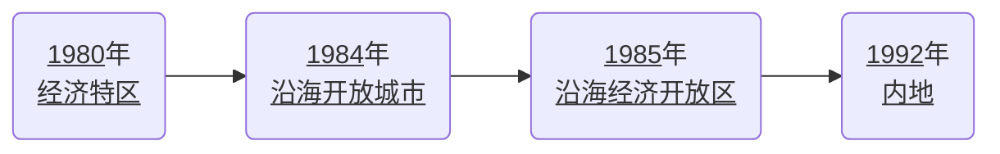

# 期末复习提纲

## 道德与法治

::: tip 考试范围
八年级下册全册
九年级下册**不考**
:::

### 第一单元 坚持宪法至上

#### 第一课 维护宪法权威

1. 我国宪法的基本原则：<u>国家的一切权力属于人民。</u>
   我国宪法的原则：

   1. <u>国家的一切权利属于人民</u>
   2. <u>国家尊重和保障人权</u>
      我国宪法的核心价值追求：<u>规范国家权力运行以保障公民权利</u>

2. 中国共产党的性质：<u>中国共产党是中国工人阶级先锋队，是中国人民和中华民族的先锋队</u>
   党的根本宗旨：<u>全心全意为人民服务</u>
   党的根本组织原则：<u>民主集中制</u>
   党的最高理想和最终目标：<u>实现共产主义</u>
   党的奋斗目标：<u>人民对美好生活的向往</u>
   党的地位：<u>中国共产党是中国特色社会主义事业的领导核心，是最高政治领导力量，是执政党</u>

3. 中国特色社会主义最本质的特征：<u>中国共产党领导</u>
   中国特色社会主义制度的最大优势：<u>中国共产党领导</u>

4. 我国的国体（国家性质）：<u>人民民主专政</u>
   我国的政体（根本政治制度）：<u>人民代表大会制度</u>
   我国的根本制度：<u>社会主义制度</u>
   我国人民的地位：<u>国家的一切权力属于人民（或人民当家作主）</u>
   立法活动的基本要求：<u>尊重和保障人权</u>
   我国宪法、党和人民三者关系：<u>我国宪法是党的主张和人民意志的统一</u>

5. 人权的实质内容和目标：<u>人自由、平等地生存和发展</u>
   我国人权的特点：<u>广泛性、公平性，真实性</u>
   <u>贫穷</u>是实现人权的最大障碍，中国的<u>减贫行动</u>是中国人权事业进步的最显著标志。

6. 我国国家机构

   |        性质         |        名称         |           最高机关            |                   职权                    |
   | :-----------------: | :-----------------: | :---------------------------: | :---------------------------------------: |
   | <u>国家权力机关</u> | <u>人民代表大会</u> |    <u>全国人民代表大会</u>    | <u>立法权、决定权、 任免权、监督权</u> |
   | <u>国家行政机关</u> |   <u>人民政府</u>   | <u>国务院（中央人民政府）</u> |               <u>行政权</u>               |
   | <u>国家监察机关</u> |  <u>监察委员会</u>  |     <u>国家监察委员会</u>     |               <u>监察权</u>               |
   | <u>国家审判机关</u> |   <u>人民法院</u>   |      <u>最高人民法院</u>      |               <u>审判权</u>               |
   | <u>国家检察机关</u> |  <u>人民检察院</u>  |     <u>最高人民检察院</u>     |               <u>检察权</u>               |

   在国家机构中居于主导地位的是：<u>人民代表大会</u>
   国家机构实行的原则：<u>民主集中制</u>
   党的领导机关：

   1. （中央）<u>党的全国代表大会及其产生的中央委员会</u>
   2. （地方）<u>党的地方各级代表大会及其产生的委员会</u>

7. 人民和人大的关系：<u>人民代表大会是人民行使国家权力的机关。全国人民代表大会和地方各级人民代表大会都由民主选举产生，对人民负责，受人民监督。</u>
   人大和其他国家机关的关系：<u>国家行政机关、监察机关、审判机关、检察机关都由人民代表大会产生，对它负责，受它监督。</u>

   ::: warning 答题模板：
   
    如国务院与全国人大的关系：
   
   1. <u>国务院是**国家行政机关**，全国人民代表大会是**国家权利机关**</u>（性质）
   2. <u>国务院由人民代表大会产生，对它负责，受它监督。</u>
   :::

8. 宪法如何规范权力运行？

   1. <u>必须加强对权力运行的制约和监督，让人民监督权力，让权力在阳光下运行，把权力关进制度的笼子。</u>
   2. <u>国家权力必须在宪法和法律限定的范围内行使，不能超越权限行使权力，也不能滥用权力</u>
   3. <u>国家机关及其工作人员必须依法行使权力、履行职责，不得懈怠、推诿。</u>
   4. <u>国家权力必须严格按照法定的程序、途径和方式行使。</u>
   5. <u>国家权力的行使不能任性，法定职责必须为，法无授权不可为。</u>

---

#### 第二课 保障宪法实施

1. 党领导人民治理国家的基本方略：<u>依法治国</u>

2. 我国宪法的本质：<u>我国宪法是党和人民意志的集中体现，是国家的根本法</u>
3. 坚持依法治国首先要坚持<u>依宪治国</u>，坚持依法执政首先要坚持<u>依宪执政</u>。
   （依法执政的主体是<u>中国共产党</u>。）

4. 一切组织和个人的行为准则是<u>宪法和法律</u>，根本活动准则是<u>宪法</u>。

5. 宪法的地位（重要性）：

   1. <u>我国宪法是党的主张和人民意志的统一，是治国安邦的总章程。</u>
   2. <u>宪法是一切组织和个人的根本活动准则。</u>
   3. <u>宪法是国家的根本法，在国家法律体系中具有最高的法律地位、法律权威和法律效力。</u>
   4. <u>宪法是国家法制统一的基础，是中国特色社会主义法律体系的核心。</u>

6. 宪法是国家根本法的原因（或表现）？（宪法与普通法律的区别）

   1. 从内容上看：<u>宪法所规定的内容是国家生活中带有全局性、根本性的问题</u>（普通法律规定的内容通常只是国家生活中的<u>一般性问题</u>。）
   2. 从效力上看：<u>宪法具有最高的法律效力，宪法是其他法律的立法基础和立法依据，其他法律是根据宪法制定的，不得与宪法的原则精神相违背。否则，就会因为违宪而无效。</u>
   3. 从制定和修改的程序上看：<u>宪法的制定和修改程序比其他法律更加严格</u>（宪法的修改必须由全国人大常委会或<u>五分之一</u>以上的的全国人大代表提议，并由全体代表的<u>三分之二</u>以上的多数通过。而其他法律只需由立法机关<u>半数</u>通过。）
   4. 从法律地位看：<u>宪法是国家法制统一的基础，是中国特色社会主义法律体系的核心。</u>（宪法是对公民基本权利的<u>根本确认和保障</u>，其他法律也对公民基本权利的实现具有<u>不可替代</u>的作用。）

7. 宪法与普通法律（其他法律）的关系？
   1. <u>宪法是国家的根本法，在国家的法律体系中具有最高的法律地位，法律权威和法律效力</u>
   2. <u>宪法具有最高的法律效力，宪法是其他法律地立法基础和立法依据，其他法律是根据宪法制定的，不得与宪法的原则精神相违背。否则，就会因为违宪而无效。</u>
8. 权力正确行使的根本保证：<u>监督</u>
   在监督体系中，具有基础性意义的是：<u>宪法监督制度</u>

9. 宪法监督的主体：<u>全国人大及其常委会</u>
   宪法监督的内容：
   1. <u>合宪性审查和监督</u>
   2. <u>审查违宪行为</u>
10. 国家增强宪法意识的重要举措：<u>设立国家宪法日、建立宪法宣誓制度等</u>

11. 公民（青少年）如何增强宪法意识？
    1. <u><b>学习宪法。</b>领会我国宪法的原则和精神，积极参与宪法宣传活动</u>
    2. <u><b>认同宪法。</b>理解并认同宪法的价值，增强对宪法的信服和推崇</u>
    3. <u><b>践行宪法。</b>严格遵守宪法和法律规定，坚决维护宪法的权威，自觉抵制各种妨碍宪法实施、损害宪法尊严的行为。</u>

---

### 第二单元 理解权利义务

#### 第三课 公民权利

#### 第四课 公民义务

1. 宪法的核心内容：<u>公民的基本权利和义务</u>
   宪法的核心价值：<u>确认并保障公民基本权利实现</u>

2. 公民的基本政治权利：<u>选举权与被选举权</u>，公民参与管理国家和管理社会的基础：<u>政治权力和自由</u>，公民最基本、最重要的权利：<u>人身自由</u>，公民赖以生存的基础：<u>劳动权</u>，即是权利又是义务的是：<u>劳动、受教育</u>。

3. 范围
   公民的基本权利包括：

   1. <u>依照宪法的规定，我国公民享有广泛的政治权利和自由、人身自由、社会经济与文化教育权利等基本权利</u>。
   2. <u>我国公民还享有平等权、宗教信仰自由等权利， 妇女、儿童和残疾人等特定人群的权利受到宪法和法律的特殊保障</u>。

   政治权利和自由的内容：<u>选举权和被选举权</u>、<u>政治自由</u>、<u>监督权</u>。

   政治自由的内容：我国公民有<u>**言论**</u>、<u>**出版**</u>、<u>**集会**</u>、<u>**结社**</u>、<u>**游行**</u>、<u>**示威**</u>的自由

   监督权的内容：

   1. <u>我国公民对任何国家机关和国家工作人员，有提出批评和建议的权利；</u>
   2. <u>对任何国家机关和国家工作人员的违法失职行为，有向国家机关提出申诉、控告或者检举的权利。</u>

   人身自由的内容：<u>人身自由不受侵犯</u>、<u>人格尊严不受侵犯</u>、<u>住宅不受侵犯</u>、<u>通信自由和通信秘密受法律保护</u>。
   人格尊严权的内容：<u>名誉权</u>、<u>荣誉权</u>、<u>肖像权</u>、<u>姓名权</u>、<u>隐私权</u>等。
   社会经济权利的内容：<u>财产权</u>、<u>劳动权</u>、<u>物质帮助权</u>
   财产权的内容：<u>占有权</u>、<u>使用权</u>、<u>收益权</u>、<u>处分权</u>
   选举权和被选举权的条件：

   1. <u>年满**十八周岁**的**中国公民**</u>
   2. <u>没有被剥夺政治权利</u>

   行使监督权的注意事项：<u>不得捏造或者歪曲事实进行诬告陷害。</u>
   受教育的重要性：<u>教育为个人人生幸福奠定基础，为人类文明传递薪火，成就民族和国家的未来。</u>
   偷看日记侵犯了<u>隐私</u>权，偷看信件侵犯了<u>通信自由和通信秘密受法律保护</u>~~权~~，偷拍照片并传播侵犯了<u>隐私</u>权，起侮辱性绰号侵犯了<u>人格尊严权中的名誉</u>权，非法搜身侵犯了<u>隐私权、名誉权、人身自由不受侵犯</u>~~权~~。

4. 公民的基本义务包括：

   1. <u>遵守宪法法律</u>
   2. <u>维护国家利益</u>
   3. <u>依法服兵役</u>
   4. <u>依法纳税</u>
   5. 其他义务：（<u>劳动</u>的义务、<u>受教育</u>的义务、夫妻双方<u>实行计划生育</u>的义务、<u>父母抚养教育未成年子女</u>的义务、<u>成年子女赡养扶助父母</u>的义务等）

   遵守宪法法律的内容：<u>保守国家秘密，爱护公共财产，遵守劳动纪律，遵守公共秩序，尊重社会公德。</u>
   维护国家利益的内容：

   1. <u>维护国家统一和全国各民族团结</u>
   2. <u>维护国家安全、荣誉和利益</u>

   我国顺利进行社会主义现代化建设的基本保证：<u>国家的统一和民族的团结</u>
   国家财政收入的主要来源：<u>税收</u>，我国的兵役制度：<u>以志愿兵为主体的志愿兵役与义务兵役相结合</u>

5. 公民维护权利的方式：<u>和解</u>、<u>调解</u>、<u>仲裁</u>、<u>诉讼</u>。调解方式主要有：<u>人民调解</u>、<u>行政调解</u>和<u>司法调解</u>。，诉讼类型包括：<u>民事诉讼</u>、<u>刑事自诉</u>、<u>行政诉讼</u>，日常生活中大量的权益争议是通过<u>和解</u>解决的。仲裁的适用情形：<u>公民与其他个人或组织之间发生合同纠纷和其他财产权益争议</u>

6. 公民违反法定义务应承担的法律责任包括：

   1. <u>违反民事法律，应当依法承担民事责任；</u>
   2. <u>违反行政法律，应当依法承担行政责任；</u>
   3. <u>违反刑事法律，构成犯罪的，应当依法承担刑事责任。</u>

7. 权利和义务的关系？

   1. <u>权利义务相统一，公民的权利与义务相互依存、相互促进。权利的实现需要义务的履行，义务的履行促进权利的实现。</u>
   2. <u>公民既是合法权利的享有者，又是法定义务的承担者。任何公民享有权利的同时必须履行义务。</u>
   3. <u>公民的某些权利同时也是义务。如劳动和受教育。</u>

8. 如何正确对待权利和义务？

   1. <u>坚持权利和义务相统一，任何公民既不能只享受权利而不承担义务，也不应只承担义务而不享受权利。</u>
   2. <u>我们不仅要增强权利意识，依法行使权利，而且要增强义务观念，自觉履行法定的义务。</u>

9. 如何正确行使权利？

   1. <u>公民行使权利不能超越它本身的界限，不能超越法律允许的范围，不能滥用权利。</u>
   2. <u>公民在行使自由和权利的时候，不得损害国家的、社会的、集体的利益和其他公民的合法的自由和权利。</u>
   3. <u>公民行使权利应依照法定程序，按照规定的活动方式、步骤和过程进行。</u>

10. 如何自觉履行义务？

    1. <u>我们要依法履行公民义务，法律要求做的必须去做。</u>
    2. <u>我们要依法履行公民义务，法律禁止做的坚决不做。</u>

---

### 第三单元 人民当家作主

#### 第五课 我国的政治和经济制度

##### 第一框 根本政治制度

1. 我国的根本制度：<u>社会主义制度</u>
   我国的根本政治制度：<u>人民代表大会制度</u>
   我国的基本政治制度：

   1. <u>中国共产党领导的多党合作和政治协商制度</u>
   2. <u>民族区域自治制度</u>
   3. <u>基层群众自治制度</u>

   其中，具有中国特色的政党制度是<u>（1）</u>，我国的民族制度是<u>（2）</u>。

2. 人大代表的职权：<u>依法审议各项议案和报告</u>、<u>表决各项决定</u>、<u>提出议案和质询案。</u>

3. 人大代表的义务：
   必须与人民群众<u>保持密切联系</u>，<u>听取和反映</u>人民群众的意见和要求，努力为人民<u>服务</u>，对人民<u>负责</u>，并接受人民<u>监督</u>。

4. 人民代表大会制度是<u>坚持党的领导</u>、<u>人民当家作主</u>、<u>依法治国</u>有机统一的根本政治制度安排。

5. 如何坚持和完善人民代表大会制度？

   1. <u>必须毫不动摇地坚持中国共产党的领导，通过人民代表大会制度，使党的主张通过法定程序成为国家意志。</u>
   2. <u>必须保证和发展人民当家作主</u>，支持和保证人民通过人民代表大会行使国家权力，扩大人民民主，健全民主制度，丰富民主形式，拓宽民主渠道。
   3. <u>必须全面推进依法治国</u>，通过人民代表大会制度，弘扬社会主义法制精神，实现国家各项工作法治化。
   4. <u>必须坚持民主集中制</u>，人民代表大会统一行使国家权力，国家机关既有合理分工又有相互协调，保证国家统一高效组织推进各项事业。

##### 第二框 基本政治制度

1. 中国共产党和各民主党派合作的基本方针：<u>长期共存</u>、<u>互相监督</u>、<u>肝胆相照</u>、<u>荣辱与共</u>。
   重要机构是<u>中国人民政治协商会议</u>，简称<u>人民政协</u>，它围绕<u>团结和民主</u>两大主题，履行<u>政治协商</u>、<u>民主监督</u>、<u>参政议政</u>的职能。
2. 我国政党制度的意义（优越性）？

   1. 是发扬社会主义民主的<u>重要形式</u>。
   2. 有利于反映民意，集中民智，促进<u>科学民主决策</u>。
   3. 有利于协调关系，化解矛盾，维护<u>社会稳定和谐</u>。
   4. 有利于凝聚人民，反对分裂，推进<u>祖国和平统一大业</u>。

3. 社会主义民族关系的特点：<u>平等团结互助和谐</u>。
   民族自治机关包括：<u>人民代表大会</u>（性质：<u>国家权力机关</u>）和<u>人民政府</u>（性质：<u>国家行政机关</u>） 。
   民族自治地方人民当家作主的主要形式是<u>人民代表大会制度</u>；专门形式是<u>民族区域自治制度</u>
4. 民族区域自治的意义（优越性）

   1. 有利于把国家的<u>集中、统一</u>和各民族的<u>自主、平等</u>结合起来。
   2. 有利于把国家的<u>法律、政策</u>与民族自治地方的<u>具体实际、特殊情况</u>结合起来。
   3. 有利于把各族人民<u>热爱祖国</u>的感情与<u>热爱自己民族</u>的感情结合起来。
   4. 民族区域自治制度符合我国国情，在维护<u>祖国统一</u>、<u>领土完整</u>，在加强<u>民族平等团结</u>、促进<u>民族地区发展</u>、增强<u>中华民族凝聚力</u>等方面都起到了重要作用。

5. 基层群众自治的组织包括<u>居民委员会</u>和<u>村民委员会</u>，其性质是<u>基层群众性自治组织</u>。
6. 基层群众自治的特点是<u>自我管理</u>、<u>自我服务</u>、<u>自我教育</u>、<u>自我监督</u>。

##### 第三框 基本经济制度

1. 我国基本经济制度包括：

   1. <u>公有制为主体、多种所有制经济共同发展</u>；

   （决定因素是<u>我国正处于社会主义初级阶段的基本国情</u>）

   2. <u>按劳分配为主体、多种分配方式并存</u>；

   3. <u>社会主义市场经济体制</u>；

2. 公有制经济包括：<u>国有经济</u>、<u>集体经济</u>、<u>混合所有制经济中的国有成分和集体成分</u>。
   我国对公有制经济的政策：<u>必须毫不动摇巩固和发展公有制经济</u>

3. 非公有制经济包括：<u>个体经济</u>、<u>私营经济</u>、<u>港澳台投资经济</u>、<u>外商投资经济</u>。
   我国对非公有制经济的政策：<u>毫不动摇鼓励、支持、引导非公有制经济发展</u>

4. 国民经济的主体：<u>公有制经济</u>；国民经济的主导力量：<u>国有经济</u>；
   社会主义市场经济的重要组成部分：<u>公有制经济和非公有制经济</u>
   我国经济社会发展的重要基础：<u>公有制经济和非公有制经济</u>

5. 坚持公有制为主体、多种所有制经济共同发展的作用：
   促进了<u>生产力的发展</u>、<u>综合国力的增强</u>和<u>人民生活水平</u>的提高，为<u>人民当家作主</u>奠定了坚实的物质基础。

---

#### 第六课 我国国家机构

1. 我国的根本制度：<u>社会主义制度</u>
   我国的根本政治制度：<u>人民代表大会制度</u>
   我国的基本政治制度：

   1. <u>中国共产党领导的多党合作和政治协商制度</u>
   2. <u>民族区域自治制度</u>
   3. <u>基层群众自治制度</u>

   我国的基本经济制度：

   1. <u>公有制为主体、多种所有制经济共同发展</u>；
   2. <u>按劳分配为主体、多种分配方式并存</u>；
   3. <u>社会主义市场经济体制</u>

2. 人民行使国家权力的机关是<u>全国</u>人民代表大会和<u>地方各级</u>人民代表大会。
   代表中华人民共和国的国家机关是<u>中华人民共和国主席</u>。
   国家权力机关的执行机关是<u>国务院</u>及其领导的地方各级<u>人民政府</u>。
   中华人民共和国的国家元首是<u>中华人民共和国主席</u>，政府首脑是<u>中华人民共和国国务院总理</u>。

3. 人大的性质：<u>国家权力机关</u>
   全国人大的性质：<u>最高国家权力机关</u>
   地方各级人大的性质：<u>地方国家权力机关</u>
   人民政府的性质：<u>国家行政机关</u>，<u>国家权力机关的执行机关</u>
   国务院的性质：<u>最高国家行政机关</u>，<u>最高国家权力机关的执行机关</u>

4. 人大的职权：<u>立法权</u>、<u>决定权</u>、<u>任免权</u>、<u>监督权</u>
   人大代表的职权：<u>审议权</u>、<u>表决权</u>、<u>提案权</u>
   国家主席的职权：<u>公布法律 、发布命令</u>、<u>任免权</u>、<u>外事权</u>、<u>授予荣誉权</u>
   国家行政机关的宗旨：<u>全心全意为人民服务</u>
   对行政机关的要求：<u>依法行政</u>
   全国人大决定修改《个人所得税法》是在行使<u>立法</u>权；批准关于国民经济和社会发展规划的报告是在行使<u>决定</u>权；听取和审议最高人民法院工作报告是在行使<u>监督</u>权。

5. 自行梳理几对关系（不默）：

   1. 人民与人大的关系：
      人大代表由人民选举产生，对人民负责，受人民监督。
   2. 人大与其他国家机关的关系（全国人大与其他中央国家机关的关系）：
      全国人民代表大会是最高国家权力机关，有权监督其他中央国家机关的工作；其他中央国家机关都由全国人大产生，并对它负责，向它报告工作，受它监督。
   3. 宪法与全国人大的关系：
      1. 宪法是国家的根本法，是全国人大根本的活动准则。
      2. 全国人大是最高国家权力机关，拥有修改宪法和监督宪法实施的权力。
   4. 全国人大与国家主席的关系：
      1. 国家主席是中华人民共和国的国家元首，是代表中华人民共和国的国家机关；全国人民代表大会是最高国家权力机关。
      2. 国家主席由全国人民代表大会选举产生，根据全国人民代表大会及其常委会的决定行使宪法赋予的职权。
   5. 国家主席和国务院总理的区别：
      1. 职能不同： 国家主席代表中华人民共和国，行使国家元首的职权
         国务院总理是国务院的最高领导人，是中华人民共和国的政治首脑，国家政务上的最高负责人
      2. 产生方式不同：国家主席由全国人民代表大会选举产生
         国务院总理是根据国家主席提名，交由全国人民代表大会全体投票通过，再由国家主席根据全国人大的决定任命。

6. 区分各类国家机关：
   | 名称 | 中央一级名称 | 性质 | 职权 |
   | :----------: | :------------------------------------: | :----------------------------------------------------------: | :----------------------------------------------------------: |
   | 人民代表大会 | <u>全国</u>人民代表大会 | （最高）国家<u>权力</u>机关 | <u>立法权</u>、<u>决定权</u>、<u>任免权</u>、<u>监督权</u> |
   | 无 | 国家主席 | 1. <u>是代表中华人民共和国的国家机关</u> 2. <u>是中华人民共和国的国家元首</u> | <u>公布法律、发布命令</u>、<u>任免权</u>、<u>外事权</u>、<u>授予荣誉权</u> |
   | 人民政府 | <u>国务院</u>（或<u>中央</u>人民政府） | （最高）国家<u>行政</u>机关、 <u>国家权力机关的执行机关</u> | <u>行政权</u> |
   | 监察委员会 | <u>国家</u>监察委员会 | （最高）国家<u>监察</u>机关 | <u>监察权</u> |
   | 人民法院 | <u>最高</u>人民法院 | （最高）国家<u>审判</u>机关 | <u>审判权</u> |
   | 人民检察院 | <u>最高</u>人民检察院 | （最高）国家<u>法律监督（检察）</u>机关 | <u>检察权</u> |

7. 全国人大与国务院的关系：

   1. <u>全国人大是最高国家权力机关，国务院是最高国家行政机关、最高国家权力机关的执行机关</u>
   2. <u>国务院由全国人大产生，对其负责，受其监督。</u>

8. 国务院与最高人民法院的关系：

   1. <u>国务院是最高国家行政机关、最高国家权力机关的执行机关，最高人民法院是最高国家审判机关。</u>
   2. <u>国务院依法行使国家行政职权，最高人民法院依法独立公正行使审判权。</u>
   3. <u>办理职务违法和职务犯罪案件，应当与国家监察委员会互相配合、互相制约</u>
   4. <u>各机关在工作中需要协助的，有关机关和单位应当根据要求依法予以协助。</u>

9. 人民与国务院的关系：

   1. <u>人民是国家的主人，国务院的权力来自于人民，是人民授予的。</u>
   2. <u>国务院必须全心全意为人民服务，努力建设人民满意的服务型政府。</u>

10. 宪法与全国人大的关系：
    1. <u>宪法是国家的根本法，是全国人大根本的活动准则。</u>
    2. <u>全国人大是最高国家权力机关，享有修改宪法和监督宪法实施的权力。</u>

---

### 第四单元 崇尚法治精神

#### 第七课 尊重自由平等

1. 法治的价值追求、法治精神的内容：<u>追求自由平等，维护公平正义</u>
   法治社会的核心价值：<u>公平正义</u>
   社会文明进步的标志，也是社会主义法治的基本原则之一：<u>法律面前人人平等</u>
2. 法治与自由的关系:
   1. 法治与自由<u>互相联系，不可分割</u>。
   2. 一方面，<u>法治标定了自由的界限</u>；
   3. 另一方面，<u>法治是自由的保障</u>。
3. 在法律意义上，平等具有两层含义：
   1. 一是<u>同等情况同等对待</u>
   2. 二是<u>不同情况差别对待</u>
4. 如何珍视自由？
   1. <u>珍惜宪法和法律赋予我们的权利</u>；
   2. <u>必须依法行使 权利</u>
5. 如何践行平等？
   1. <u>就要反对特权</u>；
   2. <u>就要平等对待他人的合法权利</u>；
   3. <u>就要敢于抵抗不平等的行为</u>

---

#### 第八课 维护公平正义

1. 公平的内涵：<u>权利公平</u>、<u>规则公平</u>、<u>机会公平</u>

2. 一般而言，正义行为都是有利于<u>促进社会进步</u>、<u>维护公共利益</u>的行为。

3. 正义的要求：

   1. <u>要求依法保障人们的正当权利</u>，使受害者得到救济、违法者受到惩罚；
   2. 要求人们分辨是非，惩恶扬善，<u>维护社会公共利益</u>；
   3. 要求人们<u>对弱者给予必要的扶助</u>，以保证其有尊严地生存。

4. 公平的重要性：

   1. <u>公平是个人生存和发展的重要保障</u>；
   2. <u>公平是社会稳定和进步的重要基础</u>

5. 正义的重要性：

   1. <u>正义是社会文明的尺度，体现了人们对美好社会的期待和追求</u>
   2. <u>正义是法治追求的基本价值目标之一</u>
   3. <u>正义是社会制度的重要价值</u>
   4. <u>正义是社会和谐的基本条件</u>

6. 如何维护公平正义？
   1. <u>个人守护公平正义，做有正义感的人；</u>
   2. <u>依靠制度（特别是法律）保障公平正义；</u>
   3. <u>司法维护公平正义，司法机关必须确保司法公正；</u>
   4. <u>社会积极承担责任，营造公平正义的社会氛围。</u>

### 第一单元 富强与创新

#### 第一课 踏上强国之路

1. 近代以来几次伟大飞跃：

   |            | 醒过来          | 站起来            | 富起来                    | 强起来     |
   | ---------- | --------------- | ----------------- | ------------------------- | ---------- |
   | 时间       | <u>1911年</u>   | <u>1949年</u>     | <u>1978年</u>             | 2012       |
   | 标志性事件 | <u>辛亥革命</u> | <u>新中国成立</u> | <u>中共十一届三中全会</u> | 党的十八大 |
   | 核心人物   | <u>孙中山</u>   | <u>毛泽东</u>     | <u>邓小平</u>             | 习近平     |

   共同追求：<u>实现中华民族伟大复兴</u>

2. 注意区别以下几个时间点（时间、事件）：

   1. 开辟中国历史新纪元：<u>1949年，新中国成立</u>
   2. 进入社会主义社会：<u>1956年，三大改造的基本完成</u>
   3. 进入中国特色社会主义新时期：<u>1978年，中共十一届三中全会</u>
   4. 进入中国特色社会主义新时代：<u>2012年，党的十八大</u>

3. 改革开放的标志：<u>1978年，中共十一届三中全会的召开</u>
   中国改革的标志：<u>1978年，安徽省凤阳县小岗村实行家庭联产承包责任制</u>

4. 社会主义基本经济制度：

   1. <u>公有制为主体、多种所有制经济共同发展</u>
   2. <u>按劳分配为主体、多种分配方式并存</u>
   3. <u>社会主义市场经济体制</u>

5. 党在社会主义初级阶段的基本路线，其核心内容是：<u>以经济建设为中心，坚持四项基本原则，坚持改革开放。</u><i>（“一个中心，两个基本点”）</i>

6. 改革开放的成就：

   1. <u>经济快速发展、综合国力显著增强</u>
   2. <u>人民生活水平显著改善</u>
   3. <u>国际地位和国际影响力显著提高，已经成为世界经济增长的主要稳定器和动力源</u>

7. 改革开放的成就说明了什么*（改革开放的重要性、意义、原因）*？

   1. <u>坚持改革开放，是我们的强国之路。</u>
   2. <u>改革开放是决定当代中国命运的关键一招<i>（关键抉择）</i>，也是决定实现中华民族伟大复兴的关键一招。</u>
   3. <i>（意义）</i><u>改革开放极大解放和发展社会生产力，人民生活显著改善，综合国力显著增强，国际地位显著提高。</u>

8. 中国共产党的初心和使命：<u>为中国人民谋幸福、为中华民族谋复兴。</u>

9. 社会主义的本质：<u>解放和发展社会生产力</u>

10. 社会主义初级阶段的奋斗目标：<u>将中国建设成为建成富强民主文明和谐美丽的社会主义现代化强国。</u>

11. 为什么要全面深化改革？

   1. 主要矛盾角度： <u>我国社会主要矛盾已经转化为人民日益增长的美好生活需要和不平衡不充分的发展之间的矛盾</u>
   2. 经济发展新常态角度： <u>由高速增长阶段转向高质量发展阶段</u>
   3. 现实挑战角度：<u>区域发展不平衡､城镇化水平不高､城乡发展不平衡不协调等现实挑战</u>
   4. 改革开放重要性角度： <u> 改革开放是我们的强国之路，是决定当代中国命运的关键一招，也是实现中华民族伟大复兴的关键一招。</u>
   5. 时代特色角度： <u>改革开放是当代中国最鲜明的特色 。</u>

12. 怎样全面深化改革？

   1. <u>坚持以人民为中心的发展思想</u>
   2. <u>落实新发展理念，转变发展方式，优化经济结构。</u>
   3. <u>促进区域协调发展，推动城乡发展一体化，实现共同富裕。</u>
   4. <u>弘扬改革创新精神。</u>

13. 关系国计民生的根本性问题：<u>农业、农村、农民问题*（三农问题）*</u>
   解决“三农”问题实施的战略：<u>乡村振兴战略</u>

14. 常见经济指标的变化说明了什么

   | 常见经济指标的变化           | 说明了什么                            |
   | ---------------------------- | ------------------------------------- |
   | 国内生产总值（GDP）增长      | <u>经济持续发展，综合国力不断增强</u> |
   | 城镇居民和农村居民收入增长   | <u>人民生活水平显著改善</u>           |
   | 城镇居民和农村居民收入差距大 | <u>城乡发展不平衡不协调</u>           |
   | 对外贸易总额增长             | <u>国际地位和国际影响力不断提高</u>   |

15. 当代中国最鲜明的特色：<u>改革开放</u>
   党的奋斗目标：<u>人民对美好生活的向往</u>

16. 我国的发展思想：<u>坚持以人民为中心</u>
   发展的根本目的：<u>增进民生福祉</u>
   衡量一个社会的文明程度，不仅要看<u>经济发展</u>，而且要看<u>发展成果是否惠及全体人民</u>

17. 共享发展成果的意义*（改善民生措施的意义、乡村振兴战略的意义）*

   1. <u>体现党和政府以人民为中心的发展思想；</u>
   2. <u>有利于实现共同富裕；</u>
   3. <u>有利满足人民日益增长的美好生活需要，缓解社会主要矛盾</u>
   4. <u>有利于促进社会公平正义。</u>

### 第二课 创新驱动发展

1. <u>创新驱动</u>是国家命运所系，我国正在实施<u>创新驱动发展</u>战略。
   国家发展的中心工作：<u>经济建设</u>
   国家发展全局的核心：<u>创新</u>
   创新的核心：<u>科技创新</u>
2. 创新的重要性：
   1. <u>科技创新能力已经成为综合国力竞争的决定性因素。*（创新已经成为世界主要国家发展战略的重心。）*</u>
   2. <u>创新是引领发展的第一动力，创新是一个民族进步的灵魂，是一个国家兴旺发达的不竭源泉。</u>
3. 改革与创新的关系：
   1. <u>创新是改革开放的生命。</u>
   2. <u>国家用改革之手激活创新引擎</u>
4. 国家的中心工作：<u>经济建设</u>
   国家发展全局的核心：<u>创新</u>
   关系国计民生的根本性问题：<u>农业农村农民问题</u>
   全面创新的核心：<u>科技创新</u>
   经济建设的重心：<u>依靠科技进步和提高劳动者素质</u>
   我们的强国之路：<u>改革开放</u>
   引领发展的第一动力：<u>创新</u>
   当代中国最鲜明的特色：<u>改革开放</u>
   民族振兴、社会进步的基石：<u>教育</u>
   企业持续发展之基、市场制胜之道：<u>提升创新能力</u>
   决定当代中国命运的关键抉择：<u>改革开放</u>
   综合国力竞争的决定性因素：<u>科技创新能力</u>
   培养创新型人才的根本途径：<u>教育</u>
   社会创新的重要力量：<u>企业</u>

5. 党的奋斗目标：<u>人民对美好生活的向往</u>
   党和政府坚持的发展思想：<u>以人民为中心</u>
   社会主义初级阶段的奋斗目标：<u>把我国建设成为富强民主文明和谐的社会主义现代</u>
   我国社会主要矛盾：<u>人民日益增长的美好生活需要和不平衡不充分的发展之间的矛盾。</u>

5. 发展的目的：<u>增进民生福祉</u>
   创新的目的：<u>增进人民福祉，让生活更美好</u>

6. 我国取得的科技成就体现了怎样的科技现状？
   <u>我国在尖端技术的掌握和创新方面打下了坚实的基础，在一些重要领域走在世界前列。</u>

7. 为什么要建设创新型国家？
   1. 重要性角度：<u>创新是引领发展的第一动力， 科技创新能力已经成为综合国力竞争的决定性因素。</u>
   2. 科技国情角度：<u>从整体上看，仍面临创新能力不强 、科技发展总体水平不高、科技 对经济社会发展的支撑能力不足、科技对经济增长贡献率远低于发达国家水平等问题。中国科技创新之路任重道远，需要加快建设创新型国家.</u>
   3. 意义角度：<u>建设创新型国家，有利于提高我国的科技创新能力和科技发展水平，有利于提高科技对经济社会发展的支撑能力和对经济增长的贡献率，有利于增强综合国力，在国际竞争中占据战略主动地位。</u>

8. 怎样建设创新型国家？
   1. 国家角度：
      1. <u>落实科教兴国、人才强国战略，把经济建设重心转移到依靠科技进步和提高劳动者素质的轨道上来</u>
      2. <u>大力发展教育事业，培养创新型人才</u>
      3. <u>实施创新驱动发展战略，推进以科技创新为核心的全面创新，增强自主创新能力</u>
      4. <u>营造有利于创新的舆论氛围和法治环境。</u>

   2. 企业角度：
      1. <u>企业是社会创新的重要力量，提升创新能力是企业持续发展之基、市场制胜之道</u>
      2. <u>增强自主创新能力。</u>

   3. 个人角度：
      1. <u>努力学习，提高科学文化素质</u>
      2. <u>积极参加社会实践，培养创新能力和实践能力</u>
      3. <u>树立远大理想，增强社会责任感。</u>

9. 教育的重要性：*（国家角度）*
   <u>教育是民族振兴、社会进步的基石，是提高国民素质，培养创新型人才、促进人的全面发展的根本途径。</u>

### 第二单元 民主与法治

#### 第三课 追求民主价值

1. 社会主义民主的本质特征：<u>人民当家作主</u>
   目的：<u>保障最广大人民的利益</u>
   我国社会主义民主的特点：<u>是新型的民主，是维护人民根本利益的最广泛、最真实、最管用的民主</u>；

2. 我国社会主义民主的重要形式：<u>选举民主、协商民主</u>；
   我国公民行使民主权利的形式：<u>民主选举、民主决策、民主监督</u>。 

3. 人民民主的真谛：<u>有事好商量，众人的事情由众人商量</u>；
   我国社会主义民主政治的特有形式和独特优势：<u>协商民主</u>；

4. 我国的社会主义民主制度：
   1. <u>人民代表大会制度</u>*（人民掌握国家政权、行使权力的根本途径）*；
   2. <u>中国共产党领导的多党合作和政治协商制度</u>*（求同存异、最大公约数、最大同心圆）*；
   3. <u>民族区域自治制度</u>*（实现民族平等）*；
   4. <u>基层群众自主制度</u>*（社会主义民主政治建设的基础）*；

5. 人民实现民主权利的一种重要形式：<u>民主选举</u>；
   保障人民利益得到充分实现的有效方式：<u>民主决策</u>；
   公民参与民主生活、行使公民监督权的具体体现：<u>民主监督</u>；

6. 我国公民参与民主决策的制度：<u>社情民意反映制度</u>、<u>专家咨询制度</u>、<u>重大事项社会公示制度</u>和<u>社会听证制度</u>等是公民参与民主决策的有力保证。

7. 社会听证制度*（或其它民主决策制度）*的意义： 
   1. <u>是公民参与民主决策的有力保证；</u>
   2. <u>有利于决策方认真听取各方意见，集中民智，促进决策科学化。</u>

8. 民主监督的意义：
   1. <u>国家角度：有利于国家机关和国家工作人员改进工作，防止滥用权力，预防腐败。</u>
   2. <u>个人角度：有助于增强公民的参与意识，保障公民的监督权。</u>

9. 网络问政的作用：
   1. <u>有利于推进决策的民主化和科学化；</u>
   2. <u>有利于拓宽民主渠道，保障公民的监督权；</u>
   3. <u>有利于促进政府依法行政。</u>

10. 政府召开听证会*（网络问政）*说明了什么？

    1. <u>我国是人民当家作主的国家*（人民是国家的主人）*；</u>
    2. <u>政府坚持以人民为中心的发展思想；</u>
    3. <u>政府坚持依法行政，保障公民的参与权和监督权。</u>

11. 公民参与听证会*（网络问政）*说明了什么?
    1. <u>我国是人民当家作主的国家*（人民是国家的主人）*；</u>
    2. <u>公民依法享有建议权和监督权；</u>
    3. <u>公民参与民主生活的意识在不断增强。</u>

12. 公民如何参与民主生活？
    要有<u>社会责任感</u>和<u>主人翁意识</u>，以<u>理性、公正、客观</u>的态度全面、深刻、辩证地看问题， <u>立场正确、逻辑清晰</u>地表达观点和意见，逐步提高<u>依法有序</u>的能力。

13. 公民如何增强民主意识？
    1. 公民要<u>自觉遵守宪法</u>，始终按照宪法原则和精神参与民主生活。
    2. 要不断<u>积累民主知识</u>，形成尊重、宽容、批判和协商的民主态度。
    3. 通过<u>依法参与公共事务</u>，在实践中增强民主意识。

## 中国历史

::: tip 考试范围
八年级下册全册
:::

### 第一单元 中华人民共和国的成立和巩固

#### 第 1 课 中华人民共和国成立

1. 中国人民政治协商会议召开的时间：<u>1949 年 9 月</u>；地点：<u>北平</u>。

2. 中国人民政治协商会议的内容

   1. 决定成立<u>中华人民共和国</u>，通过了《<u>中国人民政治协商会议共同纲领</u>》。我国是<u>新民主主义</u>即<u>人民民主主义国家</u>，实行工人阶级领导的、以工农联盟为基础的、团结各民主阶级和国内各民族的<u>人民民主专政</u>；国家政权属于人民。各政权机关一律实行<u>民主集中制</u>。
      中国人民政治协商会议代行<u>全国人民代表大会</u>的职权。共同纲领起<u>临时宪法</u>的作用。选举中央人民政府委员会，<u>毛泽东</u>当选中央人民政府主席。
   2. 决定<u>北京</u>为新中国的首都、<u>《义勇军进行曲》</u>为代国歌、<u>五星红旗</u>为国旗；采用<u>公元</u>纪年。
   3. 决定建立人民英雄纪念碑。

3. 中国人民政治协商会议的意义：标志着<u>中国共产党领导的多党合作和政治协商</u>制度正式确立。

4. 开国大典的时间：<u>1949 年 10 月 1 日下午 3 时</u>；地点：<u>北京天安门</u>。

5. 中华人民共和国成立的意义：

   1. 国内意义：
      1. <u>中华人民共和国的成立，开辟了中国历史的新纪元。中国人民经过一百多年的英勇斗争，终于推翻了帝国主义 、封建主义和官僚主义的通知；中国真正成为独立自主的国家，占人类总数四分之一的中国人从此站起来了。（中国人民终于赢得了民族独立和人民解放，真正成为国家的主人。）</u>
      2. <u>标志着中国新民主主义革命的胜利。</u>
   2. 国际意义： <u>新中国的成立，壮大了世界和平民主和社会主义的力量。</u>

6. 1949 年，西藏宗教领袖之一<u>班禅额尔德尼·确吉坚赞</u>，表示拥护中共和中央人民政府，希望早日解放西藏。1951 年，以<u>阿沛·阿旺晋美</u>为首席代表的代表团，与中央人民政府谈判，西藏和平解放。

7. 西藏和平解放的意义：
   <u>至此，祖国大陆获得统一，各族人民实现了大团结。</u>

8. 新民主主义革命的历史是从天安门到天安门。两个天安门所指历史事件分别是<u>五四运动</u>、<u>中华人民共和国成立</u>。

9. 列举元朝和清朝各一例相关史实印证“西藏自古以来就是中国的领土”。

   |     时间     |                                                    事件                                                     |
   | :----------: | :---------------------------------------------------------------------------------------------------------: |
   |     元朝     | 在西藏设立宣慰使司都元帅府，由宣政院直接统辖，掌管西藏的军民各项事务。从此，中央政府对西藏正式行使行政管辖  |
   |     清朝     | 先后确立对达赖和班禅的册封制度，设置驻藏大臣和噶厦，颁布《钦定藏内善后章程》29 条，有效地加强了对西藏的管辖 |
   | 新中国成立后 |                              1951 年，西藏和平解放；1965 年，西藏自治区成立。                               |

---

#### 第 2 课 抗美援朝

1. 在抗美援朝保家卫国战争中，中国人民志愿军发扬了怎样的精神：<u>抗美援朝精神</u>
2. 见第三课中的 1.2

---

#### 第 3 课 土地改革

1. 中华人民共和国成立后采取的巩固措施

   1. 政治上：<u>西藏和平解放</u>。

   2. 军事上：<u>抗美援朝</u>。
      目的：<u>抗美援朝，保家卫国</u>。
      性质：<u>正义的反侵略战争</u>。
      军队名称：以<u>彭德怀</u>为司令员兼政治委员的<u>中国人民志愿军</u>。
      列举一例著名战役：<u>上甘岭战役</u>。列举两位英雄人物：<u>黄继光</u>、<u>邱少云</u>。
      这一场战争意义：
      1. <u>伟大的抗美援朝战争，抵御了帝国主义侵略扩张，捍卫了新中国安全，保卫了中国人民和平生活。</u>
      2. <u>稳定了朝鲜半岛局势，维护了亚洲和世界和平，大大提高了我国的国际地位。</u>
      3. <u>抗美援朝战争伟大胜利，是中国人民站起来后屹立于世界东方的宣言书，是中华民族走向伟大复兴的重要里程碑。</u>
   3. 经济上：<u>土地改革</u>。1950 年，《<u>中华人民共和国土地改革法</u>》 颁布，规定废除<u>地主阶级封建剥削的土地所有制</u>，实行<u>农民的土地所有制</u>。
      成果：到<u>1952</u>年底，除部分民族地区外，在<u>全国大陆基本上</u>完成。
      意义：
      1. 政治上：
         1. <u>土地改革的完成，彻底摧毁了我国存在 2000 多年的封建土地制度，消灭了地主阶级。</u>
         2. <u>农民翻了身，得到了土地，成为土地的主人。</u>
         3. <u>使人民政权更加巩固。</u>
      2. 经济上：<u>大大解放了农村生产力，农业生产获得迅速恢复和发展，为国家的工业化建设准备了条件。</u>

---

### 第二单元 社会主义制度的建立与社会主义建设的探索

#### 第 4 课 工业化的起步和人民代表大会制度的确立

1. 第一个五年计划的时间<u>1953-1957 年底</u>，集中主要力量发展<u>重工业</u>。
   意义：<u>我国开始改变工业落后的面貌，向社会主义工业化迈进。</u>
2. 列举第一个五年计划的成就（工业和交通运输业各 3 例）

   1. 工业：<u>鞍山钢铁公司无缝钢管厂等三大工程</u>，<u>长春第一汽车制造厂</u>，<u>沈阳第一机床厂</u>和<u>飞机制造厂</u>等建成投产
   2. 交通运输业：
      1. 新建<u>宝成</u>、<u>鹰厦</u>等铁路 30 余条
      2. <u>川藏</u>、<u>青藏</u>、<u>新藏</u>公路
      3. 1957 年，<u>武汉长江大桥</u>建成

3. 1954 年，<u>第一届全国人民代表大会</u>第一次会议在<u>北京</u>召开，通过了《<u>中华人民共和国宪法</u>》 ，这是我国第一部<u>社会主义</u>类型的宪法，也是我国有史以来真正反映<u>人民利益</u>的宪法。宪法规定，中华人民共和国<u>全国人民代表大会</u>是最高国家权力机关。这就以国家<u>根本大法</u>的形式确定了<u>人民代表大会</u>制度，这一制度是我国的<u>根本</u>政治制度，为社会主义<u>民主政治建设</u>奠定了基础。

4. 人民军队在不同时期的称谓：
   土地革命战争时期：<u>中国工农革命军</u>、<u>中国工农红军</u>
   全面抗战时期：<u>八路军</u>、<u>新四军</u>
   人民解放战争时期：<u>人民解放军</u>（1948 年改称“<u>中国人民解放军</u>”，沿用至今）

---

#### 第 5 课 三大改造

1. 我国改变生产资料私有制的深刻社会变革：<u>三大改造</u>
2. 我国进入社会主义初级阶段的标志/社会主义基本制度建立的标志：<u>1956 年底，三大改造的基本完成。</u>
3. 三大改造指国家对<u>农业</u>、<u>手工业</u>和<u>资本主义工商业</u>的社会主义改革。
4. 对资本主义工商业实行社会主义改造的方式：<u>公私合营</u>；
   对资本主义工商业实行社会主义改造的政策：<u>赎买政策</u>
   意义：<u>实现了和平过渡，是中国社会主义改造的创举</u>
5. 三大改造基本完成的时间，意义
   时间：<u>1956 年底</u>
   意义：
   1. <u>国家实现了生产资料私有制向社会主义公有制的转变</u>
   2. <u>社会主义基本制度在我国建立起来</u>
   3. <u>这是中国历史上最深刻的社会改革</u>
   4. <u>我国从此进入社会主义初级阶段</u>
6. 近现代中国社会性质的三次转变：
   1. <u>鸦片战争：从封建社会转变为半殖民地半封建社会</u>
   2. <u>中华人民共和国成立：从半殖民地半封建社会转变为新民主主义社会</u>
   3. <u>三大改造基本完成：从新民主主义社会转变为社会主义社会</u>
7. 请写出以下事件生产资料所有制的变化
   1. 土地改革：<u>从封建地主阶级土地所有制变为农民土地所有制</u>
   2. 农业的社会主义改造：<u>从生产资料私有制变为社会主义公有制</u>

---

#### 第 6 课 艰辛探索与建设成就

1. 探索时期的良好开端是指：<u>中共八大</u>
2. 探索时期的四个失误：<u>总路线</u>、<u>“大跃进”</u>、<u>人民公社化运动</u>、<u>“文化大革命”</u>。
3. 大跃进和人民公社化运动的教训：
   1. <u>经济建设要遵循经济发展的客观规律，实事求是，一切从实际出发；</u>
   2. <u>要正确认识基本国情，要立足国情，制定正确的方针、政策和路线；</u>
   3. <u>要维护好群众利益，调动人民的生产积极性等</u>
4. 调整措施：<u>1961</u>年实施“<u>调整</u>、<u>巩固</u>、<u>充实</u>、<u>提高</u>”的八字方针。1962 年，中共中央召开<u>“七千人大会”</u>，比较系统地初步总结了“大跃进”以来的基本经验教训，对推动国民经济全面调整起到了积极作用。
5. 建设成就
   1. 全面建设社会主义时期的（1956-1966）年的成就
      1. <u>武汉</u>、<u>包头</u>两大钢铁基地；
      2. 建设三个油田：<u>大庆油田</u>、<u>胜利油田</u>、<u>大港油田</u>；
      3. 交通方面修建了：<u>兰新</u>、<u>兰青</u>、<u>包兰</u>铁路。
      4. 1965 我国首先完成了<u>人工合成结晶牛胰岛素</u>，这在世界上居于领先地位；
      5. 1964 年成功爆炸第一颗<u>原子弹</u>。
         这一时期涌现出的英雄模范人物典型代表：大庆石油工人“铁人”<u>王进喜</u>，党的好干部<u>焦裕禄</u>，解放军好战士<u>雷锋</u>。
   2. “文革”期间的成就(1966——1976)
      1. 1967 年我国爆炸了第一颗<u>氢弹</u>
      2. 1970 年成功发射了第一颗<u>人造地球卫星</u>
      3. 1973 年我国在世界上首次培育成功强优势的<u>籼型杂交水稻</u>。

---

### 第三单元 中国特色社会主义道路

#### 第 7 课 伟大的历史转折

1. 我国进入社会主义初级阶段的标志：

   1. 时间：<u>1956 年底</u>
   2. 事件：<u>三大改造基本完成</u>

   中国人民站起来的标志：

   1. 时间：<u>1949 年</u>
   2. 事件：<u>中华人民共和国成立</u>

   新中国成立以来，党历史上的伟大转折：

   1. 时间：<u>1978 年</u>
   2. 事件：<u>中共十一届三中全会</u>

2. 新中国成立以来党历史上的伟大转折内容：
   1. <u>思想</u>上：冲破长期“<u>左</u>”的 错误的严重束缚，确定了<u>解放思想</u>、<u>开动脑筋</u>、<u>实事求是</u>、团结一致向前看的指导方针。
   2. <u>组织</u>上：实际上形成了以<u>邓小平</u>为核心的党的第二代中央领导集体。
   3. <u>政治</u>上：果断结束 “<u>以阶级斗争为纲</u>”，做出了把国家工作中心转移到<u>经济建设</u>上来，实行<u>改革开放</u>的历史性决策。
      意义：是新中国成立以来党的历史上具有深远意义的伟大转折，开启了<u>改革开放</u>和<u>社会主义现代化建设</u>新时期。会后，中国共产党进行拨乱反正。

---

#### 第 8 课 经济体制改革

1. 农村经济体制改革的内容：<u>家庭联产承包责任制</u>，<u>农村乡镇企业</u>
2. 城市经济体制改革的中心环节：<u>增强企业活力</u>
3. 家庭联产承包责任制的意义？
   1. <u>家庭联产承包责任制的实行，激发了农民的劳动热情</u>
   2. <u>带来农村生产力的大解放</u>
   3. <u>农业生产和农民收入均有很大提高。</u>

---

#### 第 9 课 对外开放

1. 我国对外开放格局：<u>中国形成了“经济特区——沿海开放城市——沿海经济开放区——内地的全方位、多层次、宽领域的对外开放格局。</u>

2. <u>2001</u>年，中国加入<u>世界贸易组织</u>（WTO）。

3. 对外开放（经济特区建立）的作用/意义？
   1. <u>设立经济特区，引进外资、先进技术和管理经验</u>
   2. <u>推动国内的进一步改革，扩大对外经济交流，</u>
   3. <u>对发展社会主义现代化事业起到了极其重要的作用。</u>

---

#### 第 10 课 建设中国特色社会主义

1. 中国特色社会主义理论体系的形成过程
   |理论成果|确立会议|重要意义|
   |:--:|:--:|:--:|
   |<u>邓小平理论</u>|<u>中共十五大</u>|阐明了中国建设社会主义、巩固和发展社会主义的基本问题，是马克思主义在中国发展的新阶段。|
   |<u>“三个代表”重要思想</u>|<u>中共十六大</u>|回答了建设什么样的党，怎样建设党的问题。|
   |<u>科学发展观</u>|<u>中共十八大</u>|对新形势下实现什么样的发展，怎样实现发展等重大问题作出了新的科学回答。|
   |<u>习近平新时代中国特色社会主义思想</u>|<u>中共十九大</u>|实现了马克思主义中国化新的飞跃。|

---

#### 第 11 课 为实现中国梦而努力奋斗

1. 新发展理念的内涵：<u>创新、协调、绿色、开放、共享</u>
2. 为实现中国梦，青少年应该做好哪些准备？
   1. <u>树立远大理想，积极承担社会责任，宣传党的方针、政策、路线；</u>
   2. <u>努力学习科学文化知识，培养创新精神，提高实践能力。</u>
   3. <u>加强思想道德修养，增强法治观念，全面提高自身素质；</u>
   4. <u>自觉投身于中国特色社会主义建设，抓住机遇，迎接挑战，担当起实现中华民族伟大复兴的历史使命。</u>
3. 我国发展新的历史方位：<u>中国特色社会主义进入了新时代</u>

---

### 第四单元 民族团结与祖国统一

#### 第 12 课 民族大团结

1. 我国的一项基本政治制度，也是解决我国民族问题的基本政策：<u>民族区域自治制度</u>
   实行这一制度的意义？
   1. <u>从制度和政策层面保障了少数民族公民享有平等自由权利以及经济、社会、文化权利。</u>
   2. <u>这对维护民族团结、巩固祖国统一和促进民族地区发展具有重大意义，</u>
   3. <u>为实现各民族共同发展、共同富裕奠定了基础。</u>

---

#### 第 13 课 香港和澳门的回归

1. 一国两制的含义：就是在<u>祖国统一</u>前提下，国家的主体坚持<u>社会主义制度</u>，同时在台湾、香港、澳门保持原有的<u>资本主义制度</u>和生活方式长期不变，享有<u>高度的自治权</u>。

2. 完成祖国统一大业的基本方针/解决台湾问题的基本方针<u>“和平统一、一国两制”</u>

3. 香港、澳门回归祖国的意义？
   <u>香港、澳门回归祖国，标志着中国人民洗雪了百年耻辱，在完成祖国统一大业的道路上迈出了重要一步。</u>

4. 香港、澳门能够顺利回归祖国的原因？
   1. <u>中国综合国力增强，国际地位提高</u>
   2. <u>“一国两制”构想开辟了途径；整个中华民族的强烈愿望</u>
   3. <u>中国政府的努力等。</u>

---

#### 第 14 课 海峡两岸的交往

1. 台湾问题与香港、澳门问题的最大的不同在于，台湾问题是中国的<u>内政</u>问题，香港、澳门问题西方国家侵华造成的<u>历史遗留</u>问题。

2. 两岸关系的发展

   1. 1987，台湾当局开始被迫调整<u>“三不”</u>政策，开放台湾居民赴大陆探亲，并在经济、文化交流等方面，逐步采取了一些开放措施。海峡两岸同胞近 40 年的<u>隔绝状态</u>状态被打破，两岸关系发生<u>历史性</u>的变化。
   2. 1990 年，台湾成立台湾海峡交流基金会（<u>海基会</u>），1991 年祖国大陆成立海峡两岸关系协会（<u>海协会</u>）。1992 年，两会达成共识，史称<u>“九二共识”</u>。影响：<u>海峡两岸关系的发展迈出了历史性的重要一步</u>。
   3. 2005 年 ，事件：<u>胡锦涛会见连战</u>。
   4. 2015 年，事件：<u>习近平同马英九会面</u>。
   5. 2008 年，两岸达成<u>空运直航</u>、<u>海运直航</u>、<u>邮政合作</u>等协议，两岸同时举行<u>“三通”</u>启动仪式，两岸关系取得重大进展。

3. 实现祖国和平统一的基础：<u>坚持一个中国原则</u>

---

### 第五单元 国防建设与外交成就

#### 第 15 课 钢铁长城

1. 导弹部队的地位：<u>中国战略威慑的核心力量</u>
2. 中国人民解放军调整组建五大军种：<u>陆军 、海军 、空军 、火箭军、战略支援部队</u>

---

#### 第 16 课 独立自主的和平外交

1. 和平共处五项原则是在<u>1953</u>年底，周恩来在接见印度代表团时首次提出，它的内容是<u>互相尊重主权和领土完整</u>、<u>互不侵犯</u>、<u>互不干涉内政</u>、<u>平等互利</u>、<u>和平共处</u>。它的意义是<u>在国际上产生深远影响，被世界上越来越多的国家接受，成为处理国与国之间关系的基本准则。</u>
2. 万隆会议的时间<u>1955 年</u>，特点<u>第一次没有西方殖民主义国家</u>参加的会议，会上周恩来提出<u>“求同存异”</u>方针。
3. 我国的外交原则<u>和平共处五项原则等</u>
   我国的外交政策<u>独立自主的和平外交政策</u>
4. 例举三例史实说明 20 世纪 50 年代新中国的外交成就
   1. <u>1949-1950 年，同苏联等十几个国家建立外交关系</u>
   2. <u>1953 年，周恩来首次提出和平共处五项原则；</u>
   3. <u>1954 年，第一次以五国之一的身份参加日内瓦国际会议；</u>
   4. <u>1955 年，参加万隆会议，提出“求同存异”方针。</u>

---

#### 第 17 课 外交事业的发展

1. 列举两例史实说明 20 世纪 70 年代新中国的外交成就
   1. <u>1971 年，恢复在联合国的合法席位</u>
   2. <u>1979 年中美建交、1972 年中日建交</u>
2. 改革开放以来，我国的外交布局<u>全方位</u>、<u>多层次</u>、<u>立体化</u>。
3. 列举三例史实说明改革开放以来新中国的外交成就
   <u>中国举办“一带一路”国际合作高峰论坛、亚太经合组织领导人非正式会议、二十国集团领导人峰会、金砖国家领导人厦门会晤、亚信峰会等重要国际会议</u>

---

### 第六单元 科技文化与社会生活

#### 第 18 课 科学技术成就

1. 两弹一星指的是<u>核弹（原子弹和氢弹）</u>、<u>导弹和人造地球卫星</u>
2. 获得 2015 年诺贝尔生理学或医学奖的是<u>屠呦呦</u>，她发现了<u>青蒿素</u>
3. 2012 年，中国作家<u>莫言</u>获得<u>诺贝尔文学奖</u>

---

#### 第 19 课 社会生活的变迁

## 人文地理

### 第六单元 共同面对的全球性问题

#### 第一课 不断变化的人口问题

1. 世界人口自然增长速度，通常用<u>人口自然增长率</u>来表示。<u>发达国家</u>国家的人口自然增长率较低，<u>发展中国家</u>人口自然增长率较高。

2. 影响人口增长的因素：<u>自然增长</u>、<u>人口迁移</u>

3. 我国各种人口问题的相应解决措施、对青少年的要求：

   | 人口问题                                                     | 相应解决措施                                                 |
   | ------------------------------------------------------------ | ------------------------------------------------------------ |
   | 年龄结构角度：<u>人口老龄化程度不断加深</u>                  | 1.<u>坚持以经济建设为中心，大力发张生产力，增强综合国力（根本对策）；</u> 2.<u>加快发展社会事业，完善社会保障制度（直接对策）；</u> 3.<u>加强敬老爱老的传统美德教育，营造关爱老人的良好社会风气；</u> 4.<u>不断完善生育政策</u> |
   | 质量角度：<u>人口素质大幅提高，但与世界发达国家相比还有上升空间</u> | 1.<u>实行计划生育，提倡优生优育；</u> 2.<u>优先发展教育事业；</u> 3.<u>实施科教兴国战略和人才强国战略；</u> 4.<u>加强精神文明建设等</u> |
   | 数量角度：<u>人口总量大，但增长势头明显减弱</u>              | 1.<u>坚持计划生育的基本国策；</u> 2.<u>不断完善生育政策</u> |

   基本国策：<u>计划生育</u>

#### 第二课 日益严峻的资源问题

1. 我国面临的资源状况（优势+问题）：
   1. <u>我国资源总量丰富，种类相当齐全。人均占有量远低于世界平均水平。导致资源短缺，影响经济社会的可持续发展和人民生活水平的提高。</u>
   2. <u>空间分布不均衡。导致资源区域性短缺，对工农业生产的布局和其余经济社会发展都会产生重大影响。</u>
   3. <u>利用率低，破坏与浪费严重。进一步加剧了资源短缺。</u>

2. 应对我国资源问题的措施（3点）
   1. 基本国策：<u>节约资源</u>
   2. <u>跨区域调配</u>
   3. <u>开源与节流</u>
      1. 积极利用<u>太阳能</u>、<u>风能</u>等<u>清洁</u>能源，在<u>安全</u>的前提下稳步发展<u>核能</u>。
      2. 建立以<u>节水</u>、<u>节能</u>、<u>节材</u>为中心的工农业生产和城乡居民生活服务体系。

3. 在资源问题上，青少年应做到：
   1. <u>宣传节约资源的基本国策，树立人均观念和节约观念，珍惜和节约资源，减少浪费。</u>
   2. <u>遵守有关资源的法律法规，依法同浪费资源的行为作斗争。</u>
   3. <u>做到节水、节电，低碳出行，减少一次性物品的使用等。</u>

#### 第三课 共同关注的环境问题

1. 环境问题分为：<u>环境污染</u>、<u>生态破坏</u>两类。

2. 我国主要的生态环境问题是<u>荒漠化</u>、<u>水土流失</u>；
   我国主要的环境污染问题是<u>工业中产生的废气、废水及固体废弃物污染</u>。
   环境问题的实质是<u>发展问题</u>。

3. 加快改善我国生态环境的原因：
   1. 生态环境重要性角度：<u>生态环境是生存之本、发展之源</u>
   2. 环境现状及危害角度：
      现状：<u>目前，我国环境形式依然不容乐观、人民日益增长的对美好生态环境的需求，还不能得到充分的满足。</u>
      危害：<u>环境问题不仅危害人们的健康，制约了我国的经济发展，还影响社会安定。成为威胁中华民族生存与发展的重大问题。</u>
   3. 意义角度：
      1. <u>保护和改善环境，满足人民日益增长的对美好生态环境的需求；</u>
      2. <u>有利于推进生态文明建设，促进经济社会可持续发展；</u>
      3. <u>有利于建设美丽中国，实现中华民族的永续发展。</u>

#### 第四课 发展的选择

1. 可持续发展的含义是<u>既满足当代人的需求，又不对后代人满足其需求的能力构成危害的发展。</u>
   其包含了<u>生态持续发展、经济持续发展、社会持续发展</u>三个维度。

2. 一个文明建设：<u>生态文明建设</u>
   两个“社会”：<u>资源节约型社会</u>、<u>环境友好型社会</u>
   两个发展观：<u>科学发展观</u>、<u>可持续发展观</u>
   两个发展战略：<u>可持续发展战略</u>、<u>科教兴国战略</u>
   两条道路：<u>生产发展、生活富裕、生态良好</u>的文明发展道路；<u>全面 、可持续的文明发展</u>道路
   五大新发展理念：<u>创新、协调、绿色、开放、共享</u>
   四个基本国策：<u>（人口） 计划生育、（资源）节约资源、（环境）保护环境、（环境）对外开放</u>
   六个意识：节约意识、<u>人均</u>意识、环保意识、<u>可持续发展</u>意识、法治意识、“<u>绿水青山就是金山银山</u>”意识。

3. 中国如何实现可持续发展*（绿色发展、美丽中国……）*的措施？
   1. <u>政府积极贯彻可持续发展思想，依据中国国情，坚持创新、协调、绿色、开放、共享的新发展理念，不断朝着更高质量、更有效率、更加公平、更可持续的方向前进；</u>
   2. <u>树立“绿水青山就是金山银山”的意识；</u>
   3. <u>坚定可持续发展，坚定走生产发展、生活富裕、生态良好的文明发展道路；</u>
   4. <u>建设资源节约型、环境友好型社会，形成人与自然和谐发展的现代化建设新格局；</u>
   5. <u>推进美丽中国建设，为全球生态安全作出新贡献；</u>
   6. <u>坚持节约资源和环境保护的基本国策。</u>

4. 倡导低碳生活方式、发展低碳经济*（走可持续发展道路、可持续发展、美丽中国）*的意义？
   1. <u>有利于节约资源，提高资源利用率，缓解资源短缺状况；</u>
   2. <u>有利于减少污染，保护和改善环境，实现人与自然和谐相处；</u>
   3. <u>有利于实现经济社会的可持续发展和人民生活水平的提高等。</u>

5. 走可持续发展道路*（低碳生活、美丽中国）*，青少年该怎么做？
   1. <u>积极宣传节约资源、保护环境的基本国策；</u>
   2. <u>采取低碳环保的生活方式，如一水多用、植树种草、不乱扔垃圾、公交出行等。</u>
   3. <u>依法同浪费资源、破坏环境的行为做斗争。</u>

## 历史与社会总复习提纲

1. 第一个五年计划的时间<u>1953-1957 年底</u>，集中主要力量发展<u>重工业</u>。
   意义：<u>我国开始改变工业落后的面貌，向社会主义工业化迈进。</u>

2. 列举第一个五年计划的成就（工业和交通运输业各3例）
   1. 工业：<u>鞍山钢铁公司无缝钢管厂，长春第一汽车制造厂，沈阳第一机床厂和飞机制造厂等建成投产</u>
   2. 交通运输业：
      1. <u>新建宝成、鹰厦等铁路 30 余条</u>
      2. <u>川藏、青藏、新藏公路</u>
      3. <u>1957 年，武汉长江大桥建成</u>

3. 我国改变生产资料私有制的深刻社会变革：<u>三大改造</u>

4. 我国进入社会主义初级阶段的标志（*社会主义基本制度建立的标志*）：<u>1956 年底，三大改造的基本完成。</u>

5. 三大改造指国家对<u>农业</u>、<u>手工业</u>和<u>资本主义工商业</u>的社会主义改革。

6. 三大改造基本完成的时间：<u>1956 年底</u>
   意义：
   1. <u>国家实现了生产资料私有制向社会主义公有制的转变</u>
   2. <u>社会主义基本制度在我国建立起来</u>
   3. <u>这是中国历史上最深刻的社会改革</u>
   4. <u>我国从此进入社会主义初级阶段</u>

7. 新中国成立以来党历史上的伟大转折内容：
   1. <u>思想</u>上：冲破长期“<u>左</u>” 的错误的严重束缚，确定了<u>解放思想</u>、开动脑筋、<u>实事求是</u>、团结一致向前看的指导方针。
   2. <u>组织</u>上：实际上形成了以<u>邓小平</u>为核心的党的第二代中央领导集体。
   3. <u>政治</u>上：果断结束 “<u>以阶级斗争为纲</u>”，做出了把国家工作中心转移到<u>经济建设</u>上来，实行<u>改革开放</u>的历史性决策。
      意义：是新中国成立以来党的历史上具有深远意义的伟大转折，开启了<u>改革开放</u>和<u>社会主义现代化建设</u>新时期。会后，中国共产党进行拨乱反正。

8. 我国对外开放格局：<u>中国形成了“经济特区——沿海开放城市——沿海经济开放区——内地的全方位、多层次、宽领域的对外开放格局。</u>

9. <u>2001</u>年，中国加入<u>世界贸易组织*（WTO）*</u>。

10. 中国特色社会主义理论体系的形成过程

| 理论成果                                | 确立会议          | 重要意义                                                     |
| --------------------------------------- | ----------------- | ------------------------------------------------------------ |
| <u>邓小平理论</u>                       | <u>中共十五大</u> | <u>阐明了中国建设社会主义、巩固和发展社会主义的基本问题，是马克思主义在中国发展的新阶段。</u> |
| <u>“三个代表”重要思想</u>               | <u>中共十六大</u> | <u>回答了建设什么样的党，怎样建设党的问题。</u>              |
| <u>科学发展观</u>                       | <u>中共十八大</u> | <u>对新形势下实现什么样的发展，怎样实现发展等重大问题作出了新的科学回答。</u> |
| <u>习近平新时代中国特色社会主义思想</u> | <u>中共十九大</u> | <u>实现了马克思主义中国化新的飞跃。</u>                      |

11. 建设成就

    1. 全面建设社会主义时期的（1956-1966）年的成就
       1. <u>武汉、包头两大钢铁基地</u>
       2. 建设三个油田：<u> 大庆油田、胜利油田、大港油田</u>
       3. 交通方面修建了<u>兰新</u>、<u>兰青</u>、<u>包兰</u>铁路。
       4. 1965我国首先完成了<u>人工合成结晶牛胰岛素</u>，这在世界上居于领先地位
       5. 1964年成功爆炸第一颗<u>原子弹</u>。
          这一时期涌现出的英雄模范人物典型代表：大庆石油工人“铁人”<u>王进喜</u>，党的好干部<u>焦裕禄</u>，解放军好战士<u>雷锋</u>。
    2. “文革”期间的成就(1966——1976)
       1. 1967年我国爆炸了第一颗<u>氢弹</u>
       2. 1970年成功发射了第一颗<u>人造地球卫星</u>
       3. 1973年我国在世界上首次培育成功强优势的<u>籼型杂交水稻</u>。

12. 土地改革的时间<u>1950</u>年到1952年
    意义：

    1. 政治上
       1. <u>土地改革的完成，彻底摧毁了我国存在 2000 多年的封建土地制度，消灭了地主阶级。</u>
       2. <u>农民翻了身，得到了土地，成为土地的主人。</u>
       3. <u>使人民政权更加巩固。</u>
    2. 经济上：<u>大大解放了农村生产力，农业生产获得迅速恢复和发展，为国家的工业化建设准备了条件。</u>

13. 人民军队在不同时期的称谓： 

    1. 土地革命战争时期：<u>中国工农革命军、中国工农红军</u>
    2. 全面抗战时期：<u>八路军、新四军</u>
    3. 人民解放战争时期：<u>人民解放军</u>
    4. 抗美援朝时期：<u>中国人民志愿军</u>

14. 抗美援朝战争胜利的意义：

    1. <u>伟大的抗美援朝战争，抵御了帝国主义侵略扩张，捍卫了新中国安全，保卫了中国人民和平生活。</u>
    2. <u>稳定了朝鲜半岛局势，维护了亚洲和世界和平，大大提高了我国的国际地位。</u>
    3. <u>抗美援朝战争伟大胜利，是中国人民站起来后屹立于世界东方的宣言书，是中华民族走向伟大复兴的重要里程碑。</u>

15. 新中国成立以来党历史上的伟大转折：<u>1978 年， 中共十一届三中全会</u>

16. 新中国成立后我国农村生产关系经历的四次重大变化

    | 历史事件                               | 土地所有制                                  | 土地的归属            |
    | -------------------------------------- | ------------------------------------------- | --------------------- |
    | （1950-1952）<u>土地改革</u>           | <u>农民土地所有制（农民种自己的田）</u>     | <u>归农民个体所有</u> |
    | （1953-1956）<u>农业的社会主义改造</u> | <u>社会主义公有制（农民种集体的田） </u>    | <u>归村集体所有</u>   |
    | （1958）<u>农村人民公社化运动</u>      | <u>社会主义公有制（农民集体种集体的田）</u> | <u>归村集体所有       |
    | （1978）<u>家庭联产承包责任制</u>      | <u>社会主义公有制（农民家庭种集体的田）</u> | <u>归村集体所有</u>   |

    农村经济体制改革的内容：<u>家庭联产承包责任制</u>、<u>农村乡镇企业</u>

17. 家庭联产承包责任制的意义

    1. <u>家庭联产承包责任制的实行，激发了农民的劳动热情</u>
    2. <u>带来农村生产力的大解放</u>
    3. <u>农业生产和农民收入均有很大提高。</u>

18. 城市经济体制改革的中心环节：<u>增强企业活力</u>
    <u>1992</u>年中共十四大明确提出要建立：<u>社会主义市场经济</u>体制。

19. 我国对外开放格局
    <u>经济特区——沿海开放城市——沿海经济开放区——内地</u>的<u>全方位、多层次、宽领域的对外开放格局。</u>

20. 设立经济特区（对外开放）意义？

    1. <u>设立经济特区，引进外资、先进技术和管理经验</u>
    2. <u>推动国内的进一步改革，扩大对外经济交流，对发展社会主义现代化事业起到了极其重要的作用。</u>

21. 我国的一项基本政治制度，也是解决我国民族问题的基本政策：<u>民族区域自治制度</u>
    最早建立的少数民族自治区：<u>内蒙古自治区</u>
    最晚建立的自治区：<u>西藏自治区</u>

22. 一国两制的含义：就是在<u>祖国统一</u>前提下，国家的主体坚持<u>社会主义制度</u>，同时在台湾、香港、澳门保持原有的<u>资本主义制度</u>和生活方式长期不变，享有<u>高度的自治权</u>。

23. 完成祖国统一大业的基本方针/解决台湾问题的基本方针：<u>“和平统一、一国两制”</u>
    实现祖国和平统一的基础：<u>坚持一个中国原则</u>

24. 香港回归时间：<u>1997年7月1日</u>
    澳门回归时间：<u>1999年12月20日</u>

25. 香港、澳门能够顺利回归祖国的原因？

    1. <u>中国综合国力增强，国际地位提高</u>
    2. <u>“一国两制”构想开辟了途径；整个中华民族的强烈愿望</u>
    3. <u>中国政府的努力等。</u>

26. 香港、澳门回归祖国的意义：<u>香港、澳门回归祖国，标志着中国人民洗雪了百年耻辱，在完成祖国统一大业的道路上迈出了重要一步。</u>

27. 我国完成统一大业的有利条件： 

    1. <u>我国综合国力增强，国际地位提高</u>
    2. <u>“和平统一、一国两制”基本方针的指引</u>
    3. <u>两岸经贸 、人员交流蓬勃发展，交往日益密切</u>
    4. <u>实现祖国统一，是整个中华民族的强烈愿望等。</u>

28. 两岸关系的发展

    1. 1990年，台湾成立<u>海基会</u>，1991年祖国大陆成立<u>海协会</u>。
    2. 1992年，两会达成共识，史称<u>“九二共识”</u>。
       影响：<u>海峡两岸关系的发展迈出了历史性的重要一步</u>
    3. 2008年，两岸达成<u>空运直航、海运直航、邮政合作等协议，两岸同时举行<u>“三通”</u>启动仪式，两岸关系取得重大进展。</u>

29. 我国的外交政策：<u>独立自主的和平外交政策</u>
    我国的外交原则：<u>和平共处五项原则等</u>

30. 处理国与国关系的基本准则：<u>和平共处五项原则</u>
    这一准则是在<u>1953</u>年底，<u>周恩来</u>在接见印度代表团时首次提出
    它的内容是<u>互相尊重主权和领土完整、互不侵犯、互不干涉内政、平等互利、和平共处。</u>

31. 例举三例史实说明20世纪50年代新中国的外交成就

    1. <u>1949-1950 年，同苏联等十几个国家建立外交关系</u>
    2. <u>1953 年，周恩来首次提出和平共处五项原则</u>
    3. <u>1954 年，第一次以五国之一的身份参加日内瓦国际会议</u>
    4. <u>1955 年，参加万隆会议，提出“求同存异”方针。</u>

32. 列举三例史实说明20世纪70年代新中国的外交成就

    1. <u>1971 年，恢复在联合国的合法席位</u>
    2. <u>1979 年，中美建交</u>
    3. <u>1972 年，中日建交</u>

33. 改革开放以来，我国的外交布局<u>全方位、多层次、立体化</u>

34. 列举三例史实说明改革开放以来新中国的外交成就

    1. <u>中国举办“一带一路”国际合作高峰论坛</u>
    2. <u>亚太经合组织领导人非正式会议</u>
    3. <u>二十国集团领导人峰会</u>
    4. <u>金砖国家领导人厦门会晤</u>
    5. <u>亚信峰会等重要国际会议等</u>

35. “两弹一星”：<u>核弹（原子弹和氢弹）</u>、<u>导弹</u>、<u>人造地球卫星</u>

36. 2003年，航天员<u>杨利伟</u>乘坐<u>神舟五号</u>飞船飞入太空，并成功返回地面。我国成为世界上第<u>三</u>个独立掌握<u>载人航天</u>技术的国家。
    2008年，<u>神州七号</u>升入太空。航天员<u>翟志刚</u>实现<u>太空行走</u>。

37. “杂交水稻之父”：<u>袁隆平</u>
    2015年诺贝尔生理学或医学奖获得者：<u>屠呦呦</u>。

38. 可持续发展的涵义：<u>既满足当代人的需求，又不对后代人满足其需求的能力构成危害的发展。</u>
    其包含了哪三个维度： <u>生态持续发展、经济持续发展、社会持续发展</u>

39. 倡导低碳生活方式、发展低碳经济*（走可持续发展道路、可持续发展、美丽中国）*的意义？

    1. <u>有利于节约资源，提高资源利用率，缓解资源短缺状况；</u>
    2. <u>有利于减少污染，保护和改善环境，实现人与自然和谐相处；</u>
    3. <u>有利于实现经济社会的可持续发展和人民生活水平的提高等。</u>

40. 我国进入社会主义初级阶段的标志：（<u>1956</u>）年<u>三大改造基本完成</u>

    我国进入社会主义现代化建设新时期的标志：（<u>1978</u>）年<u>党的十一届三中全会</u>

    进入中国特色社会主义新时代的标志： （<u>2012</u>）年<u>党的十八大</u>

41. 近现代中国社会性质的三次转变：

    1. 鸦片战争：<u>从封建社会转变为半殖民地半封建社会</u>
    2. 中华人民共和国成立：<u>从半殖民地半封建社会转变为新民主主义社会</u>
    3. 三大改造基本完成：<u>从新民主主义社会转变为社会主义社会</u>

42. 邓小平开创的中国特色道路是：<u>中国特色社会主义道路</u>
    中国特色社会主义道路开创的标志是：<u>1978年中共十一届三中全会</u>
    这条道路的带给我们的启示：

    1. <u>从中国实际出发，走符合中国国情</u>
    2. <u>坚持中国共产党的领导。</u>

43. 我国环境问题的分类：

    1. <u>生态环境问题</u>：<u>荒漠化</u>和<u>水土流失</u>
    2. <u>环境污染问题</u>：<u>工业中产生的废气、废水及固体废弃物污染</u>

44. 新的历史方位：<u>中国特色社会主义进入了新时代</u>

45. 新发展理念：<u>创新、协调、绿色、开放、共享</u>

