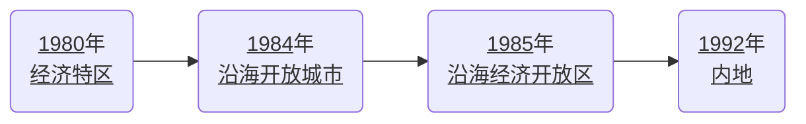

## 八下历史与社会复习提纲

1. 第一个五年计划的时间<u>1953-1957 年底</u>，集中主要力量发展<u>重工业</u>。
   意义：<u>我国开始改变工业落后的面貌，向社会主义工业化迈进。</u>

2. 列举第一个五年计划的成就（工业和交通运输业各3例）
   1. 工业：<u>鞍山钢铁公司无缝钢管厂，长春第一汽车制造厂，沈阳第一机床厂和飞机制造厂等建成投产</u>
   2. 交通运输业：
      1. <u>新建宝成、鹰厦等铁路 30 余条</u>
      2. <u>川藏、青藏、新藏公路</u>
      3. <u>1957 年，武汉长江大桥建成</u>

3. 我国改变生产资料私有制的深刻社会变革：<u>三大改造</u>

4. 我国进入社会主义初级阶段的标志（*社会主义基本制度建立的标志*）：<u>1956 年底，三大改造的基本完成。</u>

5. 三大改造指国家对<u>农业</u>、<u>手工业</u>和<u>资本主义工商业</u>的社会主义改革。

6. 三大改造基本完成的时间：<u>1956 年底</u>
   意义：
   1. <u>国家实现了生产资料私有制向社会主义公有制的转变</u>
   2. <u>社会主义基本制度在我国建立起来</u>
   3. <u>这是中国历史上最深刻的社会改革</u>
   4. <u>我国从此进入社会主义初级阶段</u>

7. 新中国成立以来党历史上的伟大转折内容：
   1. <u>思想</u>上：冲破长期“<u>左</u>” 的错误的严重束缚，确定了<u>解放思想</u>、开动脑筋、<u>实事求是</u>、团结一致向前看的指导方针。
   2. <u>组织</u>上：实际上形成了以<u>邓小平</u>为核心的党的第二代中央领导集体。
   3. <u>政治</u>上：果断结束 “<u>以阶级斗争为纲</u>”，做出了把国家工作中心转移到<u>经济建设</u>上来，实行<u>改革开放</u>的历史性决策。
      意义：是新中国成立以来党的历史上具有深远意义的伟大转折，开启了<u>改革开放</u>和<u>社会主义现代化建设</u>新时期。会后，中国共产党进行拨乱反正。

8. 我国对外开放格局：<u>中国形成了“经济特区——沿海开放城市——沿海经济开放区——内地的全方位、多层次、宽领域的对外开放格局。</u>

9. <u>2001</u>年，中国加入<u>世界贸易组织*（WTO）*</u>。

10. 中国特色社会主义理论体系的形成过程

| 理论成果                                | 确立会议          | 重要意义                                                     |
| --------------------------------------- | ----------------- | ------------------------------------------------------------ |
| <u>邓小平理论</u>                       | <u>中共十五大</u> | <u>阐明了中国建设社会主义、巩固和发展社会主义的基本问题，是马克思主义在中国发展的新阶段。</u> |
| <u>“三个代表”重要思想</u>               | <u>中共十六大</u> | <u>回答了建设什么样的党，怎样建设党的问题。</u>              |
| <u>科学发展观</u>                       | <u>中共十八大</u> | <u>对新形势下实现什么样的发展，怎样实现发展等重大问题作出了新的科学回答。</u> |
| <u>习近平新时代中国特色社会主义思想</u> | <u>中共十九大</u> | <u>实现了马克思主义中国化新的飞跃。</u>                      |

11. 建设成就

    1. 全面建设社会主义时期的（1956-1966）年的成就
       1. <u>武汉、包头两大钢铁基地</u>
       2. 建设三个油田：<u> 大庆油田、胜利油田、大港油田</u>
       3. 交通方面修建了<u>兰新</u>、<u>兰青</u>、<u>包兰</u>铁路。
       4. 1965我国首先完成了<u>人工合成结晶牛胰岛素</u>，这在世界上居于领先地位
       5. 1964年成功爆炸第一颗<u>原子弹</u>。
          这一时期涌现出的英雄模范人物典型代表：大庆石油工人“铁人”<u>王进喜</u>，党的好干部<u>焦裕禄</u>，解放军好战士<u>雷锋</u>。
    2. “文革”期间的成就(1966——1976)
       1. 1967年我国爆炸了第一颗<u>氢弹</u>
       2. 1970年成功发射了第一颗<u>人造地球卫星</u>
       3. 1973年我国在世界上首次培育成功强优势的<u>籼型杂交水稻</u>。

12. 土地改革的时间<u>1950</u>年到1952年
    意义：

    1. 政治上
       1. <u>土地改革的完成，彻底摧毁了我国存在 2000 多年的封建土地制度，消灭了地主阶级。</u>
       2. <u>农民翻了身，得到了土地，成为土地的主人。</u>
       3. <u>使人民政权更加巩固。</u>
    2. 经济上：<u>大大解放了农村生产力，农业生产获得迅速恢复和发展，为国家的工业化建设准备了条件。</u>

13. 人民军队在不同时期的称谓： 

    1. 土地革命战争时期：<u>中国工农革命军、中国工农红军</u>
    2. 全面抗战时期：<u>八路军、新四军</u>
    3. 人民解放战争时期：<u>人民解放军</u>
    4. 抗美援朝时期：<u>中国人民志愿军</u>

14. 抗美援朝战争胜利的意义：

    1. <u>伟大的抗美援朝战争，抵御了帝国主义侵略扩张，捍卫了新中国安全，保卫了中国人民和平生活。</u>
    2. <u>稳定了朝鲜半岛局势，维护了亚洲和世界和平，大大提高了我国的国际地位。</u>
    3. <u>抗美援朝战争伟大胜利，是中国人民站起来后屹立于世界东方的宣言书，是中华民族走向伟大复兴的重要里程碑。</u>

15. 新中国成立以来党历史上的伟大转折：<u>1978 年， 中共十一届三中全会</u>

16. 新中国成立后我国农村生产关系经历的四次重大变化

    | 历史事件                               | 土地所有制                                  | 土地的归属            |
    | -------------------------------------- | ------------------------------------------- | --------------------- |
    | （1950-1952）<u>土地改革</u>           | <u>农民土地所有制（农民种自己的田）</u>     | <u>归农民个体所有</u> |
    | （1953-1956）<u>农业的社会主义改造</u> | <u>社会主义公有制（农民种集体的田）</u>     | <u>归村集体所有</u>   |
    | （1958）<u>农村人民公社化运动</u>      | <u>社会主义公有制（农民集体种集体的田）</u> | <u>归村集体所有</u>   |
    | （1978）<u>家庭联产承包责任制</u>      | <u>社会主义公有制（农民家庭种集体的田）</u> | <u>归村集体所有</u>   |

    农村经济体制改革的内容：<u>家庭联产承包责任制</u>、<u>农村乡镇企业</u>

17. 家庭联产承包责任制的意义

    1. <u>家庭联产承包责任制的实行，激发了农民的劳动热情</u>
    2. <u>带来农村生产力的大解放</u>
    3. <u>农业生产和农民收入均有很大提高。</u>

18. 城市经济体制改革的中心环节：<u>增强企业活力</u>
    <u>1992</u>年中共十四大明确提出要建立：<u>社会主义市场经济</u>体制。

19. 我国对外开放格局
    <u>经济特区——沿海开放城市——沿海经济开放区——内地</u>的<u>全方位、多层次、宽领域的对外开放格局。</u>

20. 设立经济特区（对外开放）意义？

    1. <u>设立经济特区，引进外资、先进技术和管理经验</u>
    2. <u>推动国内的进一步改革，扩大对外经济交流，对发展社会主义现代化事业起到了极其重要的作用。</u>

21. 我国的一项基本政治制度，也是解决我国民族问题的基本政策：<u>民族区域自治制度</u>
    最早建立的少数民族自治区：<u>内蒙古自治区</u>
    最晚建立的自治区：<u>西藏自治区</u>

22. 一国两制的含义：就是在<u>祖国统一</u>前提下，国家的主体坚持<u>社会主义制度</u>，同时在台湾、香港、澳门保持原有的<u>资本主义制度</u>和生活方式长期不变，享有<u>高度的自治权</u>。

23. 完成祖国统一大业的基本方针/解决台湾问题的基本方针：<u>“和平统一、一国两制”</u>
    实现祖国和平统一的基础：<u>坚持一个中国原则</u>

24. 香港回归时间：<u>1997年7月1日</u>
    澳门回归时间：<u>1999年12月20日</u>

25. 香港、澳门能够顺利回归祖国的原因？

    1. <u>中国综合国力增强，国际地位提高</u>
    2. <u>“一国两制”构想开辟了途径；整个中华民族的强烈愿望</u>
    3. <u>中国政府的努力等。</u>

26. 香港、澳门回归祖国的意义：<u>香港、澳门回归祖国，标志着中国人民洗雪了百年耻辱，在完成祖国统一大业的道路上迈出了重要一步。</u>

27. 我国完成统一大业的有利条件： 

    1. <u>我国综合国力增强，国际地位提高</u>
    2. <u>“和平统一、一国两制”基本方针的指引</u>
    3. <u>两岸经贸 、人员交流蓬勃发展，交往日益密切</u>
    4. <u>实现祖国统一，是整个中华民族的强烈愿望等。</u>

28. 两岸关系的发展

    1. 1990年，台湾成立<u>海基会</u>，1991年祖国大陆成立<u>海协会</u>。
    2. 1992年，两会达成共识，史称<u>“九二共识”</u>。
       影响：<u>海峡两岸关系的发展迈出了历史性的重要一步</u>
    3. 2008年，两岸达成<u>空运直航、海运直航、邮政合作</u>等协议，两岸同时举行<u>“三通”</u>启动仪式，两岸关系取得重大进展。

29. 我国的外交政策：<u>独立自主的和平外交政策</u>
    我国的外交原则：<u>和平共处五项原则等</u>

30. 处理国与国关系的基本准则：<u>和平共处五项原则</u>
    这一准则是在<u>1953</u>年底，<u>周恩来</u>在接见印度代表团时首次提出
    它的内容是<u>互相尊重主权和领土完整、互不侵犯、互不干涉内政、平等互利、和平共处。</u>

31. 例举三例史实说明20世纪50年代新中国的外交成就

    1. <u>1949-1950 年，同苏联等十几个国家建立外交关系</u>
    2. <u>1953 年，周恩来首次提出和平共处五项原则</u>
    3. <u>1954 年，第一次以五国之一的身份参加日内瓦国际会议</u>
    4. <u>1955 年，参加万隆会议，提出“求同存异”方针。</u>

32. 列举三例史实说明20世纪70年代新中国的外交成就

    1. <u>1971 年，恢复在联合国的合法席位</u>
    2. <u>1979 年，中美建交</u>
    3. <u>1972 年，中日建交</u>

33. 改革开放以来，我国的外交布局<u>全方位、多层次、立体化</u>

34. 列举三例史实说明改革开放以来新中国的外交成就

    1. <u>中国举办“一带一路”国际合作高峰论坛</u>
    2. <u>亚太经合组织领导人非正式会议</u>
    3. <u>二十国集团领导人峰会</u>
    4. <u>金砖国家领导人厦门会晤</u>
    5. <u>亚信峰会等重要国际会议等</u>

35. “两弹一星”：<u>核弹（原子弹和氢弹）</u>、<u>导弹</u>、<u>人造地球卫星</u>

36. 2003年，航天员<u>杨利伟</u>乘坐<u>神舟五号</u>飞船飞入太空，并成功返回地面。我国成为世界上第<u>三</u>个独立掌握<u>载人航天</u>技术的国家。
    2008年，<u>神州七号</u>升入太空。航天员<u>翟志刚</u>实现<u>太空行走</u>。

37. “杂交水稻之父”：<u>袁隆平</u>
    2015年诺贝尔生理学或医学奖获得者：<u>屠呦呦</u>。

38. 可持续发展的涵义：<u>既满足当代人的需求，又不对后代人满足其需求的能力构成危害的发展。</u>
    其包含了哪三个维度： <u>生态持续发展、经济持续发展、社会持续发展</u>

39. 倡导低碳生活方式、发展低碳经济*（走可持续发展道路、可持续发展、美丽中国）*的意义？

    1. <u>有利于节约资源，提高资源利用率，缓解资源短缺状况；</u>
    2. <u>有利于减少污染，保护和改善环境，实现人与自然和谐相处；</u>
    3. <u>有利于实现经济社会的可持续发展和人民生活水平的提高等。</u>

40. 我国进入社会主义初级阶段的标志：（<u>1956</u>）年<u>三大改造基本完成</u>

    我国进入社会主义现代化建设新时期的标志：（<u>1978</u>）年<u>党的十一届三中全会</u>

    进入中国特色社会主义新时代的标志： （<u>2012</u>）年<u>党的十八大</u>

41. 近现代中国社会性质的三次转变：

    1. 鸦片战争：<u>从封建社会转变为半殖民地半封建社会</u>
    2. 中华人民共和国成立：<u>从半殖民地半封建社会转变为新民主主义社会</u>
    3. 三大改造基本完成：<u>从新民主主义社会转变为社会主义社会</u>

42. 邓小平开创的中国特色道路是：<u>中国特色社会主义道路</u>
    中国特色社会主义道路开创的标志是：<u>1978年中共十一届三中全会</u>
    这条道路的带给我们的启示：

    1. <u>从中国实际出发，走符合中国国情</u>
    2. <u>坚持中国共产党的领导。</u>

43. 我国环境问题的分类：

    1. <u>生态环境问题</u>：<u>荒漠化</u>和<u>水土流失</u>
    2. <u>环境污染问题</u>：<u>工业中产生的废气、废水及固体废弃物污染</u>

44. 新的历史方位：<u>中国特色社会主义进入了新时代</u>

45. 新发展理念：<u>创新、协调、绿色、开放、共享</u>

